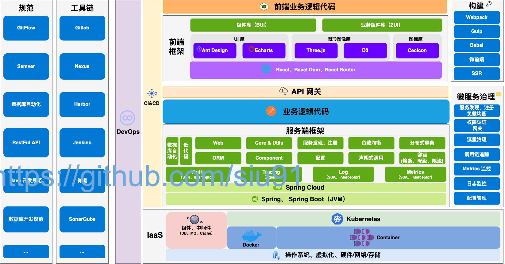
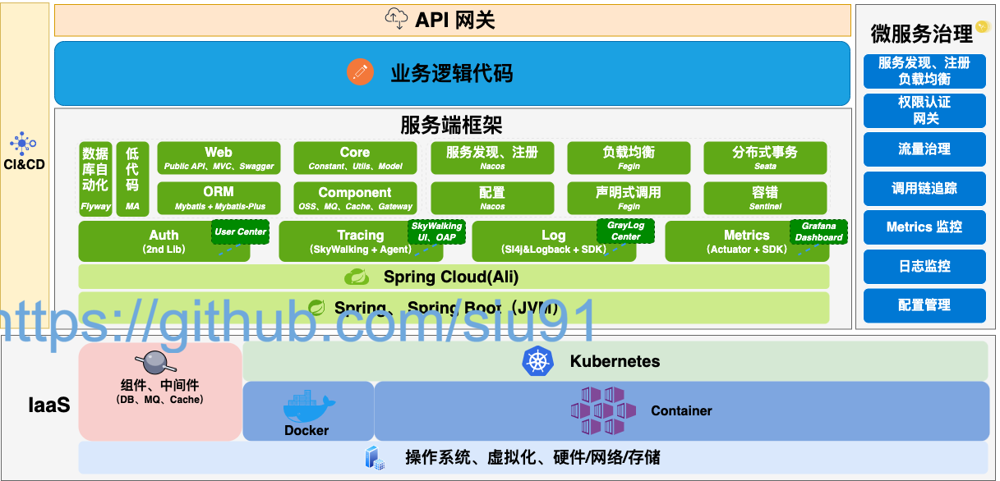
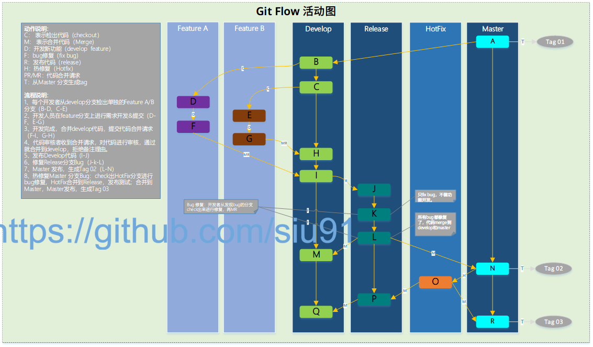
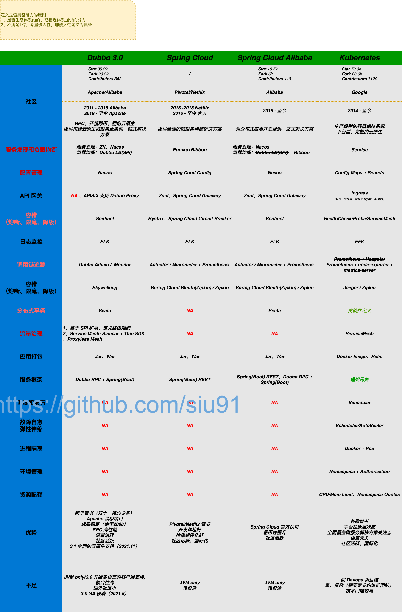

# Java 后端框架选型指南

> By [Siu]() 2022/3/26

## 前言

其实从 2019 年疫情😷刚开始时就开始准备这部分的工作，2020-2021 其实也有了很所实践和总结，但整体还不够全面和立体，故这段时间趁着整理过往的实践再次梳理和总结关于 Java 后端的框架的选型。

## 整体架构

>    整体架构包括了：前端、后端、基础设施、规范、工具链等；这里先放出架构全景，这些其实是经过两年多的实践总结不断迭代的一个成果。

***`图-1:整体架构`***

## 服务端架构

***`图-1:服务端架构`***

## 选型

***`表-1:服务端选型列表`***

| 序号 | 大类   | 分类              | 框架/组件/工具/方法模型等 | 版本/规格/标准                                           | 备注                                                         |
| ---- | ------ | ----------------- | ------------------------- | -------------------------------------------------------- | ------------------------------------------------------------ |
| 1    | 服务端 | 语言              | Java                      | Oracle JDK 1.8.0_161+                                    | 主要的技术栈为 Java；是否需要考虑 OpenJDK 方案/升级订阅商业版？ |
| 2    | 服务端 | 语言              | Python                    | 2.7、3.6                                                 | 少量使用，多作为脚本或工具模块;                              |
| 3    | 服务端 | 语言              | Scala                     | 2.11.8                                                   | 少量使用;Spark  数据处理；                                   |
| 4    | 服务端 | 框架              | Spring Boot               | 2.3.12.RELEASE                                           | 另外关注到的还有更面向云原生的方案（GraalVM）  Quarkus、Spring Native |
| 5    | 服务端 | 框架              | nacos                     | 2.1.4.RELEASE                                            | 微服务注册与配置                                             |
| 6    | 服务端 | 数据库            | MySQL                     | 5.7.24                                                   | 目前Mysql与PG相比，国内占比高，落地方案丰富。运维上无论是当前人员还是招聘市场都是熟悉Mysql远高于PG |
| 7    | 服务端 | 本地缓存          | Ehcache                   | 2.x (latest)                                             | 少量项目使用；主要考量本地持久化，当前  Spring Boot 中推荐用 3.x |
| 8    | 服务端 | 数据库连接池      | Hikari                    | /                                                        | 1.Druid  高级特性项目中并未被使用，运维本身有其他方式监控SQL     2.Hikari默认被spring体系采用，版本维护与Spring Boot 主版本绑定     3.数据连接池本身与业务代码解耦，变更不涉及到业务代码改动。 |
| 9    | 服务端 | 中间件,OSS        | MinIO                     | RELEASE.2020-06-22T03-12-50Z、latest（2021.8 dockerhub） | MinIO是一套高性能对象存储系统，兼容 Amazon  S3 云存储服务，提供一套完整的OSS方案，支持云原生。近9000多家企业也都在使用MinIO产品。 |
| 10   | 服务端 | 框架,权限         | Shiro                     | 1.5.3                                                    | 权限框架；封装在 UAC  的二方库中；按目前生态的发展会更倾向 Spring Security     风险点：当前的福州在用系统都要从shiro切换到Spring  Security，涉及平台众多，改造工作量较大。从业务角度，改造后没有业务上直接提升。该部分暂时不做变动。 |
| 11   | 服务端 | 中间件,缓存       | Redis                     | 5.0.x                                                    | 缓存；客户端使用 Lettuce 版本与Spring Boot  主版本绑定，封装在 framework2中，redis module |
| 12   | 服务端 | 中间件,MQ         | Kafka                     | 1.0.0                                                    | 消息队列，客户端使用  Spring Kafka 版本与Spring Boot 主版本绑定；业务上没有特别多的需求，故靠近已有的大数据使用的 kafka |
| 13   | 服务端 | 框架,ORM          | Mybatis                   | /                                                        | 封装在 framework2中，data module；也有调研  JPA+QueryDSL 、JOOQ |
| 14   | 服务端 | 框架,ORM          | MyBatis-Plus              | 3.3.2                                                    | MyBatis-Plus VS  tk-mybatis都是基于Mybaits插件功能开发的增强器，当前在功能丰富度和用户热度上  MyBatis-Plus要略优于tk-mybatis。因此统一选型后保留了MyBatis-Plus。 |
| 15   | 服务端 | 工具库,数据自动化 | Flyway                    | /                                                        | 数据库版本/数据库迁移管理工具；版本与Spring  Boot 主版本绑定 |
| 16   | 服务端 | 框架,单元测试     | Junit                     | Junit4                                                   | 单元测试                                                     |
| 17   | 服务端 | 框架,参数验证     | Hibernator Validator      | /                                                        | 参数校验；                                                   |
| 18   | 服务端 | 工具库,配置加密   | jasypt                    | 3.0.x                                                    | 用于配置文件中的参数值加密，如数据库账号密码；已封装在二方库中 |
| 19   | 服务端 | 工具库,验证码     | kaptcha                   | 2.3.2                                                    | 验证码工具库，https://github.com/penggle/kaptcha             |
| 20   | 服务端 | 工具库,样板代码   | Lombok                    | /                                                        | 基于注解方式，有效减少样板代码的工具库；版本与Spring  Boot 主版本绑定 |
| 21   | 服务端 | 工具库,JSON       | Jackson                   | /                                                        | Spring Boot 默认；版本与Spring Boot  主版本绑定              |
| 22   | 服务端 | 工具库,Log        | Logback + Slf4j           | /                                                        | Spring Boot 默认；版本与Spring Boot  主版本绑定              |
| 23   | 服务端 | 工具库,API 文档   | Swagger                   | 2.8.0                                                    | 封装在 framework2中，data  module；大量使用，默认和前端的API文档对接方式，前端会使用 API json 接口做 mock |
| 24   | 服务端 | 工具库,API 文档   | Knife4j                   | 2.0.4                                                    | Swagger UI 增强；                                            |
| 25   | 服务端 | 可观测性,诊断工具 | SkyWalking                | 8.9.1                                                    | 微服务日志链路追踪                                           |
| 26   | 服务端 | 框架,低代码       | magic-api                 | 1.7.1                                                    | 少量实践使用；能有效提高开发效率，比较适用于大屏展示、报表等；同类的还调研了  Dataway |
| 27   | 服务端 | 构建工具,依赖管理 | Maven                     | 3.6                                                      | 默认唯一的工具，团队开发中约束，主要基于大多数人熟悉 Maven   |
| 28   | 服务端 | CI                | Jenkins Pipeline          | /                                                        | 使用 Jenkins  共享库的方式，自定义编排流水线（Gitlab+Jenkins+Nexus），后续会合并Harbor+k8s |
| 29   | 服务端 | 云原生,容器化     | Docker                    | 20.10.5                                                  | 实践较少；使用 airflow 时用到 Rancher  1.x + docker（当前已迁移用 docker-compose 方式）；Jenkins 主从集群使用 Docker 构建 |
| 30   | 服务端 | 云原生,容器化     | k8s                       | 1.18                                                     | 运维统一维护支持，开发环境正在使用KubeSphere 容器云纳管工具平台+ k8s ;线上环境构建k8s  使用Grafana监控 |
| 31   | 服务端 | 云原生,微服务框架 | Spring Cloud              | /                                                        | 偏向于spring  cloud Alibaba                                  |
| 32   | 服务端 | 云原生,DevOps     | KubeSphere                | 3.1.1                                                    | 开发、测试环境使用                                           |
| 33   | 服务端 | 云原生,持续交付   | Jenkins                   | 2.277.1                                                  | 在非云环境中使用经验较多（交付到主机、虚拟机）；验证环境调研使用过  KubeSphere DevOps |

### 适用说明

### Java 和 Spring

### 数据库、连接池、ORM 

### 数据库自动化

> 这部分往往特别容易被忽视，但往往都会因为没有尽早考虑“数据库自动化”而引发不同程度的问题。

数据库自动化主要的收益有3大部分：

- 开发：sql 也是代码的一部分，要编码-》测试-》集成-》上线，用开发最熟悉的方式去管理；
- CI：对于ci ，数据库自动化是特别容易忽视，到问题出现时才会去想到要去构建数据库自动化的方案；
- 产品化：对于很多产品来说产品的迭代升级是一个重要的管理工作，数据库自动化会为此带来不可或缺的收益：多个版本的升级可以是一个”内治理的平衡“，不需要团队花费过多的精力。

在实践中主要的矛盾在于，“数据库自动化”这部分对于运维/DBA是黑盒，他们往往希望能够去审计上线的 SQL，所以需要根据团队具体情况去沟通，让运维/DBA了解这部分的收益和风险。

### API 文档

### 项目文档、WIKI

### CICD & GitFlow

#### CI 的工具链

目前经过两年过的实践比较合适目前团队的 CI 工具链主要由一下构成的：

- 代码版本管理 Gitlab
- 强大的、可扩展能力的 CI/CD 引擎 Jenkins
- Jenkins Piepline Library： 可定义和编排了 CI/CD 流水线(***`Pipeline as Code`***)
- 依赖管理、制品管理 Nexus/Harbor
- Devops 工具：Kubersphere （ks 其实还有更多关于微服务、云原生一站式的功能） 

#### CI 流水线

***`图-1:CI流水线`***

#### GitFlow

***`图-1:GitFlow`***

### Repo model

#### Mono Repo

#### Mutilple Repo

### Maven

### 其它中间件

### 微服务和云原生

***`图-3:微服务选型关注点`***

***`图-1:微服务主流方案对比`***

## 

## 开发规范和最佳实践

| 序号 | 大类 | 分类               | 框架/组件/工具/方法模型等  | 版本/规格/标准 | 备注                                                         |
| ---- | ---- | ------------------ | -------------------------- | -------------- | ------------------------------------------------------------ |
| 99   | 规范 | 代码管理           | 代码仓库使用规范           | /              | 已修订，主要约束了 gitlab  中仓库组的层级、分类；仓库组的权限控制规则 |
| 100  | 规范 | 代码管理           | 代码提交规范               | /              | 已修订，主要约束了 git commit message 的规格                 |
| 101  | 规范 | 代码管理           | 代码风格规范               | /              | 已修订，主要约束开发中使用的语言、脚本的风格，包括  Java、Scala、Python、Shell、JS |
| 102  | 规范 | 代码管理           | git 协同开发规范           | /              | 已修订，主要约束代码仓库的分支规范、协同的工作流，参考  gitflow、gitlab flow |
| 103  | 规范 | 代码管理           | Code Review 指南           | /              | 已修订，主要约束、指导了 CR 的原则和要点，评审人和  Commiter 的各自角色的关注点、协作方式 |
| 104  | 规范 | 代码管理           | PR 模板、ISSUE 模板        | /              | 已修订，可能要针对不同的类型的项目做调整                     |
| 105  | 规范 | 中间件使用         | 数据库开发规范             | /              | 已修订，针对 PostgreSQL 做了开发规范约束                     |
| 106  | 规范 | 中间件使用         | 缓存使用规范               | /              | 未修订                                                       |
| 107  | 规范 | 中间件使用         | 消息队列使用规范           | /              | 未修订                                                       |
| 108  | 规范 | 中间件使用         | 数据库自动化使用规范       | /              | 已修订，主要约束了 Flyway SQL  的格式，并描述了最佳的实践方式 |
| 109  | 规范 | 中间件使用         | 三方库使用规范             | /              | 未修订，需要包括前端、后端                                   |
| 110  | 规范 | 服务调用协议和标准 | RestFul API 设计规范       | /              | 已修订，主要内容包括 RestFul Path、Http  Method，Http Code，Header，Return Json Schema，最佳实践；参考：Paypal、Microsoft |
| 112  | 规范 | 开发流程           | 打包构建、制品规范         | /              | 已修订，主要约束构建工具、构建方式、构建环境、构建产物规格；还有待调整补充 |
| 113  | 规范 | 开发流程           | 配置文件规约               | /              | 未修订                                                       |
| 114  | 规范 | 开发流程           | 单元测试规约               | /              | 已修订                                                       |
| 115  | 规范 | 开发流程           | 日志规约                   | /              | 未修订                                                       |
| 116  | 规范 | 开发流程           | 前后端分离开发协同开发指南 | /              | 未修订，主要规约协同的工具、方法、职责和流程                 |
| 117  | 规范 | 基础               | 软件版本控制规范           | Semver 2.0     | 已修订，主要参考 Semver 2.0 制定                             |
| 119  | 规范 | 基础               | 全局的命名规约             | /              | 未修订，如用户ID，状态码，系统名称                           |

## 开发工具

| 序号 | 大类 | 分类 | 框架/组件/工具/方法模型等   | 版本/规格/标准    | 备注                                                         |
| ---- | ---- | ---- | --------------------------- | ----------------- | ------------------------------------------------------------ |
| 120  | 规范 | 工具 | IDE： WebStorm              | 2021+             | 前端必须唯一使用；收费，无社区版                             |
| 121  | 规范 | 工具 | IDE： IntelliJ IDEA         | 2021+ Community   | 后端必须唯一使用；迫于公司未统一采购，推荐用社区版           |
| 122  | 规范 | 工具 | Markdown 编辑器：Typora     | <1.0、0.9.x(beta) | 迫于公司未统一采购，推荐使用 1.0 之前的免费版；能用  Markdown 就一定用，保持最佳的可见性 |
| 123  | 规范 | 工具 | 画图工具：Draw.io           | 14+               | 多端都可以使用，在 vs code 、idea 里也可以集成               |
| 124  | 规范 | 工具 | 脑图工具：Xmind             | 8+                | 推荐 Xmind，迫于收费，需要自行解决                           |
| 125  | 规范 | 工具 | 数据库模型设计工具：DBeaver | 23+               | 待讨论，目前用 PowerDesigner 16  比较多，但只限于 win 环境；Navicat/DbSchema 可以多端，需要收费； |
| 126  | 规范 | 工具 | 阿里 Java 代码规约插件      | latest            | IDEA 插件                                                    |
| 127  | 规范 | 工具 | standard                    | 16.x              | 前端默认代码规范检测工具                                     |
| 128  | 规范 | 工具 | commitlint                  | 12.x              | git commit  格式规范工具                                     |
| 129  | 规范 | 工具 | docz                        | 2.x               | react组件库文档工具，使用mdx格式，可直接生成组件使用、代码案例等；目前bui、zui等组件库均用其编写 |
| 130  | 规范 | 工具 | Docsify                     | 4.x               | 文档站点工具；将  markdown 文档生成 web 站点，主要用于项目文档展示 |

## DDD

## 总结

