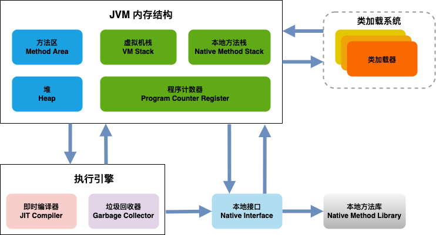

# 谈谈 Java 内存的管理

> By [Siu]() 2022/3/31

从 VM、GC 语言角度，JavaEr 很少会关注到内存的管理，但是所有程序的执行都避不开对内存使用的申请，以及回收；从现有主流的语言来看大致会分为3类：

- 使用和分配都由用户去决定；C 就是一个代表
- 使用由用户来关注，回收交给 GC；典型如 Java，GO
- 由编译系统来管理：Rust 的所有权系统就是这样的一个强大的内存管理系统

C 选择了“相信”用户，Java 选择了”包容“用户，Rust 选择了“教育”用户。
孰优孰劣，不是今天的主题，还是回到 Java 内存的管理是怎样的？

## 栈和堆

栈和堆是编程语言中最基础的数据结构，栈和堆的的作用就是为程序提供运行时的内存空间。

**栈（Stack）**

栈是先入后出（FILO），可以类比为叠盘子，增加一个盘子**只能**从顶部（入栈），取下一个盘子**只能**从顶部（出栈）。

栈中的所有数据都必须占用已知且固定大小的内存空间。

**堆（Heap）**

与栈不同，对于大小未知或者可能变化的数据，我们需要将它存储在堆上。

当向堆上放入数据时，需要请求一定大小的内存空间。

**性能**

写入方面：入栈比在堆上分配内存要快，因为入栈时操作系统无需分配新的空间，只需要将新数据放入栈顶即可。相比之下，在堆上分配内存则需要更多的工作，这是因为操作系统必须首先找到一块足够存放数据的内存空间，接着做一些记录为下一次分配做准备。

读取方面：栈数据往往可以直接存储在 CPU 高速缓存中（高速缓存和内存的访问速度差异在 10 倍以上！），而堆数据只能存储在内存中。访问堆上的数据比访问栈上的数据慢，因为必须先访问栈再通过栈上的指针来访问内存。

因此，处理器处理和分配在栈上数据会比在堆上的数据更加高效。

## JVM 管理的内存

**Java 的组成**

>***注：***
>
>- 类加载子系统：负责从文件系统或是从网络中加载class信息，加载的信息存放在一个称之为方法区的内存空间
>
>- 执行引擎：是jvm非常核心的组件，它负责执行jvm的字节码，一般先会编译成机器码后执行。
>
>- 垃圾收集系统：GC垃圾回收，保证我们程序能够有足够的内存空间运行，回收掉内存中已经无效的数据。回收算法一般有**标记清除**算法，**复制**算法，**标记整理**算法等。

### JVM 的内存结构

#### 方法区

用于存放类的信息、常量信息、常量池信息、包括字符串字面量和数字常量。我们常用的反射就是从这个方法区里读取的类信息。

#### 堆

堆空间是jvm启动的时候创建出来的一块内存区域，几乎所有的对象实例都放在这个空间里。
这个区域被划分为年轻代和老年代的，我们经常接触的GC垃圾回收机制，就是主要回收堆空间的垃圾数据。
堆空间里的数据，是被所有线程所共享的，所以会存在线程安全问题，所以那些锁就是为了解决堆空间数线程安全问题而生的。

#### 直接内存

直接内存并不是虚拟机运行时数据区的一部分，也不是虚拟机规范中定义的内存区域，但这部分也是被频繁的读写使用，也可能会导致`OutOfMemoryError`异常的出现。

Java的 `NIO`中的`allocateDirect`方法是可以直接使用直接内存的，能显著的提高读写的速度。

#### VM 栈

一堆一栈，所有线程共享堆空间里的数据，但是栈空间是每个线程独有的，互相直接不能访问。
栈空间是线程创建的时候所创建出的一份内存空间，栈里主要保存一些局部变量、方法参数、Java方法调用，返回值等信息。

#### 本地方法栈

本地方法栈和Java栈不同之处在于，可以直接调用Java本地方法，即JDK中用native修饰的方法。

#### 程序寄存器

它是每个线程私有的空间，JVM会为每个线程创建单独的PC寄存器，在任意时刻，一个Java线程总是在执行一个方法，这个方法被称为当前方法，如果当前方法不是本地方法，PC寄存器会执行当前正在被执行的指令，如果是本地方法，则PC寄存器值为undefined，寄存器存放如当前环境指针、程序计数器、操作栈指针、计算的变量指针等信息。

### 再看 Java 中的栈内存和堆内存

## 引用

## 字符串

## GC

## 逃逸分析

## 另一种实现：Netty 中的内存管理

## ref

[Java 虚拟机规范（英文）](https://docs.oracle.com/javase/specs/jls/se11/html/index.html)
