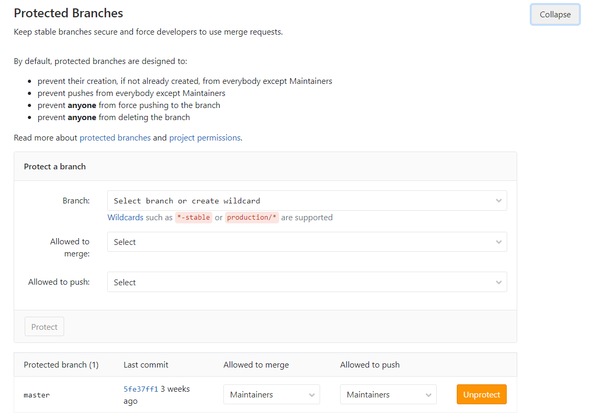
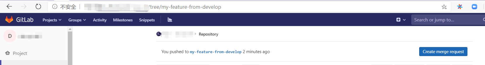
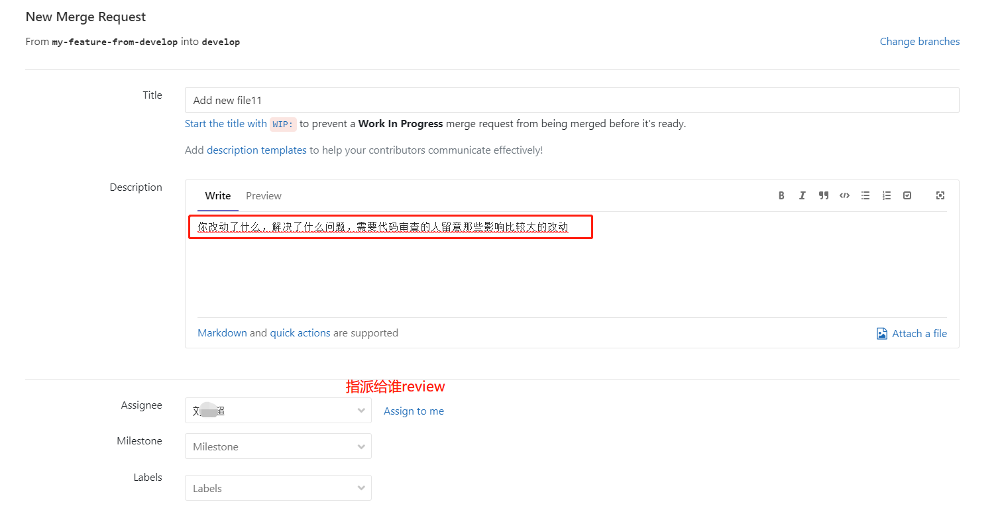
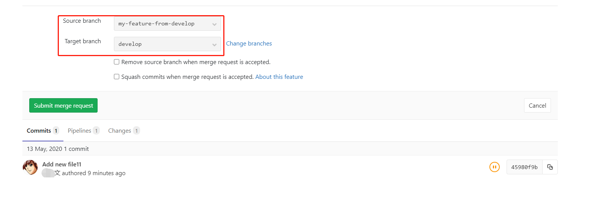
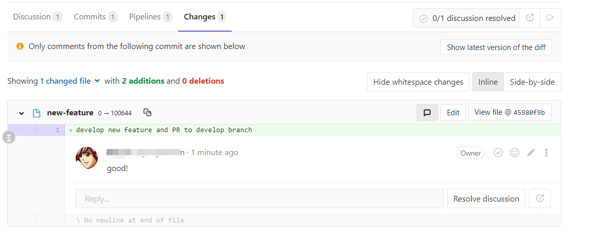
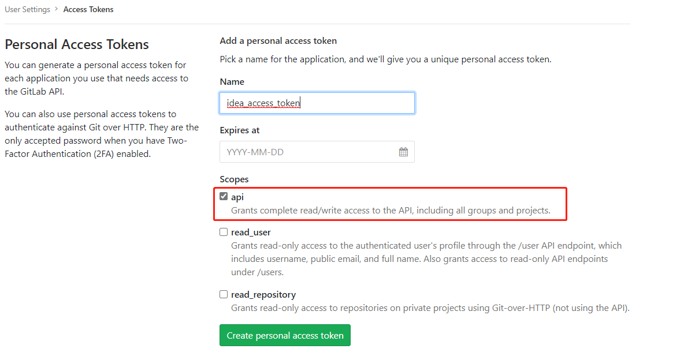

# Code Review 规范

> By [Siu]() 2020/05/14

以下采用gitflow + PR/MR模式，基于Gitlab 进行Code Review

## 1 目标&原则

Why Code Review?

- 提高代码质量，及早发现潜在缺陷，降低修改/弥补缺陷的成本

- 促进团队内部知识共享，提高团队整体水平

- 评审过程对于评审人员来说，也是一种思路重构的过程，帮助更多的人理解系统

- 是一个传递知识的手段，可以让其它并不熟悉代码的人知道作者的意图和想法，从而可以在以后轻松维护代码

- 可以被用来确认自己的设计和实现是一个清楚和简单的

- 是一种特殊的pair programing实践

- 鼓励相互学习对方的长处和优点

- 高效迅速完成Code Review

## 2 流程&规则

How To Code Review？

### 2.1 Git Flow


### 2.2 Pull Request

1. 任务完成才能提交PR
2. 严禁一个PR里面有多个任务，除非它们是紧密关联的
3. PR提交之后只允许针对Review发现问题再次提交代码，除非有充足的理由，严禁在同一个PR中再次提交其它任务的代码
4. **PR的Title**必须概括性表达提交的内容，如果无法概括，就应该考虑这些commit不应该给归为一个PR
5. 提交PR时候有一个描述框，内容会自动根据Commit的message合并而成。切记，如果一次提交的内容包含很多Commit，请不要使用自动生成的描述。请用简短但是足够说明问题的语言（理想是控制在3句话之内）来描述： 你改动了什么，解决了什么问题，需要代码审查的人留意那些影响比较大的改动。特别需要留意，如果对基础、公共的组件进行了改动，一定要另起一行特别说明。
6. PR应该在1~2个工作日内被合并或者被拒绝
7. **发起Pull Request以后，请将Pull Request的链接通过Email发给代码审核者，以此通知对方及时进行审核。(BUG修复类当日必须完成合并或者拒绝，功能类或者觉得有重大调整需要会议Review必须在邮件中明确时间和会议人员)**
8. 你可以分配这个 MR 给你自己，直到你完成你的工作，然后把它分配给其他人来做一次代码复审。如果有必要的话，这个 MR 可以被重新分配多次，直到覆盖你所需要的审查的代码。

### 2.3 Rules & Tips

1. **保证必须**以Merge的方式变更develop/release/master分支，需要对Push/Merge权限进行限制

2. 中级审初级，高级审中级，高级互审（这是一般原则）；

3. 确保每次代码合并前都有2个人review（实际允许，鼓励全员review）；

4. 不必拘束于形式，不强调会议形式，不强调审核；

5. 鼓励初级人员给高级人员提出代码意见（虽然流程上没有这样的形式，PR是自下而上的）；

6. **学会自己进行Code Review**，在别人review之前你已经解决了很多疏忽的问题；

7. **尽可能的让不同的人Review你的代码**，主动去PR给你的高级人员；

8. 虚心接受意见，但不要羞涩表达自己的观点，大胆指出问题，**鼓励积极的Disscussion**（在gitlab）；

9. 不要纠结拒绝PR是否太不计情面，写好拒绝的原有，**拒绝是为了下一次更好**；

10. 忘记下面的**Checklist**，把Code Review 当成一种轻松的交流，太正式未必达成好的效果；

11. 如果你是一个新人，那么**Code Review 将是最快融入团队的方式**；

12. **学会享受Code Review**，这是最重要的。

## 3 Code Review Checklist

Code Review主要检查代码中是否存在以下方面问题：

- 完整性检查
  - 代码是否完全实现了设计文档中提出的功能需求
  - 代码是否已按照设计文档进行了集成和Debug
  - 代码是否已创建了需要的数据库，包括正确的初始化数据
  - 代码中是否存在任何没有定义或没有引用到的变量、常数或数据类型
- 一致性检查
  - 代码的逻辑是否符合设计文档
  - 代码中使用的格式、符号、结构等风格是否保持一致
- 正确性检查
  - 代码是否符合制定的标准
  - 所有的变量都被正确定义和使用
  - 所有的注释都是准确的
  - 所有的程序调用都使用了正确的参数个数
- 可修改性检查
  - 代码涉及到的常量是否易于修改(如使用配置、定义为类常量、使用专门的常量类等)
  - 代码中是否包含了交叉说明或数据字典，以描述程序是如何对变量和常量进行访问的
  - 代码是否只有一个出口和一个入口（严重的异常处理除外）
- 可预测性检查
  - 代码所用的开发语言是否具有定义良好的语法和语义
  - 是否代码避免了依赖于开发语言缺省提供的功能
  - 代码是否无意中陷入了死循环
  - 代码是否是否避免了无穷递归
- 健壮性检查
  - 异常处理和清理（释放）资源
  - 代码是否采取措施避免运行时错误（如数组边界溢出、被零除、值越界、堆栈溢出等）
- 结构性检查
  - 程序的每个功能是否都作为一个可辩识的代码块存在
  - 循环是否只有一个入口
- 可追溯性检查
  - 代码是否对每个程序进行了唯一标识
  - 是否有一个交叉引用的框架可以用来在代码和开发文档之间相互对应
  - 代码是否包括一个修订历史记录，记录中对代码的修改和原因都有记录
  - 是否所有的安全功能都有标识
- 可理解性检查
  - 注释是否足够清晰的描述每个子程序
  - 是否使用到不明确或不必要的复杂代码，它们是否被清楚的注释
  - 使用一些统一的格式化技巧（如缩进、空白等）用来增强代码的清晰度
  - 是否在定义命名规则时采用了便于记忆，反映类型等方法
  - 每个变量都定义了合法的取值范围
  - 代码中的算法是否符合开发文档中描述的数学模型
- 可验证性检查
  - 代码中的实现技术是否便于测试
- 可重用性
  - DRY（Do not Repeat Yourself）原则：同一代码不应该重复两次以上
  - 考虑可重用的服务，功能和组件
  - 考虑通用函数和类
- 可扩展性
  - 轻松添加功能，对现有代码进行最小的更改。一个组件可以被更好的组件替换
- 安全性
  - 进行身份验证，授权，输入数据验证，避免诸如SQL注入和跨站脚本（XSS）等安全威胁 ，加密敏感数据（密码，信用卡信息等）
- 性能
  - 使用合适的数据类型，例如StringBuilder，通用集合类
  - 懒加载，异步和并行处理
  - 缓存和会话/应用程序数据

**代码检查包括不局限于上述清单，提交人应在本地自我完成代码格式、架构设计、面向对象分析与设计等检查。**

**如果是Javaer，参考阿里的《Java开发手册》（最新泰山版）。**

## 4 Code Review的步骤

Code Review 服务于项目开发，按照以下步骤执行code review：

1. 需求功能开发完成（**提测**之前），开发leader统一组织code review。
2. 代码编写者和代码审核者坐在一起，由代码编写者按照业务层次依次讲解自己负责的代码和相关逻辑。
3. 代码审核者在此过程中可以随时提出自己的疑问，同时积极发现隐藏的bug；直接在gitlab上记录。
4. 代码讲解完毕后，代码审核者给自己安排几个小时再对代码审核一遍。代码需要一行一行静下心看。同时代码又要全面的看，以确保代码整体上设计优良。
5. 代码审核者将审核的意见记录在gitlab上，抄送给代码编写者&其它审核人员，注明修改deadline。
6. 代码编写者根据代码审核者给出的修改意见，修改代码并再次PR。
7. 开发leader确认所有PR都进行明确的反馈（接受或拒绝，不接受没有理由的意见）。

## 5 Code Review Base On Gitlab

### 5.1 Gitlab Protected Branches 配置

为了保证必须以Merge的方式变更develop分支、release分支、以及master分支，需要对Push以及Merge权限进行限制。

> 菜单：Settings->Repository Settings然后展开Protected Branches选项



```txt
对于通配符的分支保护release-*，我们需要给Maintainers（Masters）组的用户Push权限，不然无法新建对应格式的分支。
对于固定名称的分支：master、release，可以限制所有角色都没有Push权限。
```

### 5.2 GitLab Code Review 约定

> 所有PR都应有明确的Milestone、Label，Tile、Description。Tile、Description 上文已经提到，下面对 Milestone、Label 做相应规范约束。

#### Milestone

> 里程碑，代指项目的版本阶段

- Title 发布版本号，如：2.5.0.2004310_RC
- Description （描述信息），需包含以下：
  - 版本的概括信息
  - 版本的计划功能列表
- 必须指定`Start Date`  `Due Date`

#### Label

> 标签，区分各MR的性质

限定以下指定标签：

- **MR:DEV:DESIGN** 提交物属性为设计类（接口设计、模型设计、流程图、设计文档、公共定义类代码）

- **MR:DEV:DOCS** 提交物属性为文档类（非设计文档，如部署，预研，项目总结PPT）

- **MR:DEV:FEAT** 提交物属性为新特性开发

- **MR:DEV:FIXBUG** 提交物属性为修复bug类

- **MR:DEV:HOTFIX** 提交物属性热修复代码类

- **MR:DEV:OTHER** 提交物属性为无法归类的其它产物

- **MR:DEV:REFACTOR** 提交物属性为重构代码类

- **MR:DEV:TEMPLATE** 提交物属性为模板类代码

### 5.3 WIP MR

> WIP MR 含义是 **在工作过程中的合并请求**，是一个我们在 GitLab 中避免 MR 在准备就绪前被合并的技术。只需要添加 `WIP:` 在 MR 的标题开头，它将不会被合并，除非你把 `WIP:` 删除。

当你改动已经准备好被合并，编辑工单来手动删除 `WIP:` ，或者使用就像如下 MR 描述下方的快捷方式。

**新功能：** `WIP` 模式可以通过[斜线命令](https://docs.gitlab.com/ce/user/project/slash_commands.html) `/wip` [快速添加到合并请求中](https://about.gitlab.com/2016/10/22/gitlab-8-13-released/#wip-slash-command)。只需要在评论或者 MR 描述中输入它并提交即可。

### 5.4 Closed Issues

> 在一个MR中可以关联相应的工单，做到当MR被接受时，关闭Issues

可以在Title，MR Description中按下面格式描述：

> #### 重构A接口，修复#1，#2
>
> 这个 MR 重构了a接口，修复以下
>
> `Closes #[Issue No] and https://gitlab.com/issues/[Issue NO]`
>
> @Siu @Jack @John

### 5.5 Other

在工单和 MR 的描述中:

- 输入 `#` 来触发一个已有工单的下拉列表
- 输入 `!` 来触发一个已有 MR 的下拉列表
- 输入 `/` 来触发[斜线命令](https://docs.gitlab.com/ce/user/project/slash_commands.html)
- 输入 `:` 来出发 emoji 表情 (也支持行中评论)
- 输入 `@` 来提示项目成员

# 附录

### GitLab Code Review 示例

#### Create Merge Request










### IDE Review Code 示例

#### Install Plugin

- Gitlab Projects [2020]

- Gitlab Integration

#### GitLab Access Token

> 菜单：User Settings>Access Tokens 进入Access Token添加页面



#### Create Merge Request


# Ref

[GitLab 工作流概览](https://linux.cn/article-8503-1.html)
