
<b> RBAC 模型与数据平台权限系统设计</b>

<b>数据技术部 龚世文</b> 

<b>2023年3月</b> 

<b>目录</b> 

---

[TOC]

​    RBAC 是指基于角色的访问控制（Role-Based Access Control），它是一种广泛使用的访问控制机制。它的核心思想是将权限赋予特定的角色，而不是直接赋予用户。

​     在 RBAC 中，用户被分配到不同的角色，每个角色都有一组与之相关的权限。用户可以根据他们所担任的角色来获得访问权限，从而简化了对系统资源的管理。RBAC 可以通过减少对细节级别的授权来提高系统的可管理性和安全性。

​     RBAC 的实现通常需要定义角色和权限，然后将角色分配给用户或组。RBAC 可以在不同的应用程序中使用，包括数据库管理、网络安全、操作系统和 Web 应用程序等。

## 一、RBAC 模型

RBAC 认为**权限的本质是 Who 对 What 进行了 How 操作**。

> User：主体，访问方，代表系统中的用户，但也可以是机器、网络等 - Who
> Object：客体，被访问方，可以是系统中的某个菜单、按钮、数据记录、API等 - What
> Operation：系统中用户可执行的某个动作 - How
> Permissions：权限，代表可向 RBAC 保护下的 Object 执行 Operation （What + How）
> Role：角色，代表组织内一些职责及该职责下的用户拥有某些指定的权限
> Session：会话，会话由一个用户触发，同时会话激活会话关联的一个或多个 Role（***RBAC2 的动态角色就是在会话中激活的***）

RBAC 模型一共分为4个子模型[^1]，分别是：

-  RBAC0：Core RBAC、基本模型
- RBAC1：Hierachal RBAC、角色分级模型
- RBAC2：Constraint RBAC 、角色限制模型
- RBAC3：Combines RBAC、统一模型

***在 RBAC 这部分主要围绕功能权限讨论。***

### 1.1 RBAC0 和传统权限模型

传统权限模型给每一个用户赋予权限则会非常麻烦，并且做不到批量修改用户权限。

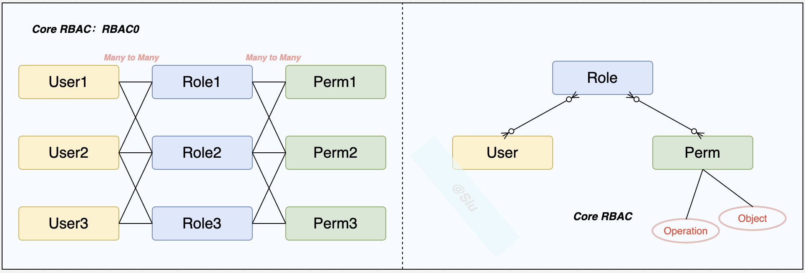

RBAC0 模型中，我们把**权限**赋予**角色**，再把**角色**赋予**用户**。用户和角色，角色和权限都是多对多的关系。用户拥有的权限等于他所有的角色持有权限之和。

### 1.2 RBAC1

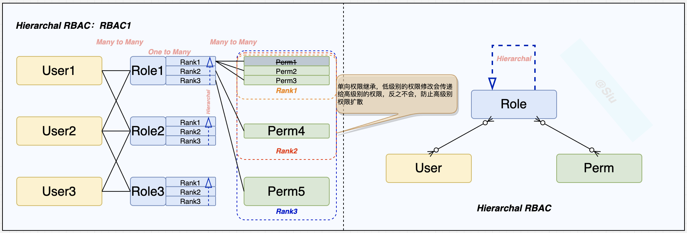

​     RBAC1建立在RBAC0基础之上，在角色中引入了继承的概念，继承是一种用于简化访问控制管理的机制（角色和权限的重叠关系大大降低）。简单理解就是，给角色可以分成几个等级，每个等级权限不同，从而实现更细粒度的权限管理。

​     比如，【开发】（提交代码）、【开发组长】（提交代码、审核代码）、【开发经理】（提交代码、审核代码、审核发布）这三个角色的权限由**低到高**，分开来看他们需要的权限有一些是重叠的，组合来看他们的权限可以用继承来表达：

- 【开发经理】继承【开发组长】的权限，同时拥有自己的权限（***如上图，Rank3 的范围***）
- 【开发组长】继承【开发】的权限，同时拥有自己的权限（***如上图，Rank2 的范围***）
- 【开发】仅拥有自己的权限（***如上图，Rank1 的范围***）

#### 1.2.1 继承关系

单向继承（**高权限**继承**低权限**），可以有效防止权限泄漏，单向继承的结构关系主要分为两种：

- 树状

  

- 有向无环图（DAG）[^2]

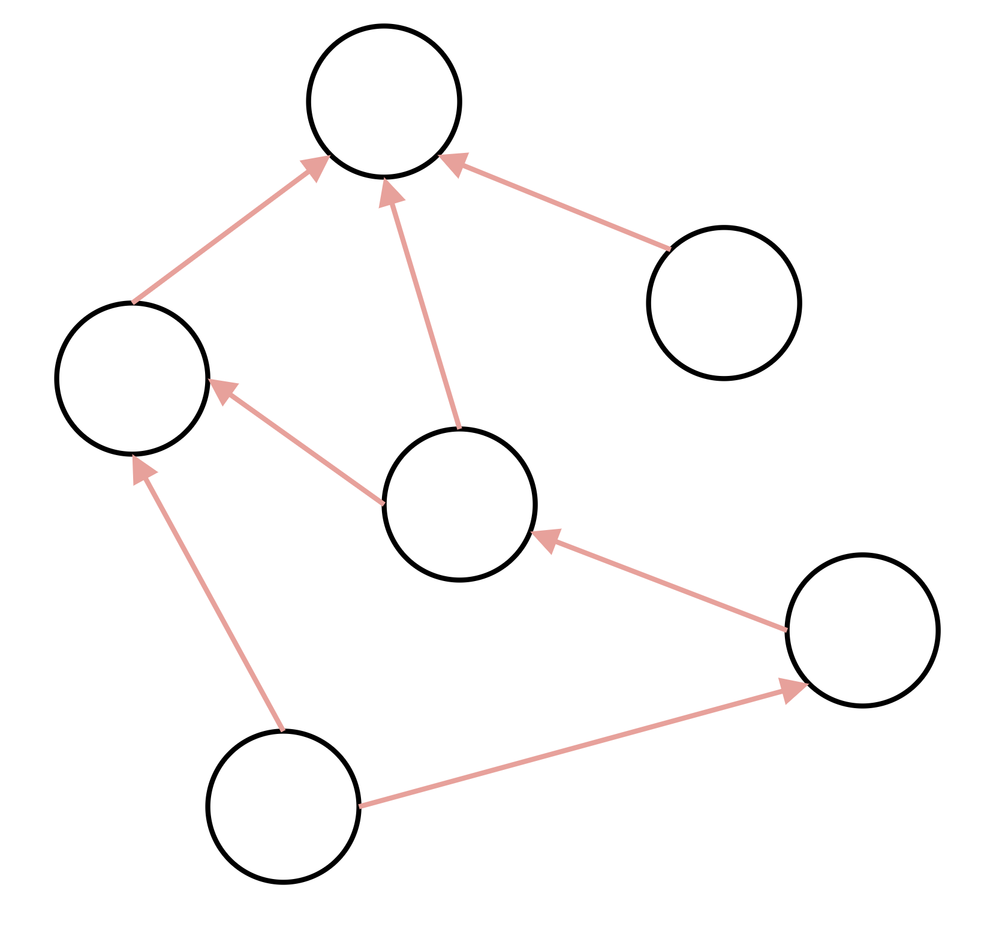

### 1.3 RBAC2

​		RBAC2 同样建立在 RBAC0 基础之上，仅是对用户、角色和权限三者之间增加了一些限制。这些限制可以分成两类，即静态职责分离 SSD(Static Separation of Duty)和动态职责分离 DSD(Dynamic Separation of Duty)。

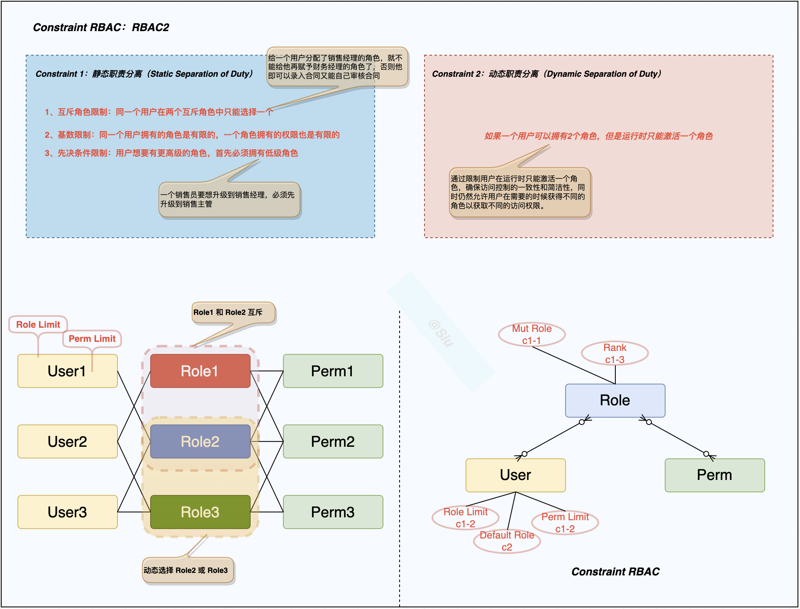

#### 1.3.1 静态职责分离

1、互斥角色限制：同一个用户在两个互斥角色中只能选择一个 

2、基数限制：同一个用户拥有的角色是有限的，一个角色拥有的权限也是有限的

3、先决条件限制：用户想要有更高级的角色，首先必须拥有低级角色

#### 1.3.2 动态职责分离

***    如果一个用户可以拥有 2个角色，但是运行时只能激活一个角色。***

> 一个CMS系统中，有多种用户角色，例如管理员、编辑和普通用户。管理员可以访问和管理整个系统，而编辑可以编辑和发布内容，普通用户只能访问内容。某个用户可能具有管理员和编辑两个角色，但在运行时只能激活其中一个角色。如果该用户激活了管理员角色，则可以执行管理员权限，如果激活编辑角色，则只能执行编辑权限，不能执行管理员权限。
>
> 这种机制可以确保管理员和编辑角色之间的权限不会发生冲突，而且每个用户只需要激活所需的角色来获取相应的权限，不需要管理和维护多个角色的权限。

### 1.4 RBAC3

### 1.5 主流权限模型对比

| 模型              | 主要特征                                                     | 应用                                                         | 优点                                         | 缺点                                                         |
| ----------------- | ------------------------------------------------------------ | ------------------------------------------------------------ | -------------------------------------------- | ------------------------------------------------------------ |
| ACL 访问控制列表  | 权限客体存储一个对自己拥有访问权限的主体名单，该名单记录主体及主体可对客体操作的权限 公司的门卫拿着一个名单，名单里记录了来访者及其可访问的楼层房间，必须在名单里的人才能进入公司相应的楼层房间 | 腾讯文档[^3]中单个文档、MacOS 的某个文件                     | 简单、容易理解                               | 用户多、权限变更频繁的场景下维护成本高、不容易做到权限审计（主体可以访问哪些客体） |
| MAC 强制访问控制  | 权限主体访问客体时，双向检查主体和客体的访问等级是否匹配 公司 1号办公室的保密等级是 level 3， 办公室门卫检查来访者的等级是否 >= level 3 | 美国空军SACDIN、Windows Vista[^4] MIC                        | 高度安全                                     | 不够灵活、前期规划成本高、主客体变动时管理成本高             |
| DAC 自主访问控制  | 权限主体可将自己对客体（往往是客体的 Owner）拥有的权限传递给其他主体，传递可以是一级或者多级 小A有公司很多办公室的钥匙，小A 可以复制一些钥匙给 小B | Unix File Mode、飞书文档                                     | 权限可分享、授权机制灵活                     | 安全性不够（权限可以随意转让）                               |
| RBAC 角色访问控制 | 主体关联角色、角色关联权限，权限关联客体和可对客体执行的动作，主体触发权限动作时如果主体在该权限关联的角色中则获得权限 公司老板给 小A一个通行证，通行证能进入 1，2，3号办公室，门卫根据通行证放行小A 进入1，2，3号办公室 | Jira[^5]、Azure[^6]、AWS[^7]、阿里云、百度云、腾讯云、美团、中通快递 | 满足最小权限、职责分离、权限抽象             | 需要定制权限多的场景时，角色数量容易暴涨；无法动态授权；配置量大 |
| ABAC 属性访问控制 | 权限主体、权限客体、访问行为、访问环境都可以用属性描述，通过在系统内定义这些属性規则来实现 “满足何种条件下，主体能对客体执行何种动作” 公司的门卫收到一套老板的规则：     内部员工可以在任何时间进入1号办公室     外部访客可在上午 10:00-12:00 进入 1号办公室 门卫检查每个来访者的身份、来访时间，来决定他们能否进入 1号办公室 | Kubernetes[^8]（在 ABAC 基础上支持 RBAC）、AWS（在 RBAC 基础上支持 ABAC）、飞书 | 灵活，能力强大，可以实现非常精细化的权限管理 | 无法直观设计用户拥有哪些权限、规则复杂会提高管理成本、系统设计复杂度高（开发难度也高）、性能问题 |

### 1.6 小结

​		RBAC 作为一个标准的权限模型，被 INCITS（国际信息技术标准委员会）[^9] 采纳，同时业内有大量的应用的权限系统使用或在RBAC 基础上扩展设计，总体上 RBAC 可以总结为以下特征：

- 标准化
- 应用实践较丰富，背书广泛，适合大多数场景
- 存在缺点和局限性（模型决定）
- 满足权限三原则：
  - 最小权限：用户仅在触发会话动作时获取到其所在角色，该角色定义了完成该动作所需的最小权限。
  - 权限抽象：可结合业务抽象出具体的权限行为，如发表评论、上传附件，而不是简单的 读、写、查。
  - 职责分离：角色本身表征了职责，加上 RBAC 支持角色和角色间的互斥机制，实现高风险动作分治。

## 二、基于 RBAC 的扩展

​		RBAC 可以在不同的应用程序中使用，但是现实场景中有一些是模型无法满足的，或是模型本身的一些自身缺陷需要调整的，这些可以根据业务场景去抽象和扩展。

### 2.1 用户组：给群体用户赋权

#### 2.1.1 业务场景

业务开发组的10个同事需要赋予“开发者角色”，“产品原型查阅角色”，“系统普通管理员角色”。

#### 2.1.2 设计方案

- 基于 RBAC0 ，需要将 3 个角色分别赋予 10 个用户
- 基于 RBAC0 + User Group，只需要将 10 个用户 组成一个 User Group，将 3 个角色赋予这个 UG，如下图：

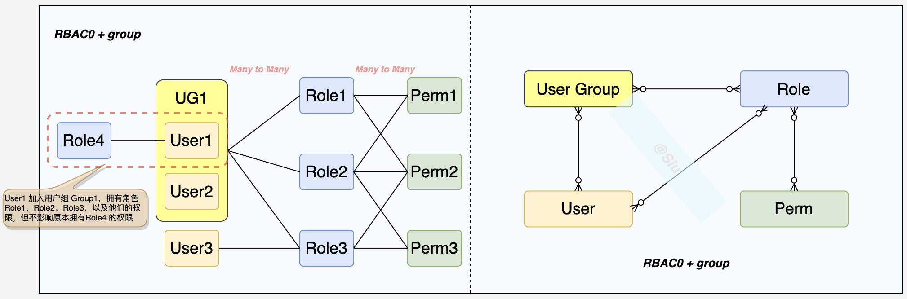

### 2.2 多租户[^10]：分析 SaaS 的权限体系

#### 2.2.1 业务场景

设计一个 SaaS[^11] 应用权限系统，需要按租户隔离账号、组织结构、权限、数据等。租户之间是相互独立的，彼此不会产生影响。

#### 2.2.2 设计方案

- 整体架构设计（简版）

  

- 模型设计

  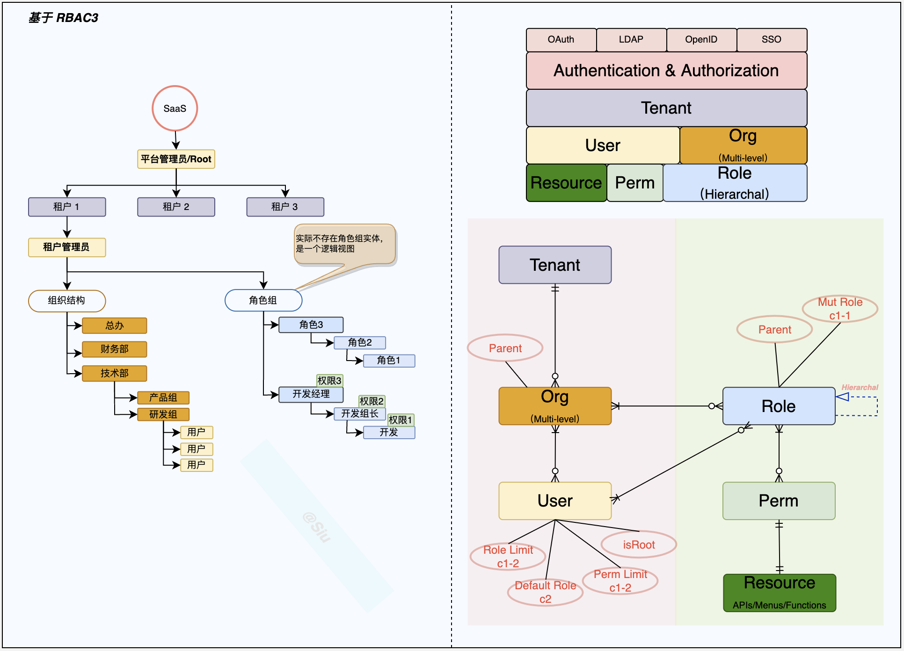

​		在 SaaS 系统中，组织结构和角色组是紧密相关的（企业微信、腾讯文档、飞书、钉钉都有类似的设计思路）。一般情况下，组织结构会作为一个租户中的一个独立的模块进行设计，可以包括公司、部门、团队等多个层级，每个层级可以包含多个用户。而角色组则是一个用于授权和权限管理的概念，用于将一组相似的权限分配给一组用户，以便更方便地管理权限（***这里角色组使用 RBAC1 中的角色分级树状继承关系来实现，产品形态上可以是一组逻辑上的角色组***）。

​    组织结构和角色组通常会相互结合，以满足业务需求。例如，可以通过将用户分配到不同的组织结构中，然后将角色组分配给组织结构，从而实现对组织结构中所有用户的权限控制。或者，可以将角色组分配给特定的组织结构中的用户，以实现更细粒度的权限控制。

​		总之，组织结构和角色组都是 SaaS 系统中的重要概念，可以相互结合来实现对用户权限的管理和控制。在设计 SaaS 系统时，需要充分考虑业务需求，并结合实际情况来确定组织结构和角色组的设计方案。

### 2.3 数据权限：统一抽象

​      数据权限解决的是用户能看到数据范围大小的问题，例如A和B两个用户都能看到销售模块，但A能看到320条数据，B只能看到100条数据，且A能看到的320条数据中包含着B能看到的100条数据，这些都是由数据权限决定的。

  而数据权限一般与企业的组织架构相关。

#### 2.3.1 业务场景

> ***数据权限（业务、行级、单维度）***

- 【用户A/研发组】，产生的业务数据不希望被其它组织中的用户访问（***数据隔离的问题***），同时希望可以访问到产品组的所有用户的业务数据（***数据授权的问题***）。
- 【用户A/研发组】，他的岗位是高级开发（组长），他希望能查看所有研发组的业务数据，同时希望【用户B/前端组】只能访问他自己以及所在子组的业务数据（***数据权限递归的问题***）

#### 2.3.2 设计方案

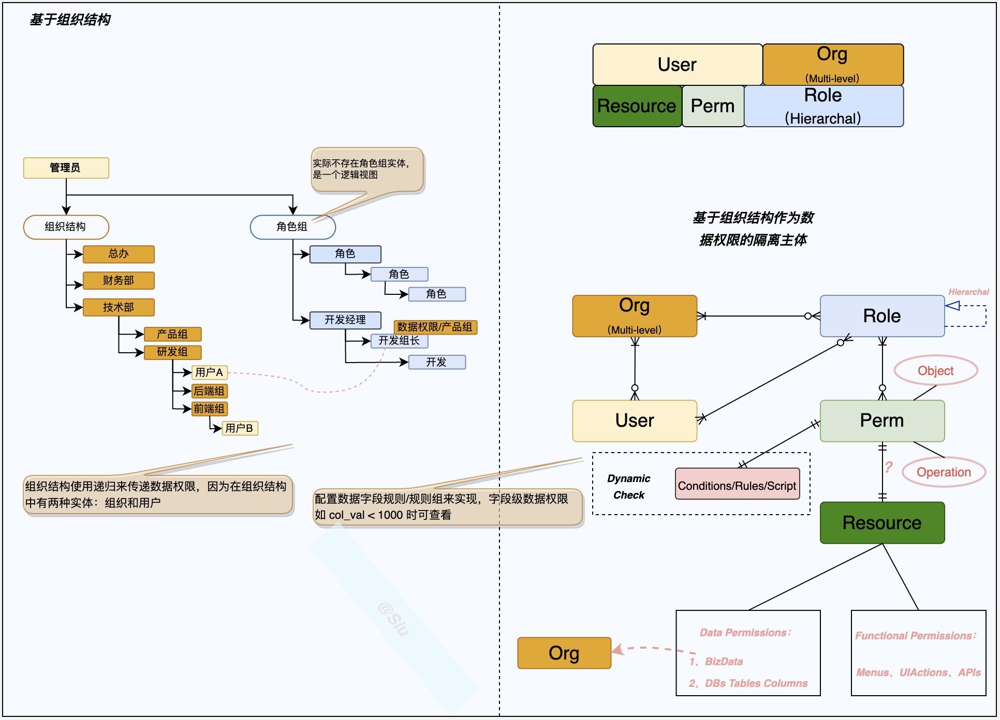

> 1. 数据权限与“组织结构/Org”相关，以组织结构为单位隔离
> 2. 用户拥有自己数据的数据权限
> 3. 用户 A 拥有 【研发组】以及子组的数据权限（递归）
> 4. 用户 A 的角色是【开发组长】，所以拥【产品组】的数据权限（包括从角色继承以及组织结构递归的数据权限）
> 5. 用户 B 拥有 【前端组】的数据权限
> 6. 给角色添加数据权限时，子组权限也要递归赋予
> 7. 数据权限是当作一种资源绑定在【Perm】实体，并不是直接与【Role】关联；与 RBAC 模型“权限抽象”保持一致
> 8. 【Role】与【Org】的实体关系，是指群体用户赋权

##### 2.3.2.1 数据权限统一抽象

- 平台系统数据按【组织结构/Org】隔离，并管理授权

- 数据权限统一抽象：

  | 权限级别/场景分类 | a) 业务系统的数据场景                                      | b) 数据仓库内的数据资源场景    |
  | ----------------- | ---------------------------------------------------------- | ------------------------------ |
  | 库级              | 低，由功能权限代替（a1）                                   | **高**，由统一数据权限抽象实现 |
  | 表级              | 低，由功能权限代替（a1）                                   | **高**，由统一数据权限抽象实现 |
  | 行级              | **高**，由Org 隔离实现，多维度由统一数据权限抽象实现（a2） | **高**，由统一数据权限抽象实现 |
  | 列级              | 中，由统一数据权限抽象实现（a3）                           | **高**，由统一数据权限抽象实现 |

  > a）
  >
  > ​	1、业务系统通常由微服务组成，即功能权限的管控，实际上可以代替【库级】、【表级】的数据权限；
  >
  > ​	2、默认的数据隔离是按照Org维度，多维度的列权限控制，需要统一的数据权限抽象来实现，结合“动态校验”；
  >
  > ​	3、对于列级数据权限，业务系统还是会有一些场景，**比如：低级别的财务不能看到大于10000 的工资，但可以看到其它的数据列，通常这类场景还与“数据脱敏”相关，实际基于“动态校验”可以实现简单的数据脱敏（读）**；
  >
  > b）
  >
  > 统一由数据权限的抽象实现：把数据的“库、表、列”抽象成数据资源和权限，结合“动态校验”；

### 2.4 动态授权：结合 ABAC

​		基于 RBAC 无法满足灵活的授权机制，而 ABAC 基于属性的授权思想，一切都是属性，属性可以来自主体、客体、上下文环境，这些属性制定成“规则”可以满足灵活且非常细粒度的授权，当然 ABAC 的缺点也很明显：不好审计、设计开发难度高、动态计算性能问题。所以建议以补充方案来提供这类的授权服务。

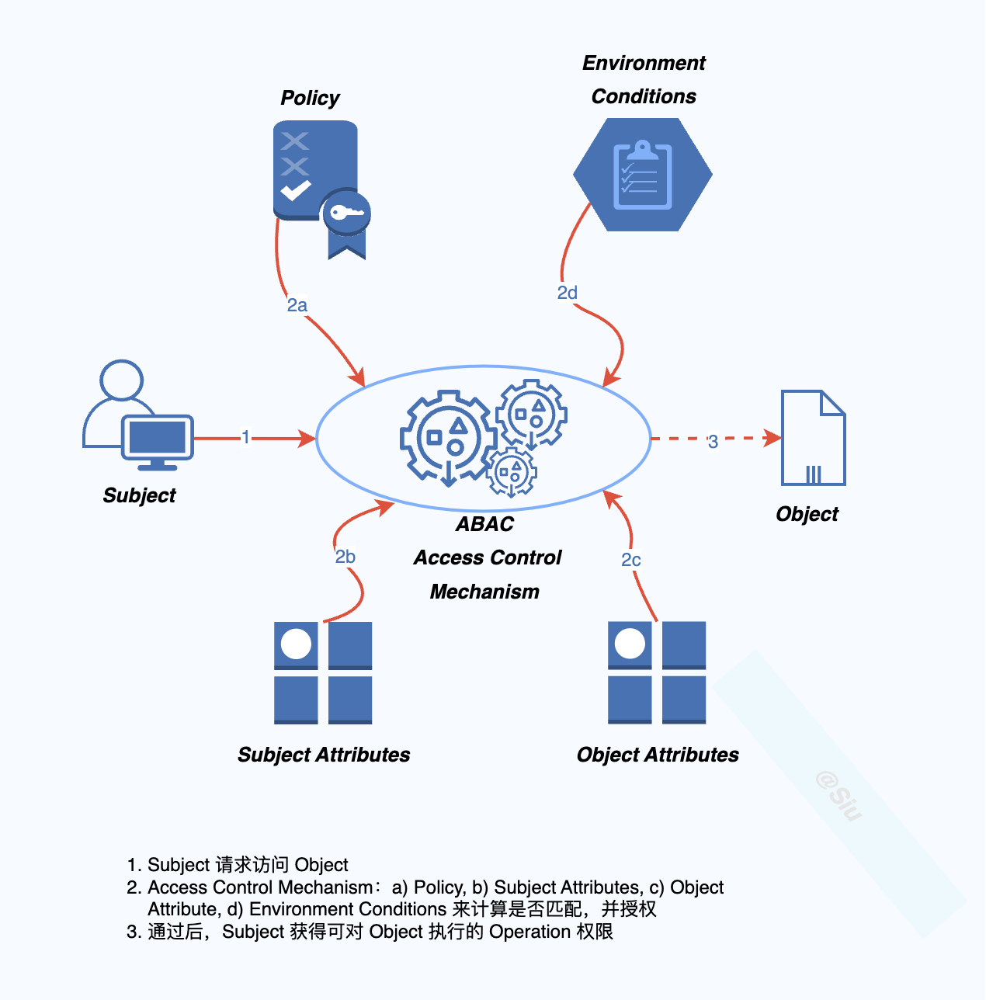

#### 2.4.1 业务场景

​		RBAC 已经提供了基于角色来配置权限，但系统也有一些需求需要根据“内置的一些规则”自动给用户授权，比如希望：***用户年龄小于30岁，早上8点-10点通过某个IP登录，且所在组人数小于10，且操作资源的某个值小于10000，满足这些条件就可以访问“资源”***（太精细、太灵活了，简直有些极端）。

​	这个需求也反向验证了 RBAC 角色爆炸的问题，当然 ABAC 需要提前的“规则规划”来处理这样的情况。

#### 2.4.2 设计方案

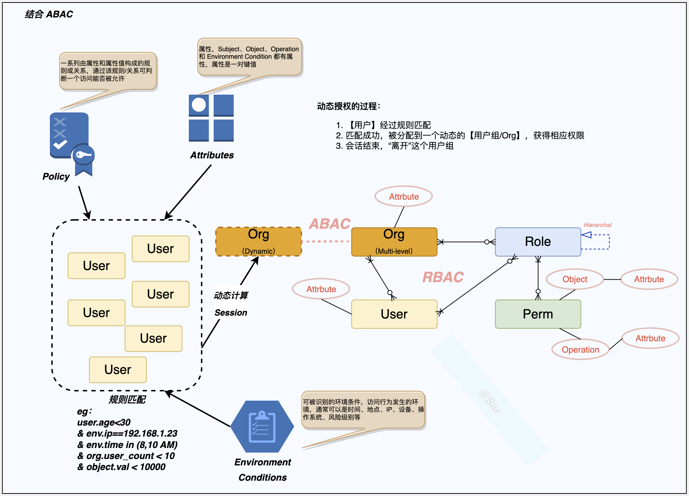

> - 通过提前的规划，内置了一些规则【Policy】，这些规则激活了相关的“动态【Org】”绑定相关角色，逻辑上与其他【Org】一致；
> - 当【User】会话激活时，动态计算通过后，【User】加入动态【Org】，由 ABAC “交换”到 RBAC 体系；

### 2.5 小结

​        基于 RBAC 模型，可以根据业务场景做一些通用的扩展，如用户组/组织结构、角色组/角色分级、数据权限等，甚至是结合其它的权限模型来解决实际问题，如ABAC（基于属性规则），而一些非通用的业务约束一般是特定子域的业务问题，这些需要结合更具体的业务场景以及借鉴业内通用的产品思路来抽象并扩展。

## 三、数据平台的权限系统设计

​		数据平台是以数据采集、数据治理、数据开发、数据服务为一体的一站式“数据工厂”，以“平台+生态入驻”和“私有化部署”形态呈现；数据平台权限系统内管控的资源包括各子系统的菜单、页面功能按钮、API、业务数据、数仓数据、元数据等，这些资源需要按**角色**和**组织**来管理和控制，同时在应用层满足标准的认证方式。

### 3.1 需求背景

​		目前数据平台部的功能权限（菜单）不完全满足“生态入驻平台”的场景，子系统间的功能体验不连续；生态和平台的定位不清晰（不需要多租户），资源分类和定义不清晰（比如Doris 定义成环境资源，Doris 的权限模型和平台的权限模型绑定）；数据权限不满足生态隔离的场景，行、列权限方案在原有基础上无法扩展；基于这些有必要理清需求和功能定位，以及思考技术架构设计的合理性，由此要对数据平台的权限设计做一次“大设计”。

### 3.2 现状分析

- 用户组（租户，现有定义，实际有一张 group 表）实现了部分组织结构的功能，但还不满足多层级/自由结构、不完全满足基于组织结构的数据权限扩展、不满足批量用户授权
- 角色的分级和继承无法满足
- 权限和资源没有抽象：目前只有菜单直接和角色关联
- 数据权限没有一个通用的实现；
- 平台权限模型与 Doris 耦合
- 原有设计基本遵循基于角色的权限的控制

### 3.3 设计目标

1. 权限管理的本质是对**用户**访问系统**资源**做**权限**控制，需要先定义好系统中的**用户、角色、权限、资源**；
2. 用户体量大情况下，要能高效、便捷的**认证、授权**；
3. 数据权限，包括数据库、表、**行**、**列**；
4. 保证良好的业务**扩展性**；
5. 权限需要的特色功能需要单独考虑：角色互斥，角色分级继承，角色先决限制；

#### 3.3.1 实现功能

- 平台超级管理员
- 组织结构管理
  - 一级组织管理员
  - 一级组织权限列表分配（绑定角色）
- 用户管理（关联角色）
- 角色管理
  - 角色组/分级和树继承
  - 角色互斥（？）
  - 绑定功能权限
  - 绑定数据权限
- 权限管理（资源统一抽象）
  - 功能权限
  - 数据权限1（Org 隔离）、数据权限2（库、表、行、列）
- 认证机制（SSO...）
- 授权机制
  - 基于角色
  - 基于属性

#### 3.3.2 设计指标

> 具体指标略。

- 认证效率：用户快速标准化进行身份认证；
- 鉴权效率：高性能保证鉴权不影响正常业务逻辑处理；
- 安全性：保证不会由于权限系统误判导致功能、数据泄漏；
- 扩展性：在系统的多个节点提供扩展性，包括但不限于用户类型扩展、用户属性扩展、资源类型扩展、资源属性扩展、多租户扩展、动态权限扩展。

### 3.4 设计思路

>  **大设计小实现。**

- **分析和改进**旧有设计；
- 基于**主流**的权限模型，**遵循**原有基于角色的设计，对齐 RBAC 模型，以 RBAC1 为基础；
- 以**满足**设计目标为主，**扩展**【组织结构】&【角色组/分级树继承】、**按需**扩展 RBAC2 的约束形成“平台基础权限模型”；
- 基于【组织结构】实现系统数据隔离（*数据权限1*）；
- 基于【权限/资源】抽象，统一处理**功能权限**（菜单、功能按钮、API）和**数据权限**（库、表、行、列（*数据权限2*））；
- 在“平台基础权限模型”上，抽象和扩展“平台业务约束”、**按需**扩展动态授权（结合ABAC）形成“平台权限模型”；
- 在“平台权限模型”基础上，讨论平台需要支持的认证方式，如 SSO、OAuth、LDAP；
- 通过“大设计、小实现”的方式迭代式开发：
  1. **完成**总体设计和主要模型设计，包括：组织结构、角色分级、数据权限、权限资源抽象、动态权限、多租户、认证和授权机制
  2. **实现**完整组织结构功能+角色分级 
  3. **实现**数据权限1
  4. **实现**权限资源统一抽象 
  5. **实现**数据权限2
  6. **实现**基础动态授权
  7. **探讨**多租户演进的必要

### 3.5 设计方案

#### 3.5.1 业务流程

##### 3.5.1.1 生态入驻

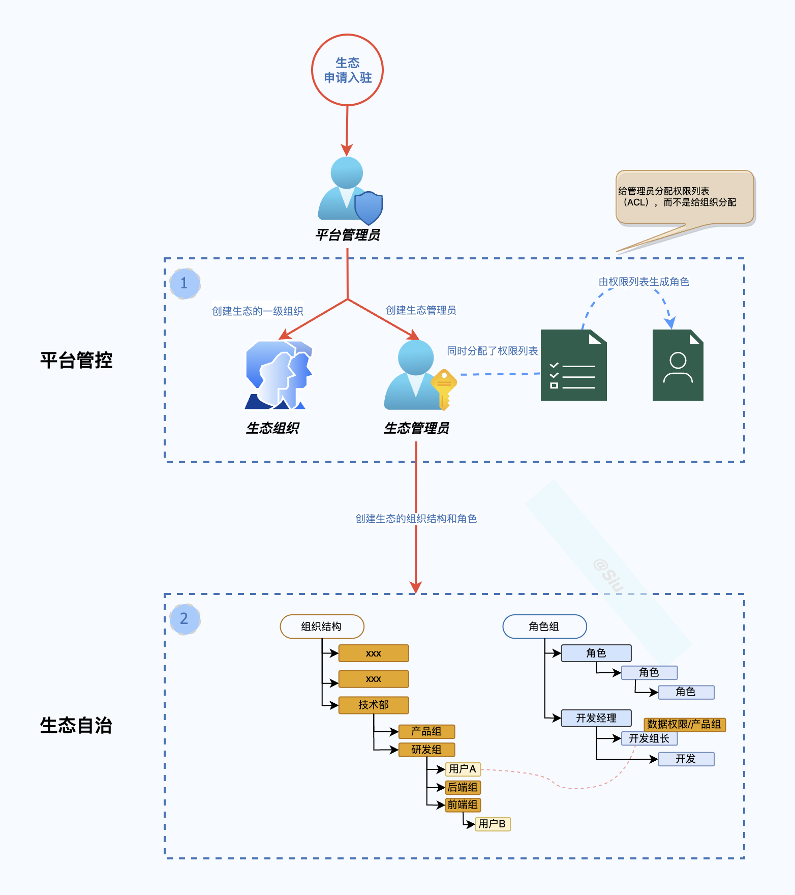

##### 3.5.1.2 添加次级组织

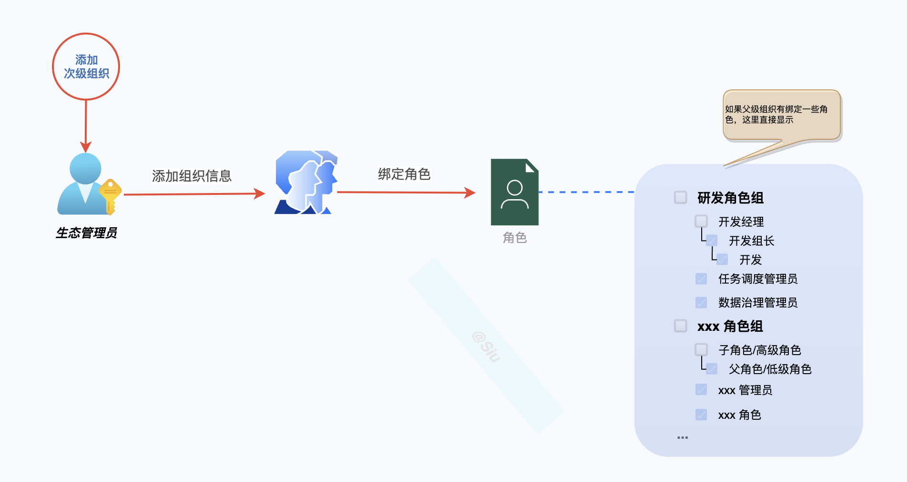

##### 3.5.1.3 添加用户

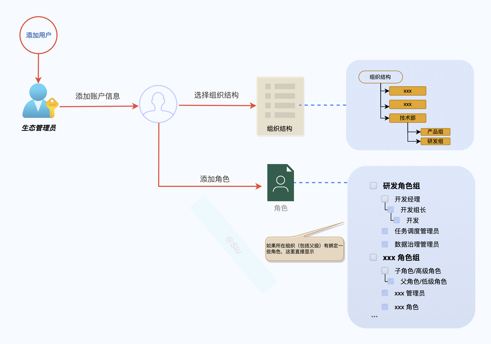

##### 3.5.1.4 添加角色

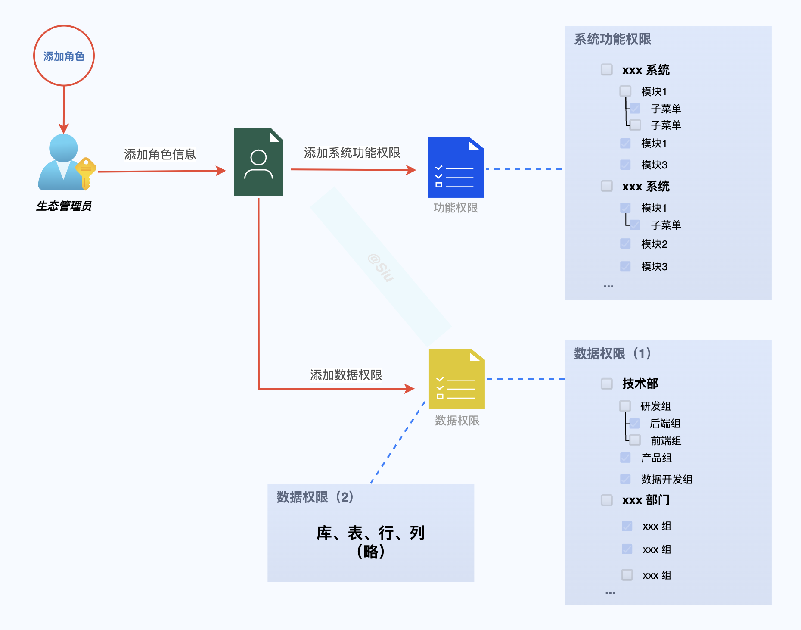

#### 3.5.2 架构设计

##### 3.5.2.1 业务架构

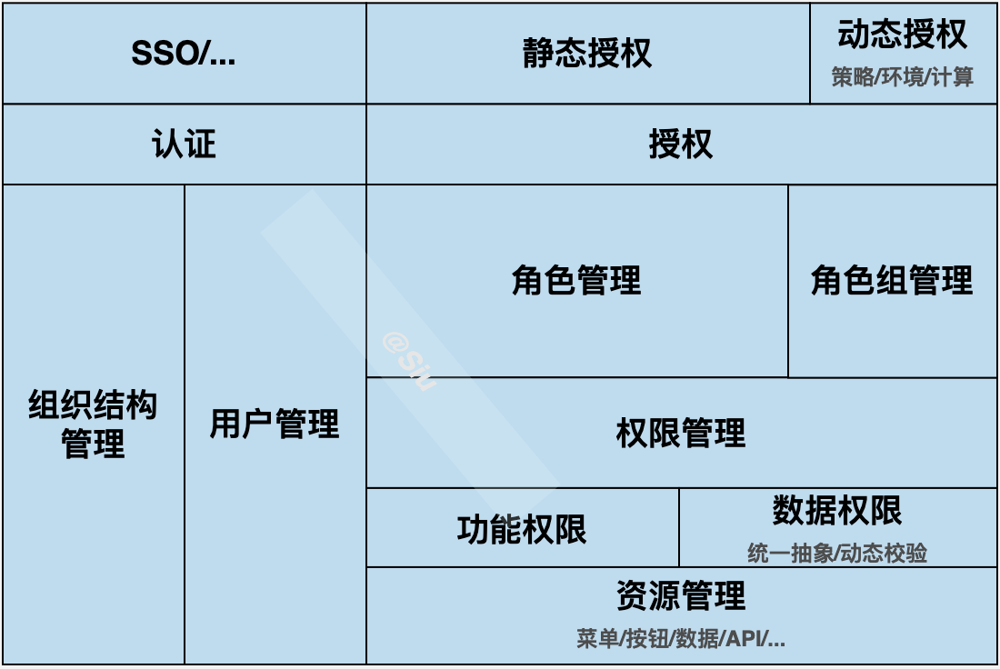

##### 3.5.2.2 模型设计

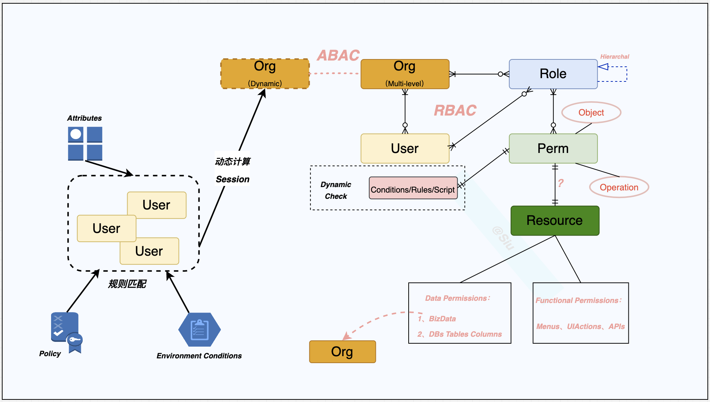

> **要点：**
>
> - 基于 RBAC1（角色分级）
>
> - 结合 ABAC，并与 RBAC 体系形成一体
>
> - 扩展：组织结构+ 角色组（管理逻辑） + RBAC2/或其它约束
>
> - 权限统一抽象：功能权限 + 数据权限
>
> - 数据权限1：Org 隔离
>
> - 数据权限2：数据权限统一抽象+动态校验
>
> - 与现有设计对比：
>
>     
>
>   - 1、原有 group（租户），对应方案中的 Org：
>     - 与角色可以建立关系，用于群体用户授权；
>     - 多层级，可用于权限的递归操作；
>     - 作为数据权限1的隔离单元；
>   - 2、完全基于角色去控制权限，所有资源都做权限抽象，与角色关联：功能权限、数据权限、ABAC 交换到 RBAC
>   - 3、平台权限模型与中间件解耦（不与 Doris 权限体系强关联）：
>     - 限制了平台权限控制的扩展，有的中间件是没有对等的权限体系（OSS，HDFS，MQ）
>     - 现有平台的权限与 Doris权限交换的粒度是“组”，无法做到细粒度的权限控制

### 3.6 已知问题

- 任务调度是基于 DS 二次开发的系统，只做到功能权限（用户同步机制现实），无法满足数据权限：
  - 可以再讨论方案，看是否可以实现【数据权限1】

# REF

https://juejin.cn/post/7119809372842098696

https://blog.csdn.net/u011282930/article/details/70211183

https://www.woshipm.com/pd/440765.html

https://www.cnblogs.com/xuanbg/p/12511509.html

https://segmentfault.com/a/1190000039338455

[工作流系统中一个基于双权角色的条件化 RBAC访问控制模型](https://www.jsjkx.com/CN/article/openArticlePDF.jsp?id=10745)

https://alidocs.dingtalk.com/i/p/Y7kmbokZp3pgGLq2/docs/OmLa2Gg0l5BW7jKgOko28vQAdYbnKEek

## 脚注

[^1]: [RBAC](https://zh.wikipedia.org/wiki/%E4%BB%A5%E8%A7%92%E8%89%B2%E7%82%BA%E5%9F%BA%E7%A4%8E%E7%9A%84%E5%AD%98%E5%8F%96%E6%8E%A7%E5%88%B6)：**以角色为基础的访问控制**英语：**Role-based access control**，**RBAC**），是[信息安全](https://zh.wikipedia.org/wiki/資訊安全)领域中，一种较新且广为使用的[访问控制](https://zh.wikipedia.org/wiki/存取控制)机制。1996年，莱威·桑度（Ravi Sandhu）等人在前人的理论基础上，提出以角色为基础的访问控制模型，故该模型又被称为**RBAC96**。之后，[美国国家标准局](https://zh.wikipedia.org/wiki/美國國家標準局)重新定义了以角色为基础的访问控制模型，并将之纳为一种标准，称之为**NIST RBAC**。RBAC 在2004年2月被美国国家标准委员会（ANSI）和IT国际标准委员会(INCITS)接纳为ANSI INCITS 359-2004标准。
[^2]: [有向无环图](https://zh.wikipedia.org/wiki/%E6%9C%89%E5%90%91%E6%97%A0%E7%8E%AF%E5%9B%BE)：在[图论](https://zh.wikipedia.org/wiki/图论)中，如果一个[有向图](https://zh.wikipedia.org/wiki/有向图)从任意[顶点](https://zh.wikipedia.org/wiki/顶点_(图论))出发无法经过若干条[边](https://zh.wikipedia.org/wiki/邊_(圖論))回到该[点](https://zh.wikipedia.org/wiki/顶点_(图论))，则这个图是一个**有向无环图**（**DAG**，**D**irected **A**cyclic **G**raph）。
[^3]: [腾讯文档](https://cloud.tencent.com/product/tdb)：腾讯文档是基于多人实时在线编辑技术的文档协作与文件共享平台。同时提供包含帐号、品类、盘、管理后台、API、安全等能力与企业内部系统进行无缝集成，从而实现自动化文档工作流。
[^4]: [Windows Vista](https://zh.wikipedia.org/wiki/Windows_Vista)：**Windows Vista**是[微软](https://zh.wikipedia.org/wiki/微軟)发行的一款[Windows](https://zh.wikipedia.org/wiki/Microsoft_Windows)个人桌面[操作系统](https://zh.wikipedia.org/wiki/操作系统)，于2005年7月22日微软正式公布此名称。开发代号**Longhorn**。
[^5]: [Jira](https://zh.wikipedia.org/wiki/JIRA)：**JIRA**是一个[缺陷跟踪管理系统](https://zh.wikipedia.org/wiki/缺陷跟踪管理系统)，为针对缺陷管理、[任务追踪](https://zh.wikipedia.org/wiki/事务跟踪管理系统)和[项目管理](https://zh.wikipedia.org/wiki/项目管理)的商业性[应用软件](https://zh.wikipedia.org/wiki/应用软件)，开发者是澳大利亚的[Atlassian](https://zh.wikipedia.org/wiki/Atlassian)。
[^6]: [Microsoft Azure](https://zh.wikipedia.org/wiki/Microsoft_Azure)：**Microsoft Azure** 是[微软](https://zh.wikipedia.org/wiki/微軟)的[公用云](https://zh.wikipedia.org/wiki/公用雲)端服务 (Public Cloud Service) 平台，是微软在线服务 (Microsoft Online Services) 的一部分，自 2008 年开始发展，2010年2月份正式推出，目前全球有54座[数据中心](https://zh.wikipedia.org/wiki/資料中心)以及44个[CDN](https://zh.wikipedia.org/wiki/CDN)跳跃点 (POP)，并且于2015年时被 [Gartner](https://zh.wikipedia.org/wiki/Gartner) 列为云计算的领先者。
[^7]: [AWS](https://zh.wikipedia.org/wiki/%E4%BA%9A%E9%A9%AC%E9%80%8A%E4%BA%91%E8%AE%A1%E7%AE%97%E6%9C%8D%E5%8A%A1)：**亚马逊云计算服务**（英语：Amazon Web Services，缩写为AWS）是[亚马逊公司](https://zh.wikipedia.org/wiki/亞馬遜公司)旗下的子公司，向个人、企业和政府提供[按需即用](https://zh.wikipedia.org/wiki/软件即服务)[云计算](https://zh.wikipedia.org/wiki/云计算)[平台](https://zh.wikipedia.org/wiki/系统平台)以及[应用程序接口](https://zh.wikipedia.org/wiki/应用程序接口)，并按照使用量计费。
[^8]: [Kuberbetes](https://zh.wikipedia.org/wiki/Kubernetes)：**Kubernetes**（常简称为**K8s**）是用于自动部署、扩展和管理“[容器化](https://zh.wikipedia.org/wiki/作業系統層虛擬化)（containerized）应用程序”的[开源](https://zh.wikipedia.org/wiki/开源软件)系统。
[^9]: [INCITS](https://www.incits.org/about/)：**INCITS** -- the InterNational Committee for Information Technology Standards -- is the central U.S. forum dedicated to creating technology standards for the next generation of innovation. INCITS members combine their expertise to create the building blocks for globally transformative technologies. From cloud computing to communications, from transportation to health care technologies, INCITS is the place where innovation begins.
[^10]: [多租户](https://zh.wikipedia.org/wiki/%E5%A4%9A%E7%A7%9F%E6%88%B6%E6%8A%80%E8%A1%93)：**多租户技术**（英语：**multi-tenancy technology**）或称**多重租赁技术**，是一种[软件架构](https://zh.wikipedia.org/wiki/軟體架構)技术，它是在探讨与实现如何于多用户的环境下共享相同的系统或程序组件，并且仍可确保各用户间资料的隔离性。
[^11]: [SaaS](https://zh.wikipedia.org/wiki/%E8%BD%AF%E4%BB%B6%E5%8D%B3%E6%9C%8D%E5%8A%A1)：**软件即服务**（英语：Software as a Service，缩写：**SaaS**，发音：/sæs/或/sɑs/），亦可称为“按需即用软件”（即“一经要求，即可使用”），它是一种[软件](https://zh.wikipedia.org/wiki/软件)交付模式。

