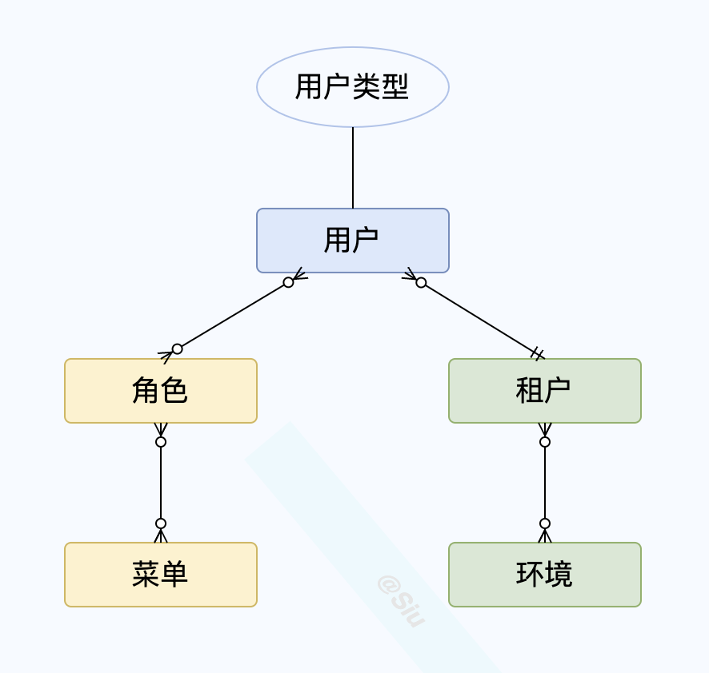
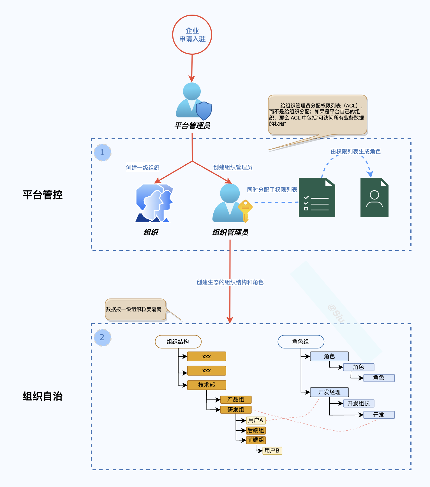
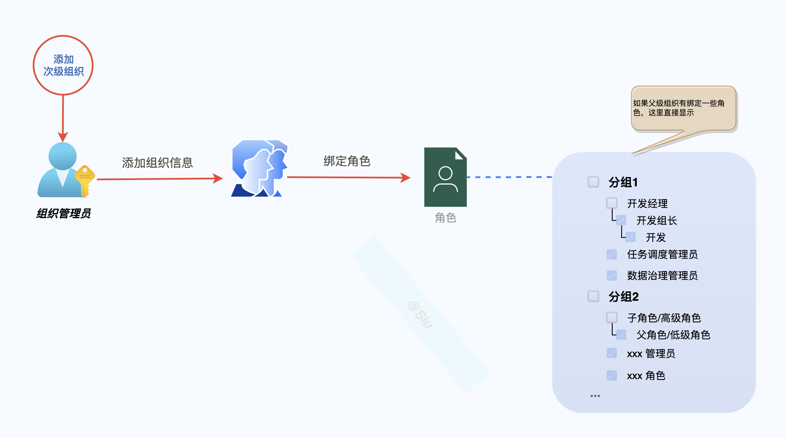
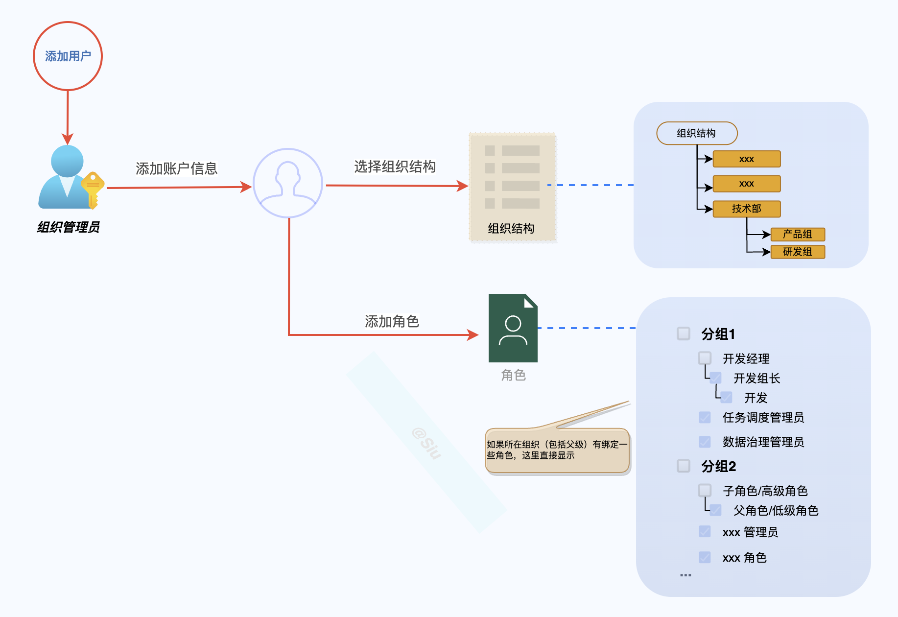
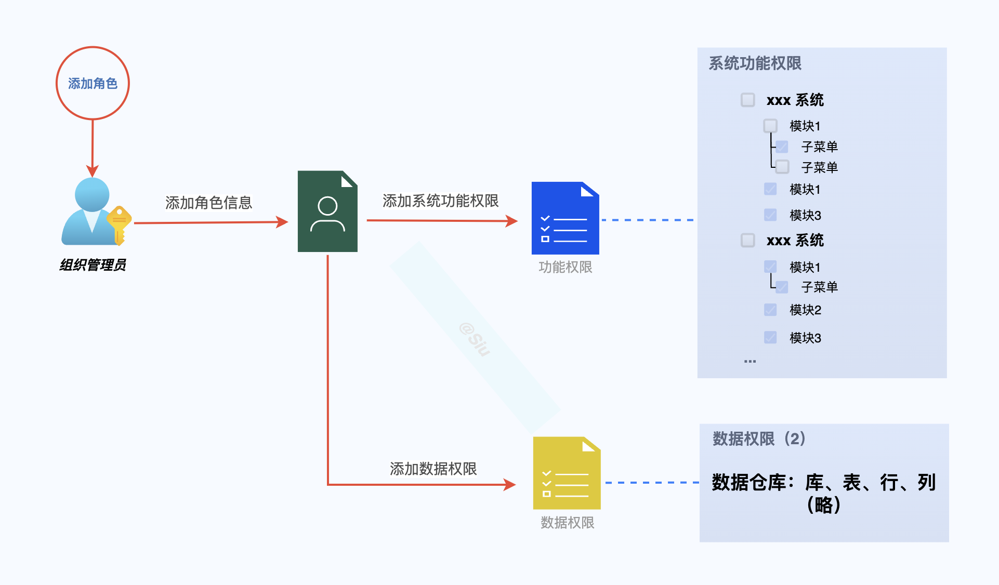
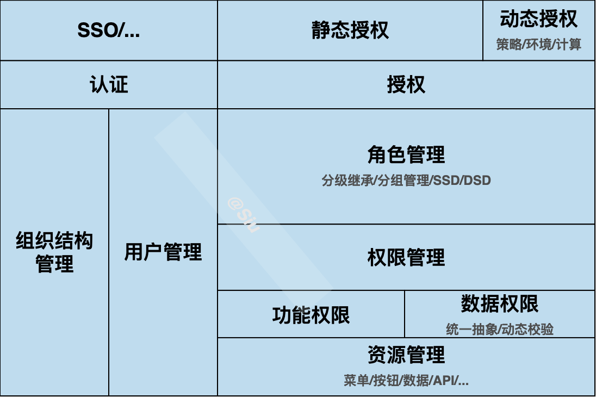
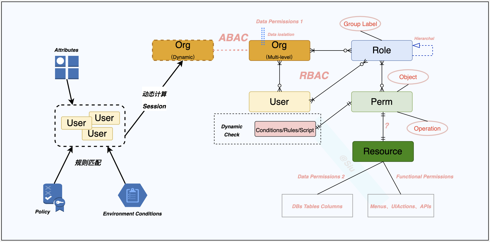

<b> 数据平台权限系统设计讨论</b>

<b>数据技术部 龚世文</b> 

<b>2023年3月</b> 

<b>目录</b> 

---

[TOC]

​		数据平台是以数据采集、数据治理、数据开发、数据服务为一体的一站式“数据工厂”，以**“平台+生态入驻”**和**“私有化部署”**形态呈现；数据平台权限系统内管控的资源包括各子系统的菜单、页面功能按钮、API、业务数据（只要按一级组织维度隔离，不需要授权）、数仓数据、元数据等，这些资源需要按**角色**和**组织**来管理和控制，同时在应用层满足标准的认证方式。

## 一 需求背景

​		目前数据平台部的功能权限（菜单）不完全满足“生态入驻平台”的场景，子系统间的功能体验不连续；生态和平台的定位不清晰（不需要多租户），资源分类和定义不清晰（比如Doris 定义成环境资源，Doris 的权限模型和平台的权限模型绑定）；数据隔离不满足按生态隔离的场景，数据仓库数据资源行、列权限控制方案在原有基础上无法扩展；基于这些有必要理清需求和功能定位，以及思考技术架构设计的合理性，由此要对数据平台的权限设计做一次“大设计”。

## 二 现状分析

- 用户组（租户，现有定义，实际有一张 group 表）实现了部分组织结构的功能，但还不满足多层级/自由结构、未实现数据隔离、不满足批量用户授权
- 角色的分级和继承无法满足
- 权限和资源没有抽象：目前只有菜单直接和角色关联
- 数据权限没有一个通用的实现；
- 平台权限模型与 Doris 耦合
- 原有设计基本遵循基于角色的权限的控制

## 三 设计目标

1. 权限管理的本质是对**用户**访问系统**资源**做**权限**控制，需要先定义好系统中的**用户、角色、权限、资源**；
2. 用户体量大情况下，要能高效、便捷的**认证、授权**；
3. 数据隔离：按一级组织维度隔离；
4. 数据权限（只有数据仓库需要控制），包括数据库、表、**行**、**列**；
5. 保证良好的业务**扩展性**；
6. 权限需要的特色功能需要单独考虑：角色互斥，角色分级继承，角色先决限制；

### 3.1 实现功能

- 平台超级管理员
- 组织结构管理
  - 一级组织管理员
  - 平台组织（具有全平台业务数据权限）
  - 数据隔离，只按一级组织隔离（**数据权限1**）
  - 一级组织权限列表分配（绑定角色）
- 用户管理（关联角色）
- 角色管理
  - 角色分组
  - 分级和树继承
  - SSD（角色互斥、？）、DSD（？）
  - 绑定功能权限
  - 绑定数据权限
- 权限管理（资源统一抽象）
  - 功能权限
  - 数据仓库库、表、行、列权限控制（**数据权限2**）
- 认证机制（SSO...）
- 授权机制
  - 基于角色
  - 基于属性

### 3.2 设计指标

> 具体指标略。

- 认证效率：用户快速标准化进行身份认证；
- 鉴权效率：高性能保证鉴权不影响正常业务逻辑处理；
- 安全性：保证不会由于权限系统误判导致功能、数据泄漏；
- 扩展性：在系统的多个节点提供扩展性，包括但不限于用户类型扩展、用户属性扩展、资源类型扩展、资源属性扩展、多租户扩展、动态权限扩展。

## 四 设计思路

>  **大设计小实现。**

- **分析和改进**旧有设计；
- 基于**主流**的权限模型，**遵循**原有基于角色的设计，对齐 RBAC 模型，以 RBAC1 为基础；
- 以**满足**设计目标为主，**扩展**【组织结构】&【角色组/分级树继承】、**按需**扩展 RBAC2 的约束形成“平台基础权限模型”；
- 基于【组织结构】实现系统数据隔离（*数据权限1*）；
- 基于【权限/资源】抽象，统一处理**功能权限**（菜单、功能按钮、API）和**数据权限**（库、表、行、列（*数据权限2*））；
- 在“平台基础权限模型”上，抽象和扩展“平台业务约束”、**按需**扩展动态授权（结合ABAC）形成“平台权限模型”；
- 在“平台权限模型”基础上，讨论平台需要支持的认证方式，如 SSO、OAuth、LDAP；
- 通过“大设计、小实现”的方式迭代式开发：
  1. **完成**总体设计和主要模型设计，包括：组织结构、角色分级、数据权限、权限资源抽象、动态权限、多租户、认证和授权机制
  2. **实现**完整组织结构功能+角色分级 
  3. **实现**数据权限1
  4. **实现**权限资源统一抽象 
  5. **实现**数据权限2
  6. **实现**基础动态授权
  7. **探讨**多租户演进的必要

## 五 设计方案

### 5.1 业务流程

#### 5.1.1 生态入驻

#### 5.1.2 添加次级组织

#### 5.1.3 添加用户

#### 5.1.4 添加角色

### 5.2 架构设计

#### 5.2.1 业务架构

#### 5.2.2 模型设计

> **要点：**
>
> - 基于 RBAC1（角色分级）
>
> - 结合 ABAC，并与 RBAC 体系形成一体
>
> - 扩展：组织结构+ 角色分组管理（与实际授权无关） + RBAC2/或其它约束
>
> - 权限统一抽象：功能权限 + 数据权限2
>
> - 数据权限1：Org 隔离（一级组织隔离）
>
> - 数据权限2：数据权限统一抽象+动态校验（业务数据不需要授权只是隔离）
>
> - 与现有设计对比：
>
>     
>
>   - 1、原有 group（租户），对应方案中的 Org：
>     - 与角色可以建立关系，用于群体用户授权；
>     - 多层级，可用于权限的递归操作；
>     - 作为数据权限1的隔离单元；
>   - 2、完全基于角色去控制权限，所有资源都做权限抽象，与角色关联：功能权限、数据权限、ABAC 交换到 RBAC
>   - 3、平台权限模型与中间件解耦（不与 Doris 权限体系强关联）：
>     - 限制了平台权限控制的扩展，有的中间件是没有对等的权限体系（OSS，HDFS，MQ）
>     - 现有平台的权限与 Doris权限交换的粒度是“组”，无法做到细粒度的权限控制

## 六 已知问题

- 任务调度是基于 DS 二次开发的系统，只做到功能权限（用户同步机制现实），无法满足数据权限：
  - 可以再讨论方案，看是否可以实现【数据权限1】

# REF

https://juejin.cn/post/7119809372842098696

https://blog.csdn.net/u011282930/article/details/70211183

https://www.woshipm.com/pd/440765.html

https://www.cnblogs.com/xuanbg/p/12511509.html

https://segmentfault.com/a/1190000039338455

[工作流系统中一个基于双权角色的条件化 RBAC访问控制模型](https://www.jsjkx.com/CN/article/openArticlePDF.jsp?id=10745)

https://alidocs.dingtalk.com/i/p/Y7kmbokZp3pgGLq2/docs/OmLa2Gg0l5BW7jKgOko28vQAdYbnKEek

https://github.com/RandolphChin/eladmin/blob/60c40aa8be97e81725a349e10f162980fb2c7bf8/eladmin-common/src/main/java/com/laboratory/config/DataScopePermissionHandler.java

