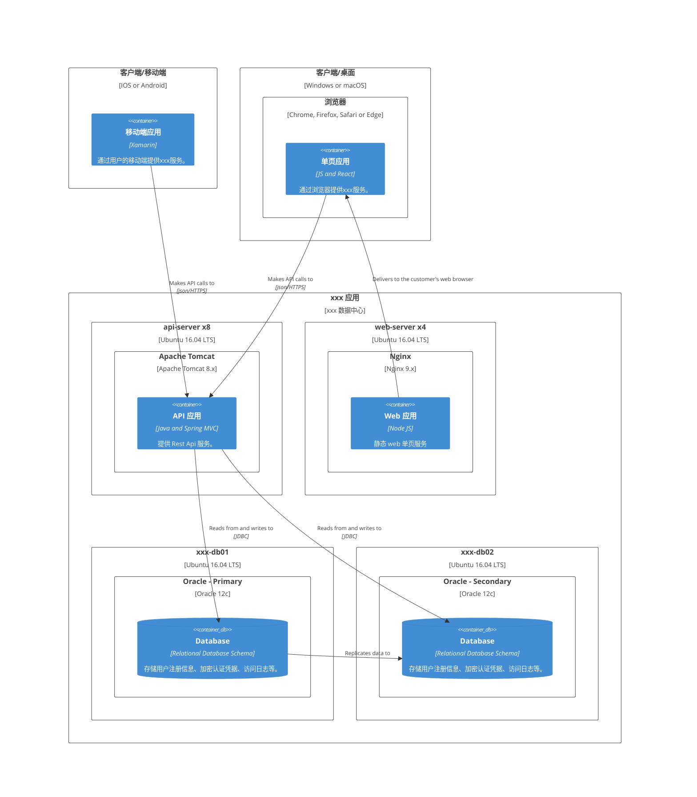
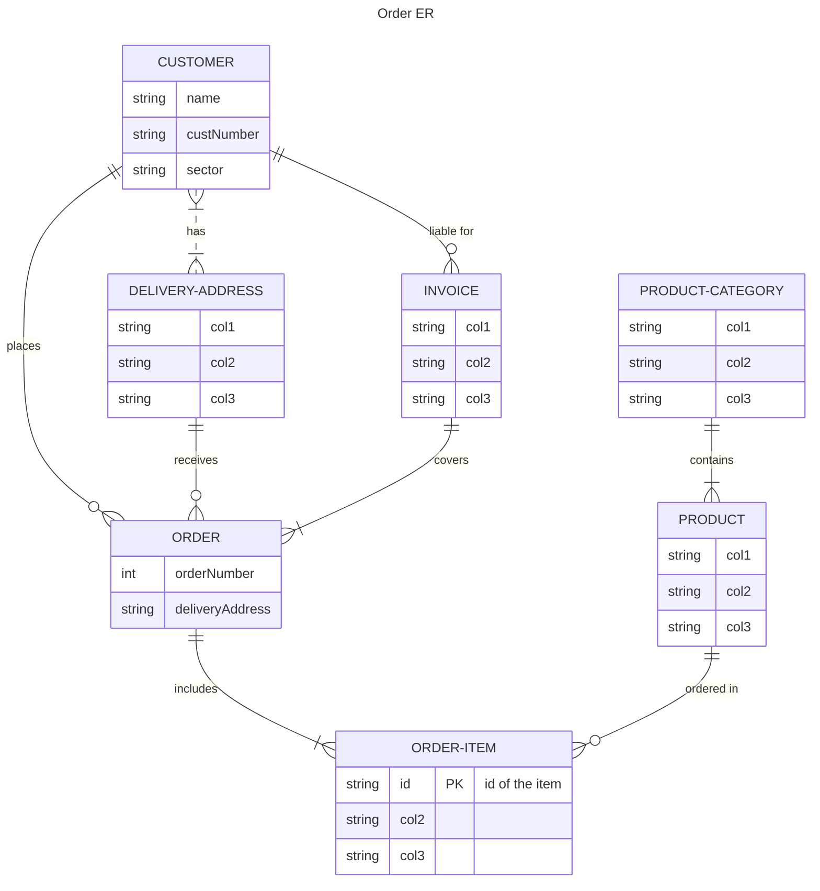
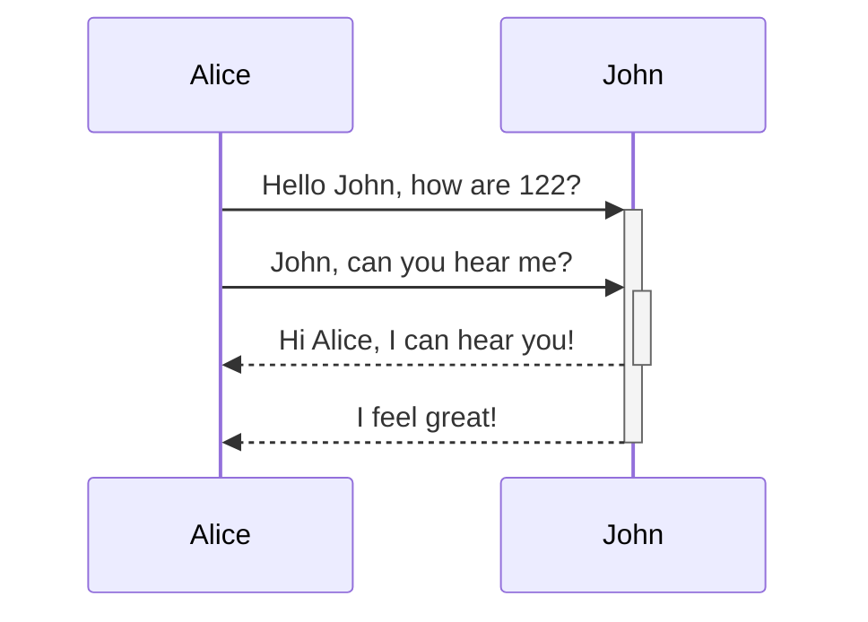
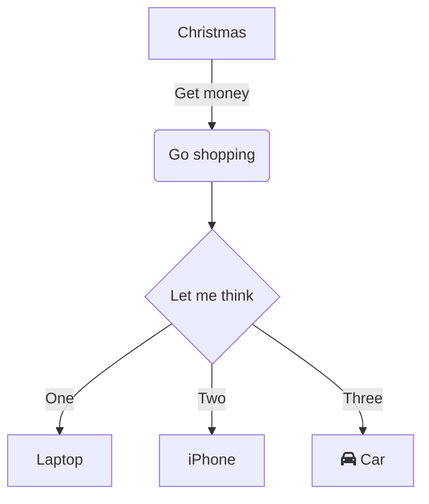
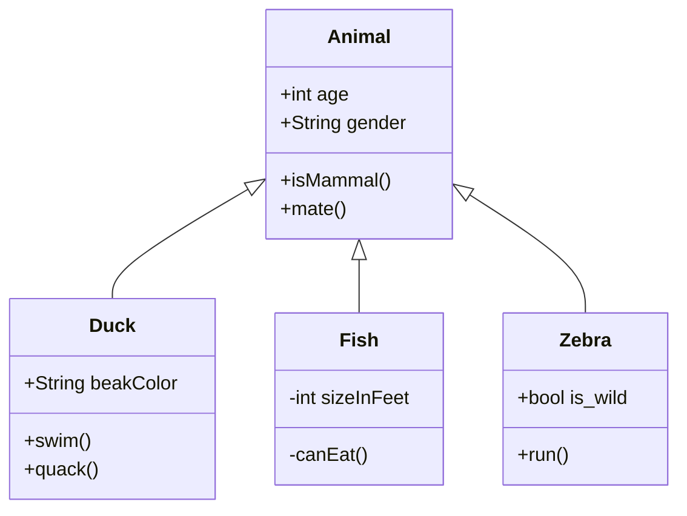
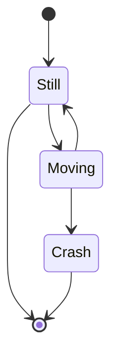
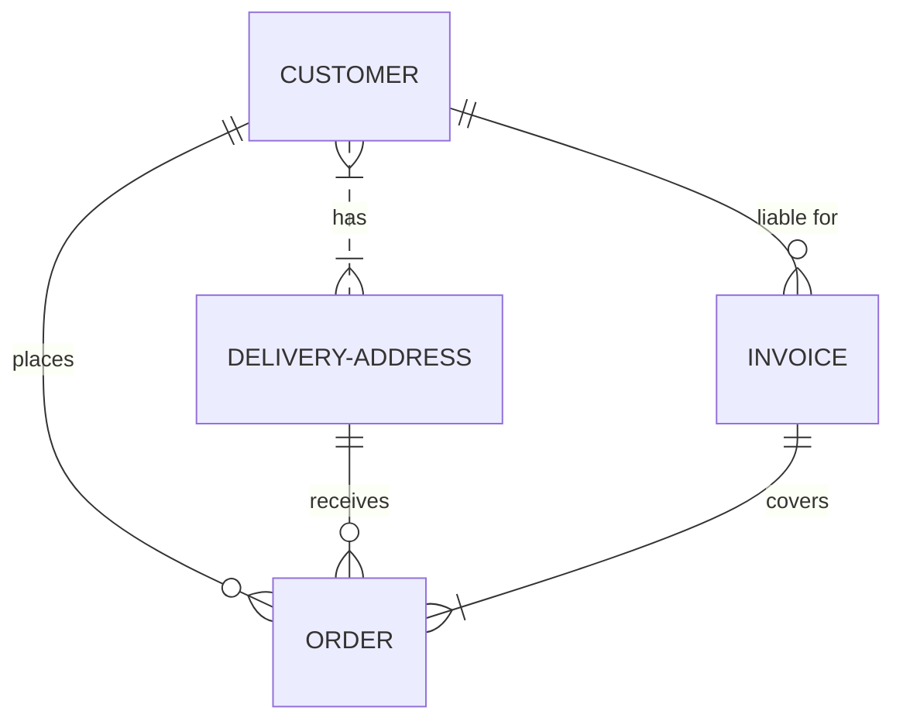

<div align='center' ><font size='60'><b> xxx 设计说明书</b></font></div>


<div align='center' ><font size='3'><b>中电数据运营有限公司 数据技术部</b> </font></div>

<div align='center' ><font size='3'><b>2023年1月</b> </font></div>

<div STYLE="page-break-after: always;"></div>

## 修订记录

| **版本编号** | **变更状态** | **简要说明** | **修订人** | **变更日期** | **评审人**                                 | **评审日期** |
| ------------ | ------------ | ------------ | ---------- | ------------ | ------------------------------------------ | ------------ |
| V0.1         | C            | 初稿         | 龚世文     | 2023.1.27    | 廖春水、彭培军、杨同彬、王涛、施俊、李文强 | 2023.02.01   |

***`变更状态：C——创建，A——增加，M——修改，D——删除`***

> ⚠️  **技术设计不是一成不变的，经常会随着业务的变化，进行完善和优化，但是每一个版本，都应该留下记录和备份。**

<div STYLE="page-break-after: always;"></div>


<div align='center' ><font size='5'><b>目录</b> </font></div>

---

 [toc]

<div STYLE="page-break-after: always;"></div>

## 文档说明

1. 文档目的：规范系统设计、提高研发效率。
2. 适用范围：本文档适用于中电运营数据技术部相关的研发项目和团队，主要面向项目管理员，架构师，开发工程师，质量管理人员，测试人员。
3. 文档组成：文档由系统设计相关的架构、流程图、数据模型、算法步骤、接口说明等组成。
4. 文档维护：文档的维护人员、修订记录见**[《文档修订记录》](#文档修订记录)**。
5. 附录: 相关的表格，模板，方法，工具说明等，详见**[《附录》](#附录)**。

> ⚠️  **这里补充几点设计文档的原则和理念：**
>
> - 设计文档不是为了约束，而是为了**沉淀知识，传递信息，理解业务和架构**，所以模版”约束“更多的是一种共识，为了更好地沉淀、传递和理解；
> - 我们追求好的设计，但好的设计不是只有一个定式一个风格，所以先做到**有设计**；
> - 设计即代码：保持设计与实现的一致；
> - 图表即代码：**一图胜千言**，尽量使用标准的图表来表达架构、业务流程、算法、数据模型；


<div align='center' ><font size='2'><b>© 2023 中电数据运营有限公司 数据技术部</b></font></div>

<div align='center' ><font size='1'><b>本文档为中电数据运营有限公司数据技术部内部研发设计文档。未经书面许可，不得以任何方式复制、抄袭、转载、改写或传播本文档的任何部分。</b></font><font size='1'><b><br>本文档中的信息及内容仅供公司内部人员使用，不得用于任何商业目的或非公司活动。</br></b></font></div>

<div STYLE="page-break-after: always;"></div>

## 项目概况

| 项目名称   | xxx系统          |
| ---------- | ---------------- |
| 项目负责人 | Siu              |
| 模块名称   | 用户消息推送模块 |
| 模块负责人 | Siu              |
| 立项日期   | 2022/10/13       |

> ⚠️  **第一部分主要说明项目或者模块的概况，这一部分虽然不太重要，但是是必须的。**

<div STYLE="page-break-after: always;"></div>

## 术语与参考资料

| 术语或缩写 | **解释**                  |
| ---------- | ------------------------- |
| SD         | 系统设计，System Design。 |
| ...        |                           |

> ⚠️ **通常会涉及软件工程、专业技术领域的一些术语、概念等，但另外一部分团队内形成的“术语和缩写”，日常技术沟通的常用到的，也应放在这里以便更好地建立团队“语言”。**


| 参考资料         | **备注** |
| ---------------- | -------- |
| 《软件工程导论》 | xxxxx    |
| ...              |          |

> ⚠️ **参考的标准、规范、文献等（内部外部皆可）。**

<div STYLE="page-break-after: always;"></div>

## 一、需求背景

产品文档：[🔗链接]()

为了实现用户的精细化运营，通过多种途径，向用户发送消息通知……


> ⚠️  **这一部分结合产品文档，把需求/背景简单提炼一下。**

<div STYLE="page-break-after: always;"></div>

## 二、设计目标

> ⚠️  **设计目标这部分核心是要把用户/业务需求转化为技术要实现的功能点、主要技术考量点，这些都会与选型设计思路、架构部分息息相关；一般分为两部分：**
>
> - **实现功能：这一部分就是就是分析需求，把产品文档里的东西，拆解成一个个的功能。**
> - **设计指标：通常面向C端用户的系统，也基本上会有一些性能、可用性之类的要求，比如接口响应平均多少多少毫秒以下、单机QPS1000、系统几个9可用……**
>
> **通俗讲，就是把需求“翻译”一下，技术化、标准化。**


### 2.1 实现功能

1. 多种渠道给用户推送消息，主要包含站内和站外两大部分：
   - 站内：
     - 站内信
     - 弹屏
   - [站外]()：
     - 邮件
     - 短信
     - push
     - 微信
     - ……
2. 触达任务管理
   - 支持定时/延时消息发送
   - 支持触发型消息发送
   - 支持用户分群发送

……


> ⚠️  **功能点比较多的话，这一部分还可以用思维导图的形式来整理。**
>
> ```mermaid
> 
> graph LR;
> 
> 
>   %%service---pod1[Pod];
>   %%service---pod2[Pod];
>   
>   root[任务触达模块]---p1[消息推送]
>   root[任务触达模块]---p2[任务管理]
>   root[任务触达模块]---p3[...]
>   
>   p1---p1p1[站外]
>   p1---p1p2[站内]
>   
>   p2---p2p1[...]
>   p2---p2p2[...]
>   
>   p1p1---p1p1p1[邮件]
>   p1p1---p1p1p2[短信]
>   p1p1---p1p1p3[push]
>   p1p1---p1p1p4[...]
>   
>   p1p2---p1p2p1[站内信]
>   p1p2---p1p2p2[弹屏]
> 
>   classDef plain fill:#ddd,stroke:#fff,stroke-width:4px,color:#000;
>   classDef k8s fill:#326ce5,stroke:#fff,stroke-width:4px,color:#fff;
>   %%classDef cluster fill:#fff,stroke:#bbb,stroke-width:2px,color:#326ce5;
>   class p1,p2,p3,p1p1,p1p2,p2p1,p2p2,p1p1p1,p1p1p2,p1p1p3,p1p1p4,p1p2p1,p1p2p2 k8s;
>   class root plain;
> 
> 
> 
> ```
>
> 
>
> ***`图 2-1`***


> ⚠️  **这一部分评审的时候一定要拉上产品经理或者相关的业务方，确定功能点没有错漏。**


### 2.2 设计指标

> ⚠️ **关于设计指标部分，可能大多数时候都只关注业务实现，但设计指标也是需要考虑的，不强求考虑完备，但一定要提前考虑这些，哪怕评估后省略部分设计，也是一种设计的结果。**

1. 性能要求

   - 百万级消息分钟级发送完成
   - xx接口，性能指标：单机1000并发，TP95[^1]响应<=200ms

   > ⚠️ **一般 C 端的服务都是有比较严格的性能要求的，毕竟如果系统响应慢的话，用户的流失率就会变高。**

2. 可用性

   - 触达模块99.9%可用
   - 消息推送成功率80%以上

   > ⚠️ **C 端系统的可用性比较重要，毕竟挂一会，影响的用户可能都是以万计，所以，设计的时候，也要考虑可用性，分析系统的瓶颈在哪里，流量突然上来，哪里可能顶不住，是要扩容，还是要限流、熔断降级……**

3. 扩展性

   - 采用策略模式+配置，新增消息渠道，只需少量代码+代码即可实现
   - 引入规则引擎，同一消息类型的不同渠道，可以通过规则调整，无需发版

   > ⚠️ **这一部分也是设计中应当考虑的，不能一味求快，否则很容易堆屎山。**

4. 兼容性

   - 接口xxx向前兼容 app 1.9.0 版本，低版本需强制更新

   > ⚠️ **C 端系统的开发，有时候比较麻烦的是低版本app的兼容，尽可能早期设计的时候，就考虑可能的扩展，如果实在没法兼容，那就只能app强制更新。**

5. 可观测性

   - 接入Prometheus[^2] 和 Grafana[^3]，对服务和业务进行监控
     - 服务监控：通过控制面板观察服务的内存、CPU、JVM、接口 QPS[^4]、接口 RT[^5]……
     - 业务监控：通过埋点上报，收集用户触达数据，通过面板可以分设备、渠道查看用户触达成功率……

   > ⚠️ **这一部分也很重要，我们一般上班的第一件事，就是看监控面板，分析有没有什么异常的地方。服务的可观测性，一般公司都是用一些开源的或者付费的监控平台，大厂一般都会自研监控平台。服务的监控很多是通过插桩来实现，业务的监控一般都需要打埋点。**

6. 告警

   - 通过 Prometheus Alert 实现服务的告警，告警信息分级别，进行飞书通知、电话通知，告警类型分为服务告警和业务告警
     - 服务告警：内存、CPU 占用过高，接口 QPS[^4] 过多，接口 RT[^5] 过长，触发告警
     - 业务告警：用户触达成功率过低告警

   > ⚠️ **告警通常也是和监控在一起的，毕竟开发人员也不可能二十四小时盯着告警，一般开源的、付费的、自建的监控系统，都支持配置告警规则，并通过不同的方式，邮件、短信、电话之类的渠道进行通知**

<div STYLE="page-break-after: always;"></div>

## 三、概要设计

> ⚠️ **概要设计，就是做个大概的系统整体设计。**
>
> **另外针对架构设计部分，这里分为业务架构、技术架构、部署架构，技术架构相对会比较粗粒度一些。这里说明一下，通常技术架构部分会有：系统架构、应用架构（技术+数据）、前端/客户端架构，模版中的示例会以应用架构为主，所以这部分在具体设计时是可以去考虑是否需要包含系统架构、应用架构、客户端架构。**


### 3.1 设计思路

- 数百万消息段时间发送完成，流量较大，对数据存储性能要求较高，需要选用高性能 DB，对存储压力也比较大，同时需要一定削峰处理；
- 定时/延时消息发送采用消息队列实现，对 MQ 的消费要求较高，并发度要高，批量消费；
- ……

> ⚠️ **这一部分主要是梳理一下整体的开发设计思路，把一些零散的想法梳理成点或者面，前期大家的讨论可以整理在这里。**


### 3.2 技术选型

- 存储：TiDB[^6]
- 缓存：Redis
- 消息队列：业务 RocketMQ，埋点 Kafka
- 注册中心：Nacos
- 配置中心：Nacos
- RPC：Dubbo
- 网关：Spring Cloud  Gateway
- Push 通道：自建

……

> ⚠️ **这一部分就是大概定一下技术选型，其实要是整个项目做好了选型，这一部分也可以不做，一般需要高级技术人员或者架构师，来整体地进行把握，而且一般一个团队，都是统一的技术选型，方便维护。**
>
> **除了技术组件本身的适用性、稳定性和行业认可度，还要从资金成本、人力成本、维护成本角度来考量选型。**


### 3.3 业务架构 


***`图 3-1`***

> ⚠️ **这一部分就是大概对功能分分层，分分块，把大概的功能切一切。**
>
> [🔗参考模版](https://onedrive.live.com/?cid=565986A2C3729D4E&id=565986A2C3729D4E%2197562&parId=565986A2C3729D4E%2197561&o=OneUp)


### 3.4 技术架构


***`图 3-2`***

> ⚠️ **技术选型+业务架构，其实一个大概的技术架构就出来了。**
>
> [🔗参考模版](https://onedrive.live.com/?cid=565986A2C3729D4E&id=565986A2C3729D4E%2197562&parId=565986A2C3729D4E%2197561&o=OneUp)


### 3.5 系统环境

| 环境     | 版本/规格                                                 | 备注 |
| -------- | --------------------------------------------------------- | ---- |
| 操作系统 | CentOS 7.6                                                |      |
| JDK版本  | OpenJDK 11                                                |      |
| 部署环境 | k8s+Containerd，单 pod 8核CPU+4G 内存，服务集群 32 个 pod |      |
| 数据库   | 业务数据：TiDB 64 核CPU+128G内存<br/> 离线数据：Hbase……   |      |
| ...      |                                                           |      |

> ⚠️ **如果是项目初建，一般还需要对系统的环境进行评估，根据技术选型、数据容量、系统QPS等等，来选择系统的环境，这一部分一般评审的时候会拉上运维同学，提前确定好系统环境，和运维同学对齐需求和排期。**


### 3.6 部署架构

> ⚠️ **较复杂的系统，特别是涉及多个应用服务，以及依赖多个中间件的中大型系统，需要考虑画出完整的部署架构，以便运维部署时的一些配置决策，也为日后选型调整，业务扩容做好基础。**
>
> **部署架构建议用标准的图表来表达，比如使用 C4 模型[^7]**。
>
> [🔗参考模版](https://onedrive.live.com/?cid=565986A2C3729D4E&id=565986A2C3729D4E%2197562&parId=565986A2C3729D4E%2197561&o=OneUp)



***`图 3-3`***


<div STYLE="page-break-after: always;"></div>

## 四、详细设计

> ⚠️ **详细设计，就是具体指导开发的设计部分了，包括流程啊、数据模型啊、具体用到的算法、和客户端的接口，等等，这一部分很重要，如果没做好，没对齐，那么搞不好就要返工，耽误进度。**


### 4.1 业务流程设计

- push 流程

  ```mermaid
  flowchart LR
      id1(消息发送) --> id2(渠道选择)
      id2(渠道选择)  --> id3(Push发送)
      
      %% style id1 fill:#28f
      %% style id2 fill:#bbf
      %% style id3 fill:#dff
  
  ```

  ***`图 4-1`***

  

> ⚠️ **业务流程比较简单，可以用流程图来表达业务逻辑；如果业务较复杂，建议用时序图、活动图（泳道）来描述。比如下面这样的图：**
>
> ```mermaid
> sequenceDiagram
>     participant 客户端
>     participant 服务端
>     participant 支付宝
>     
>     %% note right of 客户端: Alice calls John.
>     
>     客户端->>+服务端: 1.1 获取支付方式
>     activate 客户端
>     服务端-->>-客户端: 1.2 响应支付方式
>     deactivate 客户端
>     
>     客户端->>+服务端: 2.1 发起支付
>     activate 客户端
>     deactivate 客户端
>     
>     activate 服务端
>     服务端->>+支付宝: 2.2 支付
>     activate 支付宝
>     支付宝-->>-服务端: 2.3 响应收银页面地址（redirectUrl）
>     服务端-->>-客户端: 2.4 响应地址
>     deactivate 服务端
>     activate 客户端
>     客户端->>+支付宝: 2.5 跳转页面/拉起钱包，支付
>     deactivate 客户端
>     deactivate 支付宝
>     
>     支付宝->>+服务端: 3.1 回调通知
>     activate 支付宝
>     deactivate 支付宝
>     activate 服务端
>     客户端->>+服务端: 3.2 轮询支付结果
>     服务端-->>-客户端: 3.3 响应支付结果（SUCCESS）
>     deactivate 服务端
>     
>     
> 
> 
> ```
>
> ***`图 4-2`***

- ...


### 4.2 算法设计

- 渠道分流：同一消息类型，多种渠道，支持按比例分流，采用加权随机算法实现。
- ……

> ⚠️ **算法设计不一定数据结构相关的算法，代码里的一些涉及到一些需要进行逻辑计算的，都可以称之为算法，这一部分也可以先梳理一下；如果需要可以用一些算法逻辑图来表达算法逻辑。**


### 4.3 数据模型设计

| 数据库名       | xxx_sys                                                      |
| -------------- | ------------------------------------------------------------ |
| 数据库系统     | Mysql 5.6                                                    |
| 数据库系统配置 | ***（描述非物理配置）***                                     |
| 描述           | xxx系统库                                                    |
| 在线文档       | http://demo.databasir.com/xxx                                |
| 设计工具       | PowserDesinger（或 PDmaner 等）                              |
| 开发规范       | 【**MUST**】表名必须以xxx开头（系统模块名称缩写）<br>【**MUST**】表名、字段名等必须(**MUST**)使用小写字母或数字或”_“(下划线)。<br>【**MUST  NOT**】表名、字段名等禁止(**MUST NOT**)出现数字开头，禁止(**MUST NOT**)两个下划线中间只出现数字。<br/>【**MUST NOT**】命名禁止用数据库保留字，如 desc、group、limit 等。<br>【**MUST NOT**】禁止使用拼音与英文混合命名，也禁止直接使用中文拼音命名。<br>【**MUST**】主键索引名为 pk_表名_字段名 ;唯一索引名为 `uk_字段名` ;普通索引名则为 `idx_字段名` 。 |

**数据库表清单：**

| **序号** | **数据表** | **名称** |
| -------- | ---------- | -------- |
| 1        | xxx_xxx    | xxx表    |
| 2        | xxx_xxx    | xxx表    |
| 3        | ...        |          |

**数据库表 ER 图：**



***`图 4-3`***

**表结构明细（逻辑设计）：**

- **xxx_xxx [xxx表]**

| **字段**      | **名称**                 | **数据类型** | **主键** | **非空** | **默认值** | **备注说明** |
| ------------- | ------------------------ | ------------ | -------- | -------- | ---------- | ------------ |
| xxx_type      | 类型编码                 | VARCHAR(32)  |          | √        |            |              |
| xxx_type_name | 名称                     | VARCHAR(60)  |          | √        |            |              |
| status        | 状态(0：未启用，1：启用) | BIT(1)       |          | √        | 1          |              |
| xxx_id        | xxx ID                   | BIGINT(20)   |          |          | 0          |              |
| show_order    | 展示排序值               | BIT(1)       |          |          |            |              |

> ⚠️ **数据模型设计可以使用 PowerDesinger[^8]、PDManer[^9]、Screw[^10]、Databasir[^11] 等工具进行设计和管理，在设计文档里列出数据库表清单、ER 图、表结构明细的管理链接。**
>
> 


**表结构明细（物理设计）：**

> ⚠️ **表结构的物理设计指的就是逻辑设计对应的建表 SQL 脚本，通常归档在脚本文件中，或是用一些 SQL 自动化组件进行管理；这里放入归档的脚本链接。**

[🔗物理设计归档脚本](xxx)

### 4.4 接口设计

| 接口名称     | 添加支付任务         |
| ------------ | -------------------- |
| Path         | /xxx/xxx             |
| Method       | GET                  |
| 接口文档地址 | https://yapi.com/xxx |
| 入参         |                      |
| 入参描述     | comment：任务描述    |
| 出参         |                      |
| 出参描述     |                      |

> ⚠️ **接口设计可以使用 YApi、Swagger UI等工具统一管理，在设计文档里列出接口列表信息和详细的文档地址，如下：**
>
> **Yapi 地址：**
>
> https://yapi.com/xxx  （或 Swagger UI 地址：https://swagger.com/xxx ）
>
> **接口列表：**
>
> | 模块     | 接口描述     | 接口 Path    |
> | -------- | ------------ | ------------ |
> | 支付模块 | 添加支付任务 | [/xxx/xxx]() |
> |          |              |              |
> |          |              |              |


### 4.5 异常处理

- 系统中的不确定异常，进行统一处理，响应“Network Error”
- 埋点异步发送，不影响主要功能
- ……

> ⚠️ **异常处理也是需要考虑的地方，哪些异常可以吞掉降级，哪些没法处理，怎么给客户端展示，怎么打日志，都需要考虑。**

<div STYLE="page-break-after: always;"></div>

## 五、风险评估

> ⚠️ **其实每一次上线都伴随着风险，从设计，一直到上线之前，都要对存在的风险进行评估，上线了要重点观察风险点。**
>
> **==未知才是可怕的😨==**


### 5.1 已知风险

- 对数据相关服务压力较大，用户分群、用户画像等数据服务崩溃风险
- MQ存在堆积风险，导致用户收到消息延迟
- QPS较高，数据库CPU飙升风险
- ……


### 5.2 可能风险

- 场景类消息延迟，可能会影响交易相关流程，拉低转化率和成交率

……

<div STYLE="page-break-after: always;"></div>

## 六、测试建议

> ⚠️ **需求评审阶段、设计评审阶段，最好都拉上测试同学，测试同学要对整体的功能，还有性能，都有比较清楚的了解。但是，如果只看功能的话，可能就是表面的点点点，具体实现逻辑，还是开发比较清楚，所以说给测试同学提一些测试建议，给测试的测试用例提供参考。**


### 6.1 功能测试

| 功能         | 测试步骤     | 预期结果     |
| ------------ | ------------ | ------------ |
| 定时消息发送 | 创建定时消息 | 消息定时发送 |
| ……           |              |              |

> ⚠️ **这一部分基本就是结合设计目标的实现功能，列一下测试步骤和预期结果。**


### 6.2 性能测试

- xxx接口压测，预估单机QPS1000

> ⚠️ **这一部分基本就是压测了，很多时候，系统的压测没那么简单，尤其是链路长的时候，压一次都得兴师动众。**

<div STYLE="page-break-after: always;"></div>

## 七、上线准备

| 版本  | 上线准备                                                     | 相关文档     |
| ----- | ------------------------------------------------------------ | ------------ |
| 1.0.0 | 运维搭建环境<br/>数据初始化<br/>添加配置<br/>消息队列创建<br/>依赖服务上线<br/>服务上线 | [xxx 文档]() |
| 1.1.0 |                                                              |              |
| ...   |                                                              |              |

> ⚠️ **这一部分算是上线的备忘，把上线前需要做的事情列出来。**

<div STYLE="page-break-after: always;"></div>

## 八、评审意见

| 评审意见                                                | 提出人 | 提出日期     | 解决意见     | 解决人 | 解决日期     |
| ------------------------------------------------------- | ------ | ------------ | ------------ | ------ | ------------ |
| xxx接口需要考虑一下兼容性，建议xx字段，从object改为list | 老六   | 2023年1月1日 | 修改字段类型 | 老三   | 2023年1月1日 |
| ……                                                      |        |              |              |        |              |

> ⚠️ **设计文档要经过设计评审会，评审的时候，通常相关同学会提出一些评审意见，这些都应该记录下来，解决完了之后，再次评审（或通知结果），直到评审通过。**

<div STYLE="page-break-after: always;"></div>


## 附录

> ⚠️ **相关的关的表格，模板，方法，工具说明放在这里**

### 设计模版修订记录

| **版本编号** | **变更状态** | **简要说明** | **修订人** | **变更日期** | **评审人**                                                  | **评审日期** |
| ------------ | ------------ | ------------ | ---------- | ------------ | ----------------------------------------------------------- | ------------ |
| V0.1         | C            | 初稿         | 龚世文     | 2023.2.7     | 廖春水、彭培军、杨同彬、王涛、施俊、李文强、曹旺贵、王威 等 | 2023.2.10    |

***`变更状态：C——创建，A——增加，M——修改，D——删除`***

<div STYLE="page-break-after: always;"></div>

### 设计模版评审意见

| 评审意见                                 | 提出人 | 提出日期      | 解决意见                                                 | 解决人 | 解决日期 |
| ---------------------------------------- | ------ | ------------- | -------------------------------------------------------- | ------ | -------- |
| 风险评估中针对已知风险，做一些建议和措施 | 王威   | 2023年2月10日 | 待执行后，收集更多的执行反馈，来具象问题，迭代改进模版。 | 待定   | 待定     |
| ……                                       |        |               |                                                          |        |          |

<div STYLE="page-break-after: always;"></div>

### 设计模版 FAQ

1、概设和详设就一份文档了，不分开来写了， 这个的考量点是？

> 主要从1、我们交付的形式，迭代都比较短（轻文档），多份文档维护的工作量会多一些（很多内容在各个文档中都会存在，需要维护多份） 2、从实用和解决问题的角度，完整一份设计文档，有利于项目维护，也有利于架构师，开发，测试等主要对象理解系统设计。

2、【上线准备】这部分是不是放部署文档中就好了？

> 模版这里是想做好每个版本的上线 checkpoint，如果 checkpoint 能覆盖就没有部署文档；当前还没有约束部署文档的格式标准，如果部署文档能更好解决实际问题，就移除这部分，但还是会把上线部署文档归档的索引放在这里。

3、每次迭代的设计是单独一个文档设计完成后，需再补充到这部分总的文档中是吗？

> 这个问题比较复杂，我们现在实际是面临几个小的需求组成的迭代，很难规成完整的系统设计；所以从实际考虑，设计文档以服务模块为单位来组织（参照服务端的划分），每次迭代直接以修订的方式放在一个设计中，不再分布在其它地方。

4、像总体架构等共用的是可以放一起，其他各模块倒是比较倾向由索引指向到各模块的文档，文档不会太长也可以进行细化？

> 这个文档可以是两种粒度，1、系统初期规划设计（4、6、7可能是略）2、系统模块的设计，那这里的所有内容都是指这个系统模块，公用的问题要考虑“领域边界”是否是模糊的，“公用”会造成文档的形式化，所有设计都是“模版化”，没有解决实际问题，造成常见的设计一套，实现的代码又是一套。

5、这个设计方案以什么维度来写呢？以某个迭代维度，还是模块（如互联网诊疗、全流程就医）维度，还是其他呢？

> 系统模块，接近服务端的划分模块。

6、前端这一块要怎么执行，前端比较特殊，模版里大部分东西可能都不涉及？

> 前端在这个设计文档中相对会处于“次要”地位，但是大部分模块还是与前端相关，比如：需求、实现功能、设计思路、设计指标、技术选型、技术架构、业务流程、异常处理、风险评估、测试建议，所以很多工作还是需要前端介入。

7、设计文档是维护在Confluence？

> 从设计即代码的角度，希望设计文档离代码近一些，用代码的方式管理文档，放在 Git 会比较好；从团队协作的角度看放在 Confluence 等团队Wiki中有利于协作；都不能取舍的话，只能都放一份，Git 用于管理跟踪修订，Confluence 用于发布和协作。

8、系统架构和应用架构怎么区分？

> 系统架构是指整个计算机系统，包括硬件、软件、网络等资源的构成和组织方式。它关注整个系统的实现和功能，并在系统设计和实现的过程中进行管理和控制。
>
> 应用架构是指特定应用程序的架构，它关注应用程序的功能、组件、数据、接口和安全等方面的构建和组织。它在应用程序设计和实现的过程中起到指导作用。
>
> 总的来说：
>
> - 系统架构关注整个计算机系统的构成和组织。
> - 应用架构关注特定应用程序的构建和组织。

9、测试建议需要把所有的实现功能都列上吗？

> 测试建议其实是一个“互补的工作”，希望开发的同学能思考测试时容易忽略、对测试同学来说黑盒的东西，可以结合着功能列表来考虑。

10、技术选型需要列出前端的内容吗？

> 需要，粒度跟服务端相似，列出主要技术框架、组件、中间件，如 React，qiankun 。

11、设计文档中涉及很多架构图、流程图，这些需要归档源文件吗？

> 是的，设计文档中涉及的图表需要源文件，以保证能有效迭代修改。
>
> 如果是在文档中通过 Mermaid、PlantUML 等可直接编辑的语法描述的图表，不需要归档到源文件中。

12、文档如何发布到 Confluence ？

> 这里一并说明一下文档规格相关的几个问题：
>
> - 文档编辑时使用 Markdown，建议使用 Typora（>1.5.x），完整支持 Mermaid
> - 发布到 Confluence 时导出成 html，再同步到 Confluence
> - 对外交付时导出成 PDF/WORD

<div STYLE="page-break-after: always;"></div>

### [时序图参考](https://mermaid.live/edit#pako:eNptkMtqAzEMRX9F0TYzP-BFQqGFptBVd8UbYd_JGPxIHJsSQv69Hk9bKEQroXuOQLqxSRas-IJzRTR4dnLMEnSkVk_eGYy73fYtzVHRK7xPtPQDzemLJIOuqe4fwitmJC4IzZBMAT_oko0NHbvTFrvVHujQjU43bfMYP9AEeDpmSNnwwAE5iLPtitsiaC4zAjSr1lpMUn3RrOO9oVJL-rhGw6rkioHryUr5Pfr_8MW6kjKrSfylDU8SP1P6Y9DT9_V5_Yf3b_pEbDY)




<div STYLE="page-break-after: always;"></div>

### [流程图参考](https://mermaid.live/edit#pako:eNpVkMtqw0AMRX9FaNVC_ANeFBo7zSalhWZV2wvhkTNDMg_GMiXY_veObSiNVkL3XL1GbL1izPESKWg4l7WDFK9VoaPpxVLfQJa9TEcWsN7xfYL909FDr30Ixl2eN36_QFCMpwVjEG3cdd6kYvV_OJ6grE4UxIfmv3L-8RMcKvOpU_tHRUdOrreqo7yjrKUIBcUGd2g5WjIqrT0uhhpFs-Ua85Qq7mi4SY21mxNKg_ivu2sxlzjwDoegSLg0lA62j8WDMuIjplm3PhUDuW_v_xhe1fftW-vT5l-GCWdr)



<div STYLE="page-break-after: always;"></div>

### [类图参考](https://mermaid.live/edit#pako:eNptks1OwzAMx18l8gnE-gIVF8Q2icNOu02VkJt4XdTEGfnQBGPvTlrWsA9yif2z_5Zj5wjSKYIapMEQ5ho7j7Zhkc8La4tGPH9XlZgn2d_TpQ67e7qh1uMVrsWT5iiwo1u8jl5zJzpiRf4yOEjCCm02Hx5vAhYjTXBse2zv-AtEKdoS9q_OOF8C4aDtJMzuR0LZT_7pst7wsFKvGnoP-oveeEkUC5bIC4z_6scR_DXUOmeEDu8HbVSBPnHRwgwseYta5U2Mugbijiw1UGdT0RaTiQ00PKRiim79yRLq6BPNIO1Vnsh5d9dwoXR0HuotmpDhHnnjXMmhMbo6f4DhOv0A5Eej1g)



<div STYLE="page-break-after: always;"></div>

### [状态图参考](https://mermaid.live/edit#pako:eNpdkMtuwjAQRX8lusvKQXk4tPGim8KSFbvWLCxswFJiI8dBQJR_r2urL2Z158yd0cxM2FupwDB44dVKi6MTfX6puMlCfDztsjx_zbZed11CUUYYio9oYy_aHBNN-rH9D31zYjglGuX3UBD0yvVCy7DW9GXg8CfVKw4WpFQHMXaeg5s5WMXo7fZm9mDejYpgPMvfQ_7DtdTeOrCD6IYAz8K8W_vjCSnYhCtYQXADWxaLomqf67pt2rosKZ0J7tFfLooUtCrrhtLmhUDF2Zv0y_jS-RPXwGkY)



<div STYLE="page-break-after: always;"></div>

### [ER 图参考](https://mermaid.live/edit#pako:eNp1kMFqwzAMhl_F6Nz0AXwbtQ-BdYGkK7T4otnKakji4DiFEefd57RLBx3TTdKn_0f_BNoZAg7khcVPj63qWKrde3Uo9rJkc9xu48SEfM2PsjxlL0KUsqoYZxccntgYs8xNrChFajjrG9T0D5O_HYt8JxOloLH40RCrnVdwp_-4PSl70mSvq_aqtUDxF9LuSn6ADbTkW7QmPTktBwrChVpSsHgbqnFswmI8JxTH4KqvTgMPfqQNjL3BQD_JAK-xGR5TaWxw_jHssTs7166XdNvu7-HeMp6_AcLtcss)




<div STYLE="page-break-after: always;"></div>

### [架构图参考](https://onedrive.live.com/?cid=565986A2C3729D4E&id=565986A2C3729D4E%2197562&parId=565986A2C3729D4E%2197561&o=OneUp)

<div STYLE="page-break-after: always;"></div>

## 脚注

> ⚠️ **设计文档中涉及引用、注释放在这里**

[^1]:TP95：TP50、TP90、TP95、TP99、TP999是性能测试领域中常用的术语，代表了不同的百分位数；如：TP50表示50百分位，即系统在50%的情况下的性能。
[^2]: Prometheus：Prometheus, a [Cloud Native Computing Foundation](https://cncf.io/) project, is a systems and service monitoring system. It collects metrics from configured targets at given intervals, evaluates rule expressions, displays the results, and can trigger alerts when specified conditions are observed。
[^3]: Grafana：The open-source platform for monitoring and observability。
[^4]: QPS：Queries Per Second意思是“每秒查询率”，是一台服务器每秒能够相应的查询次数，是对一个特定的查询服务器在规定时间内所处理流量多少的衡量标准。。
[^5]:RT：响应时间RT(Response-time)，执行一个请求从开始到最后收到响应数据所花费的总体时间,即从客户端发起请求到收到服务器响应结果的时间。
[^6]: TiDB：[TiDB](https://github.com/pingcap/tidb) 是 [PingCAP](https://pingcap.com/about-cn/) 公司自主设计、研发的开源分布式关系型数据库，是一款同时支持在线事务处理与在线分析处理 (Hybrid Transactional and Analytical Processing, HTAP) 的融合型分布式数据库产品，具备水平扩容或者缩容、金融级高可用、实时 HTAP、云原生的分布式数据库、兼容 MySQL 5.7 协议和 MySQL 生态等重要特性。
[^7]: C4 模型：C4 Model 是Simon Brown提出的一种软件架构的可视化模型，简单来说，也就是如何描述软件架构，如何画架构图，而不是如何设计软件架构。System Context (C4Context)：用于描述整个系统的范围，以及系统与外部世界的关系。Container diagram (C4Container)：用于描述系统的容器（如服务器、云环境等）。Component diagram (C4Component)：用于描述系统的组件以及它们之间的关系。Dynamic diagram (C4Dynamic)：用于描述系统的动态行为，包括请求流和事件。Deployment diagram (C4Deployment)：用于描述系统的部署环境，以及组件和容器之间的关系。
[^8]: PowerDesinger：PowerDesigner是[Sybase](https://zh.wikipedia.org/wiki/Sybase)的企业建模和设计解决方案，采用模型驱动方法，将业务与IT结合起来，可帮助部署有效的企业体系架构，并为研发生命周期管理提供强大的分析与设计技术。
[^9]: PDManer：[PDManer元数建模](https://gitee.com/robergroup/pdmaner)，是一款多操作系统开源免费的桌面版关系数据库模型建模工具，相对于PowerDesigner，他具备界面简洁美观，操作简单，上手容易等特点。
[^10]: [Screw](https://github.com/pingfangushi/screw)：简洁好用的数据库表结构文档生成工具。
[^11]: [Databasir](https://doc.databasir.com)：一个简单易用的数据库元数据管理平台。


