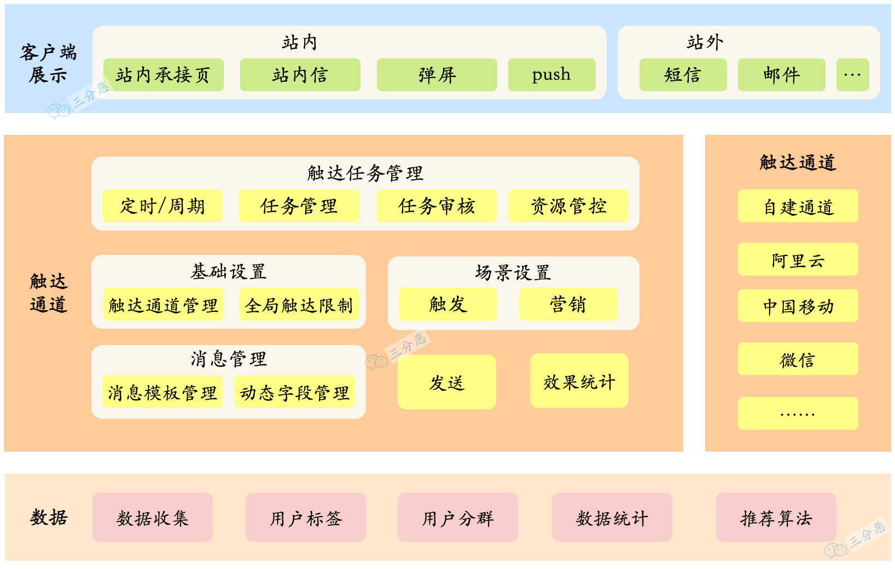
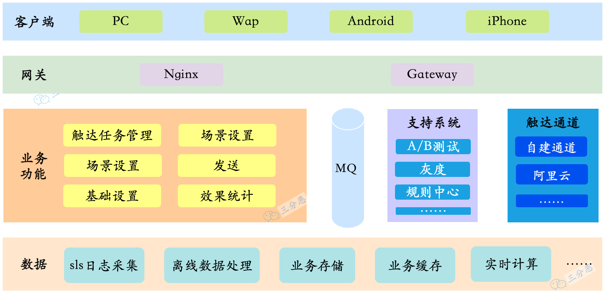
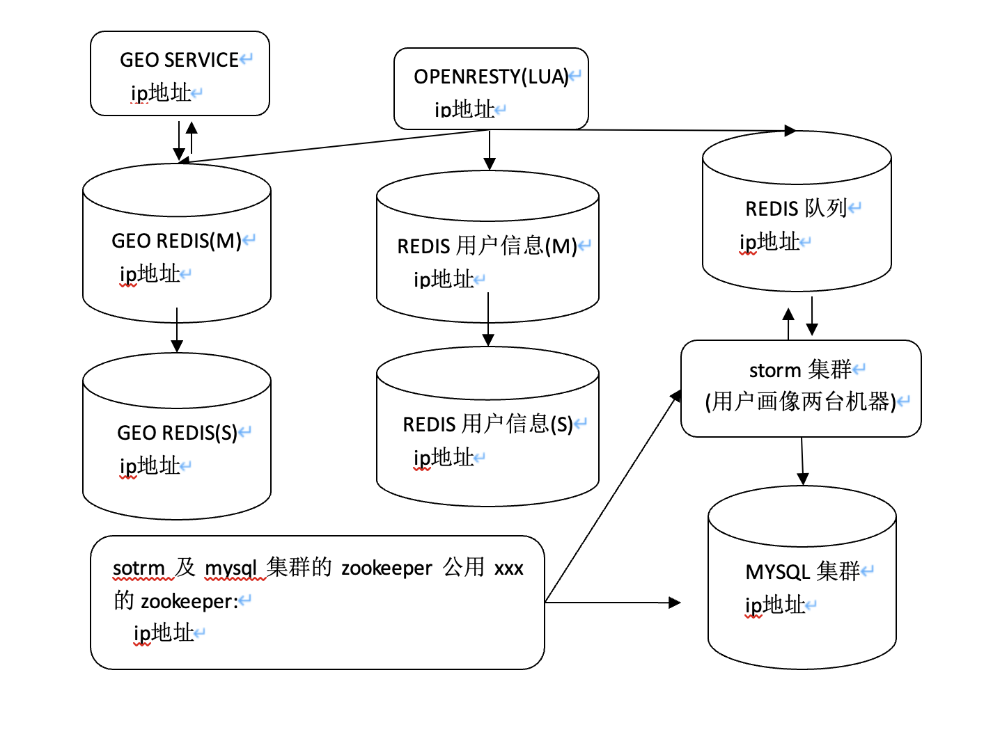
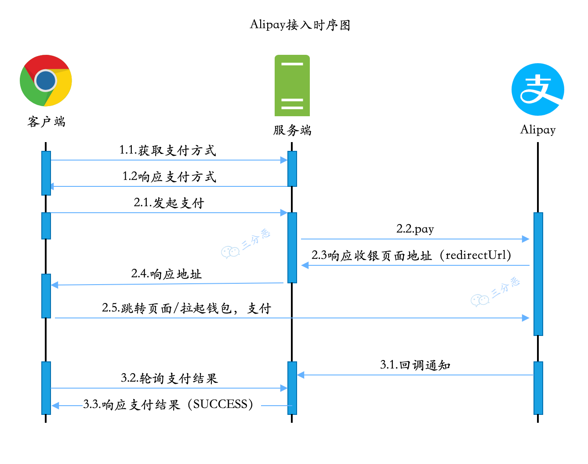
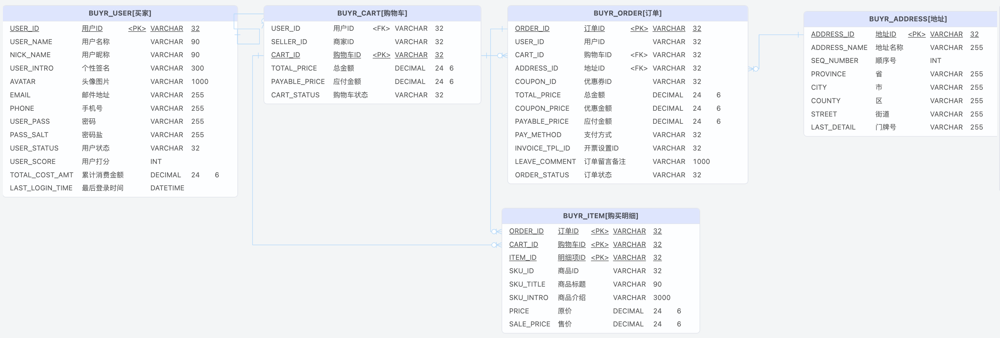

<b> xxx 设计说明书</b>

<b>中电数据运营有限公司 数据技术部</b> 

<b>2023年1月</b> 

## 修订记录

| **版本编号** | **变更状态** | **简要说明** | **修订人** | **变更日期** | **评审人** | **评审日期** |
| ------------ | ------------ | ------------ | ---------- | ------------ | ---------- | ------------ |
| V0.1         | C            | 初稿         | Siu        | 2023.1.27    | Jack、Mike | 2023.02.01   |

***`变更状态：C——创建，A——增加，M——修改，D——删除`***

> ⚠️  **技术设计不是一成不变的，经常会随着业务的变化，进行完善和优化，但是每一个版本，都应该留下记录和备份。**

<b>目录</b> 

---

 [toc]

## 文档说明

1. 文档目的：规范软件设计、提高研发效率。
2. 适用范围：本文档适用的中电运营数据技术部相关的研发项目和团队，主要面向项目管理员，架构师，开发工程师，质量管理人员，测试人员。
3. 文档组成：文档由技术设计相关的架构、流程图、数据模型、算法步骤、接口说明等组成。
4. 文档维护：文档的维护人员、修订记录见**[《文档修订记录》](#文档修订记录)**。
5. 附录: 相关的表格，模板，方法，工具说明等，详见**[《附录》](#附录)**。

<b>© 2023 中电数据运营有限公司 数据技术部</b>

<b>本文档为中电数据运营有限公司数据技术部内部软件研发设计文档。未经书面许可，不得以任何方式复制、抄袭、转载、改写或传播本文档的任何部分。</b><b> 本文档中的信息及内容仅供公司内部人员使用，不得用于任何商业目的或非公司活动。 </b>

## 项目概况

| 项目名称   | xxx系统    |
| ---------- | ---------- |
| 项目负责人 | Siu        |
| 模块名称   | 用户模块   |
| 模块负责人 | Siu        |
| 立项日期   | 2022/10/13 |

> ⚠️  **第一部分主要说明项目或者模块的概况，这一部分虽然不太重要，但是是必须的。**

## 术语与参考资料

| 术语或缩写 | **解释**                                                     |
| ---------- | ------------------------------------------------------------ |
| SD         | 系统设计，System Design。说明本数据库将反映的现实世界中的实体、属性和它们之间的关系等的原始数据形式，包括各数据项、表、视图、存储过程、触发器的标识符、定义、类型、度量单位和值域，建立本数据库的每一幅用户视图。 |
|            |                                                              |

> ⚠️ **通常会涉及软件工程、专业技术领域的一些术语、概念等，但另外一部分团队内形成的“术语和缩写”，日常技术沟通的常用到的，也应放在这里以便更好地建立团队“语言”。**

| 参考资料         | **备注** |
| ---------------- | -------- |
| 《软件工程导论》 | xxxxx    |
|                  |          |

> ⚠️ **参考的标准、规范、文献等。**

## 一、需求背景

产品文档：[🔗链接]()

为了实现用户的精细化运营，通过多种途径，向用户发送消息通知……

> ⚠️  **这一部分结合产品文档，把需求/背景简单提炼一下。**

## 二、设计目标

> ⚠️  **设计目标一般分为两部分：**
>
> - **实现功能：这一部分就是就是分析需求，把产品文档里的东西，拆解成一个个的功能。**
> - **设计指标：通常面向C端用户的系统，也基本上会有一些性能、可用性之类的要求，比如接口响应平均多少多少毫秒以下、单机QPS1000、系统几个9可用……**

### 2.1 实现功能

1. 多种渠道给用户推送消息，主要包含站内和站外两大部分：
   - 站内：
     - 站内信
     - 弹屏
   - 站外：
     - 邮件
     - 短信
     - push
     - 微信
     - ……
2. 触达任务管理
   - 支持定时/延时消息发送
   - 支持触发型消息发送
   - 支持用户分群发送

……

> ⚠️  **功能点比较多的话，这一部分还可以用思维导图的形式来整理。**

> ⚠️  **这一部分评审的时候一定要拉上产品经理或者相关的业务方，确定功能点没有错漏。**

### 2.2 设计指标

1. 性能要求

   - 百万级消息分钟级发送完成
   - xx接口，性能指标：单机1000并发，95%响应<=200ms

   > ⚠️ **一般 C 端的服务都是有比较严格的性能要求的，毕竟如果系统响应慢的话，用户的流失率就会变高。**

2. 可用性

   - 触达模块99.9%可用
   - 消息推送成功率80%以上

   > ⚠️ **C 端系统的可用性比较重要，毕竟挂一会，影响的用户可能都是以万计，所以，设计的时候，也要考虑可用性，分析系统的瓶颈在哪里，流量突然上来，哪里可能顶不住，是要扩容，还是要限流、熔断降级……**

3. 扩展性

   - 采用策略模式+配置，新增消息渠道，只需少量代码+代码即可实现
   - 引入规则引擎，同一消息类型的不同渠道，可以通过规则调整，无需发版

   > ⚠️ **这一部分也是设计中应当考虑的，不能一味求快，否则很容易堆屎山。**

4. 兼容性

   - 接口xxx向前兼容app 1.9.0版本，低版本需强制更新

   > ⚠️ **C 端系统的开发，有时候比较麻的是低版本app的兼容，尽可能早期设计的时候，就考虑可能的扩展，如果实在没法兼容，那就只能app强制更新，当然这种用户体验就非常不好了。**

5. 可观测性

   - 接入Prometheus和Grafana，对服务和业务进行监控
     - 服务监控：通过控制面板观察服务的内存、CPU、JVM、接口QPS、接口RT……
     - 业务监控：通过埋点上报，收集用户触达数据，通过面板可以分设备、渠道查看用户触达成功率……

   > ⚠️ **这一部分也很重要，我们一般上班的第一件事，就是看监控面板，分析有没有什么异常的地方。服务的可观测性，一般公司都是用一些开源的或者付费的监控平台，大厂一般都会自研监控平台。服务的监控很多是通过插桩来实现，业务的监控一般都需要打埋点。**

6. 告警

   - 通过 Prometheus Alert 实现服务的告警，告警信息分级别，进行飞书通知、电话通知，告警类型分为服务告警和业务告警
     - 服务告警：内存、CPU 占用过高，接口 QPS 过多，接口 RT 过长，触发告警
     - 业务告警：用户触达成功率过低告警

   > ⚠️ **告警通常也是和监控在一起的，毕竟开发人员也不可能二十四小时盯着告警，一般开源的、付费的、自建的监控系统，都支持配置告警规则，并通过不同的方式，邮件、短信、电话之类的渠道进行通知**

## 三、概要设计

> ⚠️ **概要设计，就是做个大概的系统整体设计。**

### 3.1 设计思路

- 数百万消息段时间发送完成，流量较大，对数据存储性能要求较高，需要选用高性能DB，对存储压力也比较大，同时需要一定削峰处理；
- 定时/延时消息发送采用消息队列实现，对MQ的消费要求较高，并发度要高，批量消费；
- ……

> ⚠️ **这一部分主要是梳理一下整体的开发设计思路，把一些零散的想法梳理成点或者面，前期大家的讨论可以整理在这里。**

### 3.2 技术选型

- 存储：TiDB
- 缓存：Redis
- 消息队列：业务RocketMQ，埋点Kafka
- 注册中心：Nacos
- 配置中心：Nacos
- RPC：Dubbo
- 网关：Spring Cloud  Gateway
- Push通道：自建

……

> ⚠️ **这一部分就是大概定一下技术选型，其实要是整个项目做好了选型，这一部分也可以不做，一般需要高级技术人员或者架构师，来整体地进行把握，而且一般一个团队，都是统一的技术选型，方便维护。**

### 3.3 业务架构

> ⚠️ **这一部分就是大概对功能分分层，分分块，把大概的功能切一切。**

### 3.4 技术架构

> ⚠️ **技术选型+业务架构，其实一个大概的技术架构就出来了。**

### 3.5 系统环境

- 操作系统： CentOS 7.6
- JDK版本：11
- 部署环境：k8s+Containerd，单pod8核CPU+4G内存，服务集群32个pod
- 数据库：
  - 业务数据：TiDB 64核CPU+128G内存
  - 离线数据：Hbase……
- ……

> ⚠️ **如果是项目初建，一般还需要对系统的环境进行评估，根据技术选型、数据容量、系统QPS等等，来选择系统的环境，这一部分一般评审的时候会拉上运维同学，提前确定好系统环境，和运维同学对齐需求和排期。**

### 3.6 部署架构

> ⚠️ **较复杂的系统，特别是涉及多个应用服务，以及依赖多个中间件的中大型系统，需要考虑画出完整的部署架构，以便运维部署时的一些配置决策，也为日后选型调整，业务扩容做好基础。**

## 四、详细设计

> ⚠️ **详细设计，就是具体指导开发的设计部分了，包括流程啊、数据模型啊、具体用到的算法、和客户端的接口，等等，这一部分很重要，如果没做好，没对齐，那么搞不好就要返工，耽误进度。**

### 4.1 业务流程设计

- push 流程

> ⚠️ 业务流程基本比较简单，可以用流程图来表达业务逻辑；如果业务较复杂，建议用时序图、活动图（泳道）来描述。比如下面这样的图：
>
> 

- ...

### 4.2 算法设计

- 渠道分流：同一消息类型，多种渠道，支持按比例分流，采用加权随机算法实现。
- ……

> ⚠️ **算法设计不一定数据结构相关的算法，代码里的一些涉及到一些需要进行逻辑计算的，都可以称之为算法，这一部分也可以先梳理一下；如果需要可以用一些算法逻辑图来表达算法逻辑。**

### 4.3 数据模型设计

| 数据库名     | xxx_sys                                                      |
| ------------ | ------------------------------------------------------------ |
| 数据库       | Mysql 5.6                                                    |
| 描述         | xxx系统库                                                    |
| 在线管理地址 | http://demo.databasir.com/groups/1/projects/1/documents?projectName=xxx |
| 设计工具     | PowserDesinger（或 PDmaner 等）                              |
| 开发规范     | 【**MUST**】表名必须以xxx开头（系统模块名称缩写） 【**MUST**】表名、字段名等必须(**MUST**)使用小写字母或数字或”_“(下划线)。 【**MUST  NOT**】表名、字段名等禁止(**MUST NOT**)出现数字开头，禁止(**MUST NOT**)两个下划线中间只出现数字。 【**MUST NOT**】命名禁止用数据库保留字，如 desc、group、limit 等。 【**MUST NOT**】禁止使用拼音与英文混合命名，也禁止直接使用中文拼音命名。 【**MUST**】主键索引名为 pk_表名_字段名 ;唯一索引名为 `uk_字段名` ;普通索引名则为 `idx_字段名` 。 |

**数据库表清单：**

| **序号** | **数据表** | **名称** |
| -------- | ---------- | -------- |
| 1        | xxx_xxx    | xxx表    |
| 2        | xxx_xxx    | xxx表    |
| 3        | ...        |          |

**数据库表 ER 图：**

**表结构明细（逻辑设计）：**

- **xxx_xxx [xxx表]**

| **字段**      | **名称**                 | **数据类型** | **主键** | **非空** | **默认值** | **备注说明** |
| ------------- | ------------------------ | ------------ | -------- | -------- | ---------- | ------------ |
| xxx_type      | 类型编码                 | VARCHAR(32)  |          | √        |            |              |
| xxx_type_name | 名称                     | VARCHAR(60)  |          | √        |            |              |
| status        | 状态(0：未启用，1：启用) | BIT(1)       |          | √        | 1          |              |
| xxx_id        | xxx ID                   | BIGINT(20)   |          |          | 0          |              |
| show_order    | 展示排序值               | BIT(1)       |          |          |            |              |

> ⚠️ **数据模型设计可以使用 PowserDesinger、PDManer、Screw、Databasir 等工具进行设计和管理，在设计文档里列出数据库表清单、ER 图、表结构明细的管理链接。**
>
> 

**表结构明细（物理设计）：**

> ⚠️ **表结构的物理设计指的就是逻辑设计对应的建表 SQL 脚本，通常归档在脚本文件中，或是用一些 SQL 自动化组件进行管理；这里放入归档的脚本链接。**

[🔗物理设计归档脚本](xxx)

### 4.4 接口设计

| 接口名称     | 添加支付任务         |
| ------------ | -------------------- |
| Path         | /xxx/xxx             |
| Method       | GET                  |
| 接口文档地址 | https://yapi.com/xxx |
| 入参         |                      |
| 入参描述     | comment：任务描述    |
| 出参         |                      |
| 出参描述     |                      |

> ⚠️ **接口设计可以使用 YApi、Swagger UI等工具统一管理，在设计文档里列出接口列表信息和详细的文档地址。**
>
> Yapi 地址：https://yapi.com/xxx 
>
> 或 Swagger UI 地址：https://swagger.com/xxx 
>
> 接口列表：
>
> - 添加支付任务 https://yapi.com/xxx
> - xxx

### 4.5 异常处理

- 系统中的不确定异常，进行统一处理，响应“Network Error”
- 埋点异步发送，不影响主要功能
- ……

> ⚠️ **异常处理也是需要考虑的地方，哪些异常可以吞掉降级，哪些没法处理，怎么给客户端展示，怎么打日志，都需要考虑。**

## 五、风险评估

> ⚠️ **其实每一次上线都伴随着风险，从设计，一直到上线之前，都要对存在的风险进行评估，上线了要重点观察风险点。**

### 5.1 已知风险

- 对数据相关服务压力较大，用户分群、用户画像等数据服务崩溃风险
- MQ存在堆积风险，导致用户收到消息延迟
- QPS较高，数据库CPU飙升风险
- ……

### 5.2 可能风险

- 场景类消息延迟，可能会影响交易相关流程，拉低转化率和成交率

……

## 六、测试建议

> ⚠️ **需求评审阶段、设计评审阶段，最好都拉上测试同学，测试同学要对整体的功能，还有性能，都有比较清楚的了解。但是啊，如果只看功能的话，可能就是表面的点点点，具体实现逻辑，还是开发比较清楚，所以说给测试同学提一些测试建议，给测试的测试用例提供参考。**

### 6.1 功能测试

| 功能         | 测试步骤     | 预期结果     |
| ------------ | ------------ | ------------ |
| 定时消息发送 | 创建定时消息 | 消息定时发送 |
| ……           |              |              |

> ⚠️ **这一部分基本就是结合设计目标的实现功能，列一下测试步骤和预期结果。**

### 6.2 性能测试

- xxx接口压测，预估单机QPS1000

> ⚠️ **这一部分基本就是压测了，很多时候，系统的压测没那么简单，尤其是链路长的时候，压一次都得兴师动众。**

## 七、上线准备

| 版本  | 上线准备                                                     | 相关文档     |
| ----- | ------------------------------------------------------------ | ------------ |
| 1.0.0 | 运维搭建环境 数据初始化 添加配置 消息队列创建 依赖服务上线 服务上线 | [xxx 文档]() |
|       |                                                              |              |
|       |                                                              |              |

> ⚠️ **这一部分算是上线的备忘吧，把上线前需要做的事情列出来。**

## 八、评审意见

| 评审意见                                                | 提出人 | 提出日期     | 解决意见     | 解决人 | 解决日期     |
| ------------------------------------------------------- | ------ | ------------ | ------------ | ------ | ------------ |
| xxx接口需要考虑一下兼容性，建议xx字段，从object改为list | 老六   | 2023年1月1日 | 修改字段类型 | 老三   | 2023年1月1日 |
| ……                                                      |        |              |              |        |              |

> ⚠️ **设计文档不是写完，啪，丢出去就完事了，还要上设计评审会，评审的时候，通常相关同学会提出一些评审意见，这些都应该记录下来，解决完了之后，再次评审（或通知结果），直到评审通过，然后就可以开始CRUD了。**

## 附录

> ⚠️ **相关的关的表格，模板，方法，工具说明放在这里**

## 脚注

> ⚠️ **设计文档中涉及引用、注释放在这里**

[^3]: Scrum 指南：Ken Schwaber & Jeff Sutherland 编写的 Scrum 指南。
[^4]: 禅道：禅道是一个项目管理软件，这里是官方的产品使用手册。
[^5]: Scrum：完整的Scrum框架包括 3 个角色（Scrum Master、Product Owner、Team）、3 个工件（Product Backlog、Sprint Backblog、Increment）、5 个活动（Sprint、Sprint planning meeting、Daily standup meeting、Sprint review、Retrospective meeting）、5 个价值观（专注、勇气、公开、承诺、尊重）。
[^7]:[持续交付](https://cloud.google.com/architecture/devops/devops-tech-continuous-delivery?hl=zh-cn)：持续交付是指能够按需快速、安全且可持续地发布各种类型的更改。采取持续交付的团队能够随时（包括正常工作时间）以低风险方式发布软件和更改生产，而不影响用户。
[^9]: [灰度发布](https://baike.baidu.com/item/%E7%81%B0%E5%BA%A6%E5%8F%91%E5%B8%83/7100322)：灰度发布（又名金丝雀发布）是指在黑与白之间，能够平滑过渡的一种发布方式。
