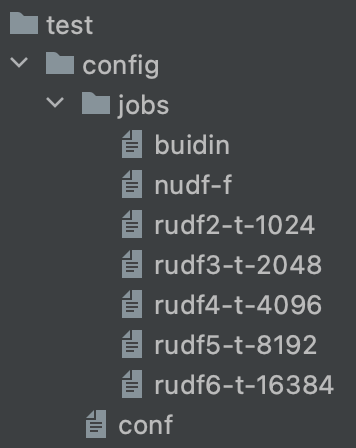

# sql 性能测试工具的设计

> By [Siu]() 2022/3/17


## 前言

当前的团队的工作比较多的会在关注和执行 sql 性能相关的测试，对于标准的测试模型，如 TPC 范围内的工具有比较好的实践方式，对于自定义和具体的场景目前团队还没有去总结一个比较好的”工具方案“，这里主要围绕这个问题去做一些分享。


## 先看看有哪些现有工具？

- Tidb bench ：C ；集成在 TiDB 中，用于 TPC-C/H 的测试，不适用于其它数据库
- BenchMarkSQL 5.0： Java；适用于 TPC-C ，主流的 RDBMS 都支持，Mysql/PostgreSQL/Oracle 等
- Sysbench：C；适用于 TPC-C ，主流的 RDBMS 都支持，Mysql/PostgreSQL/Oracle 等
- mysqlslap：C；用于msyql 的性能测试
- sqlbench：go；支持 PostgreSQL 的性能测试
- 其它的开源的库针对非传统数据库/组件：这些通常是依据标准模型 TPC-H/DS、SSB 等的实现，这部分较复杂，可以到官方和社区去找一些方案和工具（ClickHouse、Flink、Trino）

简单总结：

- 以上这些工具都是比较优秀的，大多是开源的；整体我都使用过，值得去深入了解各自的场景和特点；
- BenchMarkSQL、Sysbench 比较合适标准模型的基准测试（mysqlslap 也比较适合，但不主流）；
- mysqlslap、sqlbench：适用于自定义的 sql 场景的测试；


## 这些工具的“设计“

> "设计”，主要讨论这些工具的内部设计大体是怎么样的，哪些可以借鉴和指导我们去设计/开发我们的自定义 sql 性能测试工具/脚本。
>
> 当然这些我总结的”范式“可能不是真正的标准，但是已经经过了具体的借鉴和实践。

### 编程范式

当然设计会受语言的编程范式影响，受语言特性影响，但这里忽略这部分，不做讨论。

实际实现的时候要考虑这部分。


### 工具设计的拆解

分析比较了 BenchMarkSQL 5.0、sqlbench、mysqlslap 等的功能和代码，等到如下总结：

- 环境/全局配置：通过 CMD 参数或配置文件加载到程序
  - 环境：系统、依赖工具、数据库信息
  - 全局：工具运行时的参数，线程数、执行数等
- sql 任务配置：定义 sql 执行的单位
- 其它：主要是功能，造数、执行日志（参数、环境、上下文，IO，网络等）、执行结果/绘图、终端动态展示运行等

用一个命令行描述：

```shell
sh myApp --config=./config/env.conf --sql=./sql/* --func xxx
```


特别说下 BenchMarkSQL TPC-C 测试流程：

- 配置数据库信息、测试的全局信息
- 启动造数据程序：元数据、数据
- 执行测试：实时输出测试指标和日志、归档日志/结果等到测试目录
- 执行绘图程序，输出图表测试结果
- 清理数据


## 设计一个简单的 sql 性能测试程序

> 这里以 mysqlslap + shell 去设计一个 sql 性能测试脚本。
>
> ***比较好的路线是基于一些标准库用某个语言去实现，这样可定制的功能比较好控制。***

### 选型

- 语言 shell：读写文件、option、函数
- 库/工具：mysqlslap

### 设计

```shell
.
├── config
│   ├── conf # 主配置：环境、全局
│   └── jobs # sql 配置
├── output # 测试输出
│   ├── test-1 # 测试1输出
│   └── test-2 # 测试2输出
└── run.sh # 入口：加载配置/日志、归档测试结果、执行：获取jobs/执行mysqlslap、option（暂未实现）
```

**配置部分：**




***conf 文件：***

***`任何格式，按照需求去设计`***

```shell
# 一些全局参数
db_schema='ssb'
db_user='root'
db_port='9030'
...
```

***jobs/ :***

***`任何格式，按照需求去设计，JSON、YML、TOML 都行`***

```shell
# test 1: build-in functions
test_name='build-in'
query_sql="select length(c_address) from ssb.customer;"
pre_query="set global enable_vectorized_engine=true;set global batch_size=1024;"
...
```


### 实现

逻辑描述：

`启动`  => `加载配置/optioin传入 `  => `加载jobs`  => `LOOP：构建job > 执行job > 记录job日志&结果`  => `归档&展示测试结果`

***待实现：从 option 传入配置***

#### 运行

```shell
[root@test-fe-1 test]# sh run.sh 
=====================================================================================================================================
test-fe-1 2022-03-16 21:29:17.249 执行测试：build-in 
test-fe-1 2022-03-16 21:29:17.256 执行预处理：set global enable_vectorized_engine=true;set global batch_size=1024;
test-fe-1 2022-03-16 21:29:17.264 执行测试 SQL：select length(c_address) from ssb.customer;
test-fe-1 2022-03-16 21:29:25.877 build-in 执行完成： build-in,mixed,1.698,1.298,1.872,10,1
=====================================================================================================================================
test-fe-1 2022-03-16 21:29:25.883 执行测试：n-udf-f 
test-fe-1 2022-03-16 21:29:25.890 执行预处理：set global enable_vectorized_engine=false;
test-fe-1 2022-03-16 21:29:25.895 执行测试 SQL：select ssb.get_string_length(c_address) from ssb.customer;
test-fe-1 2022-03-16 21:29:34.986 n-udf-f 执行完成： n-udf-f,mixed,1.798,1.740,1.879,10,1
=====================================================================================================================================
test-fe-1 2022-03-16 21:29:34.995 执行测试：rudf2-t-1024 
test-fe-1 2022-03-16 21:29:35.001 执行预处理：set global enable_vectorized_engine=true;set global batch_size=1024;
test-fe-1 2022-03-16 21:29:35.008 执行测试 SQL：select ssb.str_length(c_address) from ssb.customer;
test-fe-1 2022-03-16 21:29:44.929 rudf2-t-1024 执行完成： rudf2-t-1024,mixed,1.961,1.867,2.058,10,1
=====================================================================================================================================
test-fe-1 2022-03-16 21:29:44.936 执行测试：rudf3-t-2048 
test-fe-1 2022-03-16 21:29:44.942 执行预处理：set global enable_vectorized_engine=true;set global batch_size=2048;
test-fe-1 2022-03-16 21:29:44.948 执行测试 SQL：select ssb.str_length(c_address) from ssb.customer;
test-fe-1 2022-03-16 21:29:53.113 rudf3-t-2048 执行完成： rudf3-t-2048,mixed,1.612,1.494,1.782,10,1
=====================================================================================================================================
test-fe-1 2022-03-16 21:29:53.119 执行测试：rudf4-t-4096 
test-fe-1 2022-03-16 21:29:53.124 执行预处理：set global enable_vectorized_engine=true;set global batch_size=4096;
test-fe-1 2022-03-16 21:29:53.129 执行测试 SQL：select ssb.str_length(c_address) from ssb.customer;
test-fe-1 2022-03-16 21:30:00.478 rudf4-t-4096 执行完成： rudf4-t-4096,mixed,1.447,1.396,1.518,10,1
=====================================================================================================================================
test-fe-1 2022-03-16 21:30:00.485 执行测试：rudf2-5-8192 
test-fe-1 2022-03-16 21:30:00.492 执行预处理：set global enable_vectorized_engine=true;set global batch_size=8192;
test-fe-1 2022-03-16 21:30:00.497 执行测试 SQL：select ssb.str_length(c_address) from ssb.customer;
test-fe-1 2022-03-16 21:30:07.553 rudf2-5-8192 执行完成： rudf2-5-8192,mixed,1.388,1.352,1.488,10,1
=====================================================================================================================================
test-fe-1 2022-03-16 21:30:07.561 执行测试：rudf6-t-16384 
test-fe-1 2022-03-16 21:30:07.567 执行预处理：set global enable_vectorized_engine=true;set global batch_size=16384;
test-fe-1 2022-03-16 21:30:07.574 执行测试 SQL：select ssb.str_length(c_address) from ssb.customer;
test-fe-1 2022-03-16 21:30:11.685 rudf6-t-16384 执行完成： rudf6-t-16384
##########################################################################
全局参数：
client_num=10
queries_num=10
测试结果： test-20220316212917243/result.csv 
test_name      mode   avg    min    max    client_num  queries_per_client
build-in       mixed  1.698  1.298  1.872  10          1
n-udf-f        mixed  1.798  1.740  1.879  10          1
rudf2-5-8192   mixed  1.388  1.352  1.488  10          1
rudf2-t-1024   mixed  1.961  1.867  2.058  10          1
rudf3-t-2048   mixed  1.612  1.494  1.782  10          1
rudf4-t-4096   mixed  1.447  1.396  1.518  10          1
rudf6-t-16384
#########################################################################
```


## ref

- [测试工具：BenchMarkSQL 5.0](https://sourceforge.net/projects/benchmarksql/) | [使用方法](https://support.huaweicloud.com/tstg-kunpengdbs/kunpengbenchmarksql_06_0002.html)
- [Sysbench 在美团点评中的应用](https://tech.meituan.com/2017/07/14/sysbench-meituan.html)
