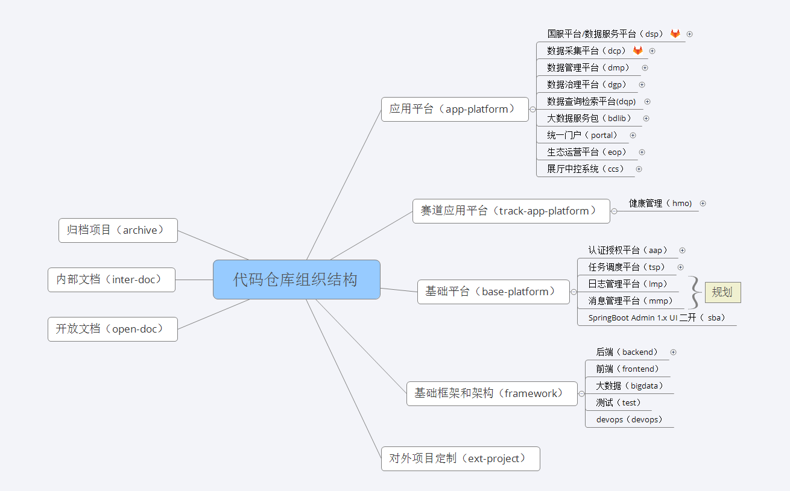

# 代码仓库规范

> ​		By [Siu]() 2021/03/02
>
> ​		随着业务单元增多，前端、后端、基础框架等代码库组织结构混乱（仓库划分不清晰、前后端项目关系无法对应、分支结构不规范），存在以下几大问题：
>
> - 不利于代码的维护。
> - 开发人员无法了解项目的全貌、也不了解项目在产品矩阵中的定位。
> - 各项目的代码权限无法做到统一的管控。
> - 自动化和 CI/CD 无法推进。


## 1 代码仓库结构




> ​		按目前的业务单元规划出上图的代码仓库组结构，详见 ：http://192.168.1.23/cecdat

```txt
|── cecdat （一级）
	├── app-platform 应用平台项目仓库组 （二级）
	│   ├── dsp 国服平台仓库组（三级）
	│   ├── dcp 数据采集平台仓库组（三级）
	│   ├── dmp 数据管理平台仓库组（三级）
	│   ├── dqp 数据检索平台仓库组（三级）
	│   ├── bdlib 大数据服务包仓库组（三级）
	│   ├── portal 统一门户仓库组（三级）
	│   ├── eop 生态运营平台仓库组（三级）
	│   ├── ccs 展厅中控系统仓库组（三级）
    │   ├── origin 太初（三级）
	│   ├── common 公共依赖仓库组（三级）
	│   ├── component 三方依赖（基础组件）仓库组（三级）
	├── tarck-app-platform 赛道应用平台项目仓库组 （二级）
	│   ├── hmo hmo仓库组（三级）
	├── base-platform 基础平台项目仓库组 （二级）
	│   ├── aap 认证授权平台仓库组（三级）
	│   ├── tsp 任务调度平台仓库组（三级）
	├── framework 框架和基础架构仓库组 （二级）
	│   ├── frontend 前端基础仓库组（三级）
	│   ├── backend 后端基础仓库组（三级）
	│   ├── bigdata 大数据基础架构仓库组（三级）
	│   ├── test 测试相关仓库组（三级）
	│   ├── devops devops相关仓库组（三级）
	├── ext-project 对外项目定制 （二级）
	├── inter-doc 内部文档仓库组 （二级）
	├── open-doc 开放文档仓库组 （二级）
	└── archive 归档项目仓库组 （二级）
```


## 2 仓库组规范

-  一级 group ：cecdat ，**禁止**修改和新增。
- 二级 group ：**禁止**私自修改和新增，修改、新增需要统一规划。
- 三级 group：修改、新增需要统一规划。
- 三级 group 下**禁止**创建 subgroup。
- 组名**必须**由 ASCII 小写字母、数字和连接符`-` 组成


## 3 项目规范

- 项目名称、模块名称**必须**由 ASCII 小写字母、数字和连接符`-` 组成。

- 相关联的前后端项目名称**必须**遵循以下：

  - 前端项目名称**必须**以`-web`结尾标识。
  - 后端项目名称、服务模块名称**禁止**使用`-web` 结尾标识。
  - 范例：uac-web （前端）、uac-web-server（后端）

- **后端**项目根目录下**必须**创建以下文档目录：

  ```shell
  .
  ├── docs
  │   ├── 0-需求文档 
  │   ├── 1-设计文档
  │   ├── 2-接口文档
  │   ├── 3-项目管理
  │   ├── 4-投产文档
  │   ├── 5-其它
  │   ├── 6-开放文档
  └   └── assets （存放除开放文档的资源文件）
  ```

  - 前端项目视情况而定组织以上目录，不强制要求；

- 项目代码仓库**必须**创建 READM.md 并包含各模块说明，范例：

  ```txt
  .
  ├── .build             编译描述文件
  ├── .jenkins           jenkins构建相关
  ├── bin                项目相关脚本
  ├── dc-common          公共模块
  ├── dc-serverbase      基础服务模块
  ├── dcc                中心模块
  ├── dcc-ddlclient      中心数据下载客户端模块
  ├── dcc-netwmonitor    中心网络监控模块
  ├── dcc-sba            中心spring boot admin
  ├── dcc-taskschedule   中心任务调度模块
  ├── dcc-updserver      中心升级服务端模块
  ├── dcc-webapi         中心前端API模块
  ├── dcfe               前置模块
  ├── dcfe-ddlserver     前置数据下载服务端模块
  ├── dcfe-updclient     前置升级客户端模块
  ├── docs               文档
  ├── package            打包相关配置和脚本
  └── sql                项目sql
  ```

- 项目的代码仓库**必须**设置项目的描述信息

- 项目分支规范**必须**遵循[《git 协同开发指南》](http://192.168.6.146:3000/#/./%E6%8A%80%E6%9C%AF%E8%A7%84%E8%8C%83/git%E5%8D%8F%E5%90%8C%E5%BC%80%E5%8F%91%E6%8C%87%E5%8D%97)中规定的。

  - 补充：没有提交测试流程的项目**允许**不设置 release 分支，如 framework 下的项目。

- 项目**必须**创建在三级 group 下


## 4 仓库权限规范

***适用于应用平台项目仓库组、赛道应用平台项目仓库组、基础平台项目仓库组、框架和基础架构仓库组***

- 各级仓库组成员根据职责定位按最小权限授予。
- 三级 group 业务平台/系统权限
  - 业务平台/系统负责人拥有组的 `Maintainer` 权限（默认已初始分配）
  - 其它人员角色默认继承上级 group 权限
  - group 内成员的权限配置由 `Maintainer`  配置