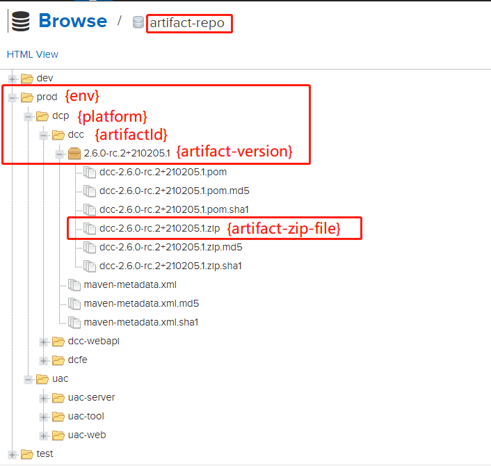

# 制品规范

> By [Siu]() 2021/02/20
>
> ​		以下讨论制品以 maven、npm 为打包工具。


## 1 制品文件命名规范

> **格式：**	`{artifactId}-{productVersion}+{buildDate}.{buildId}.zip`
>
> **例：**		`uac-web-2.6.0-rc.2+210205.1.zip`




### **1.2 格式说明**

- 制品ID（artifactId）：

  - 在打包配置中指定为 `${project.artifactId}`，与应用名称一致`spring.application.name`；
  - 以小写字符描述；
  - 详见最佳实践中的 pom 配置示例；

- 制品编译版本号：

  > ​	与《语义化版本控制规范》定义一致。

  - productVersion：见[《语义化版本控制规范》]()中的`版本号主体` （2.3.3、2.4.0-rc.1）
  - buildDate：编译日期 210205，在打包配置中指定为 `${maven.build.timestamp}`
  - buildId：编译号，非负整型数值，通常为 Jenkins 的`${BUILD_ID}`，通过 `Djenkins.build.id=${BUILD_ID}` 传入

- 固定后缀 ：`.zip`

- 所有字符均为小写


## 2 制品内容规范

### Java 项目

#### **制品示例**

```shell
uac-web-2.6.0-rc.2+210205.1.zip
.
├── bin
│   ├── version.sh
│   ├── semver
│   ├── startup.sh
│   ├── shutdown.sh
│   ├── upgrade.sh
├── config
│   ├── appliaction-prod.yml
├── uac-web-server_2.6.0-rc.2+210205.1.jar
└── lib
```

***所有制品文件命名均为小写***

#### Java 项目规范细则

- Java 启动类：

  - 命名格式：${artifactId}App.java ，`artifactId` 在pom.xml 中为小写，类中命名为驼峰格式。
    - 例：SimpleDemoApp，pom.xml 中 `artifactId` 为 simple-demo
  - **启动类**应在 `package com.cecdat`  下

- `spring.application.name` 应与  pom 中 artifactId  一致，配置为`@project.artifactId@`

- pom 文件 ：

  - version 与《语义化版本控制规范》中的`版本号主体` （2.3.3、2.4.0-rc.1）

  - artifactId 必填

  - properties 必须包含以下

    ```xml
    <properties>
        <project.build.sourceEncoding>UTF-8</project.build.sourceEncoding>
        <!-- 编译日期 -->
        <maven.build.timestamp.format>yyMMdd</maven.build.timestamp.format>
        <!-- 编译时传入 jenkins BUILD_ID -->
        <jenkins.build.id>1</jenkins.build.id>
        <!-- ZIP 制品默认打包 prod 环境配置 -->
        <pack.active.profile>prod</pack.active.profile>
        <!-- 编译版本号（产品版本号）,单模块项目可以不添加此项，用${project.version} 代替-->
        <project.build.version>2.6.0-rc.2</project.build.version>
        <!-- 归属平台或系统 -->
        <attribution.platform.or.system>uac</attribution.platform.or.system>
      </properties>
    ```

  - build 等其它配置参考最佳实践中的 pom 配置示例

- shell 脚本

  - 使用 bash 执行

  - bin 目录下的脚本参考最佳实践

### **NodeJS 项目**

**前端制品上没有特殊的规范要求，只要求制品文件名格式按上述规范**


## 3 制品库规范

- 所有制品存放于制品库 `artifact-repo` 中 

  - repo url ：http://192.168.1.111:8081/repository/artifact-repo

- 制品的组织结构

  - 结构 {env}/{platform}/{artifactId}/{artifact-version}/{artifact-zip-file}

  - {env} 对应各个环境

    - 开发 dev
    - 测试 test
    - 生产 prod

  - {platform} 对应各个业务平台/系统，与 gitlab 上三级仓库组名一致

  - {artifactId}、{artifact-version}、{artifact-zip-file} 与上面的 artifactId 、制品编译版本号、制品格式一致

  - 管理形式如下：

    

- 所有环境交付物必须从制品库拉取，拉取完成后必须校验 md5

- 前端制品：

  - 前端制品放在各自归属的业务平台/系统下，{artifactId} 命名为 `{platform}_web`
  - 例 ： uac 的前端制品ID 为 `uac_web`


## 4 最佳实践

### 4.1 pom.xml 配置

```xml
<?xml version="1.0" encoding="UTF-8"?>
<project xsi:schemaLocation="http://maven.apache.org/POM/4.0.0 http://maven.apache.org/xsd/maven-4.0.0.xsd" xmlns="http://maven.apache.org/POM/4.0.0"
    xmlns:xsi="http://www.w3.org/2001/XMLSchema-instance">
  <modelVersion>4.0.0</modelVersion>
  <packaging>pom</packaging>
  <parent>
    <artifactId>framework2</artifactId>
    <groupId>com.cecdat</groupId>
    <version>2.3.5.PRE</version>
  </parent>
  <artifactId>uac-all</artifactId>
  <name>${project.artifactId}</name>
  <version>2.6.0</version>

  <properties>
    <project.build.sourceEncoding>UTF-8</project.build.sourceEncoding>
    <!-- 编译日期 -->
    <maven.build.timestamp.format>yyMMdd</maven.build.timestamp.format>
    <!-- 编译时传入 jenkins BUILD_ID -->
    <jenkins.build.id>0</jenkins.build.id>
    <!-- ZIP 制品默认打包 prod 环境配置 -->
    <pack.active.profile>prod</pack.active.profile>
    <!-- 归属平台或系统 -->
    <attribution.platform.or.system>aap</attribution.platform.or.system>

    <!-- 编译版本号（产品版本号）-->
    <project.build.version>2.6.0-rc.2</project.build.version>
    <!--各模块内部版本号-->
    <uac-sdk.version>2.6.0</uac-sdk.version>
    <uac-base.version>2.6.0-rc.2</uac-base.version>
    <uac-web.version>2.6.0-rc.2</uac-web.version>
    <uac-server.version>2.6.0-rc.2</uac-server.version>
    <uac-tool.version>2.6.0-rc.2</uac-tool.version>
  </properties>

  <modules>
    <module>uac-sdk</module>
    <module>uac-base</module>
    <module>uac-web</module>
    <module>uac-server</module>
    <module>uac-tool</module>
  </modules>


  <build>
  <finalName>${project.artifactId}-${project.build.version}+${maven.build.timestamp}.${jenkins.build.id}</finalName>
    <resources>
      <resource>
        <filtering>true</filtering>
        <directory>${project.basedir}/src/main/resources</directory>
        <includes>
          <include>**/**</include>
        </includes>
      </resource>
    </resources>
    <testResources>
      <testResource>
        <directory>${project.basedir}/src/main/resources</directory>
        <includes>
          <include>**/**</include>
        </includes>
        <filtering>false</filtering>
      </testResource>
    </testResources>
    <plugins>
      <plugin>
        <groupId>org.apache.maven.plugins</groupId>
        <artifactId>maven-jar-plugin</artifactId>
        <version>3.0.2</version>
        <configuration>
          <archive>
            <manifestEntries>
              <Project-Build-Version>${project.build.version}</Project-Build-Version>
              <Project-Build-Environment>${pack.active.profile}</Project-Build-Environment>
              <Attribution-Platform-Or-System>${attribution.platform.or.system}</Attribution-Platform-Or-System>
            </manifestEntries>
          </archive>
        </configuration>
      </plugin>
      <plugin>
        <groupId>org.apache.maven.plugins</groupId>
        <artifactId>maven-surefire-plugin</artifactId>
        <version>2.22.2</version>
        <configuration>
          <testFailureIgnore>true</testFailureIgnore>
          <skipTests>true</skipTests>
        </configuration>
      </plugin>
      <plugin>
        <artifactId>maven-resources-plugin</artifactId>
        <configuration>
          <encoding>utf-8</encoding>
        </configuration>
        <version>3.0.1</version>
      </plugin>
      <plugin>
        <groupId>org.apache.maven.plugins</groupId>
        <artifactId>maven-assembly-plugin</artifactId>
        <version>3.0.0</version>
        <configuration>
          <descriptors>
            <descriptor>package/package.xml</descriptor>
          </descriptors>
          <appendAssemblyId>false</appendAssemblyId>
          <finalName>${project.artifactId}-${project.build.version}+${maven.build.timestamp}.${jenkins.build.id}</finalName>
        </configuration>
        <executions>
          <execution>
            <id>make-assembly</id>
            <phase>package</phase>
            <goals>
              <goal>single</goal>
            </goals>
          </execution>
        </executions>
      </plugin>
    </plugins>
  </build>

</project>
```


#### 4.1.1 properties-maven-plugin

**使用 maven properties 插件读取自定义的公共配置文件（如：my.properties）**

```xml
 		<plugin>
            <groupId>org.codehaus.mojo</groupId>
            <artifactId>properties-maven-plugin</artifactId>
            <version>1.0.0</version>
            <executions>
                <execution>
                    <id>default-cli</id>
                    <phase>initialize</phase>
                    <goals>
                        <goal>read-project-properties</goal>
                    </goals>
                    <configuration>
                        <files>
                            <file>${common_properties_path}/my.properties</file>
                        </files>
                    </configuration>
                </execution>
            </executions>
        </plugin>
```

**my.properties 内容可以在 pom.xml 中引用**

```pro
product.version=2.9.0
user.name=root
```


### 4.2 package.xml 示例

```xml
<?xml version="1.0" encoding="UTF-8"?>
<assembly xmlns="http://maven.apache.org/POM/4.0.0" xmlns:xsi="http://www.w3.org/2001/XMLSchema-instance"
          xsi:schemaLocation="http://maven.apache.org/POM/4.0.0 http://maven.apache.org/xsd/assembly-1.0.0.xsd">
    <id>assembly</id>
    <formats>
        <format>zip</format>
    </formats>
    <includeBaseDirectory>true</includeBaseDirectory>
    <fileSets>
        <fileSet>
            <directory>target</directory>
            <outputDirectory>.</outputDirectory>
            <includes>
                <include>*.jar</include>
            </includes>
        </fileSet>
        <fileSet>
            <directory>${project.basedir}/src/main/resources/baseMapper/</directory>
            <outputDirectory>/baseMapper</outputDirectory>
            <includes>
                <include>*.xml</include>
            </includes>
        </fileSet>
        <fileSet>
            <directory>${basedir}/src/main/resources</directory>
            <outputDirectory>/config</outputDirectory>
            <includes>
                <include>application.yml</include>
                <include>application-${pack.active.profile}.yml</include>
            </includes>
            <excludes>
                <exclude>*local*.yml</exclude>
            </excludes>
        </fileSet>
        <fileSet>
            <directory>${basedir}/src/main/resources/mapper</directory>
            <outputDirectory>/mapper</outputDirectory>
            <includes>
                <include>*.xml</include>
            </includes>
        </fileSet>
        <fileSet>
            <directory>${basedir}/bin/</directory>
            <outputDirectory>/bin</outputDirectory>
            <includes>
                <include>*.sh</include>
            </includes>
            <lineEnding>unix</lineEnding>
        </fileSet>
        <fileSet>
            <directory>${project.basedir}/../package/bin</directory>
            <outputDirectory>/bin</outputDirectory>
            <includes>
                <include>*.sh</include>
            </includes>
            <lineEnding>unix</lineEnding>
        </fileSet>
    </fileSets>
    <dependencySets>
        <dependencySet>
            <outputDirectory>lib</outputDirectory>
            <scope>runtime</scope>
        </dependencySet>
    </dependencySets>

</assembly>
```

### 4.3 jenkins 中使用 mvn 打包命令

```shell
clean package -pl ${artifactId} -am -Dmaven.test.skip=true -Dpack.active.profile=${profile} -Djenkins.build.id=${BUILD_ID}
```

**例：**`clean package -pl uac-web -am -Dmaven.test.skip=true -Dpack.active.profile=test -Djenkins.build.id=2`


### 4.4 bin 下的脚本实例

**所有 shell 脚本必须在zip 文件解压后的目录下可执行，使用 bash**

```shell
unzip uac-web-2.6.0-rc.2+210205.1.zip && cd uac-web-2.6.0-rc.2+210205.1
bash ./bin/version.sh
2.6.0-rc.2
```

[参考示例见](http://192.168.1.23/cecdat/app-platform/common/package)


### 4.5 发布制品

```sh
mvn -e deploy:deploy-file -DgroupId=prod.uac -DartifactId=uac-web -Dversion=2.6.0-rc.2+210205.1 -Dpackaging=zip -Dfile=uac-web-2.6.0-rc.2+210225.0.zip -DrepositoryId=releases -Durl=http://192.168.1.111:8081/repository/artifact-repo
```

- 制品ID（artifactId）、发布制品版本（version）：与上面制品格式中定义一致
- repositoryId 与 maven settings.xml 中 server 配置对应

### 4.6 下载制品

```sh
wget http://192.168.1.111:8081/repository/artifact-repo/prod/uac/uac-web/2.6.0-rc.2+210205.0/uac-web-2.6.0-rc.2+210205.0.zip
```

#### 获取制品元数据

```sh
wget http://192.168.1.111:8081/repository/artifact-repo/prod/uac/uac-tool/maven-metadata.xml
```

### 4.7 制品库 web 管理地址

```html
http://192.168.1.111:8081/#browse/browse:artifact-repo
```


