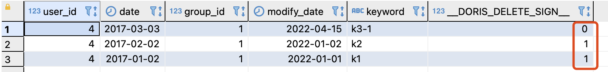

# Doris Uniq 模型：分析场景下保证 Key 的唯一性

> By [Siu]() 2022/4/15


## 背景

最近了解到数据治理人员在处理数据时有一个需求：希望一张表在导入数据时能保证 key 的唯一性（全表唯一）

这里有两个问题要解决：

- Q1：保证 key 唯一，全局唯一，不仅是分区内唯一；
- Q2：Uniq 模型在有分区情况下，只能保证分区内 key 的唯一性，如何高效处理全局重复的 key；


## 验证


### 创建表

```sql
drop table example_db.t_uniq_model_test;
CREATE TABLE IF NOT EXISTS example_db.t_uniq_model_test
(
    `user_id` BIGINT NOT NULL COMMENT "用户id",
    `date` DATE NOT NULL COMMENT "日期",
    `group_id` BIGINT COMMENT "组id",
    `modify_date` DATE COMMENT "修改日期",
    `keyword` VARCHAR(128) COMMENT "关键字"
)
UNIQUE KEY(`user_id`, `date`, `group_id`)
PARTITION BY RANGE(`date`)
(
    PARTITION `p201701` VALUES LESS THAN ("2017-02-01"),
    PARTITION `p201702` VALUES LESS THAN ("2017-03-01"),
    PARTITION `p201703` VALUES LESS THAN ("2017-04-01")
)
DISTRIBUTED BY HASH(`user_id`) BUCKETS 10
PROPERTIES (
"replication_allocation" = "tag.location.default: 3",
"in_memory" = "false",
"storage_format" = "V2"
);

-- 开启 BATCH_DELETE 特性（默认fe已开启这个配置就不需要显示添加）
-- ALTER TABLE example_db.t_uniq_model_test ENABLE FEATURE "BATCH_DELETE";
-- 隐藏 
SET show_hidden_columns=true;
desc example_db.t_uniq_model_test;
```

#### 导入数据

```sql
-- 导入3条 user_id、group_id 一样的数据，分布于 3个分区
insert into example_db.t_uniq_model_test(user_id,date,group_id,modify_date,keyword) values(4,'2017-01-02',1,'2022-01-01','k1');
insert into example_db.t_uniq_model_test(user_id,date,group_id,modify_date,keyword) values(4,'2017-02-02',1,'2022-01-02','k2');
insert into example_db.t_uniq_model_test(user_id,date,group_id,modify_date,keyword) values(4,'2017-03-03',1,'2022-01-03','k3');

select * from example_db.t_uniq_model_test order by `date` desc;
```


### 验证分区内 key 唯一性

在分区 p201703 中插入一行 user_id = 4、group_id = 1，keyword = ‘k3-1’

```sql
insert into example_db.t_uniq_model_test(user_id,date,group_id,modify_date,keyword) values(4,'2017-03-03',1,'2022-04-15','k3-1');
select * from example_db.t_uniq_model_test order by `date` desc;
```


表中还是只有 3 条数据，分区内 key 相同的数据被更新了。

### 使用 BATCH_DELETE

> 使用 BATCH_DELETE 来实现全表内 key 唯一性。
>
> 相比于直接使用 delete ，BATCH_DELETE 是一个标记删除，实际只有 insert，但是做到了 upsert 的语意。
>
> - 性能上更优；
> - “删除时”不会阻塞读取；


```sql
insert
	into
	example_db.t_uniq_model_test (user_id,
	date,
	group_id,
	modify_date,
	keyword,
	__DORIS_DELETE_SIGN__)

	-- 根据 modify_date 找到重复的旧数据
	select
		t1.*,
		1 -- 标记为删除
	from
		example_db.t_uniq_model_test t1
	where
		EXISTS (
		select
			1
		from
			example_db.t_uniq_model_test t2
		WHERE
      -- key: user_id + group_id
			t1.user_id = t2.user_id
			and t1.group_id = t2.group_id
      -- 最新数据
			and t1.modify_date <t2.modify_date );
SET show_hidden_columns=false;
select * from example_db.t_uniq_model_test order by `date` desc;

SET show_hidden_columns=true;
select * from example_db.t_uniq_model_test order by `date` desc;
```





#### 性能测试（todo）

# ref

https://doris.apache.org/branch-0.15/zh-CN/getting-started/data-model-rollup.html#uniq-%E6%A8%A1%E5%9E%8B

https://doris.apache.org/branch-0.15/zh-CN/getting-started/data-partition.html#%E6%95%B0%E6%8D%AE%E5%88%92%E5%88%86-2

https://doris.apache.org/branch-0.15/zh-CN/administrator-guide/load-data/batch-delete-manual.html#%E8%AF%AD%E6%B3%95
