# PG HA 方案

> By [Siu](https://siu91.github.io/notes/#/./%E6%95%B0%E6%8D%AE%E5%BA%93/PG/PGHA/PG%20HA%E6%96%B9%E6%A1%88) 2020年12月


# 1 介绍

>    ​       方案中使用 [PostgreSQL Failover、Warm Standby](https://www.postgresql.org/docs/10/warm-standby-failover.html) 的特性，安装 [pg_auto_failover](https://github.com/citusdata/pg_auto_failover) 扩展服务，为PostgreSQL 服务实现安全的自动故障转移。
>


***以下方案或验证中，考虑实际单个机房内某台主机的故障情况；非应对整个机房瘫痪的双活/异地容灾高可用方案。***


**高可用的几个阶段：**

- 冷备：需要停机恢复，数据丢失风险；

- 双机热备：需要停机恢复；

- ##### Active/Standby 模式：进一步可以配置单写多读，读写分离；

- ~~互为主备~~：相比于 Active/Standby ，更合理理由服务器资源。目前 PG 没有合适的候选方案；

- 同城双活：可以解决某个 IDC 机房整体挂掉的情况（停电，断网等）；

- 异地双活：应对大部分的灾备情况，但是碰到大面积停电，或者自然灾害的时候，服务依然会中断；

- 异地多活：理想方案。


## 1.1 架构


### 1.1.1 two-standby-sync 架构

>  ​		[two-standby-sync 架构](https://pg-auto-failover.readthedocs.io/en/latest/architecture-multi-standby.html?#number-sync-standbys)，这种架构下两个 standby 节点都参与复制仲裁 （Node B、Node C），[number_sync_standby = 1](https://pg-auto-failover.readthedocs.io/en/latest/architecture.html#synchronous-vs-asynchronous-replication) ，系统始终维护至少**两个数据集副本**，一个在 Node A 主数据库上，另一个在 Node B 或 Node C 上。丢失**任意一个**节点，仍可保证拥有两个数据集副本，三个节点实现 Postgres **服务和数据集**的**高可用性**。
>
>  ​		如果需要增加可用的数据副本数，按同样的配置增加节点 ，即可变成 **N-standby-sync 架构**。


***注：***

> - Streaming Replication : **流复制**，PG的特性之一。
> - [number_sync_standby](https://pg-auto-failover.readthedocs.io/en/latest/architecture.html#synchronous-vs-asynchronous-replication) ：同步复制的 standby 节点数；写操作都会阻塞，直到至少收到`number_sync_standby` 个standby 节点报告同步完成。
> - [replication quorum](https://pg-auto-failover.readthedocs.io/en/latest/architecture-multi-standby.html?#replication-quorum)：是否参与复制仲裁；例图中 3 个 replication quorum = true ，Primary 节点的写操作只要任意一个 Secondary 节点确认即可。
> - candidate priority ：选举优先级；当故障转移时，候选节点成为主节点的优先级。
> - [replication quorum = true 的节点数]  > number_sync_standbys；一般配置为 [replication quorum = true 的 standby 节点数]  = number_sync_standbys + 1 。
> - 当可用 standby 节点数 < number_sync_standbys 时 PG 服务将**降级为只读**；故并不是越多的数据副本代表更高的可用性，数据可用副本只是保证了数据的完整性，在实际场景中要权衡。
> - 上图架构中 Node B、C 两个 standby 故障时，PG 将降级为只读；将 number_sync_standbys 设置为0，将允许写入数据，即使两个备用节点都处于故障状态也是如此。 在这种情况下，将保留生产数据集的单个副本，如果主数据库随后发生故障，则某些数据将丢失， 多少取决于数据备份和恢复机制。


### 1.1.2 three-standby-one-async 架构

> ​		[three-standby-one-async 架构](https://pg-auto-failover.readthedocs.io/en/latest/architecture-multi-standby.html?#sample-architectures-with-three-standby-nodes)，与 two-standby-sync 不同的是多了一个**异步复制**的节点 **Node D** 。
>
> ​		这种架构适合以下情况：
>
> ​		Node A，B ， C 部署在**同一数据中心**或可用性区域中，而 Node D 部署在另一个数据中心或可用性区域中。 


***注：***

> - Node D 不会作为故障转移的候选者（candidate priority = 0 ）。


## 1.2 可用性分析

> 依据 two-standby-sync 架构做分析。


|      | Monitor                 | PG Nodes                             | Available | Failover |                                                              |
| ---- | ----------------------- | ------------------------------------ | --------- | -------- | ------------------------------------------------------------ |
| 1    | :heavy_check_mark: 正常 | 大于 2 个节点可用                    | **是**    | **是**   | /                                                            |
| 2    | :heavy_check_mark:正常  | 小于等于 1 个节点可用                | **否**    | **否**   | 与配置策略相关，当 number_sync_standbys > 0 and synchronous_standby_names 非空时**不可写** |
| 3    | :x:故障                 | Primary 可用，至少1个 Secondary 可用 | **是**    | **否**   | /                                                            |
| 4    | :x:故障                 | Primary 不可用，Secondary 任意状态   | **否**    | **否**   | **不可写**                                                   |
| 5    | ***any***               | 所有节点故障                         | **否**    | **否**   | **完全故障**                                                 |


***注：***

> ​		只有 Primary 节点时（所有 standby 故障），服务可能降级为只读，取决于 number_sync_standbys 和 synchronous_standby_names 的设置。


## [1.3 Monitor SPOF ](https://pg-auto-failover.readthedocs.io/en/latest/faq.html#the-monitor-is-a-spof-in-pg-auto-failover-design-how-should-we-handle-that) 

- Monitor 故障时，将无法提供**故障转移**服务；
- Monitor 故障时，将无法分配状态给PG节点（添加节点、故障转移、节点维护）；
- Monitor 故障时，可以**无状态**下**快速恢复**；
- Monitor 故障时，可以从备份数据中**快速恢复**；
- Monitor 故障时，**不影响PG服务**；


***注：***

> [SPOF](https://baike.baidu.com/item/单点故障/3570893): 单点故障 (single point of failure)


### 1.3.1 Monitor SPOF 优化

> ​		在 [pg_auto_failover](https://github.com/citusdata/pg_auto_failover) 原有功能基础上，利用 keepalived 的功能设计实现保证 Monitor 节点的高可用。在 Keepalived 中配置 **VRRP instance** ，将`VIP`绑定到可用的节点，使用 **track_script 、notify_master、notify_backup** 将 keepalived 的状态和 pgafom 的状态绑定，同步`MASTER`和`BACKUP`数据；使得同一时间内，两台 Monitor节点只要保证一台主机正常，就能保证**有且只有一个** Monitor 服务在线工作。


**Monitor 故障转移：**


  **注：**

> - 在此配置中 pgafo 服务不需要设置 `systemed enable`；
> - [VRRP即虚拟路由冗余协议(Virtual Router Redundancy Protocol)](https://www.jianshu.com/p/7410507d57c3)，它是为了**避免路由器出现单点故障**的一种容错协议。
> - MASTER、BACKUP 数据同步直接采用数据**增量**文件同步（rsync）的方式，主要考虑：
>   - 1、数据量非常小 
>   - 2、互为 hot standy 容易数据不一致，且两个节点以上配置切换复杂。


### 1.3.2 优化后的架构


> ​		在此架构下，解决了Monitor 服务的单点故障问题，保证了同一时间内有且只有一个 Monitor 服务在线。上图中也可以看出，优化方案对**应用接入**这一层没有任何影响。


## 1.4 方案回退

> pg-auto-failover 本身对PG数据库没有侵入，回退或切换方案，只要做相应的数据迁移。


## 1.5 主流方案对比

> 所有对比方案，均采用 [PostgreSQL Failover、Warm Standby](https://www.postgresql.org/docs/10/warm-standby-failover.html) 作为HA核心功能的解决方案。

|                | [Pgpool-II](https://pgpool.net/mediawiki/index.php/Main_Page) | [Repmgr](https://repmgr.org/)                               | [Patroni](https://patroni.readthedocs.io/en/latest/)         | [pg_auto_failover](https://github.com/citusdata/pg_auto_failover) |
| -------------- | ------------------------------------------------------------ | ----------------------------------------------------------- | ------------------------------------------------------------ | ------------------------------------------------------------ |
| **类型**       | middleware                                                   | afo tool                                                    | afo tool                                                     | afo tool                                                     |
| **开源协议**   | [非开源、当前免费](https://pgpool.net/mediawiki/index.php/pgpool-II_License) | [GPL v3](https://repmgr.org/GPL-v3.txt)                     | [License (MIT)](https://github.com/zalando/patroni/blob/master/LICENSE) | [PostgreSQL License](https://github.com/citusdata/pg_auto_failover/blob/master/LICENSE) |
| **源码**       | /                                                            | [2ndQuadrant/repmgr](https://github.com/2ndQuadrant/repmgr) | [zalando/patroni](https://github.com/zalando/patroni)        | [citusdata/pg_auto_failover](https://github.com/citusdata/pg_auto_failover) |
| **配置复杂度** | 较高                                                         | 中                                                          | 高                                                           | 低                                                           |
| **维护难度**   | 高                                                           | 低                                                          | 中                                                           | 低                                                           |
| **文档**       | [规范、详细 ](https://www.pgpool.net/mediawiki/index.php/Documentation) | [规范、详细 ](https://repmgr.org/docs/5.1/index.html)       | [规范、详细 ](https://patroni.readthedocs.io/en/latest/)     | [规范、详细、友好 ](https://pg-auto-failover.readthedocs.io/) |
| **扩展性**     | 不支持动态增加节点（待确定）                                 | ***未收集相关信息***                                        | ***未收集相关信息***                                         | 支持动态增加节点，删除节点                                   |
| **功能**       | 连接池、VIP、负载均衡、读写分离、故障转移、数据复制          | 故障转移、数据复制                                          | 故障转移、数据复制                                           | 故障转移、数据复制、节点扩展                                 |
| **问题**       | Watchdog leader 、数据一致性导致故障转移失败                 | 未知（未验证）                                              | 未知（未验证）                                               | Monitor SPOF                                                 |
| **团队/品牌**  | Pgpool-II                                                    | 2ndQuadrant                                                 | Zalando SE                                                   | Microsoft/Citus Data                                         |

> - 类型：这部分各有有点，中间件对业务是透明的，无侵入，如果中间件稳定功能丰富且适合业务需求，是比较好的选择；Patrotni和其它两个的区别在于它是一个Python的模板，可用于自主配置PG HA工具；
> - 开源部分：主要考量主要在于开源热度、团队和品牌、许可范围；
> - 配置和运维：主要考量目前团队对新组件在预期内的掌握程度和未来交维的能力；pg-pool 维护难度较高一部分是配置较为复杂、一部分是功能上丰富，带来一定的熟悉难度；
> - 扩展性：这个和后期运维关系紧密
> - 功能：主要考量我们目前的业务需求和未来的主要规划；
> - 性能：性能部分未单独考量，因为只有pg-pool方式需要特别考虑性能（中间件和连接池），其它列出的几种方式都是直接连接PG，只跟PG 驱动和同步复制相关；基准测试部分会有个基础依据；


**注：pg 驱动支持读写分离，负载均衡（待验证）**


# 2 准备


## 2.1 主机规划

> 开发测试环境

| 节点名称 | CPU  | 内存 | 系统盘 | 数据盘1 | 数据盘2 | 备注                 | 是否必须 |
| -------- | ---- | ---- | ------ | ------- | ------- | -------------------- | -------- |
| pg-node1 | 4C   | 16G  | 60G    | 1T      | 60G     | Postgres 节点        | 是       |
| pg-node2 | 4C   | 16G  | 60G    | 1T      | 60G     | Postgres 节点        | 是       |
| pg-node3 | 4C   | 16G  | 60G    | 1T      | 60G     | Postgres 节点        | 是       |
| pg-afom1 | 2C   | 2G   | 60G    | 60G     | /       | pg afo  monitor 节点 | 是       |
| pg-afom2 | 2C   | 2G   | 60G    | 60G     | /       | pg afo  monitor 节点 | **否**   |

> 说明：
>
> - pg-node 数据盘1作为postgres 的数据盘，统一挂载在 /data/pg10 ;数据盘2作为pg-auto-failover monito的数据备份盘统一挂载在 /pgafo/monitor
> - pg-afom 数据盘1作为pg-auto-failover monito的数据盘和数据备份盘统一挂载在 /pgafo/monitor
> - 注：测试、开发环境资源不足可以暂时规划 `4C/8G/20G/200G/20G` `2C/2G/20G/20G/`
> - 生产环境根据业务规模规划
>
> 磁盘挂载：https://cloud.tencent.com/developer/article/1496311
>
> - 设置主机名：hostnamectl set-hostname [host-name]
>
>   192.168.5.149 pg-node1
>   192.168.5.150 pg-node2
>   192.168.5.151 pg-node3
>   192.168.6.170 pg-afom1


## 2.2 [Postgres Kernel 调优](https://www.postgresql.org/docs/10/kernel-resources.html)

> 针对数据库相关的内核参数，按需调优。[参考](https://www.postgresql.org/docs/10/kernel-resources.html)


## 2.3 配置节点时钟同步

> **生产必须**


## 2.4 配置SSH互信

> SSH方式自动部署必须配置，参考：./pgafo -a
>


# 3 安装

```shell
# 解压部署包，目录下 config为配置文件
unzip PGHA.zip && cd PGHA && chmod +x pgafo
# -p 初始化各节点
# -c 清理旧的afo环境（重新安装时需要）
# -i 安装afo基础环境
./pgafo -p -c -i

# -r 启动afo
su ha-admin
./pgafo -r
```

配置文件如下（按实际配置）：

```shell
# ha-admin password,operation user
HA_ADMIN_PASS='ha1234'
# PG server trusted network segment
PG_HBA_MD5="192.168.31.1/24 192.168.1.1/24 192.168.2.1/24"
# PG version
PG_VERSION='10'
# PG subversion
PG_SUB_VERSION='15'

# PG port
PG_PORT='5432'
# PG afo monitor port
PGM_PORT='5431'

# PG afo monitor hostname
PG_AFOM_HOSTNAME="pg-afom"
# node list info
NODE_LIST="${PG_AFOM_HOSTNAME}:192.168.5.151 pg-node1:192.168.5.149 pg-node2:192.168.5.150 pg-node3:192.168.6.170"
```


# 4 运维


## 4.1 pgafo 

```shell
[root@pg-node1 PGHA]# ./pgafo -v

  ================================================
  #                 pgafo 工具                   #
  # 版本： 1.0.0                                 #
  # 作者： Siu                                   #
  # 支持： postgres 10,11,12                     #
  # GCC: (GNU) 4.8.5 20150623 (Red Hat 4.8.5-28) #
  ================================================


Usage: ./pgafo -p
       ./pgafo -s
       ./pgafo -l
       ./pgafo -c local
       ./pgafo -p -c -i
       ./pgafo -d pg-node5

Options:
  -a      设置当前用户 ssh 免密
  -p      初始化主机
  -c      清理旧 afo 环境（重装时需要，必须输入验证码二次确认）
  -i      安装 afo 基础环境（必须输入验证码二次确认）
  -r      启动 afo、afom
  -b      备份 afo monitor数据
  -n      查看节点信息
  -s      查看节点信息（节点情况、连接串、pg_autoctl 配置文件、节点配置）
  -d      删除节点（必须二次确认）
  -o      主动故障转移（必须二次确认）
  -g      设置 postgresql.conf（需要重启PG）
  -l      查看服务日志
  -m      维护节点
  -R      维护完成，启用节点
  -h      帮助信息
  -v      pgafo 工具版本信息
```


## 4.2 运维操作


### 4.2.1 查看节点状态

> ./pgafo -n 2  # 每隔两秒输出当前节点的状态

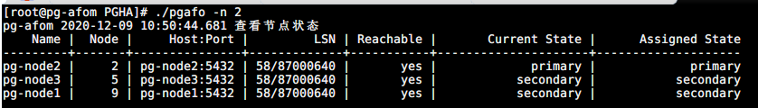


### 4.2.2 查看系统日志

> ./pgafo -l

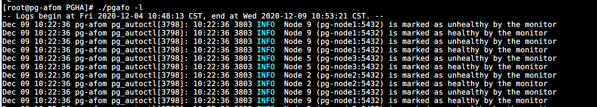


### 4.2.3 节点维护

> 将节点置为维护状态，适用于主机内核升级等情况；


**Secondary 节点维护**

> ./pgafo -m


**Primary 节点维护**

> ./pgafo -m

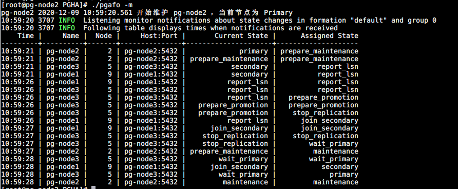


### 4.2.4 节点伸缩

**删除节点**

> ./pgafo -d [hostname]


**增加节点**

> 参考安装，只需要在新的节点安装为 postgres 节点即可成为新的节点加入。


# 5 测试

| 序号 | 测试项         | 预期                                                         | 目的                                                   |
| ---- | -------------- | ------------------------------------------------------------ | ------------------------------------------------------ |
| 1    | 故障转移测试   | 1）、任意一个节点故障，不影响PG服务和数据完整<br/>2）、任意两个节点故障： <br/>                                   a、所有 standby 故障， 当可用 standby 节点数 < number_sync_standbys 时 PG 服务将降级为只读；<br/>                                   b、主节点和其中一个 standby 节点故障，不影响PG服务，有可能影响数据完整性（取绝于接管主PG服务的节点是否是最后执行复制仲裁的节点或故障时有无读请求）<br/>3）、Monitor 故障不影响PG服务和数据完整性，只会影响故障转移；<br/>4）、Monitor SPOF 解决方案的可行性；<br/>5）、Monitor SPOF 解决方案的可靠性；<br/>6）、基于pg-auto-failover 的PG HA方案的可靠性； | 验证 HA，failover可靠性                                |
| 2    | JDBC 应用测试  | 应用正常使用                                                 | 验证现有应用使用 JDBC HA方式能正常使用，业务上无侵入。 |
| 3    | 数据库基准测试 | 性能差距在 **5% 左右**，小于 10%                             | 验证方案，JDBC HA方式连接对性能没有影响 。             |
| 4    | 数据库压测     | /                                                            | 测试数据稳定性，发现未知问题。                         |


## 5.1  故障转移测试

> 依据 two-standby-sync 架构做整体方案的功能和可靠性验证。


### 5.1.1 场景一 ：任意一个 PG 节点故障

> ​		由于这种场景下 Secondary 节点故障并不会触发故障转移（重新选择主节点），故在测试中制造 Primary 节点故障。

| Monitor            | Primary            | Scondary1          | Scondary2          | Available | Failover |
| ------------------ | ------------------ | ------------------ | ------------------ | --------- | -------- |
| :heavy_check_mark: | :heavy_check_mark: | :heavy_check_mark: | :heavy_check_mark: | **是**    | **是**   |


**故障转移测试：**

- 手动造成 Primary 节点服务故障（断电，关机）；

  

  
- 观察故障转移：新主节点产生，原主节点被降级

  

- 重启原 Primary 节点

- 观察故障转移：原 Primary 节点重新加入，开始同步 LSN

  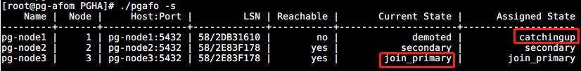

- 观察故障转移：新的 Primary 节点状态 从 join_primary 变为 primary

  


### 5.1.2 场景二 ：任意两个 PG 节点故障

> 验证 number_sync_standbys 和 synchronous_standby_names 配置的影响


**故障转移测试1：两个 Secondary 节点故障**

| Monitor            | Primary            | Scondary1 | Scondary2 | Available | Failover |
| ------------------ | ------------------ | --------- | --------- | --------- | -------- |
| :heavy_check_mark: | :heavy_check_mark: | :x:       | :x:       | **否**    | **否**   |


- 手动造成两个 Secondary 节点故障（断电/关机）；

  - 关机前节点状态

    

  - pg-node2、pg-node3 关机 （pg-node1 降级只读，写阻塞）

    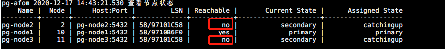

    

  - 设置 number-sync-standbys=0 ,synchronous_standby_names=''（pg-node1 可读写）

    ```shell
    # 设置 number-sync-standbys = 0
    /usr/pgsql-10/bin/pg_autoctl set formation number-sync-standbys 0 --pgdata /pgafo/monitor/pgafomonitor
    
    # 设置 synchronous_standby_names = ''
    /usr/pgsql-10/bin/pg_autoctl set node replication-quorum false --name pg-node2 --pgdata /pgafo/monitor/pgafomonitor
    /usr/pgsql-10/bin/pg_autoctl set node replication-quorum false --name pg-node3 --pgdata /pgafo/monitor/pgafomonitor
    ```

    

    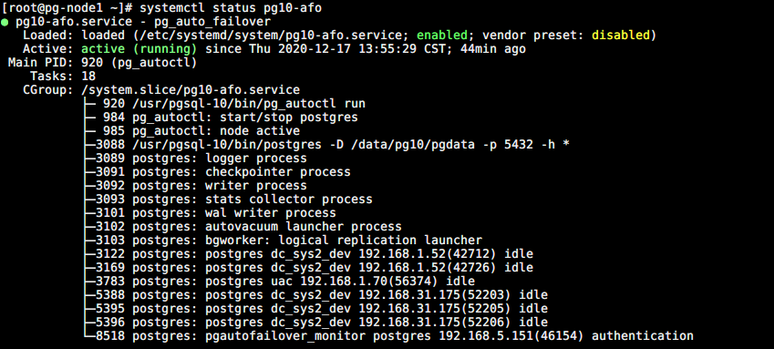


**故障转移测试2：Primary 节点故障，一个Secondary 故障**

| Monitor            | Primary | Scondary1          | Scondary2 | Available | Failover |
| ------------------ | ------- | ------------------ | --------- | --------- | -------- |
| :heavy_check_mark: | :x:     | :heavy_check_mark: | :x:       | **是**    | **否**   |


- 手动造成 Primary 和一个 Secondary 节点故障（断电/关机）；

  - 关机前节点状态

    

  - 关机后故障转移（synchronous_standby_names 自动配置为空）

    

    

  - 故障节点重新加入（重启 pg-node2、pg-node3）

    


> ​		Primary 节点和 Secondary 节点同时故障，另一个 Secondary 节点变成唯一副本，会升级为主节点（wait_primary），synchronous_standby_names 自动配置为空；待故障节点重新加入时，synchronous_standby_names 自动配置为相应的配置。


### 5.1.3 场景三：Monitor 节点故障

| Monitor | Primary            | Scondary1          | Scondary2 | Available | Failover |
| ------- | ------------------ | ------------------ | --------- | --------- | -------- |
| :x:     | :heavy_check_mark: | :heavy_check_mark: | ***any*** | **是**    | **否**   |


**故障转移测试：**

- 手动造成 一个 Monitor 节点故障（断电/关机）；

- 手动造成 一个 Secondary 节点故障（断电/关机）；

- 观察PG服务是否可用；

  

- 重启 故障节点，恢复：

  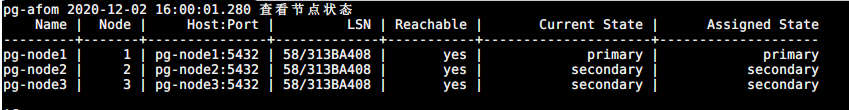


***注：***

> **可增加 Monitor SPOF 解决方案，防止单点影响**。


### 5.1.4 Monitor 故障转移测试

| Monitor1 | Monitor2           | Failover |
| -------- | ------------------ | -------- |
| :x:      | :heavy_check_mark: | **是**   |


**故障转移测试：**

- 手动造成 一个 Monitor 节点（MASTER）故障（断电/关机）；

  


- 另一个备用 Monitor 节点接管服务

  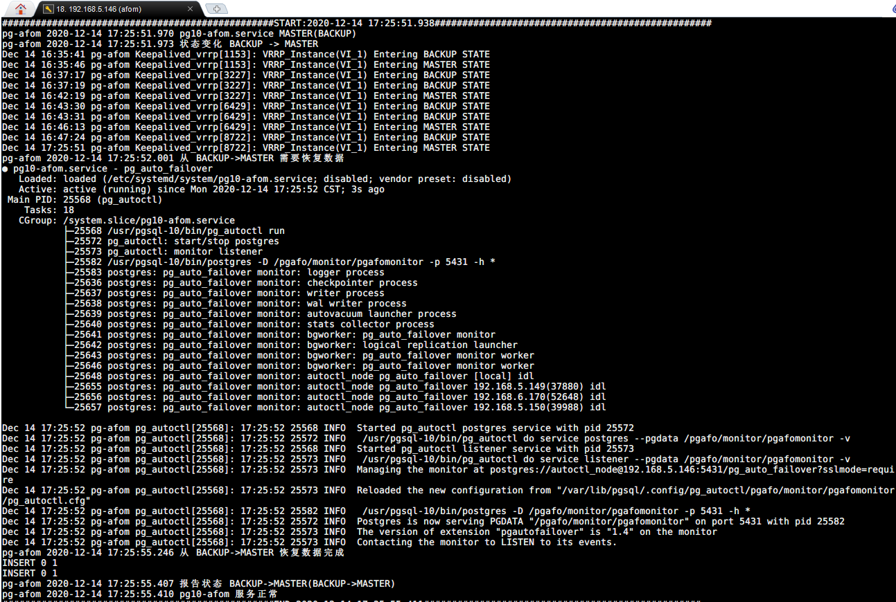


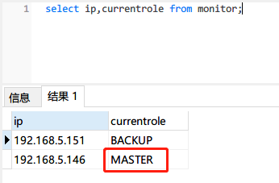


### 5.1.5 Monitor Failover 压测

> 7 X 24小时 ，模拟Monitor 节点故障（两个节点先后故障，间隔5分钟，每小时触发一次）


**两个节点每个小时定时重启**

```shell
# Node1
crontab -l
25 * * * * /sbin/reboot

# Node2
crontab -l
31 * * * * /sbin/reboot
```


***failover 日志：***


### 5.1.6 Primary Failover 压测

> 7 X 24小时 ，每个小时让 Primary 节点故障两次（间隔10分钟）


```shell
# Node1
crontab -l
5 * * * * sh /opt/PGHA/failovertest.sh
55 * * * * sh /opt/PGHA/failovertest.sh

# Node2
crontab -l
5 * * * * sh /opt/PGHA/failovertest.sh
55 * * * * sh /opt/PGHA/failovertest.sh

# Node3
crontab -l
5 * * * * sh /opt/PGHA/failovertest.sh
55 * * * * sh /opt/PGHA/failovertest.sh
```

```shell
#!/bin/bash
# failovertest.sh

is_secondary=$(sudo su postgres -c "psql -p 5432 -c 'select * from pg_is_in_recovery();'" | head -n 3|tail -n 1)
is_secondary=`echo $is_secondary`

# 如果是主节点
if [[ ${is_secondary} == "f" ]]; then
  echo "10秒后重启系统"
  sleep 10
  /sbin/reboot
fi
```


***failover 日志***

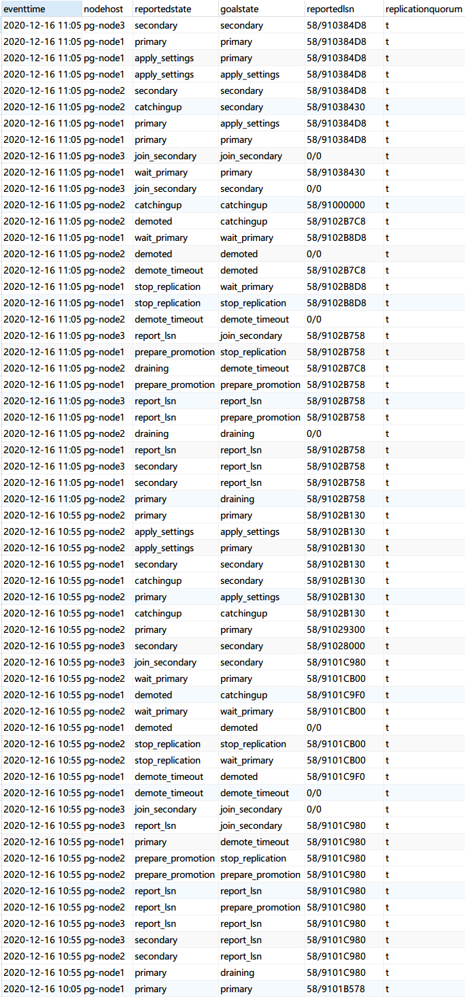


**压测中进行故障转移：**


## 5.2 [JDBC 测试](https://jdbc.postgresql.org/documentation/head/connect.html#connection-parameters)

> 驱动版本：[postgresql-42.2.11](https://github.com/pgjdbc/pgjdbc)


### 5.2.1 HA JDBC连接

`url: jdbc:postgresql://pg-node3:5432,pg-node2:5432,pg-node1:5432/dbname?targetServerType=master `

>  **测试结果正常**


### 5.2.2 读写分离JDBC连接

> （待验证）

`url: jdbc:postgresql://pg-node3:5432,pg-node2:5432,pg-node1:5432/dbname?targetServerType=perferSlave `


## 5.3 数据库基准测试

> ​		基准测试主要了从 JDBC 驱动层到数据库层完全执行一个指令所需的时钟周期，即测试中实际执行的事务。


### 5.3.1 测试环境

- [测试工具：BenchMarkSQL 5.0](https://sourceforge.net/projects/benchmarksql/) | [使用方法](https://support.huaweicloud.com/tstg-kunpengdbs/kunpengbenchmarksql_06_0002.html)
- PG 版本： 10.15
- PG 服务器主要参数： 4C 8G
- PG 驱动版本：postgresql-42.2.11
- 客户端参数：略


> ​		BenchmarkSQL is an open source implementation of the popular TPC/C OLTP
> database benchmark. Version 5.0 is a major overhaul of the benchmark driver.
> This version supports Firebird, Oracle and PostgreSQL, adds foreign keys to
> the schema (as required by the specifications) and captures detailed benchmark


### 5.3.2 测试模型：TPC-C 标准测试

**TPC-C 标准测试模拟了 5 种事务处理，通过这些事务处理来模拟真实的用户操作，事务分别为**:

- 新订单（New-Order）
- 支付操作(Payment)
- 订单状态查询(Order-Status)
- 发货(Delivery)
- 库存状态查询(Stock-Level)


### 5.3.3 BenchmarkSQL 指标说明

- Latency 表示完全执行一个指令所需的时钟周期，潜伏期越少越好。
- tmpC 表示每分钟执行的事务数(NewOrders)
- tmpTOTAL 表示每分钟执行的总事务数
- runMins BenchmarkSQL 测试模式，分为 runTxnsPerTerminal 和 runMins ：
  - runTxnsPerTerminal ：每个终端执行数模式
  - runMins：执行时长模式


### 5.3.4 HA JDBC 连接基准测试

> 采用 BenchmarkSQL runMins 模式进行测试。

#### 5.3.4.1 [基准参照数据](./pressure-test/single_t16_10m#1/report.html)

> ​		基准参照数据取单机 JDBC 连接的的基准测试，单机是指只有一个主节点，没有 standby 节点数据复制的影响。测试多组，以下指标展示为典型值。


**Run Properties**

>  10:45:09,874 [main] INFO   jTPCC : Term-00, +-------------------------------------------------------------+
>  10:45:09,875 [main] INFO   jTPCC : Term-00,      BenchmarkSQL v5.0
>  10:45:09,875 [main] INFO   jTPCC : Term-00, +-------------------------------------------------------------+
>  10:45:09,875 [main] INFO   jTPCC : Term-00,  (c) 2003, Raul Barbosa
>  10:45:09,875 [main] INFO   jTPCC : Term-00,  (c) 2004-2016, Denis Lussier
>  10:45:09,876 [main] INFO   jTPCC : Term-00,  (c) 2016, Jan Wieck
>  10:45:09,877 [main] INFO   jTPCC : Term-00, +-------------------------------------------------------------+
>  10:45:09,877 [main] INFO   jTPCC : Term-00,
>  10:45:09,878 [main] INFO   jTPCC : Term-00, db=postgres
>  10:45:09,878 [main] INFO   jTPCC : Term-00, driver=org.postgresql.Driver
>  10:45:09,879 [main] INFO   jTPCC : Term-00, conn=**jdbc:postgresql://pg-node1:5432/pressure**
>  10:45:09,879 [main] INFO   jTPCC : Term-00, user=postgres
>  10:45:09,879 [main] INFO   jTPCC : Term-00,
>  10:45:09,879 [main] INFO   jTPCC : Term-00, warehouses=10
>  10:45:09,879 [main] INFO   jTPCC : Term-00, terminals=16
>  10:45:09,880 [main] INFO   jTPCC : Term-00, runMins=10
>  10:45:09,880 [main] INFO   jTPCC : Term-00, limitTxnsPerMin=100000
>  10:45:09,880 [main] INFO   jTPCC : Term-00, terminalWarehouseFixed=true
>  10:45:09,880 [main] INFO   jTPCC : Term-00,
>  10:45:09,880 [main] INFO   jTPCC : Term-00, newOrderWeight=45
>  10:45:09,881 [main] INFO   jTPCC : Term-00, paymentWeight=43
>  10:45:09,881 [main] INFO   jTPCC : Term-00, orderStatusWeight=4
>  10:45:09,881 [main] INFO   jTPCC : Term-00, deliveryWeight=4
>  10:45:09,881 [main] INFO   jTPCC : Term-00, stockLevelWeight=4
>
>  10:55:31,085 [Thread-13] INFO   jTPCC : Term-00, Measured tpmC (NewOrders) = 5435.37
>  10:55:31,086 [Thread-13] INFO   jTPCC : Term-00, Measured tpmTOTAL = 12056.08
>  10:55:31,086 [Thread-13] INFO   jTPCC : Term-00, Session Start     = 2020-12-18 10:45:30
>  10:55:31,086 [Thread-13] INFO   jTPCC : Term-00, Session End       = 2020-12-18 10:55:31
>  10:55:31,086 [Thread-13] INFO   jTPCC : Term-00, Transaction Count = 120627

**Result Summary**

<table width="1100px" border="2">
    <tr>
      <th rowspan="2" width="16%"><b>Transaction<br/>Type</b></th>
      <th colspan="2" width="24%"><b>Latency</b></th>
      <th rowspan="2" width="12%"><b>Count</b></th>
      <th rowspan="2" width="12%"><b>Percent</b></th>
      <th rowspan="2" width="12%"><b>Rollback</b></th>
      <th rowspan="2" width="12%"><b>Errors</b></th>
      <th rowspan="2" width="12%"><b>Skipped<br/>Deliveries</b></th>
    </tr>
    <tr>
      <th width="12%"><b>90th&nbsp;%</b></th>
      <th width="12%"><b>Maximum</b></th>
    </tr>
    <tr>
      <td align="left">NEW_ORDER</td>
      <td align="right">0.139s</td>
      <td align="right">2.956s</td>
      <td align="right">54384</td>
      <td align="right">45.084%</td>
      <td align="right">1.081%</td>
      <td align="right">0</td>
      <td align="right">N/A</td>
    </tr>
    <tr>
      <td align="left">PAYMENT</td>
      <td align="right">0.050s</td>
      <td align="right">2.917s</td>
      <td align="right">51700</td>
      <td align="right">42.859%</td>
      <td align="right">N/A</td>
      <td align="right">0</td>
      <td align="right">N/A</td>
    </tr>
    <tr>
      <td align="left">ORDER_STATUS</td>
      <td align="right">0.017s</td>
      <td align="right">0.193s</td>
      <td align="right">4781</td>
      <td align="right">3.963%</td>
      <td align="right">N/A</td>
      <td align="right">0</td>
      <td align="right">N/A</td>
    </tr>
    <tr>
      <td align="left">STOCK_LEVEL</td>
      <td align="right">0.018s</td>
      <td align="right">0.617s</td>
      <td align="right">4863</td>
      <td align="right">4.031%</td>
      <td align="right">N/A</td>
      <td align="right">0</td>
      <td align="right">N/A</td>
    </tr>
    <tr>
      <td align="left">DELIVERY</td>
      <td align="right">0.000s</td>
      <td align="right">0.001s</td>
      <td align="right">4899</td>
      <td align="right">4.061%</td>
      <td align="right">N/A</td>
      <td align="right">0</td>
      <td align="right">N/A</td>
    </tr>
    <tr>
      <td align="left">DELIVERY_BG</td>
      <td align="right">0.441s</td>
      <td align="right">3.166s</td>
      <td align="right">4899</td>
      <td align="right">N/A</td>
      <td align="right">N/A</td>
      <td align="right">0</td>
      <td align="right">0</td>
    </tr>
    </table>

**TPM and TL**


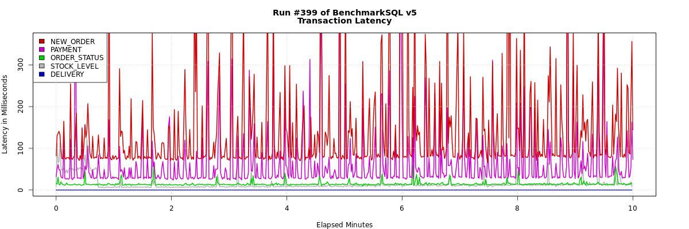


#### 5.3.4.2 [HA JDBC 基准测试数据](./pressure-test/ha_t16_10m#1/report.html)

> 测试多组，以下指标展示为典型值。


**Run Properties**

> 12:17:50,020 [main] INFO   jTPCC : Term-00, +-------------------------------------------------------------+
> 12:17:50,020 [main] INFO   jTPCC : Term-00,      BenchmarkSQL v5.0
> 12:17:50,020 [main] INFO   jTPCC : Term-00, +-------------------------------------------------------------+
> 12:17:50,020 [main] INFO   jTPCC : Term-00,  (c) 2003, Raul Barbosa
> 12:17:50,020 [main] INFO   jTPCC : Term-00,  (c) 2004-2016, Denis Lussier
> 12:17:50,022 [main] INFO   jTPCC : Term-00,  (c) 2016, Jan Wieck
> 12:17:50,023 [main] INFO   jTPCC : Term-00, +-------------------------------------------------------------+
> 12:17:50,023 [main] INFO   jTPCC : Term-00,
> 12:17:50,023 [main] INFO   jTPCC : Term-00, db=postgres
> 12:17:50,023 [main] INFO   jTPCC : Term-00, driver=org.postgresql.Driver
> 12:17:50,023 [main] INFO   jTPCC : Term-00, conn=**jdbc:postgresql://pg-node3:5432,pg-node2:5432,pg-node1:5432/pressure?targetServerType=master**
> 12:17:50,023 [main] INFO   jTPCC : Term-00, user=postgres
> 12:17:50,023 [main] INFO   jTPCC : Term-00,
> 12:17:50,024 [main] INFO   jTPCC : Term-00, warehouses=10
> 12:17:50,024 [main] INFO   jTPCC : Term-00, terminals=16
> 12:17:50,025 [main] INFO   jTPCC : Term-00, runMins=10
> 12:17:50,025 [main] INFO   jTPCC : Term-00, limitTxnsPerMin=100000
> 12:17:50,025 [main] INFO   jTPCC : Term-00, terminalWarehouseFixed=true
> 12:17:50,025 [main] INFO   jTPCC : Term-00,
> 12:17:50,025 [main] INFO   jTPCC : Term-00, newOrderWeight=45
> 12:17:50,025 [main] INFO   jTPCC : Term-00, paymentWeight=43
> 12:17:50,025 [main] INFO   jTPCC : Term-00, orderStatusWeight=4
> 12:17:50,025 [main] INFO   jTPCC : Term-00, deliveryWeight=4
> 12:17:50,026 [main] INFO   jTPCC : Term-00, stockLevelWeight=4
>
> 12:28:21,752 [Thread-9] INFO   jTPCC : Term-00, Measured tpmC (NewOrders) = 4963.44
> 12:28:21,752 [Thread-9] INFO   jTPCC : Term-00, Measured tpmTOTAL = 10986.67
> 12:28:21,752 [Thread-9] INFO   jTPCC : Term-00, Session Start     = 2020-12-18 12:18:21
> 12:28:21,753 [Thread-9] INFO   jTPCC : Term-00, Session End       = 2020-12-18 12:28:21
> 12:28:21,753 [Thread-9] INFO   jTPCC : Term-00, Transaction Count = 109971


**Result Summary**

 <table width="1100px" border="2">
    <tr>
      <th rowspan="2" width="16%"><b>Transaction<br/>Type</b></th>
      <th colspan="2" width="24%"><b>Latency</b></th>
      <th rowspan="2" width="12%"><b>Count</b></th>
      <th rowspan="2" width="12%"><b>Percent</b></th>
      <th rowspan="2" width="12%"><b>Rollback</b></th>
      <th rowspan="2" width="12%"><b>Errors</b></th>
      <th rowspan="2" width="12%"><b>Skipped<br/>Deliveries</b></th>
    </tr>
    <tr>
      <th width="12%"><b>90th&nbsp;%</b></th>
      <th width="12%"><b>Maximum</b></th>
    </tr>
    <tr>
      <td align="left">NEW_ORDER</td>
      <td align="right">0.170s</td>
      <td align="right">4.330s</td>
      <td align="right">49682</td>
      <td align="right">45.177%</td>
      <td align="right">1.012%</td>
      <td align="right">0</td>
      <td align="right">N/A</td>
    </tr>
    <tr>
      <td align="left">PAYMENT</td>
      <td align="right">0.062s</td>
      <td align="right">4.268s</td>
      <td align="right">47264</td>
      <td align="right">42.979%</td>
      <td align="right">N/A</td>
      <td align="right">0</td>
      <td align="right">N/A</td>
    </tr>
    <tr>
      <td align="left">ORDER_STATUS</td>
      <td align="right">0.016s</td>
      <td align="right">0.271s</td>
      <td align="right">4330</td>
      <td align="right">3.937%</td>
      <td align="right">N/A</td>
      <td align="right">0</td>
      <td align="right">N/A</td>
    </tr>
    <tr>
      <td align="left">STOCK_LEVEL</td>
      <td align="right">0.038s</td>
      <td align="right">0.447s</td>
      <td align="right">4386</td>
      <td align="right">3.988%</td>
      <td align="right">N/A</td>
      <td align="right">0</td>
      <td align="right">N/A</td>
    </tr>
    <tr>
      <td align="left">DELIVERY</td>
      <td align="right">0.000s</td>
      <td align="right">0.001s</td>
      <td align="right">4309</td>
      <td align="right">3.918%</td>
      <td align="right">N/A</td>
      <td align="right">0</td>
      <td align="right">N/A</td>
    </tr>
    <tr>
      <td align="left">DELIVERY_BG</td>
      <td align="right">0.455s</td>
      <td align="right">4.377s</td>
      <td align="right">4309</td>
      <td align="right">N/A</td>
      <td align="right">N/A</td>
      <td align="right">0</td>
      <td align="right">0</td>
    </tr>
    </table>
**TPM and TL**

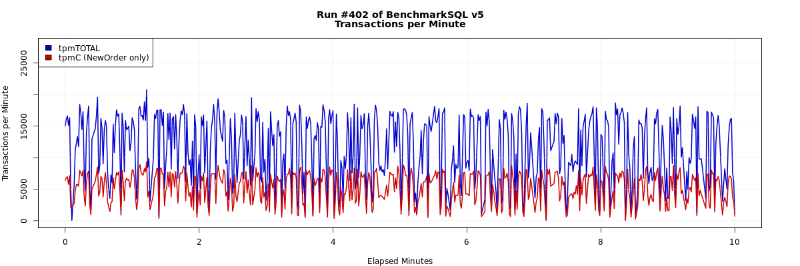


#### 5.3.4.3 基准测试结果

<table width="1100px" border="2">
    <tr>
      <th rowspan="2" width="12%"><b>JDBC Type</b></th>
	  <th rowspan="2" width="8%"><b>Terminsls</b></th>
      <th colspan="3" width="30%" align="center"><b>tpmC</b></th>
	  <th colspan="3" width="30%" align="center"><b>tpmTOTAL</b></th>
	  <th colspan="2" width="20%" align="center"><b>Average</b></th>
    </tr>
    <tr>
      <th width="10%"><b>#1</b></th>
      <th width="10%"><b>#2</b></th>
      <th width="10%"><b>#3</b></th>
	  <th width="10%"><b>#1</b></th>
      <th width="10%"><b>#2</b></th>
      <th width="10%"><b>#3</b></th>
	  <th width="10%"><b>tpmC</b></th>
      <th width="10%"><b>tpmTOTAL</b></th>
    </tr>
    <tr>
      <td align="center">HA</td>
      <td align="center">16</td>
      <td align="right"><a href='./pressure-test/ha_t16_10m#1/report.html'>4963.44</a></td>
      <td align="right"><a href='./pressure-test/ha_t16_10m#2/report.html'>4898.79</a></td>
      <td align="right"><a href='./pressure-test/ha_t16_10m#3/report.html'>4657.05</a></td>
      <td align="right"><a href='./pressure-test/ha_t16_10m#1/report.html'>10986.67</a></td>
      <td align="right"><a href='./pressure-test/ha_t16_10m#2/report.html'>10883.45</a></td>
      <td align="right"><a href='./pressure-test/ha_t16_10m#3/report.html'>10324.87</a></td>
	  <td align="right">4839.76</td>
      <td align="right">10731.66</td>
    </tr>
    <tr>
      <td align="center">Single</td>
      <td align="center">16</td>
      <td align="right"><a href='./pressure-test/single_t16_10m#1/report.html'>5435.37</a></td>
      <td align="right"><a href='./pressure-test/single_t16_10m#2/report.html'>5114.47</a></td>
      <td align="right"><a href='./pressure-test/single_t16_10m#3/report.html'>5412.43</a></td>
      <td align="right"><a href='./pressure-test/single_t16_10m#1/report.html'>12056.08</a></td>
      <td align="right"><a href='./pressure-test/single_t16_10m#2/report.html'>11341.28</a></td>
      <td align="right"><a href='./pressure-test/single_t16_10m#3/report.html'>12007.29</a></td>
	  <td align="right">5320.76</td>
      <td align="right">11801.55</td>
    </tr>
    </table>


## 5.4 压测

> 压测主要指标解读参照基准测试。

#### **[terminal=16 主要指标](./pressure-test/ha_t16_1h#1/report.html)**

**Run Properties**

>  db=postgres
>  driver=org.postgresql.Driver
>  conn=jdbc:postgresql://pg-node3:5432,pg-node2:5432,pg-node1:5432/pressure?useUnicode=true&characterEncoding=UTF-8&autoReconnect=true&targetServerType=master
>  user=postgres
>
>  warehouses=10
>  terminals=16
>  runMins=60
>  limitTxnsPerMin=100000
>
>  Running Average tpmTOTAL: 5960.14    Current tpmTOTAL: 2365524    Memory Usage: 117MB / 159MB
>
>  Measured tpmC (NewOrders) = 2677.05
>  Measured tpmTOTAL = 5960.14
>  Session Start     = 2020-11-30 15:17:35
>  Session End       = 2020-11-30 16:17:37
>  Transaction Count = 357847


**Result Summary**

<table width="1100px" border="2">
    <tr>
      <th rowspan="2" width="16%"><b>Transaction<br/>Type</b></th>
      <th colspan="2" width="24%"><b>Latency</b></th>
      <th rowspan="2" width="12%"><b>Count</b></th>
      <th rowspan="2" width="12%"><b>Percent</b></th>
      <th rowspan="2" width="12%"><b>Rollback</b></th>
      <th rowspan="2" width="12%"><b>Errors</b></th>
      <th rowspan="2" width="12%"><b>Skipped<br/>Deliveries</b></th>
    </tr>
    <tr>
      <th width="12%"><b>90th&nbsp;%</b></th>
      <th width="12%"><b>Maximum</b></th>
    </tr>
    <tr>
      <td align="left">NEW_ORDER</td>
      <td align="right">0.362s</td>
      <td align="right">16.688s</td>
      <td align="right">160731</td>
      <td align="right">44.916%</td>
      <td align="right">0.978%</td>
      <td align="right">0</td>
      <td align="right">N/A</td>
    </tr>
    <tr>
      <td align="left">PAYMENT</td>
      <td align="right">0.189s</td>
      <td align="right">14.234s</td>
      <td align="right">154400</td>
      <td align="right">43.147%</td>
      <td align="right">N/A</td>
      <td align="right">0</td>
      <td align="right">N/A</td>
    </tr>
    <tr>
      <td align="left">ORDER_STATUS</td>
      <td align="right">0.110s</td>
      <td align="right">2.864s</td>
      <td align="right">14371</td>
      <td align="right">4.016%</td>
      <td align="right">N/A</td>
      <td align="right">0</td>
      <td align="right">N/A</td>
    </tr>
    <tr>
      <td align="left">STOCK_LEVEL</td>
      <td align="right">0.072s</td>
      <td align="right">13.617s</td>
      <td align="right">14038</td>
      <td align="right">3.923%</td>
      <td align="right">N/A</td>
      <td align="right">0</td>
      <td align="right">N/A</td>
    </tr>
    <tr>
      <td align="left">DELIVERY</td>
      <td align="right">0.000s</td>
      <td align="right">0.001s</td>
      <td align="right">14307</td>
      <td align="right">3.998%</td>
      <td align="right">N/A</td>
      <td align="right">0</td>
      <td align="right">N/A</td>
    </tr>
    <tr>
      <td align="left">DELIVERY_BG</td>
      <td align="right">0.914s</td>
      <td align="right">14.876s</td>
      <td align="right">14307</td>
      <td align="right">N/A</td>
      <td align="right">N/A</td>
      <td align="right">0</td>
      <td align="right">0</td>
    </tr>
    </table>

**TPM and TL**


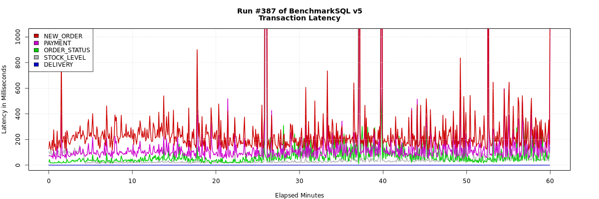


#### **[terminal=32 主要指标](./pressure-test/ha_t32_1h#1/report.html)**

**Run Properties**

>  db=postgres
>  driver=org.postgresql.Driver
>  conn=jdbc:postgresql://pg-node3:5432,pg-node2:5432,pg-node1:5432/pressure?useUnicode=true&characterEncoding=UTF-8&autoReconnect=true&targetServerType=master
>  user=postgres
>
>  warehouses=10
>  terminals=32
>  runMins=60
>  limitTxnsPerMin=100000
>
>  Running Average tpmTOTAL: 7846.76    Current tpmTOTAL: 3115428    Memory Usage: 44MB / 83MB
>
>  Measured tpmC (NewOrders) = 3519.94
>  Measured tpmTOTAL = 7846.88
>  Session Start     = 2020-11-30 11:40:57
>  Session End       = 2020-11-30 12:40:57
>  Transaction Count = 470833


**Result Summary**

<table width="1100px" border="2">
    <tr>
      <th rowspan="2" width="16%"><b>Transaction<br/>Type</b></th>
      <th colspan="2" width="24%"><b>Latency</b></th>
      <th rowspan="2" width="12%"><b>Count</b></th>
      <th rowspan="2" width="12%"><b>Percent</b></th>
      <th rowspan="2" width="12%"><b>Rollback</b></th>
      <th rowspan="2" width="12%"><b>Errors</b></th>
      <th rowspan="2" width="12%"><b>Skipped<br/>Deliveries</b></th>
    </tr>
    <tr>
      <th width="12%"><b>90th&nbsp;%</b></th>
      <th width="12%"><b>Maximum</b></th>
    </tr>
    <tr>
      <td align="left">NEW_ORDER</td>
      <td align="right">0.576s</td>
      <td align="right">13.890s</td>
      <td align="right">211206</td>
      <td align="right">44.858%</td>
      <td align="right">1.008%</td>
      <td align="right">0</td>
      <td align="right">N/A</td>
    </tr>
    <tr>
      <td align="left">PAYMENT</td>
      <td align="right">0.429s</td>
      <td align="right">14.443s</td>
      <td align="right">203260</td>
      <td align="right">43.170%</td>
      <td align="right">N/A</td>
      <td align="right">0</td>
      <td align="right">N/A</td>
    </tr>
    <tr>
      <td align="left">ORDER_STATUS</td>
      <td align="right">0.166s</td>
      <td align="right">2.983s</td>
      <td align="right">18754</td>
      <td align="right">3.983%</td>
      <td align="right">N/A</td>
      <td align="right">0</td>
      <td align="right">N/A</td>
    </tr>
    <tr>
      <td align="left">STOCK_LEVEL</td>
      <td align="right">0.065s</td>
      <td align="right">11.492s</td>
      <td align="right">18946</td>
      <td align="right">4.024%</td>
      <td align="right">N/A</td>
      <td align="right">0</td>
      <td align="right">N/A</td>
    </tr>
    <tr>
      <td align="left">DELIVERY</td>
      <td align="right">0.000s</td>
      <td align="right">0.005s</td>
      <td align="right">18667</td>
      <td align="right">3.965%</td>
      <td align="right">N/A</td>
      <td align="right">0</td>
      <td align="right">N/A</td>
    </tr>
    <tr>
      <td align="left">DELIVERY_BG</td>
      <td align="right">1.344s</td>
      <td align="right">16.202s</td>
      <td align="right">18667</td>
      <td align="right">N/A</td>
      <td align="right">N/A</td>
      <td align="right">0</td>
      <td align="right">0</td>
    </tr>
    </table>

**TPM and TL**


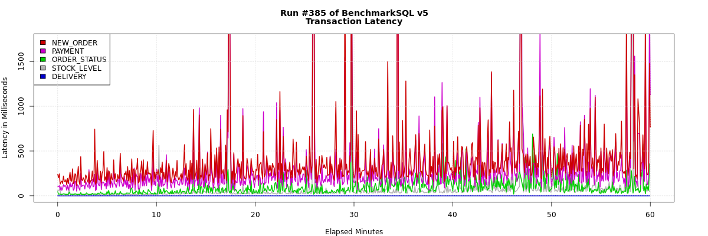


## 5.5 测试结论

> - 故障转移测试
>   - [场景一](#场景一)：验证任意一个节点故障，都能保证PG服务可用和数据安全，**符合预期**；
>   - [场景二](#场景二)：验证了standby 故障，当可用 standby 节点数 < number_sync_standbys 时 PG 服务将**降级为只读**，**符合预期**；验证了主节点和一个 standby 节点故障，不影响可用性，**符合预期**；
>   - [场景三](#场景三) 验证 Monitor 节点故障不影响 PG 服务，**符合预期**；
>   - [Monitor 故障转移测试]()验证了 Monitor SPOF 解决方案的功能可行，**符合预期**；
> - 应用 JDBC 连接测试正常，**符合预期**；
> - 从基准测试结果的两组数据对比上看，HA 和单机连接单位时间内执行的事务数差距大概差距在8%-10%（这个差距依据测试模型中 newOrder 的数据得出），**略大于预期的5%**。
> - 压测中发现，大量的写操作会造成复制节点pg_wal 大量增长，磁盘压力增大，需要增对 pg_wal 参数进行调优。


# 6  应用

> 任何阶段的风险和不适用评估都会对下一阶段有决定性的影响。


| 阶段       | 规模                   | 目标                      | 下个阶段   | 备注              |
| ---------- | ---------------------- | ------------------------- | ---------- | ----------------- |
| DEV_READY  | 2个应用                | failover 压测稳定运行 1周 | DEV        | **已稳定运行7天** |
| DEV        | 全部应用               | 稳定运行 3周              | TEST       | /                 |
| TEST       | 全部应用               | 稳定运行 3周              | PROD_READY | /                 |
| PROD_READY | 符合业务规模的压力测试 | 稳定运行4周               | PROD       | /                 |
| PROD       | 待定                   | /                         | /          | /                 |


# 7 总结

> ​		PG HA方案解决了目前生产上 PG 单点故障问题，实现 Postgres 服务和数据集的高可用性，在原有 pg-auto-failover 之上补充了 Monitor SPOF 的解决方案。整体方案在 DEV_READY 阶段做了完整测试和验证，包括：故障转移（压测）、JDBC 应用层接入、数据库基准、数据库压测，测试结果基本符合预期；数据基准测试性能上的差距主因是同步的流复制，流复制是主流 PG Active/Standby HA 方案的基础，这部分性能上的差距在类似方案上也是存在的；在验证和测试部分下个阶段可以更深入关注异步复制的影响、基准上参照可以考虑对比非 pg-auto-failover 中自动配置的流复制。
>
> ​		整体上推荐方案进入下一阶段的使用和验证。
>
> ​		


# 附录

## [pg_auto_failover Glossary](https://pg-auto-failover.readthedocs.io/en/latest/architecture.html#pg-auto-failover-glossary)

| 概念      | 描述                                                         |
| --------- | ------------------------------------------------------------ |
| Formation | **编队**是一起管理的 PG 服务的逻辑集合。                     |
| Monitor   | **Monitor** 是 pg-auto-failover 里的一个服务，用于跟踪一个或多个包含**节点组**的**编队**。Monitor 服务以一个 PG 扩展的方式实现，所以当创建 Monitor 服务时，将会初始化一个 PG 实例，并使用该扩展进行配置和启动。Monitor 服务时嵌入在 PG 实例里面的 |
| Group     | **节点组**， 一个**节点组**由 PG 主节点和具有一个或多个同步复制的 standby 节点组成，以 HA 的方式提供单个 PG 服务。 |
| Keeper    | **Keeper** 是 pg-auto-failover 的**守护程序**，必须在运行 PG 节点的服务器上运行。Keeper 控制本地的 PG 实例（通过 pg_ctl 命令和 SQL 查询），并与 **Monitor** 通信：<br/>      1、根据PG 的统计信息视图，发送本地节点的更新数据，例如服务器之间的 WAL 增量<br/>     2、从 Monitor 接受状态分配 |
| Node      | **节点**是运行 PG 实例和 **Keeper** 服务的服务器。           |
| State     | **状态**是每个实例和每个组情况的表示。                       |


## [Failover State reference](https://pg-auto-failover.readthedocs.io/en/latest/failover-state-machine.html#state-reference)


| 状态                                                         | 描述                                                         | 场景                                                         |
| ------------------------------------------------------------ | ------------------------------------------------------------ | ------------------------------------------------------------ |
| [init](https://pg-auto-failover.readthedocs.io/en/latest/failover-state-machine.html#init) | 节点**第一次**向 Monitor **注册**时，被分配的状态；这时除了知道节点**存在**，并不知道节点的任何信息。 | /                                                            |
| [single](https://pg-auto-failover.readthedocs.io/en/latest/failover-state-machine.html#single) | **只有一个节点**时，或其他节点被删除时；此时相当于当个 PG 实例，没有 HA 和 failover的能力。 | /                                                            |
| [wait_primary](https://pg-auto-failover.readthedocs.io/en/latest/failover-state-machine.html#wait-primary) | 计划成为主节点（primary），但还未成为时；此时这个节点已知 standby 节点的信息（名称、IP），并允许 hot standby （复制连接）。 | 1、新的健康节点注册时 <br/>2、现有 Secondary 节点不健康时（这种情况下，从 priamry 到 wait_primary 这段时间内，同步复制和查询都会被限制） |
| [join_primary](https://pg-auto-failover.readthedocs.io/en/latest/failover-state-machine.html#join-primary) | 当 standby 节点加入时，应用于主节点；此时主节点将修改HBA 设置，之后新的节点才能使用 pg_basebackup 命令。 | /                                                            |
| [primary](https://pg-auto-failover.readthedocs.io/en/latest/failover-state-machine.html#primary) | 当主节点存在一个健康的 standby 节点，并且 WAL 复制落后为0。  | /                                                            |
| [wait_standby](https://pg-auto-failover.readthedocs.io/en/latest/failover-state-machine.html#wait-standby) | Monitor 判定为 standby 节点，此时等待主节点授权允许 hot standby（复制连接）。 | /                                                            |
| [catching_up](https://pg-auto-failover.readthedocs.io/en/latest/failover-state-machine.html#catchingup) | 主节点允许 hot standby（复制连接）时，standby 节点被分配的状态。 | /                                                            |
| [secondary](https://pg-auto-failover.readthedocs.io/en/latest/failover-state-machine.html#secondary) | 是主节点的 hot standby ，WAL 是最新的。                      | /                                                            |
| [maintenance](https://pg-auto-failover.readthedocs.io/en/latest/failover-state-machine.html#maintenance) | 节点进入维护状态。                                           | /                                                            |
| [prepare_maintenance](https://pg-auto-failover.readthedocs.io/en/latest/failover-state-machine.html#prepare-maintenance) | 主节点进入维护状态前的中间状态，确保 standby 节点完成所有写确认。 | /                                                            |
| [wait-maintenance](https://pg-auto-failover.readthedocs.io/en/latest/failover-state-machine.html#wait-maintenance) | standby 节点进入维护状态前的中间状态；为了确保写不会被阻塞，节点会被切换到异步复制。 | /                                                            |
| [draining](https://pg-auto-failover.readthedocs.io/en/latest/failover-state-machine.html#draining) | primary 和 demoted 之间的中间状态，等待复制缓冲区完成刷新；此时节点将不会接受新的写请求。 | 主节点故障时，被降级                                         |
| [demoted](https://pg-auto-failover.readthedocs.io/en/latest/failover-state-machine.html#demoted) | 主节点处于降级状态，PG 实例将会被停止。                      |                                                              |
| [demote-timeout](https://pg-auto-failover.readthedocs.io/en/latest/failover-state-machine.html#demote-timeout) | 主节点被 Monitor 分配 demoted 状态，但主节点上的 keeper 服务未在超时窗口内进行确认收到，此时Monitor 会分配 demote-timeout 给主节点。 | 主节点突然断电或关机了，被降级，keeper 服务未报告状态。      |
| [stop-replication](https://pg-auto-failover.readthedocs.io/en/latest/failover-state-machine.html#stop-replication) | stop-replication 状态确保在故障转移时，主数据库先进入 demoted（降级）状态， standby 才变为单个数据库（可写）。 |                                                              |
| [prepare-promotion](https://pg-auto-failover.readthedocs.io/en/latest/failover-state-machine.html#prepare-promotion) | prepare_promotion 状态用于准备将 standby 服务器升级。        |                                                              |
| [report-lsn](https://pg-auto-failover.readthedocs.io/en/latest/failover-state-machine.html#report-lsn) | 当故障转移时，存在多个 standby 节点时，将report_lsn 状态分配给 standby 节点；Monitor 将会选择偏移最大 LSN 作为新的主节点，所以所有 standby 会先报告最新的 LSN。 |                                                              |
| [fast-forward](https://pg-auto-failover.readthedocs.io/en/latest/failover-state-machine.html#fast-forward) | 故障转移时，当一个 standby 节点被选为主节点是因为 candidate-priority 配置（比其它节点的大），而不是因为它的 LSN 偏移最大，此时节点会被分配 fast_forward 状态，由此节点会利用 PG 级联复制功能，从最大 LSN  standby 节点获取丢失的 WAL。 |                                                              |


## [Failover logic](https://pg-auto-failover.readthedocs.io/en/latest/failover-state-machine.html#failover-logic)


### Node state machine


### Group state machine


# FQA

[pg_wal 文件膨胀](https://zhuanlan.zhihu.com/p/166218704)

[wal configuration](http://www.postgres.cn/docs/10/wal-configuration.html)

[如何遏制PostgreSQL WAL的疯狂增长](http://www.postgres.cn/news/viewone/1/273)

虚拟机下使用 huge_page 重启后，huge_page失效，PG会重启失败

[PostgreSQL数据库Linux内核参数调优](https://www.modb.pro/db/14150)

[PostgreSQL优化之Linux 内核参数调优](http://www.pgsql.tech/project_300_10000084)

[pg-auto-failover 介绍](http://citusdb.cn/?p=1076)

[pg-auto-failover source code](https://github.com/citusdata/pg_auto_failover)

[install pg-auto-failover](https://pg-auto-failover.readthedocs.io/en/latest/install.html)

[pg-auto-failover docs](https://pg-auto-failover.readthedocs.io/en/latest/tutorial.html)

[pg-auto-failover glossary](https://pg-auto-failover.readthedocs.io/en/latest/architecture.html#pg-auto-failover-glossary)

[pg-auto-failover: failover state machine](https://pg-auto-failover.readthedocs.io/en/latest/failover-state-machine.html)

[pg-auto-failover : number_sync_standby](https://pg-auto-failover.readthedocs.io/en/latest/architecture.html#synchronous-vs-asynchronous-replication)

[pg-auto-failover : Client Side HA](https://pg-auto-failover.readthedocs.io/en/latest/architecture.html#client-side-ha)

[pg-auto-failover configuration](https://pg-auto-failover.readthedocs.io/en/latest/ref/configuration.html)

[Set Number Sync Standbys](https://pg-auto-failover.readthedocs.io/en/latest/architecture-multi-standby.html?#number-sync-standbys)

[postgres jdbc connection parameters](https://jdbc.postgresql.org/documentation/head/connect.html#connection-parameters)

[the monitor is a spof in pg-auto-failover design how should we handle that](https://pg-auto-failover.readthedocs.io/en/latest/faq.html#the-monitor-is-a-spof-in-pg-auto-failover-design-how-should-we-handle-that)

[自动故障转移和读写分离](https://help.aliyun.com/document_detail/173284.html)

[读写分离](https://developer.aliyun.com/article/73930)

[测试工具：BenchMarkSQL](https://sourceforge.net/projects/benchmarksql/) | [使用方法](https://support.huaweicloud.com/tstg-kunpengdbs/kunpengbenchmarksql_06_0002.html)

[Pgpool-II](https://pgpool.net/mediawiki/index.php/Main_Page)

[Patroni](https://patroni.readthedocs.io/en/latest/)

[Repmgr](https://repmgr.org/)

[PostgreSQL Failover、Warm Standby](https://www.postgresql.org/docs/10/warm-standby-failover.html) 

[PostgreSQl Connection parameters](https://jdbc.postgresql.org/documentation/head/connect.html#connection-parameters)

[Postgres Kernel Resources](https://www.postgresql.org/docs/10/kernel-resources.html)

[SPOF](https://baike.baidu.com/item/单点故障/3570893): 单点故障 (single point of failure)

[Keepalived 原理和 VRRP 协议](https://www.cnblogs.com/kevingrace/p/6248941.html)

[Keepalived VIP 切换配置](https://my.oschina.net/u/4262664/blog/3326804)

[keepalived-doc](https://keepalived-doc.readthedocs.io/zh_CN/latest/%E6%9C%AF%E8%AF%AD.html)

[Linux 逻辑卷创建、挂载](https://cloud.tencent.com/developer/article/1496311)

[yum rpm 缓存路径](https://blog.csdn.net/meanshe/article/details/52065873) | [yum 缓存配置](https://www.jianshu.com/p/a295d7b1e3b3)

[BenchmarkSQL  推荐配置](https://blog.csdn.net/msdnchina/article/details/81167888)