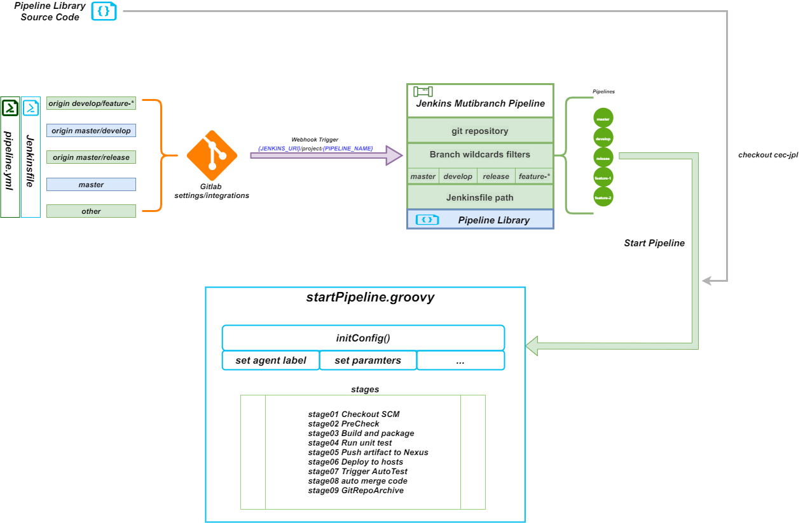
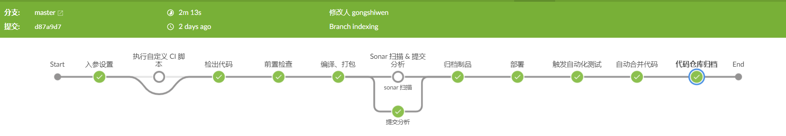

# jpl 设计

#### 源码结构

**Shared Library 的标准源码结构：**

```txt
.
├── pom.xml 项目依赖配置
├── resources 配置和资源文件
├── src 主要存放 groovy 类，执行流水线时，Jenkins 会将这些类加载到 classpath
├── test 单元测试
└── vars 流水线入口、流水线阶段和步骤的脚本，也是由 groovy 编写的，这些脚本会作为流水线的变量公开
```

#### 约定优于配置

整体上 `jpl` 采用 “约定优于配置”，让80%的项目接入几乎做到“0”配置，`jpl` 中“约定“：

- 打包描述文件 `pom.xml` 或 `package.json` 放在项目的根目录
- 默认部署路径为：`/app/ecdat/[web/server/jar]/{artifactId}`
- 后端项目的启停脚本打包后存在于 `./bin` 下，`startup.sh ${env}、shutdown.sh` 或 `app.sh start、app.sh stop`
- 项目遵循[《制品规范》](./pages/规范文档/制品规范)、[《语义版本规范》](./pages/规范文档/语义化版本控制规范)、[《代码仓库规范》](./pages/规范文档/代码仓库组织规范)、分支模型规范

##### 配置采用 yml 格式

> ​  最早的版本，出于处理简单，数据容易解析处理（groovy），`jpl`的配置文件采用 `json` 结构，但考虑到可读性、扩展性等，最终采用更流行的 `yml` 格式。

- YAML的可读性好
- YAML和脚本语言的交互性好
- YAML使用实现语言的数据类型
- YAML表达能力强，扩展性好

#### 执行流程




