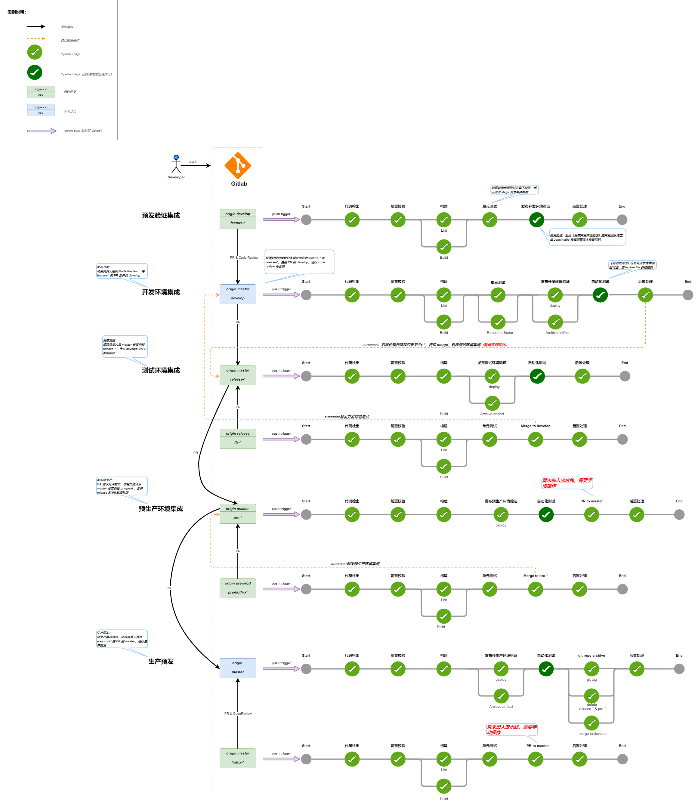

# 多分支流水线设计

#### 流水线阶段

#### 分支模型和多分支流水线

<!-- tabs:start -->

#### ** v2 **

*`表-2-1：多分支流水线（V2）`*

| 流水线名称        | 分支      | 分支类型 | 分支保护 | 是否归档制品 | buildId 起始 | 部署环境 | 成功后影响                          |
| ----------------- | --------- | -------- | -------- | ------------ | ------------ | -------- | ----------------------------------- |
| 开发预发验证      | feature-* | 临时     | 否       | 否           | 100          | DEV      | /                                   |
| 开发集成          | develop   | **永久** | **是**   | **是**       | 1000         | DEV      | /                                   |
| 测试集成          | release-* | 临时     | **是**   | **是**       | 300          | TEST     | /                                   |
| 测试集成  (BUG）  | fix-*     | 临时     | 否       | 否           | 500          | /        | PR & Merge 到 develop，触发开发集成 |
| 预生产集成        | pre-*     | 临时     | 否       | 否           | 700          | PROD     | PR 到 master                        |
| 预生产集成（BUG） | prefix-*  | 临时     | 否       | 否           | 800          | /        | PR 到 pre-*                         |
| 生产预发          | master    | **永久** | **是**   | **是**       | 5000         | PROD     | PR & Merge 到 develop，触发开发集成 |
| 生产预发（BUG）   | hotfix-*  | 临时     | 否       | 否           | 900          | /        | PR 到 master                        |

#### ** v3 **

*`表-2-2：多分支流水线（V3）`*

| 流水线名称       | 分支      | 分支类型 | 分支保护 | 是否归档制品 | 部署环境 | 成功后影响                          |
| ---------------- | --------- | -------- | -------- | ------------ | -------- | ----------------------------------- |
| 开发预发验证     | feature-* | 临时     | 否       | 否           | DEV      | /                                   |
| 开发集成         | develop   | **永久** | **是**   | 否           | DEV      | /                                   |
| 测试集成         | release-* | 临时     | **是**   | **是**       | TEST     | /                                   |
| 测试集成  (BUG） | fix-*     | 临时     | 否       | 否           | /        | PR & Merge 到 develop，触发开发集成 |
| 生产预发         | master    | **永久** | **是**   | 否           | PROD     | PR & Merge 到 develop，触发开发集成 |
| Hotfix           | hotfix-*  | 临时     | 否       | 否           | /        | 创建 release-* 分支                 |

<!-- tabs:end -->
