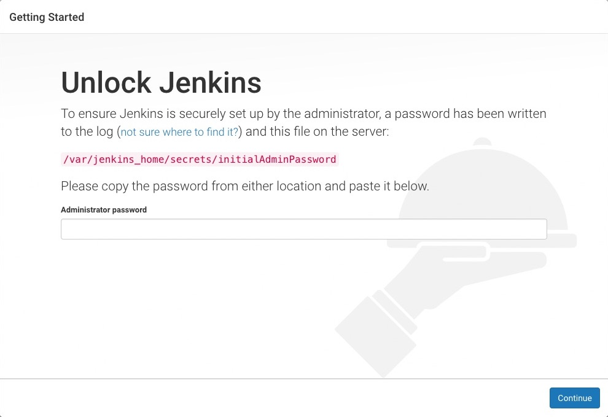
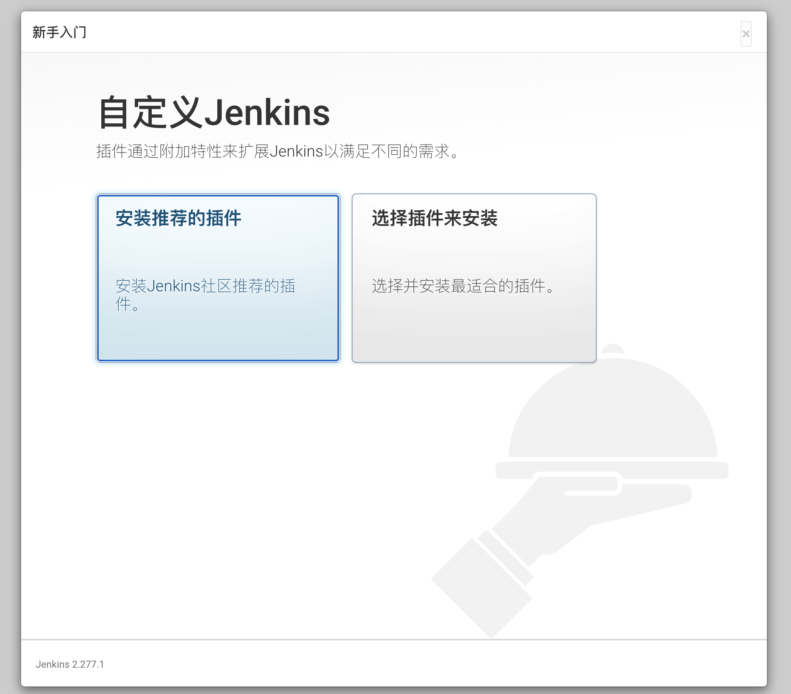
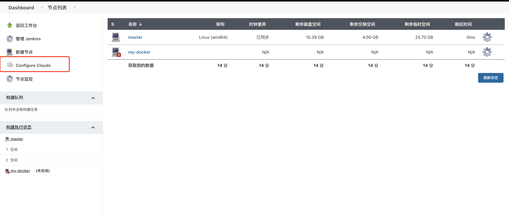
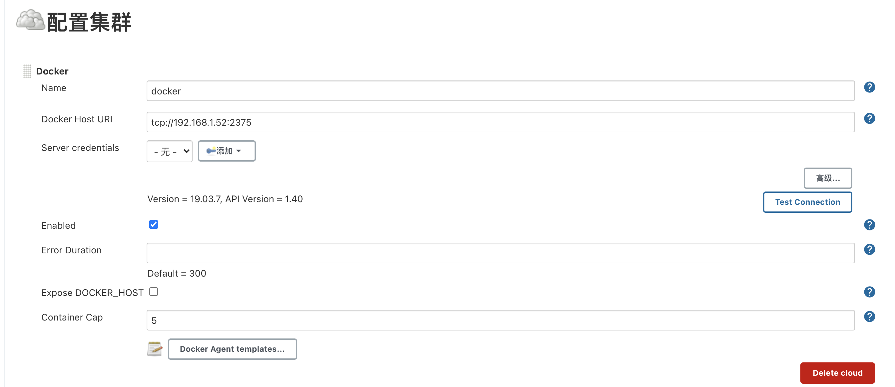
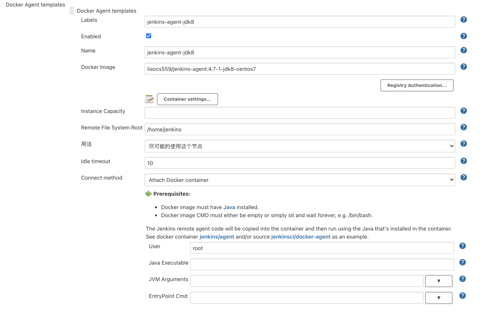

# Docker动态构建Jenkins Slave

## 引言

### 传统 Jenkins Slave 一主多从方式的痛点

我们知道持续构建与发布是我们日常工作中必不可少的一个步骤，目前大多公司都采用 Jenkins 集群来搭建符合需求的 CI/CD 流程，然而传统的 Jenkins Slave 一主多从方式会存在一些痛点，比如：

- 主 Master 发生单点故障时，整个流程都不可用了
- 每个 Slave 的配置环境不一样，来完成不同语言的编译打包等操作，但是这些差异化的配置导致管理起来非常不方便，维护起来也是比较费劲
- 资源分配不均衡，有的 Slave 要运行的 job 出现排队等待，而有的 Slave 处于空闲状态
- 资源有浪费，每台 Slave 可能是物理机或者虚拟机，当 Slave 处于空闲状态时，也不会完全释放掉资源。

### 动态的创建Jenkins Slave这种方式好处

- **服务高可用**，当 Jenkins Master 出现故障时，通过docker可快速恢复环境的可用
- **动态伸缩**，合理使用资源，每次运行 Job 时，会自动创建一个 Jenkins Slave，Job 完成后，Slave 自动注销并删除容器，资源自动释放。
- **统一环境**，通过docker容器，保持每个流水线执行环境一致
- **扩展性好**，当资源严重不足而导致 Job 排队等待时，可以很容易调整slave的数量，从而实现扩展。

## 系统要求

推荐配置：

- 8G可用内存
- 200G可用磁盘空间
- 4核CPU

## 先决条件

- 安装docker
- 宿主机创建jenkins用户

## Docker安装

**卸载旧版本**

```shell
sudo yum remove docker \
         docker-client \
         docker-client-latest \
         docker-common \
         docker-latest \
         docker-latest-logrotate \
         docker-logrotate \
         docker-engine
```

**设置仓库**

```shell
# 阿里云
sudo yum-config-manager \
  --add-repo \
  http:**//**mirrors.aliyun.com**/**docker-ce**/**linux**/**centos**/**docker-ce.repo
```

### 安装 Docker Engine-Community

安装最新版本的 Docker Engine-Community 和 containerd:

```shell
sudo yum install docker-ce docker-ce-cli containerd.io
```

启动 Docker

```shell
sudo systemctl start docker
```

通过运行 hello-world 映像来验证是否正确安装了 Docker Engine-Community 。

```shell
sudo docker run hello-world
```

## Jenkins Master节点安装

### docker-jenkins启动命令

拉取镜像

```shell
docker pull jenkinsci/blueocean:latest
```

启动容器

```shell
  docker run \
  --name jenkinsci-blueocean \
  -u root \
  -d \
  -p 49000:8080 \
  -p 50000:50000 \
  -v /home/jenkins:/var/jenkins_home \
  -v /var/run/docker.sock:/var/run/docker.sock \
  -v /etc/localtime:/etc/localtime \
  jenkinsci/blueocean
```

如果执行以上语句报如下错误：

```
docker: Error response from daemon: driver failed programming external connectivity on endpoint jenkinsci-blueocean (77b74a39bc59350ff7a47ed295018eb5eace6a77c8a1dcd08ce01fc091ff3d5f):  (iptables failed: iptables --wait -t nat -A DOCKER -p tcp -d 0/0 --dport 50000 -j DNAT --to-destination 172.17.0.2:50000 ! -i docker0: iptables: No chain/target/match by that name.
 (exit status 1)).
```

解决：重启docker

## 安装后设置向导

下载安装并运行Jenkins后，即将开始进入安装向导。

此安装向导会引导您完成几个快速“一次性”步骤来解锁Jenkins， 使用插件对其进行自定义，并创建第一个可以继续访问Jenkins的管理员用户。

### 解锁 Jenkins

当您第一次访问新的Jenkins实例时，系统会要求您使用自动生成的密码对其进行解锁。

1. 浏览到 `http://localhost:8080`（或安装时为Jenkins配置的任何端口），并等待 **解锁 Jenkins** 页面出现。



进入到docker容器中获取初始化密码：

```shell
# 进入到jenkinsci-blueocean容器
docker exec  -it jenkinsci-blueocean /bin/bash
# 获取初始密码
more /var/jenkins_home/secrets/initialAdminPassword
```

2.插件安装：选择“安装推荐的插件”



### 创建第一个管理员用户

最后，在[customizing Jenkins with plugins](https://www.jenkins.io/zh/doc/book/installing/#customizing-jenkins-with-plugins)之后，Jenkins要求您创建第一个管理员用户。 . 出现“ **创建第一个管理员用户** ”页面时， 请在各个字段中指定管理员用户的详细信息，然后单击 **保存完成** 。 . 当 **Jenkins准备好了** 出现时，单击*开始使用 Jenkins*。

**Notes:** * 这个页面可能显示 **Jenkins几乎准备好了!** 相反，如果是这样，请单击 **重启** 。 * 如果该页面在一分钟后不会自动刷新，请使用Web浏览器手动刷新页面。如果需要，请使用您刚刚创建的用户的凭据登录到Jenkins，并准备好开始使用Jenkins！

## Docker动态构建Jenkins Slave

### Docker plugin动态创建Jenkins Slave

#### **一、准备**

```
Docker plugin，Jenkins插件

liaocs559/jenkins-agent:4.7-1-jdk8-centos7，配合Docker plugin使用

10.10.2.33，提供docker环境的宿主机，用于运行slave节点
```

#### **二、具体实现**

##### **1.Slave节点宿主机配置**

```shell
# 拉取agent镜像
docker pull liaocs559/jenkins-agent:4.7-1-jdk8-centos7.1
```

##### **2.docker宿主机配置远程访问**

Slave节点宿主机要开启远程TCP访问，以便Master节点的Docker plugin能够远程访问

###### 开启配置

在/usr/lib/systemd/system/docker.service，配置远程访问。

主要是在[Service]这个部分，加上下面两个参数

```shell
[root@PUBLIC_IP ~]# vim /usr/lib/systemd/system/docker.service
[Service]
ExecStart=/usr/bin/dockerd  -H tcp://0.0.0.0:2375  -H unix:///var/run/docker.sock
```

重启

```shell
[root@PUBLIC_IP ~]# systemctl daemon-reload
[root@PUBLIC_IP ~]# systemctl restart docker
```

查看docker进程：

```
[root@slaver2 ~]# ps -ef|grep docker
root      44221      1  1 18:16 ?        00:00:06 /usr/bin/dockerd -H tcp://0.0.0.0:2375 -H unix://var/run/docker.sock
```

Docker守护进程打开一个HTTP Socket,这样才能实现远程通信

###### 简单实用：

查看镜像列表：

```shell
[root@PUBLIC_IP ~]# docker -H tcp://192.168.1.51:2375 images
CONTAINER ID        IMAGE                                COMMAND                  CREATED             STATUS              PORTS                                               NAMES
9889abad366e        jenkinsci/blueocean                  "/sbin/tini -- /usr/…"   2 weeks ago         Up 7 days           0.0.0.0:50000->50000/tcp, 0.0.0.0:49000->8080/tcp   jenkinsci-blueocean
2402b9c9309f        rancher/rke-tools:v0.1.56            "nginx-proxy CP_HOST…"   10 months ago       Up 7 days                                                               nginx-proxy
7704003768fc        rancher/hyperkube:v1.17.5-rancher1   "/opt/rke-tools/entr…"   10 months ago       Up 7 days                                                               kube-proxy
```

##### 3. Jenkins Master节点配置：

1. ###### 安装Docker plugin插件

2. ###### 配置插件

选择"系统管理"->"节点管理"：


选择Configure Clouds-docker:




###### 3. 配置docker cloud

"Docker Host URI" 是slave宿主机的tcp socket，master的docker plugin通过这个tcp连接对宿主的 docker环境进行操作。




4. ###### Docker Agent template配置



## FAQ

### Jenkins容器时间和宿主机不一致

#### 解决一：宿主机直接执行命令给某个容器同步时间

```shell
# 方法1：直接在宿主机操作
docker cp /etc/localtime 【容器ID或者NAME】:/etc/localtime
docker cp -L /usr/share/zoneinfo/Asia/Shanghai 【容器ID或者NAME】:/etc/localtime

# 方法2：登录容器同步时区timezone
ln -sf /usr/share/zoneinfo/Asia/Singapore /etc/localtime
```

适用场景：该方式适合在容器已经启动时使用

#### 解决二：docker run 添加时间参数

```shell
 docker run \
  --name jenkinsci-blueocean \
  -u root \
  -d \
  -p 49000:8080 \
  -p 50000:50000 \
  -v /home/jenkins:/var/jenkins_home \
  -v /var/run/docker.sock:/var/run/docker.sock \
  -v /etc/localtime:/etc/localtime \
  jenkinsci/blueocean
```

适用场景：该方式适合容器启动时使用

## jenkins时间与宿主机实际时间差8个小时

#### 解决方案一：通过jenkins命令行执行命令修改

登录jenkins进入到【系统管理页面】->【脚本命令行】中执行以下语句：

```shell
System.setProperty('org.apache.commons.jelly.tags.fmt.timeZone', 'Asia/Shanghai')
```

以上解决方案发现，过段时间又不对了，说明只是临时解决方案

#### 解决方案二：修改容器时区

```shell
#进入容器中
[root@localhost ~]# docker exec -it d7cfb7bb5fd0 /bin/bash
#修改时区
bash-5.0# echo  'Asia/Shanghai' > /etc/timezone
bash-5.0#  cat /etc/timezone
Asia/Shanghai
bash-5.0# exit
exit
# 重启容器
[root@localhost ~]# docker restart jenkinsci-blueocean
```

## 参考

Jenkins官网：https://www.jenkins.io/zh/doc/book/installing/

docker动态构建jenkins slave: https://www.toutiao.com/i6816270951391429128/

dokcer安装：https://www.runoob.com/docker/centos-docker-install.html

Docker容器时间如何与宿主机同步问题：https://segmentfault.com/a/1190000023624052