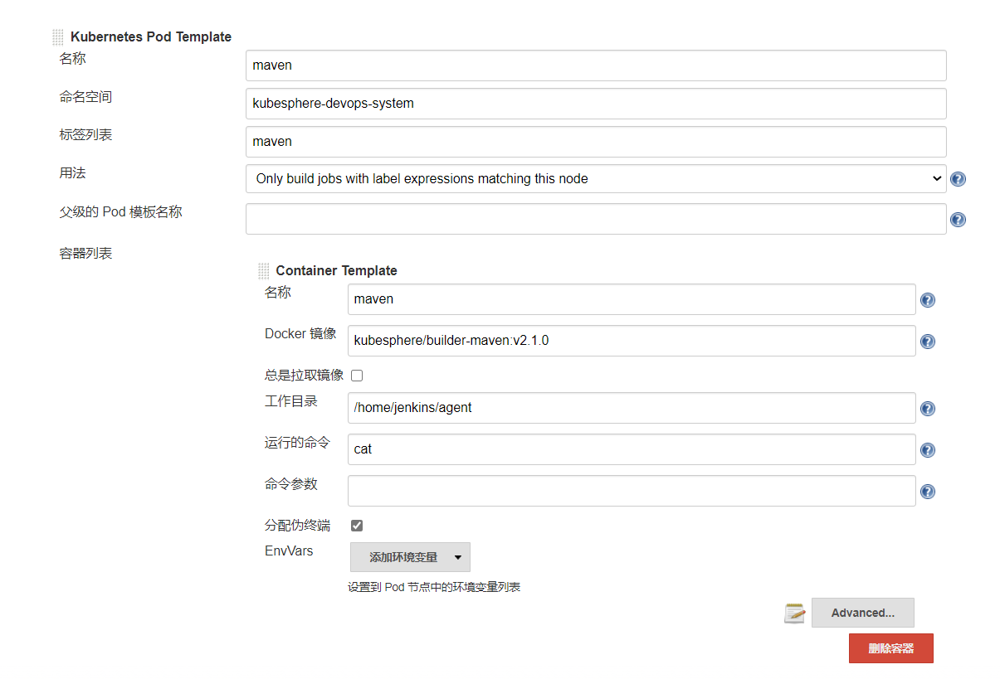

## 获取原有镜像构建的Dockerfile

> https://github.com/kubesphere/builder-maven/blob/master/Dockerfile

```shell
FROM kubespheredev/builder-base:latest

# java
RUN yum install -y java-1.8.0-openjdk-devel \
    java-1.8.0-openjdk-devel.i686

# maven
ENV MAVEN_VERSION 3.5.3
RUN curl -f -L http://central.maven.org/maven2/org/apache/maven/apache-maven/$MAVEN_VERSION/apache-maven-$MAVEN_VERSION-bin.tar.gz | tar -C /opt -xzv
ENV M2_HOME /opt/apache-maven-$MAVEN_VERSION
ENV maven.home $M2_HOME
ENV M2 $M2_HOME/bin
ENV PATH $M2:$PATH

# ant
ENV ANT_VERSION 1.10.7
RUN cd && \
    wget -q http://www.us.apache.org/dist//ant/binaries/apache-ant-${ANT_VERSION}-bin.tar.gz && \
    tar -xzf apache-ant-${ANT_VERSION}-bin.tar.gz && \
    mv apache-ant-${ANT_VERSION} /opt/ant && \
    rm apache-ant-${ANT_VERSION}-bin.tar.gz
ENV ANT_HOME /opt/ant
ENV PATH ${PATH}:/opt/ant/bin

# Set JDK to be 32bit
COPY set_java $M2
RUN $M2/set_java && rm $M2/set_java

CMD ["mvn","-version"]
```


修改成

```shell
FROM kubespheredev/builder-base:latest


# maven
ENV MAVEN_VERSION 3.6.3
COPY maven/pkg/apache-maven-${MAVEN_VERSION}-bin.tar.gz /opt
RUN tar -zxvf /opt/apache-maven-${MAVEN_VERSION}-bin.tar.gz -C /opt
ENV M2_HOME /opt/apache-maven-${MAVEN_VERSION}
ENV maven.home $M2_HOME
ENV M2 $M2_HOME/bin

# JDK jdk1.8.0_191
ENV JAVA_HOME /opt/jdk1.8.0_191
ENV JAVA $JAVA_HOME/bin
COPY maven/install_jdk $M2
COPY maven/uninstall_openjdk $M2
COPY maven/pkg/jdk-8u191-linux-x64.tar.gz $M2
RUN sh $M2/uninstall_openjdk
RUN tar -zxvf $M2/jdk-8u191-linux-x64.tar.gz -C /opt

ENV PATH $M2:$JAVA:$PATH

# Clean package

RUN rm /opt/apache-maven-${MAVEN_VERSION}-bin.tar.gz
RUN rm $M2/jdk-8u191-linux-x64.tar.gz

CMD ["mvn","-version"]

```

## 编译新的镜像

```shell
pipeline {
  agent {
    node {
      label 'base'
    }

  }
  stages {
    stage('build and tag image') {
      steps {
        container('base') {
          sh '''docker build -f maven/Dockerfile -t core.harbor.oa.com:10080/cecdatafj/builder-maven:latest .
docker tag core.harbor.oa.com:10080/cecdatafj/builder-maven:latest core.harbor.oa.com:10080/cecdatafj/builder-maven:latest'''
        }

      }
    }
    stage('docker push') {
      when{
        branch 'master'
      }
      steps {
        container('base') {
          withCredentials([usernamePassword(passwordVariable : 'DOCKER_PASSWORD' ,usernameVariable : 'DOCKER_USERNAME' ,credentialsId : 'harbor-id' ,)]) {
            sh 'echo "$DOCKER_PASSWORD" | docker login core.harbor.oa.com:10080 -u "$DOCKER_USERNAME" --password-stdin'
          }
            sh 'docker push core.harbor.oa.com:10080/cecdatafj/builder-maven:latest'
        }
      }
    }
  }
}

```


## 修改 Pod Template 中的镜像

> kubesphere/builder-maven:v2.1.0 修改成 core.harbor.oa.com:10080/cecdatafj/builder-maven:latest

