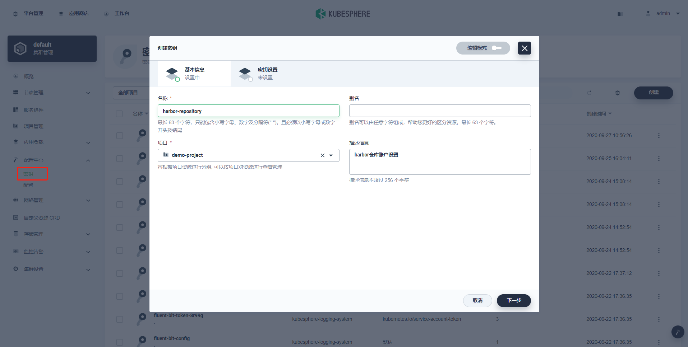

# 离线安装Harbor

## 1. 前提准备

### 1.1 安装依赖

[安装docker]()

[安装docker compose]()

### 1.2 下载离线包

> [GIthub Habor Release](https://github.com/goharbor/harbor/releases)
>
> [速度较慢可以使用Github镜像站](https://github.rc1844.workers.dev/)

```shell
wget -b https://github.com/goharbor/harbor/releases/download/v2.1.0/harbor-offline-installer-v2.1.0.tgz
```


## 2. 生成自签证书

> [参见](https://kubesphere.com.cn/forum/d/1150-harbor-https)

### 2.1 创建 CA 证书

- 生成 CA 证书私钥

```bash
mkdir -p /cert/harbor.oa.com
cd /cert/harbor.oa.com
openssl genrsa -out ca.key 4096
```

- 生成证书

```bash
openssl req -x509 -new -nodes -sha512 -days 3650 \
 -subj "/C=CN/ST=Beijing/L=Beijing/O=example/OU=Personal/CN=oa.com" \
 -key ca.key \
 -out ca.crt
```

### 2.2 创建域名证书

- 生成私钥

```bash
openssl genrsa -out harbor.oa.com.key 4096
```

- 生成证书签名请求 CSR

```bash
openssl req -sha512 -new \
    -subj "/C=CN/ST=Beijing/L=Beijing/O=example/OU=Personal/CN=oa.com" \
    -key harbor.oa.com.key \
    -out harbor.oa.com.csr
```

- 生成 x509 v3 扩展

```bash
cat > v3.ext <<-EOF
authorityKeyIdentifier=keyid,issuer
basicConstraints=CA:FALSE
keyUsage = digitalSignature, nonRepudiation, keyEncipherment, dataEncipherment
extendedKeyUsage = serverAuth
subjectAltName = @alt_names

[alt_names]
DNS.1=harbor.oa.com
DNS.2=*.harbor.oa.com
DNS.3=hostname
EOF
```

- 创建 Harbor 访问证书

```bash
openssl x509 -req -sha512 -days 3650 \
    -extfile v3.ext \
    -CA ca.crt -CAkey ca.key -CAcreateserial \
    -in harbor.oa.com.csr \
    -out harbor.oa.com.crt
```

- 将 crt 转换为 cert ，以供 Docker 使用

```bash
openssl x509 -inform PEM -in harbor.oa.com.crt -out harbor.oa.com.cert
```

最终在目录下得到如下文件：

```bash
ls
ca.crt  ca.key  ca.srl  harbor.oa.com.cert  harbor.oa.com.crt  harbor.oa.com.csr  harbor.oa.com.key  v3.ext
```

## 3. 安装Harbor

### 3.1 修改配置文件

```shell
tar zxf /opt/harbor-offline-installer-v2.1.0.tgz  -C /usr/local/
cd /usr/local/harbor
cp harbor.yml.tmpl harbor.yml
vi harbor.yml
```

```shell
# Configuration file of Harbor

# The IP address or hostname to access admin UI and registry service.
# DO NOT use localhost or 127.0.0.1, because Harbor needs to be accessed by external clients.
hostname: 192.168.1.52

# http related config
http:
  # port for http, default is 80. If https enabled, this port will redirect to https port
  port: 10080

# https related config
https:
  # https port for harbor, default is 443
  port: 443
  # The path of cert and key files for nginx
  certificate: /cert/harbor.oa.com/harbor.oa.com.crt
  private_key: /cert/harbor.oa.com/harbor.oa.com.key

# # Uncomment following will enable tls communication between all harbor components
# internal_tls:
#   # set enabled to true means internal tls is enabled
#   enabled: true
#   # put your cert and key files on dir
#   dir: /etc/harbor/tls/internal

# Uncomment external_url if you want to enable external proxy
# And when it enabled the hostname will no longer used
# external_url: https://reg.mydomain.com:8433

# The initial password of Harbor admin
# It only works in first time to install harbor
# Remember Change the admin password from UI after launching Harbor.
harbor_admin_password: Harbor12345

# Harbor DB configuration
database:
  # The password for the root user of Harbor DB. Change this before any production use.
  password: root123
  # The maximum number of connections in the idle connection pool. If it <=0, no idle connections are retained.
  max_idle_conns: 50
  # The maximum number of open connections to the database. If it <= 0, then there is no limit on the number of open connections.
  # Note: the default number of connections is 1024 for postgres of harbor.
  max_open_conns: 1000

# The default data volume
data_volume: /data/harbor-data

# Log configurations
log:
  # options are debug, info, warning, error, fatal
  level: info
  # configs for logs in local storage
  local:
    # Log files are rotated log_rotate_count times before being removed. If count is 0, old versions are removed rather than rotated.
    rotate_count: 50
    # Log files are rotated only if they grow bigger than log_rotate_size bytes. If size is followed by k, the size is assumed to be in kilobytes.
    # If the M is used, the size is in megabytes, and if G is used, the size is in gigabytes. So size 100, size 100k, size 100M and size 100G
    # are all valid.
    rotate_size: 200M
    # The directory on your host that store log
    location: /var/log/harbor
```

### 3.2 执行安装命令

```shell
./install.sh
```

## 4. 配置及使用

### 3.1 页面访问

配置 hosts 之后，通过 [https://core.harbor.oa.com](https://core.harbor.oa.com/) 访问：

[](https://kubesphere.com.cn/forum/assets/files/2020-04-18/1587218682-743031-harbor-oa-error.png)

这是因为自签的证书不被信任。我们需要将 harbor.oa.com.crt 证书导入系统，下面以 OS X 系统为例：

将证书保存一份到本地，拖拽到 Keychain 中，然后双击证书，设置为 Always Trust 。如下图：

[](https://kubesphere.com.cn/forum/assets/files/2020-04-18/1587218701-660568-harbor-cert-keychain.png)

再次访问时，就可以正常打开页面登陆。

[](https://kubesphere.com.cn/forum/assets/files/2020-04-18/1587218712-406013-harbor-https-dashboard.png)

### 3.2 Docker 访问

> **在每个节点配置**

- docker信任配置

> 要让docker可以访问harbor，需要将harbor域名或IP设置为docker的受信任仓库，修改配置文件 /etc/docker/daemon.json ，增加docker受信任IP或域名。

```
vi  /etc/docker/daemon.json
```

追加内容：

```
{
    "insecure-registries": ["core.harbor.oa.com:10080"]
}
```

- 将拷贝证书至 Docker 的证书配置目录

```bash
mkdir -p /etc/docker/certs.d/core.harbor.oa.com:10080/
cd /cert/harbor.oa.com:10080
cp harbor.oa.com.cert /etc/docker/certs.d/core.harbor.oa.com/
cp harbor.oa.com.key /etc/docker/certs.d/core.harbor.oa.com/
cp ca.crt /etc/docker/certs.d/core.harbor.oa.com/
```

这里的 core.harbor.oa.com 目录一定要与服务保持一致，如果有端口，也应该用 `:` 连接带上。

- 重启docker和harbor

  ```shell
  #重启docker
  systemctl daemon-reload
  systemctl restart docker.service
  # 重启harbor
  cd /usr/local/harbor
  ./prepare
  docker-compose down
  docker-compose up -d
  ```

  

- 登陆 core.harbor.oa.com

```bash
docker login core.harbor.oa.com:10080 -u admin -p Harbor12345
WARNING! Using --password via the CLI is insecure. Use --password-stdin.
WARNING! Your password will be stored unencrypted in /root/.docker/config.json.
Configure a credential helper to remove this warning. See
https://docs.docker.com/engine/reference/commandline/login/#credentials-store

Login Succeeded
```

- 推送镜像

```bash
# load 镜像
docker load < hello_world.tar
Loaded image ID: sha256:bf756fb1ae65adf866bd8c456593cd24beb6a0a061dedf42b26a993176745f6b
# 打tag
docker tag bf756fb1ae65 core.harbor.oa.com:10080/library/hellp-world:v1.0.0
# 推送
docker push core.harbor.oa.com:10080/library/hellp-world:v1.0.0
```

- 页面查看推送的镜像
 

由于推送之后，我又删除本地镜像，再次拉取，这里的下载次数为 1 。

### 3.3 KubeSphere添加Harbor仓库

> **配置中心 > 密钥**




# ref

- [ 安装harbor](https://blog.csdn.net/ZHONGZEWEI/article/details/106869179)
- [离线安装harbor](https://www.cnblogs.com/yyee/p/13121272.html)
- [Github镜像站](https://github.rc1844.workers.dev/)
- [KubeSphere添加Harbor](https://v2-1.docs.kubesphere.io/docs/zh-CN/configuration/image-registry/)