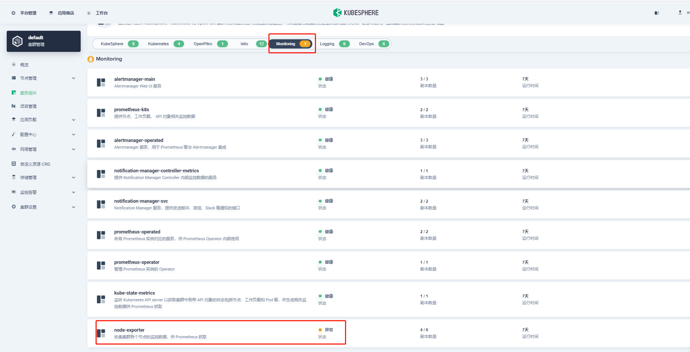
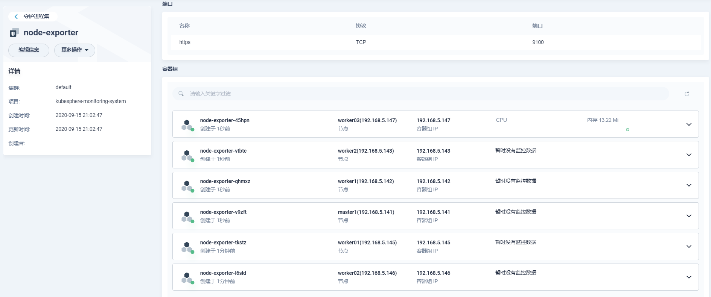
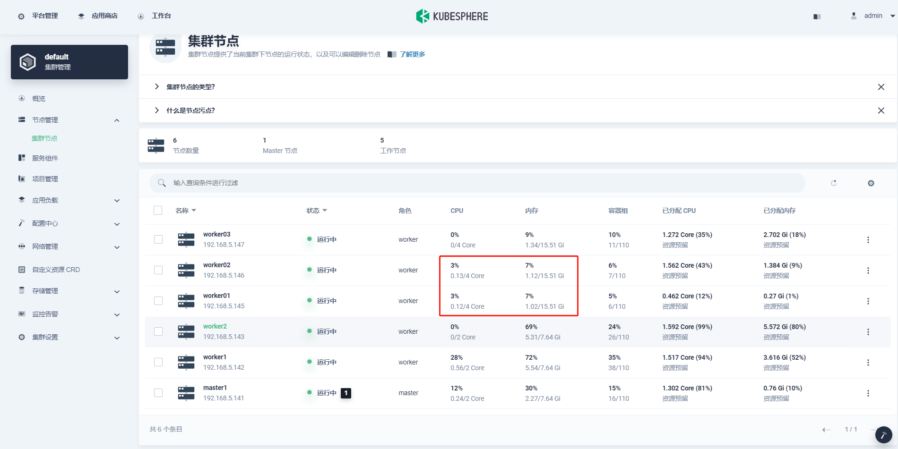

## 版本

**KubeSphere ：v3.0.0**

**Kubenetes ：v1.18.6**


## 问题概述

添加worker节点成功后，KubeSphere Console 上看不到节点的资源信息。


## 现象

### console上查看

**集群节点看不到节点的资源信息**


**Monitoring服务组件状态异常**




### 日志

**查看容器日志**

```shell
time="2020-09-22T01:12:45Z" level=info msg="Listening on 127.0.0.1:9100" source="node_exporter.go:170"

time="2020-09-22T01:12:45Z" level=fatal msg="listen tcp 127.0.0.1:9100: bind: address already in use" source="node_exporter.go:172"
```

> **bind: address already in use**
>
> 初步定位是重复启动异常，之前的进程占用端口


## 解决

### 查看端口是否监听

```shell
[root@worker02 ~]# netstat -anp | grep 9100
tcp6       0      0 :::9100                 :::*                    LISTEN      2315/node_exporter
tcp6       0      0 192.168.5.146:9100      192.168.5.142:43266     TIME_WAIT   -
tcp6       0      0 192.168.5.146:9100      192.168.6.150:64030     ESTABLISHED 2315/node_exporter
tcp6       0      0 192.168.5.146:9100      192.168.5.143:51354     TIME_WAIT   -
```

### 找到占用端口的进程

```shell
[root@worker02 ~]# lsof -i:9100
COMMAND    PID USER   FD   TYPE DEVICE SIZE/OFF NODE NAME
node_expo 2315 root    3u  IPv6  30219      0t0  TCP *:jetdirect (LISTEN)
node_expo 2315 root    5u  IPv6  62983      0t0  TCP worker02:jetdirect->192.168.6.150:64030 (ESTABLISHED)
```

### 查看进程信息

```shell
[root@worker02 ~]# ps -ef | grep 2315
root      2315     1  0 Sep21 ?        00:02:13 /usr/local/bin/node_exporter
root      6896 14920  0 09:21 pts/0    00:00:00 grep --color=auto 2315
```

> 当前是时间是Sep 22 9:22，端口占用很久

### kill 进程

```shell
[root@worker02 ~]# kill -9 2315
```

### 重新部署


#### 恢复正常



