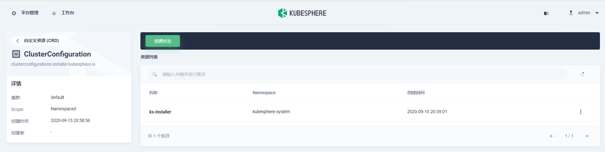
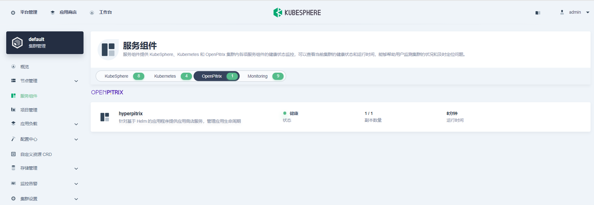

# KubeSphere应用商店

> KubeSphere为用户提供了基于Helm的应用商店，[用于在 OpenPitrix](https://github.com/openpitrix/openpitrix)后面进行应用程序生命周期管理，这是一个基于开源的基于 Web 的系统，用于打包、部署和管理不同类型的应用程序。 KubeSphere App Store 允许 ISVs、开发人员和用户在一站式商店中只需单击几下即可上传、测试、部署和发布应用程序。
>
> 在内部，KubeSphere 应用商店可以作为不同团队共享数据、中间件和办公室应用程序的地方。从外部看，它有利于制定建筑和交付的行业标准。默认情况下，应用商店中有 15 个应用。启用此功能后，可以使用应用模板添加更多应用。


## 安装前启用应用商店

### 在 Linux 上安装

编辑`config-sample.yaml` 。完成后保存文件。

```
openpitrix:
    enabled: true # Change "false" to "true"
```

使用配置文件创建群集：

```
./kk create cluster -f config-sample.yaml
```

### **在Kubenetes安装**

> [参见](https://kubesphere.com.cn/en/docs/pluggable-components/app-store/)


## 安装后启用应用商店

登录控制台。单击**左**上角的平台并选择**群集管理**。


单击**CRD**并在搜索栏中输入`clusterconfiguration`。

在`ks-installer`，单击右侧的三个点，然后选择编辑**YAML**




在此 yaml 文件中，编辑以下 。完成后，单击**右**下角的"更新"以保存配置。

```
openpitrix:
    enabled: true # Change "false" to "true"
```

使用 Web kubectl 通过执行以下命令来检查安装过程：

```
kubectl logs -n kubesphere-system $(kubectl get pod -n kubesphere-system -l app=ks-install -o jsonpath='{.items[0].metadata.name}') -f
```

> 提示
>
> 您可以通过单击控制台右下角的锤子图标来查找 Web kubectl 工具


## 验证组件的安装

<!-- tabs:start -->

#### ** 在KubeSphere控制台确认 **




#### ** 使用kubectl命令确认 **

```shell
# kubectl get pod -n openpitrix-system
NAME                                                 READY   STATUS      RESTARTS   AGE
hyperpitrix-generate-kubeconfig-f8xp9                0/2     Completed   0          8m24s
hyperpitrix-release-app-job-cbmkk                    0/1     Completed   0          8m26s
openpitrix-hyperpitrix-deployment-5b585565cb-m9s6r   1/1     Running     0          8m28s
```


<!-- tabs:end -->