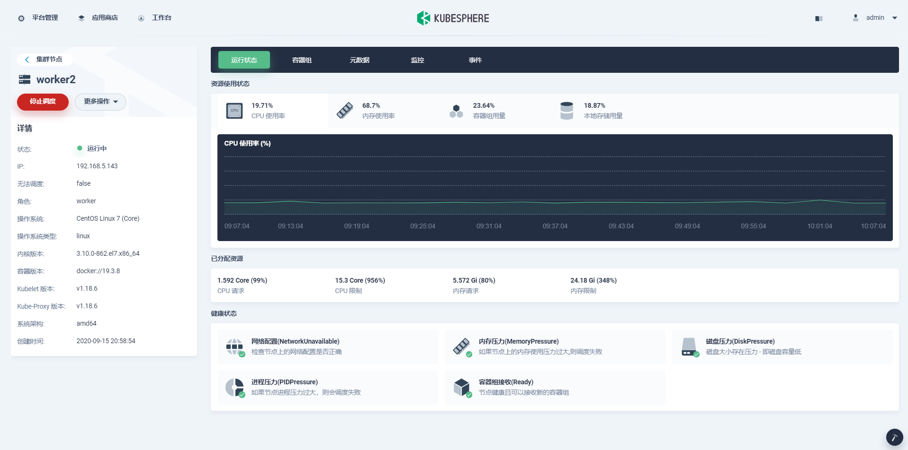

## 添加节点

> 添加新节点时，不允许修改原始节点（例如master1）的主机名。

下面介绍添加三个个节点 worker01，worker02，worker03

### 修改配置文件

```yaml
spec:
  hosts:
  - {name: master1, address: 192.168.5.141, internalAddress: 192.168.5.141, password: xxx}
  - {name: worker1, address: 192.168.5.142, internalAddress: 192.168.5.142, password: xxx}
  - {name: worker2, address: 192.168.5.143, internalAddress: 192.168.5.143, password: xxx}
  - {name: worker01, address: 192.168.5.145, internalAddress: 192.168.5.145, password: xxx}
  - {name: worker02, address: 192.168.5.146, internalAddress: 192.168.5.146, password: xxx}
  - {name: worker03, address: 192.168.5.147, internalAddress: 192.168.5.147, password: xxx}
  roleGroups:
    etcd:
    - master1
    master:
    - master1
    worker:
    - worker1
    - worker2
    - worker01
    - worker02
    - worker03
```

### 执行Add-node 命令

```she
./kk add nodes -f config-v1.18.6-v3-addworkernodes.yaml
```

### 查看节点

```shell
[root@master1 kubesphere]# kubectl get node
NAME       STATUS   ROLES    AGE     VERSION
master1    Ready    master   5d20h   v1.18.6
worker01   Ready    worker   3m29s   v1.18.6
worker02   Ready    worker   3m29s   v1.18.6
worker03   Ready    worker   3m29s   v1.18.6
worker1    Ready    worker   5d20h   v1.18.6
worker2    Ready    worker   5d20h   v1.18.6
```


## 删除节点

### 停止调度节点

将节点标记为不可调度可防止调度程序将新的容器放置到该节点上，但不会影响该节点上的现有容器。 这对于节点重新引导或其他维护之前的准备步骤很有用。

若要将节点标记为不可调度，可以从菜单中选择 **节点管理→群集节点 **，然后找到要从群集中删除的节点，然后单击**停止调度**按钮。 它与命令`kubectl cordon $NODENAME`具有相同的效果，有关更多详细信息，请参见[Kubernetes Nodes](https://kubernetes.io/docs/concepts/architecture/nodes/)。




> 注意：作为DaemonSet一部分的Pod可以在无法调度的节点上运行。 守护程序集通常提供应在节点上运行的节点本地服务，即使正在耗尽工作负载应用程序也是如此。

### 删除节点

您可以通过以下命令删除节点：

```
./kk delete node worker1 -f config-v1.18.6-v3-addworkernodes.yaml
```


# 附录

### 问题

[节点资源信息无法读取：node-exporter启动异常]()

### 添加节点完整日志

```she
+----------+------+------+---------+----------+-------+-------+-----------+--------+------------+-------------+------------------+--------------+
| name     | sudo | curl | openssl | ebtables | socat | ipset | conntrack | docker | nfs client | ceph client | glusterfs client | time         |
+----------+------+------+---------+----------+-------+-------+-----------+--------+------------+-------------+------------------+--------------+
| master1  | y    | y    | y       | y        | y     | y     | y         | y      | y          |             | y                | CST 16:51:32 |
| worker1  | y    | y    | y       | y        | y     | y     | y         | y      | y          |             | y                | CST 16:51:32 |
| worker03 | y    | y    | y       | y        | y     | y     | y         |        | y          |             | y                | CST 16:51:32 |
| worker2  | y    | y    | y       | y        | y     | y     | y         | y      | y          |             | y                | CST 16:51:32 |
| worker01 | y    | y    | y       | y        | y     | y     | y         |        | y          |             | y                | CST 16:51:32 |
| worker02 | y    | y    | y       | y        | y     | y     | y         |        | y          |             | y                | CST 16:51:32 |
+----------+------+------+---------+----------+-------+-------+-----------+--------+------------+-------------+------------------+--------------+

This is a simple check of your environment.
Before installation, you should ensure that your machines meet all requirements specified at
https://github.com/kubesphere/kubekey#requirements-and-recommendations

Continue this installation? [yes/no]: yes
INFO[16:51:36 CST] Downloading Installation Files
INFO[16:51:36 CST] Downloading kubeadm ...
INFO[16:51:36 CST] Downloading kubelet ...
INFO[16:51:36 CST] Downloading kubectl ...
INFO[16:51:36 CST] Downloading kubecni ...
INFO[16:51:36 CST] Downloading helm ...
INFO[16:51:37 CST] Configurating operating system ...
[worker03 192.168.5.147] MSG:
net.ipv4.ip_forward = 1
net.bridge.bridge-nf-call-arptables = 1
net.bridge.bridge-nf-call-ip6tables = 1
net.bridge.bridge-nf-call-iptables = 1
net.ipv4.ip_local_reserved_ports = 30000-32767
[worker01 192.168.5.145] MSG:
net.ipv4.ip_forward = 1
net.bridge.bridge-nf-call-arptables = 1
net.bridge.bridge-nf-call-ip6tables = 1
net.bridge.bridge-nf-call-iptables = 1
net.ipv4.ip_local_reserved_ports = 30000-32767
[worker02 192.168.5.146] MSG:
net.ipv4.ip_forward = 1
net.bridge.bridge-nf-call-arptables = 1
net.bridge.bridge-nf-call-ip6tables = 1
net.bridge.bridge-nf-call-iptables = 1
net.ipv4.ip_local_reserved_ports = 30000-32767
[worker1 192.168.5.142] MSG:
net.ipv4.ip_forward = 1
net.bridge.bridge-nf-call-arptables = 1
net.bridge.bridge-nf-call-ip6tables = 1
net.bridge.bridge-nf-call-iptables = 1
net.ipv4.ip_local_reserved_ports = 30000-32767
[master1 192.168.5.141] MSG:
net.ipv4.ip_forward = 1
net.bridge.bridge-nf-call-arptables = 1
net.bridge.bridge-nf-call-ip6tables = 1
net.bridge.bridge-nf-call-iptables = 1
net.ipv4.ip_local_reserved_ports = 30000-32767
[worker2 192.168.5.143] MSG:
net.ipv4.ip_forward = 1
net.bridge.bridge-nf-call-arptables = 1
net.bridge.bridge-nf-call-ip6tables = 1
net.bridge.bridge-nf-call-iptables = 1
net.ipv4.ip_local_reserved_ports = 30000-32767
INFO[16:51:40 CST] Installing docker ...
INFO[16:53:07 CST] Start to download images on all nodes
[worker03] Downloading image: kubesphere/pause:3.2
[worker1] Downloading image: kubesphere/pause:3.2
[master1] Downloading image: kubesphere/etcd:v3.3.12
[worker01] Downloading image: kubesphere/pause:3.2
[worker2] Downloading image: kubesphere/pause:3.2
[worker02] Downloading image: kubesphere/pause:3.2
[worker2] Downloading image: kubesphere/kube-proxy:v1.18.6
[worker1] Downloading image: kubesphere/kube-proxy:v1.18.6
[master1] Downloading image: kubesphere/pause:3.2
[master1] Downloading image: kubesphere/kube-apiserver:v1.18.6
[worker1] Downloading image: coredns/coredns:1.6.9
[worker2] Downloading image: coredns/coredns:1.6.9
[worker1] Downloading image: kubesphere/k8s-dns-node-cache:1.15.12
[master1] Downloading image: kubesphere/kube-controller-manager:v1.18.6
[worker1] Downloading image: calico/kube-controllers:v3.15.1
[worker01] Downloading image: kubesphere/kube-proxy:v1.18.6
[master1] Downloading image: kubesphere/kube-scheduler:v1.18.6
[worker2] Downloading image: kubesphere/k8s-dns-node-cache:1.15.12
[master1] Downloading image: kubesphere/kube-proxy:v1.18.6
[worker1] Downloading image: calico/cni:v3.15.1
[worker1] Downloading image: calico/node:v3.15.1
[master1] Downloading image: coredns/coredns:1.6.9
[worker2] Downloading image: calico/kube-controllers:v3.15.1
[master1] Downloading image: kubesphere/k8s-dns-node-cache:1.15.12
[worker1] Downloading image: calico/pod2daemon-flexvol:v3.15.1
[worker02] Downloading image: kubesphere/kube-proxy:v1.18.6
[master1] Downloading image: calico/kube-controllers:v3.15.1
[worker2] Downloading image: calico/cni:v3.15.1
[master1] Downloading image: calico/cni:v3.15.1
[worker2] Downloading image: calico/node:v3.15.1
[master1] Downloading image: calico/node:v3.15.1
[master1] Downloading image: calico/pod2daemon-flexvol:v3.15.1
[worker2] Downloading image: calico/pod2daemon-flexvol:v3.15.1
[worker03] Downloading image: kubesphere/kube-proxy:v1.18.6
[worker01] Downloading image: coredns/coredns:1.6.9
[worker02] Downloading image: coredns/coredns:1.6.9
[worker01] Downloading image: kubesphere/k8s-dns-node-cache:1.15.12
[worker02] Downloading image: kubesphere/k8s-dns-node-cache:1.15.12
[worker03] Downloading image: coredns/coredns:1.6.9
[worker03] Downloading image: kubesphere/k8s-dns-node-cache:1.15.12
[worker02] Downloading image: calico/kube-controllers:v3.15.1
[worker01] Downloading image: calico/kube-controllers:v3.15.1
[worker03] Downloading image: calico/kube-controllers:v3.15.1
[worker02] Downloading image: calico/cni:v3.15.1
[worker03] Downloading image: calico/cni:v3.15.1
[worker01] Downloading image: calico/cni:v3.15.1
[worker02] Downloading image: calico/node:v3.15.1
[worker01] Downloading image: calico/node:v3.15.1
[worker03] Downloading image: calico/node:v3.15.1
[worker02] Downloading image: calico/pod2daemon-flexvol:v3.15.1
[worker01] Downloading image: calico/pod2daemon-flexvol:v3.15.1
[worker03] Downloading image: calico/pod2daemon-flexvol:v3.15.1
INFO[16:59:28 CST] Generating etcd certs
INFO[16:59:29 CST] Synchronizing etcd certs
INFO[16:59:29 CST] Creating etcd service
INFO[16:59:33 CST] Starting etcd cluster
[master1 192.168.5.141] MSG:
Configuration file already exists
Waiting for etcd to start
INFO[16:59:39 CST] Refreshing etcd configuration
INFO[16:59:39 CST] Get cluster status
[master1 192.168.5.141] MSG:
Cluster already exists.
[master1 192.168.5.141] MSG:
v1.18.6
[master1 192.168.5.141] MSG:
I0921 16:59:41.968611   15991 version.go:252] remote version is much newer: v1.19.2; falling back to: stable-1.18
W0921 16:59:44.008018   15991 configset.go:202] WARNING: kubeadm cannot validate component configs for API groups [kubelet.config.k8s.io kubeproxy.config.k8s.io]
[upload-certs] Storing the certificates in Secret "kubeadm-certs" in the "kube-system" Namespace
[upload-certs] Using certificate key:
930a276735de408fde424172805a7dc67a960f3c153186c74a109a36e8010cc2
[master1 192.168.5.141] MSG:
secret/kubeadm-certs patched
[master1 192.168.5.141] MSG:
secret/kubeadm-certs patched
[master1 192.168.5.141] MSG:
secret/kubeadm-certs patched
[master1 192.168.5.141] MSG:
W0921 16:59:45.043094   16258 configset.go:202] WARNING: kubeadm cannot validate component configs for API groups [kubelet.config.k8s.io kubeproxy.config.k8s.io]
kubeadm join lb.kubesphere.local:6443 --token jy8nw4.ngwf2777qr9dtjqg     --discovery-token-ca-cert-hash sha256:eea4b8498e6e94c4ee40349f418f0e1f96a90678375c9446d39cc1cc4e74cdc1
[master1 192.168.5.141] MSG:
NAME      STATUS   ROLES    AGE     VERSION   INTERNAL-IP     EXTERNAL-IP   OS-IMAGE                KERNEL-VERSION          CONTAINER-RUNTIME
master1   Ready    master   5d20h   v1.18.6   192.168.5.141   <none>        CentOS Linux 7 (Core)   3.10.0-862.el7.x86_64   docker://19.3.8
worker1   Ready    worker   5d20h   v1.18.6   192.168.5.142   <none>        CentOS Linux 7 (Core)   3.10.0-862.el7.x86_64   docker://19.3.8
worker2   Ready    worker   5d20h   v1.18.6   192.168.5.143   <none>        CentOS Linux 7 (Core)   3.10.0-862.el7.x86_64   docker://19.3.8
INFO[16:59:45 CST] Installing kube binaries
Push /opt/k8s/kubesphere/kubekey/v1.18.6/amd64/kubeadm to 192.168.5.147:/tmp/kubekey/kubeadm   Done
Push /opt/k8s/kubesphere/kubekey/v1.18.6/amd64/kubeadm to 192.168.5.145:/tmp/kubekey/kubeadm   Done
Push /opt/k8s/kubesphere/kubekey/v1.18.6/amd64/kubeadm to 192.168.5.146:/tmp/kubekey/kubeadm   Done
Push /opt/k8s/kubesphere/kubekey/v1.18.6/amd64/kubelet to 192.168.5.145:/tmp/kubekey/kubelet   Done
Push /opt/k8s/kubesphere/kubekey/v1.18.6/amd64/kubelet to 192.168.5.147:/tmp/kubekey/kubelet   Done
Push /opt/k8s/kubesphere/kubekey/v1.18.6/amd64/kubelet to 192.168.5.146:/tmp/kubekey/kubelet   Done
Push /opt/k8s/kubesphere/kubekey/v1.18.6/amd64/kubectl to 192.168.5.145:/tmp/kubekey/kubectl   Done
Push /opt/k8s/kubesphere/kubekey/v1.18.6/amd64/kubectl to 192.168.5.146:/tmp/kubekey/kubectl   Done
Push /opt/k8s/kubesphere/kubekey/v1.18.6/amd64/kubectl to 192.168.5.147:/tmp/kubekey/kubectl   Done
Push /opt/k8s/kubesphere/kubekey/v1.18.6/amd64/helm to 192.168.5.145:/tmp/kubekey/helm   Done
Push /opt/k8s/kubesphere/kubekey/v1.18.6/amd64/helm to 192.168.5.146:/tmp/kubekey/helm   Done
Push /opt/k8s/kubesphere/kubekey/v1.18.6/amd64/helm to 192.168.5.147:/tmp/kubekey/helm   Done
Push /opt/k8s/kubesphere/kubekey/v1.18.6/amd64/cni-plugins-linux-amd64-v0.8.6.tgz to 192.168.5.145:/tmp/kubekey/cni-plugins-linux-amd64-v0.8.6.tgz   Done
Push /opt/k8s/kubesphere/kubekey/v1.18.6/amd64/cni-plugins-linux-amd64-v0.8.6.tgz to 192.168.5.147:/tmp/kubekey/cni-plugins-linux-amd64-v0.8.6.tgz   Done
Push /opt/k8s/kubesphere/kubekey/v1.18.6/amd64/cni-plugins-linux-amd64-v0.8.6.tgz to 192.168.5.146:/tmp/kubekey/cni-plugins-linux-amd64-v0.8.6.tgz   Done
INFO[16:59:49 CST] Joining nodes to cluster
[worker02 192.168.5.146] MSG:
W0921 16:59:49.950870    5295 join.go:346] [preflight] WARNING: JoinControlPane.controlPlane settings will be ignored when control-plane flag is not set.
[preflight] Running pre-flight checks
[preflight] Reading configuration from the cluster...
[preflight] FYI: You can look at this config file with 'kubectl -n kube-system get cm kubeadm-config -oyaml'
W0921 16:59:50.361084    5295 utils.go:26] The recommended value for "clusterDNS" in "KubeletConfiguration" is: [10.233.0.10]; the provided value is: [169.254.25.10]
[kubelet-start] Downloading configuration for the kubelet from the "kubelet-config-1.18" ConfigMap in the kube-system namespace
[kubelet-start] Writing kubelet configuration to file "/var/lib/kubelet/config.yaml"
[kubelet-start] Writing kubelet environment file with flags to file "/var/lib/kubelet/kubeadm-flags.env"
[kubelet-start] Starting the kubelet
[kubelet-start] Waiting for the kubelet to perform the TLS Bootstrap...

This node has joined the cluster:
* Certificate signing request was sent to apiserver and a response was received.
* The Kubelet was informed of the new secure connection details.

Run 'kubectl get nodes' on the control-plane to see this node join the cluster.
[worker03 192.168.5.147] MSG:
W0921 16:59:49.750850    5362 join.go:346] [preflight] WARNING: JoinControlPane.controlPlane settings will be ignored when control-plane flag is not set.
[preflight] Running pre-flight checks
[preflight] Reading configuration from the cluster...
[preflight] FYI: You can look at this config file with 'kubectl -n kube-system get cm kubeadm-config -oyaml'
W0921 16:59:50.194606    5362 utils.go:26] The recommended value for "clusterDNS" in "KubeletConfiguration" is: [10.233.0.10]; the provided value is: [169.254.25.10]
[kubelet-start] Downloading configuration for the kubelet from the "kubelet-config-1.18" ConfigMap in the kube-system namespace
[kubelet-start] Writing kubelet configuration to file "/var/lib/kubelet/config.yaml"
[kubelet-start] Writing kubelet environment file with flags to file "/var/lib/kubelet/kubeadm-flags.env"
[kubelet-start] Starting the kubelet
[kubelet-start] Waiting for the kubelet to perform the TLS Bootstrap...

This node has joined the cluster:
* Certificate signing request was sent to apiserver and a response was received.
* The Kubelet was informed of the new secure connection details.

Run 'kubectl get nodes' on the control-plane to see this node join the cluster.
[worker01 192.168.5.145] MSG:
W0921 16:59:49.866954    4918 join.go:346] [preflight] WARNING: JoinControlPane.controlPlane settings will be ignored when control-plane flag is not set.
[preflight] Running pre-flight checks
[preflight] Reading configuration from the cluster...
[preflight] FYI: You can look at this config file with 'kubectl -n kube-system get cm kubeadm-config -oyaml'
W0921 16:59:50.312455    4918 utils.go:26] The recommended value for "clusterDNS" in "KubeletConfiguration" is: [10.233.0.10]; the provided value is: [169.254.25.10]
[kubelet-start] Downloading configuration for the kubelet from the "kubelet-config-1.18" ConfigMap in the kube-system namespace
[kubelet-start] Writing kubelet configuration to file "/var/lib/kubelet/config.yaml"
[kubelet-start] Writing kubelet environment file with flags to file "/var/lib/kubelet/kubeadm-flags.env"
[kubelet-start] Starting the kubelet
[kubelet-start] Waiting for the kubelet to perform the TLS Bootstrap...

This node has joined the cluster:
* Certificate signing request was sent to apiserver and a response was received.
* The Kubelet was informed of the new secure connection details.

Run 'kubectl get nodes' on the control-plane to see this node join the cluster.
[worker02 192.168.5.146] MSG:
node/worker02 labeled
[worker03 192.168.5.147] MSG:
node/worker03 labeled
[worker01 192.168.5.145] MSG:
node/worker01 labeled
INFO[16:59:58 CST] Congradulations! Scaling cluster is successful.
```

### 删除节点完整日志

```shell

```

