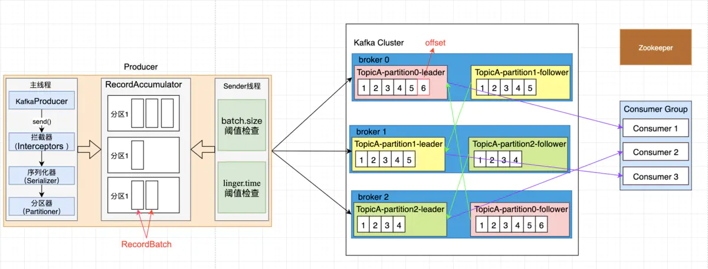

## 方案选型

在流批一体方案中，主要是通过消息队列进行数据传输。所以MQ选型是关键的一环，目前业界主要MQ有Kafka和Pulsar的选择。

## Kafka

### 什么是Kafka

Kafka是最初由Linkedin公司开发，是一个分布式、支持分区的（partition）、多副本的（replica），基于zookeeper协调的分布式消息系统，它的最大的特性就是可以实时的处理大量数据以满足各种需求场景：比如基于hadoop的批处理系统、低延迟的实时系统、storm/Spark流式处理引擎，web/nginx日志、访问日志，消息服务等等，Linkedin于2010年贡献给了Apache基金会并成为顶级开源项目。

### Kafka的整体架构

kafka的总体架构还是遵循消息中间件的架构，即产生消息->存储消息->消费消息。

### Kafka名词解释

| 名称           | 说明                                                         |
| -------------- | ------------------------------------------------------------ |
| Broker         | Kafka集群中的一台或多台服务器称为Broker。Broker存储Topic的数据 |
| Topic          | topic相当于传统消息系统MQ中的一个队列queue，producer端发送的message必须指定是发送到哪个topic上. |
| Partition      | 物理上的Topic分区，一个Topic可以分为多个Partition，至少有一个Partition。 |
| Producer       | 消息和数据的生产者。Producer将消息发布到Kafka的topic中。     |
| Consumer       | 消息和数据的消费者。Consumer从Broker中读取数据。Consumer可以消费多个topic中的数据。 |
| Consumer Group | 每个消费者都属于一个特定的消费者组。消费者组是Kafka用来实现一个Topic消息的广播和单播的手段。 |
| Leader         | 每个Partition有多个副本，其中有且仅有一个作为leader。Leader是当前负责数据的读写的Partition。 |
| Follower       | Follower跟随Leader，所有写请求都通过Leader路由，数据变更会广播给所有Follower，Follower与Leader保持数据同步。如果Leader失效，则从Follower中选举出一个新的Leader。 |

### Kafka的核心场景

- 消息队列
  - 比起大多数的消息系统来说，Kafka有更好的吞吐量，内置的分区，冗余及容错性，这让Kafka成为了一个很好的大规模消息处理应用的解决方案。消息系统一般吞吐量相对较低，但是需要更小的端到端延时，并常常依赖于Kafka提供的强大的持久性保障。在这个领域，Kafka足以媲美传统消息系统，如ActiveMQ或RabbitMQ。

- 行为跟踪
  - Kafka的另一个应用场景是跟踪用户浏览页面、搜索及其他行为，以发布-订阅的模式实时记录到对应的topic里。那么这些结果被订阅者拿到后，就可以做进一步的实时处理，或实时监控，或放到hadoop/离线数据仓库里处理。
- 元信息监控
  - 作为操作记录的监控模块来使用，即汇集记录一些操作信息，可以理解为运维性质的数据监控吧。
- 日志收集
  - 日志收集方面，其实开源产品有很多，包括Scribe、Apache Flume。很多人使用Kafka代替日志聚合（log aggregation）。日志聚合一般来说是从服务器上收集日志文件，然后放到一个集中的位置（文件服务器或HDFS）进行处理。然而Kafka忽略掉文件的细节，将其更清晰地抽象成一个个日志或事件的消息流。这就让Kafka处理过程延迟更低，更容易支持多数据源和分布式数据处理。比起以日志为中心的系统比如Scribe或者Flume来说，Kafka提供同样高效的性能和因为复制导致的更高的耐用性保证，以及更低的端到端延迟。
- 流处理
  - 这个场景可能比较多，也很好理解。保存收集流数据，以提供之后对接的Storm或其他流式计算框架进行处理。很多用户会将那些从原始topic来的数据进行阶段性处理，汇总，扩充或者以其他的方式转换到新的topic下再继续后面的处理。例如一个文章推荐的处理流程，可能是先从RSS数据源中抓取文章的内容，然后将其丢入一个叫做“文章”的topic中；后续操作可能是需要对这个内容进行清理，比如回复正常数据或者删除重复数据，最后再将内容匹配的结果返还给用户。这就在一个独立的topic之外，产生了一系列的实时数据处理的流程。Strom和Samza是非常著名的实现这种类型数据转换的框架。
- 事件源
  - 事件源是一种应用程序设计的方式，该方式的状态转移被记录为按时间顺序排序的记录序列。Kafka可以存储大量的日志数据，这使得它成为一个对这种方式的应用来说绝佳的后台。比如动态汇总（News feed）
- 持久性日志（commit log）
  - Kafka可以为一种外部的持久性日志的分布式系统提供服务。这种日志可以在节点间备份数据，并为故障节点数据回复提供一种重新同步的机制。Kafka中日志压缩功能为这种用法提供了条件。在这种用法中，Kafka类似于Apache BookKeeper项目。

### Kafka痛点

Kakfa的诸多痛点如下：

- 扩展 Kafka 十分困难，因为 broker 与存储数据耦合。所以添加一个 broker 它必须复制 topic 分区和副本，这非常耗时。
- 在长时间的存储时，对kafka来说需要较高的成本
- 当副本不同步时，会造成消息丢失的风险。
- 必须提前计划和计算 broker、topic、分区和副本的数量（确保计划未来的使用量），以避免扩展带来问题。
- 集群重新平衡会影响相连的生产者和消费者的性能。

接下来我详细介绍一下Pulsar

## Pulsar

### Pulsar 是什么

Apache Pulsar 是 Apache 软件基金会顶级项目，是下一代云原生分布式消息流平台，集消息、存储、轻量化函数式计算为一体，采用计算与存储分离架构设计，支持多租户、持久化存储、多机房跨区域数据复制，具有强一致性、高吞吐、低延时及高可扩展性等流数据存储特性。

### 整体架构

单个 Pulsar 集群由以下三部分组成：

- 一个或者多个 broker 负责处理和负载均衡 producer 发出的消息，并将这些消息分派给 consumer；Broker 与 Pulsar 配置存储交互来处理相应的任务，并将消息存储在 BookKeeper 实例中（又称 bookies）；Broker 依赖 ZooKeeper 集群处理特定的任务，等等。
- 包含一个或多个 bookie 的 BookKeeper 集群负责消息的[持久化存储](https://pulsar.apache.org/docs/zh-CN/concepts-architecture-overview/#persistent-storage)。
- 一个Zookeeper集群，用来处理多个Pulsar集群之间的协调任务。
- 在更细粒度的实例级别, 有一个能访问到全部实例的ZooKeeper群集处理涉及多个pulsar集群的配置协调任务, 例如 [异地复制](https://pulsar.apache.org/docs/zh-CN/concepts-replication)。

### Pulsar 的关键特性如下：

- Pulsar 的单个实例原生支持多个集群，可[跨机房](https://pulsar.apache.org/docs/zh-CN/administration-geo)在集群间无缝地完成消息复制。

- 极低的发布延迟和端到端延迟。

- 可无缝扩展到超过一百万个 topic。

- 简单的[客户端 API](https://pulsar.apache.org/docs/zh-CN/concepts-clients)，支持 [Java](https://pulsar.apache.org/docs/zh-CN/client-libraries-java)、[Go](https://pulsar.apache.org/docs/zh-CN/client-libraries-go)、[Python](https://pulsar.apache.org/docs/zh-CN/client-libraries-python) 和 [C++](https://pulsar.apache.org/docs/zh-CN/client-libraries-cpp)。

- 支持多种[ topic 订阅模式](https://pulsar.apache.org/docs/zh-CN/concepts-messaging#subscription-modes)（[独占订阅](https://pulsar.apache.org/docs/zh-CN/concepts-messaging#exclusive)、[共享订阅](https://pulsar.apache.org/docs/zh-CN/concepts-messaging#shared)、[故障转移订阅](https://pulsar.apache.org/docs/zh-CN/concepts-messaging#failover)）。

- 通过 [Apache BookKeeper](http://bookkeeper.apache.org/) 提供的[持久化消息存储机制](https://pulsar.apache.org/docs/zh-CN/concepts-architecture-overview#persistent-storage)保证消息传递 。

- - 由轻量级的 serverless 计算框架 [Pulsar Functions](https://pulsar.apache.org/docs/zh-CN/functions-overview) 实现流原生的数据处理。

- 基于 Pulsar Functions 的 serverless connector 框架 [Pulsar IO](https://pulsar.apache.org/docs/zh-CN/io-overview) 使得数据更易移入、移出 Apache Pulsar。

- [分层式存储](https://pulsar.apache.org/docs/zh-CN/concepts-tiered-storage)可在数据陈旧时，将数据从热存储卸载到冷/长期存储（如S3、GCS）中。

### 使用场景

##### 1、队列和流的融合—维护一套 MQ 服务就够了

Apache Pulsar 抽象出了统一的 producer-topic-subscription-consumer 消费模型，既支持队列模型，也支持流模型。在 Pulsar 的消息消费模型中，Topic 是用于发送消息的通道。每一个 Topic 对应着 Apache BookKeeper 中的一个分布式日志。发布者发布的每条消息只在 Topic 中存储一次；存储的过程中，BookKeeper 会将消息复制存储在多个存储节点上；Topic 中的每条消息，可以根据消费者的订阅需求，多次被使用，每个订阅对应一个消费者组。尽管消息仅在主题（Topic）上存储一次，但是用户可以有不同的订阅方式来消费这些消息：

- 消费者被组合在一起以消费消息，每个消费组是一个订阅。
- 每个 Topic 可以有不同的消费组。
- 每组消费者都是对主题的一个订阅。
- 每组消费者可以拥有自己不同的消费方式：独占（Exclusive），故障切换（Failover）或共享（Share）。

##### 2、多种 MQ 协议兼容—轻松迁移传统 MQ 服务

在 Pulsar 架构中，为了处理 Bookie 存储消息和防止消息丢失等，基于 Managed Leger 实现了一套分布式的流程封装。Pulsar Protocol Handler 处理 Pulsar 中生产者和消费者发送出来的 TCP 请求，将其转化为可读取状态的操作。Pulsar 2.5 版本后，将 Protocol Handler 接口单独脱离了出来，利用这个框架就可以单独实现自定义协议的转换，比如 Kafka、AMQP 等，可以帮助存量的 MQ 业务轻松迁移到 Pulsar。

##### 3、企业级多租户特性—数据安全有保证

作为企业的消息中枢，Apache Pulsar 自诞生之日起就支持多租户，因为该项目最初就是为了满足 Yahoo 的严格需求，而当时市面上没有任何可用的开源系统能够提供多租户功能。在 Pulsar 的设计中，租户可以跨集群分布，每个租户都可以有单独的认证和授权机制；租户也是存储配额、消息 TTL 和隔离策略的管理单元。Pulsar 通过下列方式满足了多租户场景下的数据安全：

- 通过为每个租户进行身份验证、授权和 ACL（访问控制列表）获得所需安全性。

- 为每个租户强制实施存储配额。
- 以策略的方式定义所有隔离机制，策略可在运行过程中更改，借此降低运维成本并简化管理工作。

##### 4、跨地域复制—自带跨机房冗灾能力

在大型的分布式系统中，都会涉及到跨多个数据中心的需求。在对服务质量和灾备要求更高的场景中，会规划将机房部署在地理位置分散的多个数据中心内。在此类多数据中心部署中，通常会使用跨地域复制机制提供额外的冗余，以防某个数据中心故障、自然侵害或其他事件导致服务无法正常运作。Apache Pulsar 在设计之初就加入了对 Yahoo 全球十多个机房的跨地域复制的需求。Apache Pulsar 的跨地域多机房互备特性是 Pulsar 企业级特性的重要组成部分，它在保证数据稳定可靠的同时，为用户提供了便捷的操作和管理。

在上图中，无论 Producer P1、P2 和 P3 在什么时候分别将消息发布给 Cluster A、Cluster B 和 Cluster C 中的 Topic T1，这些消息均会立刻复制到整个集群。一旦完成复制，Consumer C1 和 C2 即可从自己所在的集群消费这些消息。

Pulsar 的跨地域复制不仅应用在跨数据中心数据备份的场景，在 PowerFL 联邦学习平台中跨地域复制的能力还被用来做通信服务使用。

##### 云原生支持—助力服务上云

云原生的原生即软件设计之初就考虑到了将来会被运行在云端的可能，从而在设计层面上就充分利用了云资源的特点，典型的是分布式和弹性伸缩的能力。Pulsar 之所以说是云原生的消息平台，核心就是它的架构设计能够充分利用分布式的、能够弹性伸缩的云端资源。以 Pulsar on Kubernetes 为例，Bookie 是有状态的节点，但是节点之间是对等的，可以采用 StatefulSet 来部署；而 Broker 作为无状态的节点，直接使用 ReplicaSet 即可，每个 Pod 支持水平扩展。

### pulsar VS Kafka

|               | Kafka                          | Pulsar                               |
| ------------- | ------------------------------ | ------------------------------------ |
| 消费模型      | producer-subscription-consumer | producer-topic-subscription-consumer |
| 开源协议      | Apache-2.0 License             | Apache-2.0 License                   |
| 订阅模型      | 拉                             | 推                                   |
| 消息存储      | 发布订阅                       | 发布订阅，点对点                     |
| 多租户        | 支持                           | 支持                                 |
| 写入性能      | 非常好                         | 非常好                               |
| 消费性能      | 非常好                         | 非常好                               |
| 稳定性        | 分区过多或扩容时，写入性能下降 | 分区较多时，性能稳定                 |
| 支持Topic数量 | 单机超过500+ Topic，负载升高   | 5万topic，性能稳定                   |
| 消息优先级    | 不支持                         | 不支持                               |
| 死信队列      | 不支持                         | 支持                                 |
| 消息TTL       | 支持                           | 支持                                 |
| 可靠性        | 很好                           | 很好                                 |
| 异地复制      | 支持（需要mirror-maker）       | 支持（内置）                         |
| star          | 20K                            | 9.6K                                 |
| Contributors  | 818                            | 450                                  |
### pulsar VS Kafka 总结

|      | pulsar                                                       | kafka                                                        |
| ---- | ------------------------------------------------------------ | ------------------------------------------------------------ |
| 优点 | 1、计算存储分离，水平扩展不需要重平衡 2、支持topic的分区数可达到百万级别 3、队列和流的融合—维护一套 MQ | 1、生态较好，大数据使用领域较广 2、维护较少的组件，在kafka3.0去除zk的依赖 |
| 缺点 | 1、多层架构需要更多组件：broker，bookie； 2、运行 bookie 和 Pulsar broker 的机器，必须使用高规格的机器。 | 1、重平衡对生产运行影响较大 2、单机partition过多，性能明显下降  3、集群消费时被分区数目受限 |

### 使用Pulsar的公司

.jpg)

### 选择pulsar的理由

- Pulsar 可以支持百万级别 Topic 数量的扩展，同时还能一直保持良好的性能。
- 内置异地复制，使用这个场景时会更加的方便。无需再多维护mirror-maker进程
- 扩容方便，只需增加Bookie结点。
- 强大的多租户功能，对租户可以更好的管理。
- 官方推出Pulsar manage在管理使用上也会更加的友好。

#### Ref

[比拼Kafka，大数据分析新秀Pulsar到底好在哪 - 知乎](https://zhuanlan.zhihu.com/p/47388267)

[kafka简介](https://www.jianshu.com/p/674363ecc84a)

[Kafka为什么这么快](https://os.51cto.com/art/202008/623763.htm)

[Kafka系列1：Kafka概况 - 知乎专栏](https://zhuanlan.zhihu.com/p/107900688)

[kafka 官网](https://kafka.apache.org/27/documentation.html#georeplication)

[Pulsar  官网](https://pulsar.apache.org/docs/zh-CN/deploy-bare-metal/)

[Pulsar 集群部署](https://pulsar.apache.org/docs/zh-CN/deploy-bare-metal/)

[pulsar-flink-connector](https://flink.apache.org/2021/01/07/pulsar-flink-connector-270.html)

[TICDC sink-uri -配置](https://docs.pingcap.com/zh/tidb/stable/manage-ticdc#sink-uri-%E9%85%8D%E7%BD%AE-pulsar)

[架构师的选择，Pulsar还是Kafka？](https://www.cnblogs.com/StreamNative/p/14323559.html)

[鹅厂大佬深度解析 Apache Pulsar 五大应用场景](https://blog.csdn.net/qq_36668144/article/details/114854650)

[我为什么放弃Kafka，选择Pulsar？](https://blog.csdn.net/weixin_45727359/article/details/113409786)