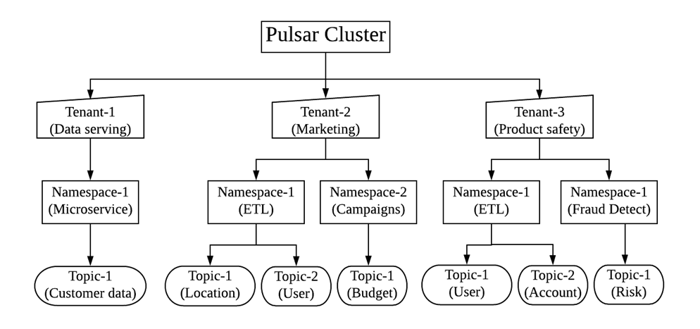

## 方案选型-Pulsar

在流批一体方案中，主要是通过消息队列进行数据传输。所以MQ选型是关键的一环，目前业界主要MQ有Kafka和Pulsar的选择。

#### 我们的场景

- 异地复制
- 保证CDC顺序读写
- 未来可能有多租户

在本文中，我将重点介绍 Pulsar 的优势，并说明 Pulsar 胜于 Kafka 的理由。

Kafka 是消息传递系统之王。它由 LinkedIn 于 2011 年创建，并在 Confluent 的支持下得到了广泛的传播。

Confluent 已向开源社区发布了许多新功能和附加组件，例如用于模式演化的 Schema Registry，用于从其他数据源轻松流式传输的 Kafka Connect 等。

数据库到 Kafka，Kafka Streams 进行分布式流处理，最近使用 KSQL 对 Kafka topic 执行类似 SQL 的查询等等。

Kafka 快速，易于安装，非常受欢迎，可用于广泛的范围或用例。从开发人员的角度来看，尽管 Apache Kafka 一直很友好，但在操作运维方面却是一团糟。

因此，让我们回顾一下 Kafka 的一些痛点：

Kakfa的诸多痛点如下：

- 扩展 Kafka 十分棘手，这是由于 broker 与存储数据的耦合架构结构所致。剥离一个 broker 意味着它必须复制 topic 分区和副本，这非常耗时。
- 没有与租户完全隔离的本地多租户。
- 存储会变得非常昂贵，尽管可以长时间存储数据，但是由于成本问题却很少用到它。
- 万一副本不同步，有可能丢失消息。
- 必须提前计划和计算 broker、topic、分区和副本的数量（确保计划的未来使用量增长），以避免扩展问题，这非常困难。
- 如果仅需要消息传递系统，则使用偏移量可能会很复杂。
- 集群重新平衡会影响相连的生产者和消费者的性能。

接下来我详细介绍一下Pulsar

### Pulsar 是什么

Apache Pulsar 是 Apache 软件基金会顶级项目，是下一代云原生分布式消息流平台，集消息、存储、轻量化函数式计算为一体，采用计算与存储分离架构设计，支持多租户、持久化存储、多机房跨区域数据复制，具有强一致性、高吞吐、低延时及高可扩展性等流数据存储特性。

### 整体架构

单个 Pulsar 集群由以下三部分组成：

- 一个或者多个 broker 负责处理和负载均衡 producer 发出的消息，并将这些消息分派给 consumer；Broker 与 Pulsar 配置存储交互来处理相应的任务，并将消息存储在 BookKeeper 实例中（又称 bookies）；Broker 依赖 ZooKeeper 集群处理特定的任务，等等。
- 包含一个或多个 bookie 的 BookKeeper 集群负责消息的[持久化存储](https://pulsar.apache.org/docs/zh-CN/concepts-architecture-overview/#persistent-storage)。
- 一个Zookeeper集群，用来处理多个Pulsar集群之间的协调任务。
- 在更细粒度的实例级别, 有一个能访问到全部实例的ZooKeeper群集处理涉及多个pulsar集群的配置协调任务, 例如 [异地复制](https://pulsar.apache.org/docs/zh-CN/concepts-replication)。

### Pulsar的特性

- 内置多租户，不同的团队可以使用相同的集群并将其隔离，解决了许多管理难题。它支持隔离、身份验证、授权和配额；
- 多层体系结构：Pulsar 将所有 topic 数据存储在由 Apache BookKeeper 支持的专业数据层中。存储和消息传递的分离解决了扩展、重新平衡和维护集群的许多问题。它还提高了可靠性，几乎不可能丢失数据。另外，在读取数据时可以直连 BookKeeper，且不影响实时摄取。例如，可以使用 Presto 对 topic 执行 SQL 查询，类似于 KSQL，但不会影响实时数据处理；
- 虚拟 topic：由于采用 n 层体系结构，因此对 topic 的数量没有限制，topic 及其存储是分离的。用户还可以创建非持久性 topic；
- N 层存储：Kafka 的一个问题是，存储费用可能变高。因此，它很少用于存储"冷"数据，并且消息经常被删除，Apache Pulsar 可以借助分层存储自动将旧数据卸载到 Amazon S3 或其他数据存储系统，并且仍然向客户端展示透明视图；Pulsar 客户端可以从时间开始节点读取，就像所有消息都存在于日志中一样；
- Pulsar Function：易于部署、轻量级计算过程、对开发人员友好的 API，无需运行自己的流处理引擎（如 Kafka）；
- 安全性：它具有内置的代理、多租户安全性、可插拔的身份验证等特性；
- 快速重新平衡：分区被分为易于重新平衡的分片；
- 服务器端重复数据删除和无效字段：无需在客户端中执行此操作，也可以在压缩期间删除重复数据；
- 内置 Schema registry（架构注册表）：支持多种策略，易于操作；
- 地理复制和内置 Discovery：易于将集群复制到多个区域；
- 集成的负载均衡器和 Prometheus 指标；
- 多重集成：Kafka、RabbitMQ 等；
- 支持多种编程语言，例如 GoLang、Java、Scala、Node、Python…...
- 分片和数据分区在服务器端透明进行，客户端不需要了解分片与分区数据。

### 使用场景

##### 1、队列和流的融合—维护一套 MQ 服务就够了

Apache Pulsar 抽象出了统一的 producer-topic-subscription-consumer 消费模型，既支持队列模型，也支持流模型。在 Pulsar 的消息消费模型中，Topic 是用于发送消息的通道。每一个 Topic 对应着 Apache BookKeeper 中的一个分布式日志。发布者发布的每条消息只在 Topic 中存储一次；存储的过程中，BookKeeper 会将消息复制存储在多个存储节点上；Topic 中的每条消息，可以根据消费者的订阅需求，多次被使用，每个订阅对应一个消费者组。尽管消息仅在主题（Topic）上存储一次，但是用户可以有不同的订阅方式来消费这些消息：

- 消费者被组合在一起以消费消息，每个消费组是一个订阅。
- 每个 Topic 可以有不同的消费组。
- 每组消费者都是对主题的一个订阅。
- 每组消费者可以拥有自己不同的消费方式：独占（Exclusive），故障切换（Failover）或共享（Share）。

##### 2、多种 MQ 协议兼容—轻松迁移传统 MQ 服务

在 Pulsar 架构中，为了处理 Bookie 存储消息和防止消息丢失等，基于 Managed Leger 实现了一套分布式的流程封装。Pulsar Protocol Handler 处理 Pulsar 中生产者和消费者发送出来的 TCP 请求，将其转化为可读取状态的操作。Pulsar 2.5 版本后，将 Protocol Handler 接口单独脱离了出来，利用这个框架就可以单独实现自定义协议的转换，比如 Kafka、AMQP 等，可以帮助存量的 MQ 业务轻松迁移到 Pulsar。

##### 3、企业级多租户特性—数据安全有保证

作为企业的消息中枢，Apache Pulsar 自诞生之日起就支持多租户，因为该项目最初就是为了满足 Yahoo 的严格需求，而当时市面上没有任何可用的开源系统能够提供多租户功能。在 Pulsar 的设计中，租户可以跨集群分布，每个租户都可以有单独的认证和授权机制；租户也是存储配额、消息 TTL 和隔离策略的管理单元。Pulsar 通过下列方式满足了多租户场景下的数据安全：

- 通过为每个租户进行身份验证、授权和 ACL（访问控制列表）获得所需安全性。

- 为每个租户强制实施存储配额。
- 以策略的方式定义所有隔离机制，策略可在运行过程中更改，借此降低运维成本并简化管理工作。

##### 4、跨地域复制—自带跨机房冗灾能力

在大型的分布式系统中，都会涉及到跨多个数据中心的需求。在对服务质量和灾备要求更高的场景中，会规划将机房部署在地理位置分散的多个数据中心内。在此类多数据中心部署中，通常会使用跨地域复制机制提供额外的冗余，以防某个数据中心故障、自然侵害或其他事件导致服务无法正常运作。Apache Pulsar 在设计之初就加入了对 Yahoo 全球十多个机房的跨地域复制的需求。Apache Pulsar 的跨地域多机房互备特性是 Pulsar 企业级特性的重要组成部分，它在保证数据稳定可靠的同时，为用户提供了便捷的操作和管理。

在上图中，无论 Producer P1、P2 和 P3 在什么时候分别将消息发布给 Cluster A、Cluster B 和 Cluster C 中的 Topic T1，这些消息均会立刻复制到整个集群。一旦完成复制，Consumer C1 和 C2 即可从自己所在的集群消费这些消息。

Pulsar 的跨地域复制不仅应用在跨数据中心数据备份的场景，在 PowerFL 联邦学习平台中跨地域复制的能力还被用来做通信服务使用。

##### 云原生支持—助力服务上云

云原生的原生即软件设计之初就考虑到了将来会被运行在云端的可能，从而在设计层面上就充分利用了云资源的特点，典型的是分布式和弹性伸缩的能力。Pulsar 之所以说是云原生的消息平台，核心就是它的架构设计能够充分利用分布式的、能够弹性伸缩的云端资源。以 Pulsar on Kubernetes 为例，Bookie 是有状态的节点，但是节点之间是对等的，可以采用 StatefulSet 来部署；而 Broker 作为无状态的节点，直接使用 ReplicaSet 即可，每个 Pod 支持水平扩展。

### pulsar VS Kafka

|               | Kafka                          | Pulsar                               |
| ------------- | ------------------------------ | ------------------------------------ |
| 消费模型      | producer-subscription-consumer | producer-topic-subscription-consumer |
| 订阅模型      | 拉                             | 推                                   |
| 消息存储      | 发布订阅                       | 发布订阅，点对点                     |
| 多租户        | 支持                           | 支持                                 |
| 写入性能      | 非常好                         | 非常好                               |
| 消费性能      | 非常好                         | 非常好                               |
| 稳定性        | 分区过多或扩容时，写入性能下降 | 分区较多时，性能稳定                 |
| 支持Topic数量 | 单机超过500+ Topic，负载升高   | 5万topic，性能稳定                   |
| 消息优先级    | 不支持                         | 不支持                               |
| 死信队列      | 不支持                         | 支持                                 |
| 消息TTL       | 支持                           | 支持                                 |
| 可靠性        | 很好                           | 很好                                 |
| 异地复制      | 支持（需要mirror-maker）       | 支持（内置）                         |
### pulsar VS Kafka 总结

|      | pulsar                                                       | kafka                                                        |
| ---- | ------------------------------------------------------------ | ------------------------------------------------------------ |
| 优点 | 1、高吞吐量，低延迟，高靠性，高容错 2、计算存储分离，水平扩展不需要重平衡 3、支持topic的分区数可达到百万级别 | 1、高吞吐量，低延迟，高靠性，高容错 2、生态较好，大数据使用领域较广 |
| 缺点 | 1、2层体系结构导致需要更多组件：BookKeeper，bookie； 2、运行 bookie 和 Pulsar broker 的机器，必须使用高规格的机器。 | 1、重平衡对生产运行影响较大 2、单机partition过多，性能明显下降  3、集群消费分区数目受限 |

### 使用Pulsar的公司

.jpg)

#### Ref

[比拼Kafka，大数据分析新秀Pulsar到底好在哪 - 知乎](https://zhuanlan.zhihu.com/p/47388267)

[kafka简介](https://www.jianshu.com/p/674363ecc84a)

[Kafka为什么这么快](https://os.51cto.com/art/202008/623763.htm)

[Kafka系列1：Kafka概况 - 知乎专栏](https://zhuanlan.zhihu.com/p/107900688)

[kafka 官网](https://kafka.apache.org/27/documentation.html#georeplication)

[Pulsar  官网](https://pulsar.apache.org/docs/zh-CN/deploy-bare-metal/)

[Pulsar 集群部署](https://pulsar.apache.org/docs/zh-CN/deploy-bare-metal/)

[pulsar-flink-connector](https://flink.apache.org/2021/01/07/pulsar-flink-connector-270.html)

[TICDC sink-uri -配置](https://docs.pingcap.com/zh/tidb/stable/manage-ticdc#sink-uri-%E9%85%8D%E7%BD%AE-pulsar)

[架构师的选择，Pulsar还是Kafka？](https://www.cnblogs.com/StreamNative/p/14323559.html)

[鹅厂大佬深度解析 Apache Pulsar 五大应用场景](https://blog.csdn.net/qq_36668144/article/details/114854650)

[我为什么放弃Kafka，选择Pulsar？](https://blog.csdn.net/weixin_45727359/article/details/113409786)