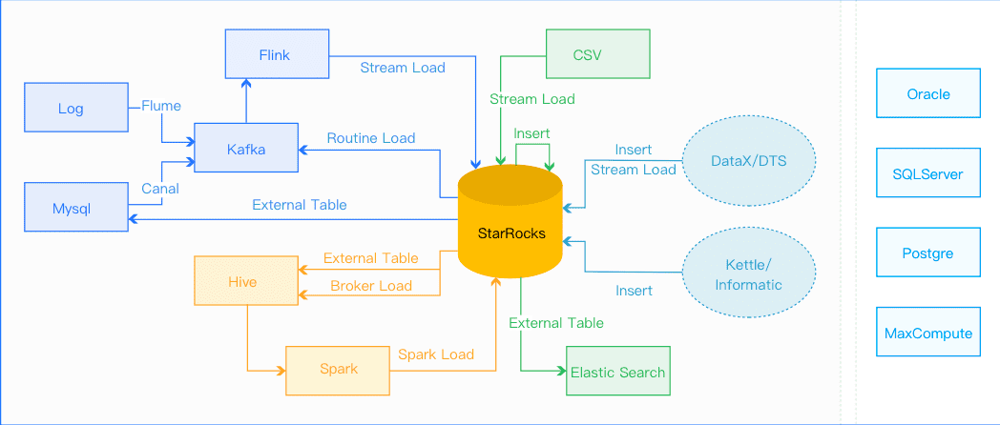
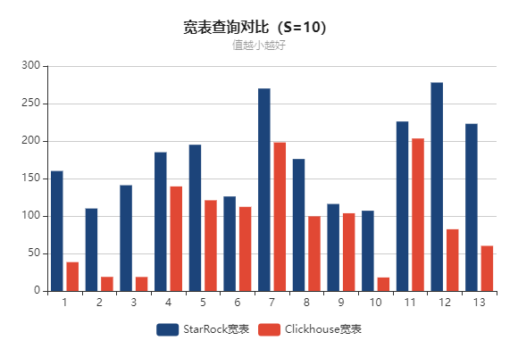

# StarRocks介绍

## 前世今生

StarRocks 的前身 Doris 最早是解决百度凤巢统计报表的专用系统，随着百度业务的飞速发展对系统进行了多次迭代，逐渐承担起百度内部业务的统计报表和多维分析需求。2013 年，百度把 Doris 进行了 MPP 框架的升级，并将新系统命名为 Palo ，2017 年百度以百度 Palo 的名字在 GitHub 上进行了开源，2018 年贡献给 Apache 基金会时，由于与国外数据库厂商重名，因此选择用回最初的名字，这就是 Apache Doris 的由来。

那么 StarRocks 以及 DorisDB 是什么？

2020 年 2 月，前百度 Doris 团队成员基于 Apache Doris 之前的版本做了商业化闭源产品 DorisDB ，并于2021年9月以StarRocks名字开源。

## 是什么

- StarRocks是**新一代极速全场景MPP数据库**。
- StarRocks充分吸收关系型OLAP数据库和分布式存储系统在大数据时代的优秀研究成果，在业界实践的基础上，进一步改进优化、升级架构，并增添了众多全新功能，形成了全新的企业级产品。
- StarRocks致力于构建极速统一分析体验，满足企业用户的多种数据分析场景，支持多种数据模型(明细模型、聚合模型、更新模型)，多种导入方式（批量和实时），可整合和接入多种现有系统(Spark、Flink、Hive、 ElasticSearch)。
- StarRocks兼容MySQL协议，可使用MySQL客户端和常用BI工具对接StarRocks来进行数据分析。
- StarRocks采用分布式架构，对数据表进行水平划分并以多副本存储。集群规模可以灵活伸缩，**能够支持10PB级别的数据分析**; 支持MPP框架，并行加速计算; 支持多副本，具有弹性容错能力。
- StarRocks采用关系模型，使用严格的数据类型和列式存储引擎，通过编码和压缩技术，降低读写放大；使用向量化执行方式，充分挖掘多核CPU的并行计算能力，从而显著提升查询性能。

## 特性

StarRocks的架构设计融合了MPP数据库，以及分布式系统的设计思想，具有以下特性：

#### 架构精简

StarRocks内部通过MPP计算框架完成SQL的具体执行工作。MPP框架本身能够充分的利用多节点的计算能力，整个查询并行执行，从而实现良好的交互式分析体验。 StarRocks集群不需要依赖任何其他组件，易部署、易维护，极简的架构设计，降低了StarRocks系统的复杂度和维护成本，同时也提升了系统的可靠性和扩展性。 管理员只需要专注于StarRocks系统，无需学习和管理任何其他外部系统。

#### 全面向量化引擎

StarRocks的计算层全面采用了向量化技术，将所有算子、函数、扫描过滤和导入导出模块进行了系统性优化。通过列式的内存布局、适配CPU的SIMD指令集等手段，充分发挥了现代CPU的并行计算能力，从而实现亚秒级别的多维分析能力。

#### 智能查询优化

StarRocks通过CBO优化器(Cost Based Optimizer)可以对复杂查询自动优化。无需人工干预，就可以通过统计信息合理估算执行成本，生成更优的执行计划，大大提高了Adhoc和ETL场景的数据分析效率。

#### 联邦查询

StarRocks支持使用外表的方式进行联邦查询，当前可以支持Hive、MySQL、Elasticsearch三种类型的外表，用户无需通过数据导入，可以直接进行数据查询加速。

#### 高效更新

StarRocks支持多种数据模型，其中更新模型可以按照主键进行upsert/delete操作，通过存储和索引的优化可以在并发更新的同时实现高效的查询优化，更好的服务实时数仓的场景。

#### 智能物化视图

StarRocks支持智能的物化视图。用户可以通过创建物化视图，预先计算生成预聚合表用于加速聚合类查询请求。StarRocks的物化视图能够在数据导入时自动完成汇聚，与原始表数据保持一致。并且在查询的时候，用户无需指定物化视图，StarRocks能够自动选择最优的物化视图来满足查询请求。

#### 标准SQL

StarRocks支持标准的SQL语法，包括聚合、JOIN、排序、窗口函数和自定义函数等功能。StarRocks可以完整支持TPC-H的22个SQL和TPC-DS的99个SQL。此外，StarRocks还兼容MySQL协议语法，可使用现有的各种客户端工具、BI软件访问StarRocks，对StarRocks中的数据进行拖拽式分析。

#### 流批一体

StarRocks支持实时和批量两种数据导入方式，支持的数据源有Kafka、HDFS、本地文件，支持的数据格式有ORC、Parquet和CSV等，StarRocks可以实时消费Kafka数据来完成数据导入，保证数据不丢不重（exactly once）。StarRocks也可以从本地或者远程（HDFS）批量导入数据。

#### 高可用易扩展

StarRocks的元数据和数据都是多副本存储，并且集群中服务有热备，多实例部署，避免了单点故障。集群具有自愈能力，可弹性恢复，节点的宕机、下线、异常都不会影响StarRocks集群服务的整体稳定性。 StarRocks采用分布式架构，存储容量和计算能力可近乎线性水平扩展。StarRocks单集群的节点规模可扩展到数百节点，数据规模可达到10PB级别。 扩缩容期间无需停服，可以正常提供查询服务。 另外StarRocks中表模式热变更，可通过一条简单SQL命令动态地修改表的定义，例如增加列、减少列、新建物化视图等。同时，处于模式变更中的表也可也正常导入和查询数据。

## 适合场景

StarRocks可以满足企业级用户的多种分析需求，包括OLAP多维分析、定制报表、实时数据分析和Ad-hoc数据分析等。具体的业务场景包括：

- OLAP多维分析
  - 用户行为分析
  - 用户画像、标签分析、圈人
  - 高维业务指标报表
  - 自助式报表平台
  - 业务问题探查分析
  - 跨主题业务分析
  - 财务报表
  - 系统监控分析
- 实时数据分析
  - 电商大促数据分析
  - 教育行业的直播质量分析
  - 物流行业的运单分析
  - 金融行业绩效分析、指标计算
  - 广告投放分析
  - 管理驾驶舱
  - 探针分析APM（Application Performance Management）
- 高并发查询
  - 广告主报表分析
  - 零售行业渠道人员分析
  - SaaS行业面向用户分析报表
  - Dashbroad多页面分析
- 统一分析
  - 通过使用一套系统解决多维分析、高并发查询、预计算、实时分析、Adhoc查询等场景，降低系统复杂度和多技术栈开发与维护成本。

## 基本概念

| 服务/组件                                                    | 作用                                                         |
| ------------------------------------------------------------ | ------------------------------------------------------------ |
| FE：FrontEnd StarRocks的前端节点                             | 负责管理元数据，管理客户端连接，进行查询规划，查询调度等工作。 |
| BE：BackEnd StarRocks的后端节点                              | 负责数据存储，计算执行，以及compaction，副本管理等工作。     |
| Broker：StarRocks中和外部HDFS/对象存储等外部数据对接的中转服务 | 辅助提供导入导出功能                                         |
| StarRocksManager：StarRocks 管理工具（企业版）               | 提供StarRocks集群管理、在线查询、故障查询、监控报警的可视化工具。 |
| Tablet：StarRocks 表的逻辑分片                               | 也是StarRocks中副本管理的基本单位，每个表根据分区和分桶机制被划分成多个Tablet存储在不同BE节点上。 |

## 整体架构

#### 组件介绍

StarRocks集群由FE和BE构成, 可以使用MySQL客户端访问StarRocks集群。

##### FE

FE接收MySQL客户端的连接, 解析并执行SQL语句。

- 管理元数据, 执行SQL DDL命令, 用Catalog记录库, 表, 分区, tablet副本等信息。
- FE高可用部署, 使用复制协议选主和主从同步元数据, 所有的元数据修改操作, 由FE leader节点完成, FE follower节点可执行读操作。 元数据的读写满足顺序一致性。  FE的节点数目采用2n+1, 可容忍n个节点故障。  当FE leader故障时, 从现有的follower节点重新选主, 完成故障切换。
- FE的SQL layer对用户提交的SQL进行解析, 分析, 改写, 语义分析和关系代数优化, 生产逻辑执行计划。
- FE的Planner负责把逻辑计划转化为可分布式执行的物理计划, 分发给一组BE。
- FE监督BE, 管理BE的上下线, 根据BE的存活和健康状态, 维持tablet副本的数量。
- FE协调数据导入, 保证数据导入的一致性。

##### BE

- BE管理tablet副本, tablet是table经过分区分桶形成的子表, 采用列式存储。
- BE受FE指导, 创建或删除子表。
- BE接收FE分发的物理执行计划并指定BE coordinator节点, 在BE coordinator的调度下, 与其他BE worker共同协作完成执行。
- BE读本地的列存储引擎获取数据,并通过索引和谓词下沉快速过滤数据。
- BE后台执行compact任务, 减少查询时的读放大。
- 数据导入时, 由FE指定BE coordinator, 将数据以fanout的形式写入到tablet多副本所在的BE上。

## 数据模型

StarRocks根据摄入数据和实际存储数据之间的映射关系，将数据表的明细表，聚合表和更新表，分别对应有**明细模型**，**聚合模型**和**更新模型**。

- 明细模型：表中存在主键重复的数据行，和摄入数据行一一对应，用户可以召回所摄入的全部历史数据。适用于数据无需提前聚合的分析业务。
- 聚合模型：表中不存在主键重复的数据行, 摄入的主键重复的数据行合并为一行, 这些数据行的指标列通过聚合函数合并, 用户可以召回所摄入的全部历史数据的累积结果, 但无法召回全部历史数据。适合报表和多维分析业务。
- 更新模型：聚合模型的特殊情形，主键满足唯一性约束，最近摄入的数据行，替换掉其他主键重复的数据行。相当于在聚合模型中，为数据表的指标列指定的聚合函数为REPLACE， REPLACE函数返回一组数据中的最新数据。适用于有更新的分析业务。

## 数据导入

StarRocks系统提供了5种不同的导入方式，以支持不同的数据源（如HDFS、Kafka、本地文件等），或者按不同的方式（异步或同步）导入数据。

- Broker Load：Broker Load通过Broker进程访问并读取外部数据源，然后采用MySQL协议向StarRocks创建导入作业。适用于源数据在Broker进程可访问的存储系统（如HDFS）中。
- Spark Load：Spark Load通过Spark资源实现对导入数据的预处理，提高 StarRocks大数据量的导入性能并且节省StarRocks集群的计算资源。
- Stream Load：Stream Load是一种同步执行的导入方式，通过HTTP协议发送请求将本地文件或数据流导入到StarRocks中，并等待系统返回导入的结果状态，从而判断导入是否成功。
- Routine Load：Routine Load提供了一种自动从指定数据源进行数据导入的功能。用户通过MySQL协议提交例行导入作业，生成一个常驻线程，不间断的从数据源（如 Kafka）中读取数据并导入到StarRocks中。
- Insert Into：类似MySQL中的Insert语句，可以通过INSERT INTO tbl SELECT ...或INSERT INTO tbl VALUES(...)等语句插入数据。
- Flink-Connector：Flink-Connector实时数据导入，日志数据和业务数据库的binlog同步到Kafka以后，优先推荐通过[Routine load](https://docs.starrocks.com/zh-cn/main/loading/RoutineLoad) 导入StarRocks，如果导入过程中有复杂的多表关联和ETL预处理可以使用Flink处理以后用stream load写入StarRocks。
- DataX-writer：DataX-writer插件实现了写入数据到 StarRocks 的目的表的功能。在底层实现上， StarRocksWriter 通过Stream load以csv或 json 格式导入数据至StarRocks。内部将`reader`读取的数据进行缓存后批量导入至StarRocks，以提高写入性能。

## 监控报警

StarRocks提供两种监控报警的方案，第一种是**企业版内置的StarRocksManager**。第二种使用**开源的Prometheus+Grafana的方案**，StarRocks提供了兼容Prometheus的信息采集接口，可以通过直接链接BE/FE的HTTP端口来获取集群的监控信息。

## 应用案例

- [携程 x StarRocks：高效支持高并发查询，大幅降低人力和硬件成本](https://mp.weixin.qq.com/s/wIgi3zPt0pjQnU7vNMApxg)：携程大住宿数据智能平台中**70%的实时数据场景**已经接入StarRocks，查询响应速度平均在200ms左右，超过500ms的慢查询数大幅度减少，同时人力和硬件成本大大降低。总数据行数大概700亿左右，数据容量8T，每天需要更新的数据行数大概有150亿左右。通过StarRocks解决了ClickHouse无法支持高并发查询的痛点。
- [58同城 | 上线近二十套集群，满足多场景业务分析需求](https://www.starrocks.com/zh-CN/blog/58tongcheng)：已经落地了18套StarRocks集群。在报表系统等场景中，包含实时数据分析等业务场景，共50+张表，占用约100T存储空间，查询并发量100-500+。

- [贝壳找房 | 全新统一的极速OLAP平台实践](https://www.starrocks.com/zh-CN/blog/beikezhaofang)：支持了如指标平台、可视化报表平台、典型业务场景等多个应用。集群规模：35台物理机（80core、192GB内存、3TB SSD），部署了35 BE，3 FE。

## 谁在使用

## 功能验证

| 功能                | 验证通过 | 支撑场景                                                     | 备注                                                         |
| ------------------- | -------- | ------------------------------------------------------------ | ------------------------------------------------------------ |
| 外部表              | 是       | 联邦查询场景，例如StarRocks的明细表可以关联Mysql的维度表     | 目前支持MySQL、HDFS、ElasticSearch、Hive以及StarRocks这些数据源 |
| bitmap精确去重      | 是       | 精确去重：如果基数在亿级以上，并且需要精确去重的场景         | 在去重场景中，与传统去重方案对比，具有时间和空间上的优势     |
| HLL近似去重         | 是       | 近似去重：如果基数在亿级以上，可以接受近似去重的场景。       | 计算结果的误差可控制在1%—10%左右，误差与数据集大小以及所采用的哈希函数有关。 |
| 数组                | 是       | A/B Test对比、用户标签分析、人群画像等场景                   | 当前支持了 多维数组嵌套、数组切片、比较、过滤等特性。        |
| CBO 优化器          | 是       | 针对复杂 Ad-hoc 场景生成更优的执行计划                       |                                                              |
| 窗口函数            | 是       | 用来分析趋势、计算离群值以及对大量数据进行分桶分析等         |                                                              |
| 批量导出            | 是       | 指定的表和分区以文本格式，通过 Broker 进程导出到远端存储上，如 HDFS/阿里云OSS/AWS S3（或者兼容S3协议的对象存储） |                                                              |
| Lateral Join        | 是       | 行转列场景：一行转多行                                       | 支持String，Array类型，Bitmap类型之间的转化，当前还不支持子查询 |
| Stream load         | 是       | 程序/本地直接导入数据，支持CSV文件格式。数据量在10GB以下。   | 是一种发送 HTTP 请求的同步的导入方式                         |
| BrokerLoad          | 否       | 数据源（如HDFS, S3）上的数据                                 | 离线数据导入                                                 |
| Spark Load          | 否       | 初次迁移、大数据量导入StarRocks                              | 离线数据导入                                                 |
| Routine Load        | 是       | 日志数据和业务数据库的binlog等数据同步到Kafka，导入过程不涉及复杂的多表关联和ETL处理优的场景 | 实时数据导入：支持从Kafka持续不断的导入数据，并且支持通过SQL控制导入任务的暂停、重启、停止 |
| Insert Into loading | 是       | 仅做测试使用场景                                             | 仅导入几条测试数据，验证一下 StarRocks 系统的功能。          |
| Flink-connector     | 是       | 流导入，获取实时变更的数据                                   | 实时数据导入：导入过程中有复杂的多表关联和ETL预处理          |
| Datax-writer        | 否       | 批量导入                                                     | 支持大部分数据源                                             |

## 同质比较

目前开源社区中，存算一体的MPP数据库主要有：Apache Doris、StarRocks、ClickHouse、TiDB、GreenPlumn等。

#### 1、StarRocks VS Apache Doris VS ClikHouse VS TiDB（2021/10）

|                     | StarRocks                                                    | Apache Doris                                                 | ClickHouse                                                   | TiDB                                               |
| ------------------- | ------------------------------------------------------------ | ------------------------------------------------------------ | ------------------------------------------------------------ | -------------------------------------------------- |
| 开源社区            | StarRocks                                                    | Apache                                                       | ClickHouse                                                   | CNCF                                               |
| 开源协议            | Elastic-2.0 License                                          | Apache-2.0 License                                           | Apache-2.0 License                                           | Apache-2.0 License                                 |
| 开源时间            | 2021/9                                                       | 2017年开源，2018进入 Apache孵化                              | 2016/6                                                       | 2014                                               |
| 社区现状            | 迭代两个版本1.18.2、1.18.4                                   | 即将毕业成为顶级项目                                         | 每月一更新，迭代很快                                         | 稳定                                               |
| Github star         | 1.6k                                                         | 3.4k                                                         | 20k                                                          | 29.3k                                              |
| Github Contributors | 41                                                           | 207                                                          | 802                                                          | 675                                                |
| 文档                | [中文](https://docs.starrocks.com/zh-cn/main/introduction/StarRocks_intro) | [中文/英文](https://doris.apache.org/branch-0.14/zh-CN/installing/compilation.html) | [中/英文](https://clickhouse.com/docs/zh/operations/performance-test/) | [中/英文](https://docs.pingcap.com/zh/tidb/stable) |
| 标准SQL             | 支持，兼容Mysql协议                                          | 支持，兼容Mysql协议                                          | 不完全支持                                                   | 支持，兼容Mysql协议                                |
| 分布式join          | 支持                                                         | 支持                                                         | 几乎不支持，推荐大宽表                                       | 支持                                               |
| 高并发查询          | 支持                                                         | 支持                                                         | 不支持高并发，官方推荐100QPS                                 | 支持                                               |
| 更新                | upsert                                                       | upsert                                                       | 适合大批次更新，单行更新很弱                                 | update                                             |
| 数据规模            | 10PB                                                         | 10PB                                                         | 百PB                                                         | PB                                                 |
| 联邦查询            | 支持                                                         | 支持                                                         | 不支持                                                       | 不支持                                             |
| ACID                | 部分                                                         | 部分                                                         | 不支持                                                       | 支持                                               |
| 多租户              | 不支持                                                       | 下个版本推出                                                 | 部分支持                                                     | 不支持                                             |
| 资源隔离            | 不支持                                                       | 下个版本推出，部分支持（节点隔离）                           | 配额管理                                                     | 不支持                                             |
| 安全                | RBAC，表级；LDAP                                             | RBAC，表级；LDAP                                             | RBAC，行级                                                   | RBAC，表级                                         |
| 运维                | 支持自动扩容、故障恢复等命令方式。                           | 支持自动扩容、故障恢复等命令方式。                           | 扩缩容复杂，运维成本高                                       | 简单                                               |
| 性能                | 读写性能好                                                   | 读写性能好                                                   | 单机性能强悍 分布式性能会提升 单表读性能强悍，多表差 写性能好 | 读写性能好                                         |
| 定位                | 极速全场景MPP数据库                                          | 极速全场景MPP数据库                                          | 高性能的列式 OLAP 数据库管理系统                             | HTAP数据库                                         |
| 未来方向            | 新一代流批融合的极速湖仓（Lakehouse）                        | 新一代流批融合的极速湖仓（Lakehouse）                        | 高性能的列式 OLAP 数据库管理系统                             | 一栈式实时 HTAP 数据库                             |
| 其他                | 性能比Apache Doris高                                         | 依托于Apache，社区比StarRocks更强大                          |                                                              | 周边组件丰富 迁移方便 稳定性高             |

#### 2、StarRocks VS Apache Doris 总结

由于StarRocks出自Apache Doris，为此两者之间存在许多共同点，同时存在一部分差异，具体如下：

| 共性                                                         | 差异                                                         |
| ------------------------------------------------------------ | ------------------------------------------------------------ |
| 1、整体架构一致 2、适用的场景基本一致 3、未来方向都为为**新一代流批融合的极速湖仓（Lakehouse）** | 1、社区不一致，StarRocks社区主要由鼎石主导和推进，Doris背靠Apache，社区更加稳固和强大，更有利于后续Doris生态的打造和良性推进 2、**StarRocks的开源协议Elastic License 2.0更严苛**，该点可能成为用户选型的一大考量，从而偏向Apache Doris，促使Doris社区更加强大 3、**目前StarRocks整体性能会优于Apache Doris**，主要是StarRocks重构了优化器和执行器。 4、目前Apache Doris相对于StarRocks更新迭代比较慢，主要是StarRocks核心贡献人员集中在鼎石内部，基本上全精力投入，为此推进更加快速 |

#### 3、StarRocks/Apache Doris VS ClickHouse VS TiDB总结

| 数据库                 | 优点                                                         | 缺点                                                         |
| ---------------------- | ------------------------------------------------------------ | ------------------------------------------------------------ |
| StarRocks/Apache Doris | 1、单表和多表性能表现良好 2、易运维 3、适用的场景更加广泛和全面 4、部分兼容Mysql协议 5、支持联邦查询 6、支持高并发场景 | 1、社区相对较弱，更新迭代比较慢 2、整体生态体系还比较薄弱 |
| ClickHouse             | 1、单表性能强悍 2、社区强大，迭代速度快 3、兼容Mysql/PG协议，比较弱 | 1、多表性能比较差 2、不支持高并发查询场景 3、不易运维 |
| TiDB                   | 1、百分之百支持OLTP 2、社区强大，稳定成熟 3、易运维 4、完全兼容Mysql协议 5、生态工具比较完善 6、支持高并发场景 | 1、支持百分八十OLAP场景，相对更弱，且存在数据冗余            |

#### 4、StarRocks VS ClickHouse性能测试

##### 结论

完整地对比了StarRocks和ClickHouse的性能。测试使用业界流行的Star Schema Benchmark星型模型测试集。结论如下：

- 单表查询：StarRocks与Clickhouse整体性能都较为良好，但对比而言**Clickhouse优于StarRocks。**
- 多表查询：**StarRocks性能良好**，但Clickhouse下降严重，甚至在S=50中集群运行过于缓慢，以致放弃该项测试。

**关于Clickhouse**

- ClickHouse多表查询需要更改SQL，使类型一致才可以，且字段名、表名区分大小写。
- ClickHouse单机性能强悍，性价比较高。
- ClickHouse大单表查询方式效率好，多表关联效率降低明显。

**关**于**StarRocks**

- StarRocks单表和多表关联查询速度都非常快。

**测试汇总数据**：

缩写说明： **SS**：StarRocks **CC**：Clickhouse

| 对比项                   | 速度对比 | 备注                               |
| ------------------------ | -------- | ---------------------------------- |
| SS与CC宽表查询对比       | 0:13     | CC优于SS                           |
| SS与CC关联表查询对比     | 13:0     | SS优于CC                           |
| SS宽表与SS关联表查询对比 | 2:11     | SS的宽表查询优于关联，但差距不大   |
| CC宽表与CC关联表查询对比 | 13:0     | CC的宽表查询远远优于关联查询性能。 |

##### 规模因子为10（6千万数据）

| SQL编号 | StarRock关联表 | StarRock宽表 | Clickhouse宽表 | Clickhouse关联表 |
| ------- | -------------- | ------------ | -------------- | ---------------- |
| Q1.1    | 145            | 160          | 38.45          | 425.2            |
| Q1.2    | 132            | 110          | 18.75          | 399              |
| Q1.3    | 125            | 141          | 18.65          | 418.4            |
| Q2.1    | 242            | 185          | 139.45         | 18107            |
| Q2.2    | 209            | 195          | 120.95         | 13287            |
| Q2.3    | 186            | 126          | 112.2          | 13207            |
| Q3.1    | 357            | 270          | 198.1          | 13043            |
| Q3.2    | 220            | 176          | 99.55          | 10751            |
| Q3.3    | 158            | 116          | 103.65         | 7372             |
| Q3.4    | 154            | 107          | 18             | 1330             |
| Q4.1    | 452            | 226          | 203.35         | 15744            |
| Q4.2    | 365            | 278          | 82.3           | 3928             |
| Q4.3    | 269            | 223          | 60.15          | 3640             |

##### 规模因子为50（3亿条数据）

| SQL编号 | StarRock关联表 （首次） | StarRock关联表 | StarRock宽表 （首次） | StarRock宽表 | Clickhouse宽表 （5次平均值） | Clickhouse宽表 (首次) | Clickhouse关联表 |
| ------- | ----------------------- | -------------- | --------------------- | ------------ | ---------------------------- | --------------------- | ---------------- |
| Q1.1    | 5375                    | 888            | 5771                  | 486          | 95.2                         | 212                   | /                |
| Q1.2    | 1543                    | 533            | 2312                  | 422          | 32.2                         | 379                   | /                |
| Q1.3    | 533                     | 500            | 981                   | 408          | 25.2                         | 107                   | /                |
| Q2.1    | 4072                    | 881            | 5869                  | 626          | 582                          | 7088                  | /                |
| Q2.2    | 823                     | 750            | 1559                  | 762          | 482                          | 495                   | /                |
| Q2.3    | 695                     | 684            | 462                   | 437          | 456                          | 446                   | /                |
| Q3.1    | 2513                    | 1564           | 2264                  | 912          | 826.6                        | 3090                  | /                |
| Q3.2    | 1013                    | 935            | 2557                  | 592          | 372                          | 2269                  | /                |
| Q3.3    | 869                     | 804            | 566                   | 370          | 374.6                        | 369                   | /                |
| Q3.4    | 755                     | 971            | 373                   | 366          | 33                           | 31                    | /                |
| Q4.1    | 2098                    | 1671           | 3774                  | 870          | 905.8                        | 4296                  | /                |
| Q4.2    | 1298                    | 1273           | 3371                  | 1033         | 299                          | 488                   | /                |
| Q4.3    | 1138                    | 1203           | 2830                  | 706          | 197.4                        | 329                   | /                |

#####  Clickhouse不同主机测试

| SQL编号 | 4核6G | 2核6G  |
| ------- | ----- | ------ |
| Q1.1    | 93    | 174.4  |
| Q1.2    | 34.6  | 46.8   |
| Q1.3    | 21.8  | 34.2   |
| Q2.1    | 578.2 | 1287.6 |
| Q2.2    | 482.2 | 1086.8 |
| Q2.3    | 447.4 | 1004.6 |
| Q3.1    | 817   | 1729.6 |
| Q3.2    | 358.8 | 753    |
| Q3.3    | 360.8 | 757.4  |
| Q3.4    | 34    | 34.4   |
| Q4.1    | 877   | 1989.2 |
| Q4.2    | 286.2 | 633.8  |
| Q4.3    | 186.8 | 357.6  |

## 总结

StarRocks在特性、覆盖的场景和性能上符合**新一代极速全场景MPP数据库**的定义，在目前的整体测评上是有优势的，但是社区能否成长是其未来能否走得更好和更远的关键，未来能否突出重围坐待时间检验。

## 附件

#### ROLLUP

ROLLUP 在多维分析中是“上卷”的意思，即将数据按某种指定的粒度进行进一步聚合，本质上是预聚合，用空间换时间的概念。

Rollup是StarRocks使用的一种新型预计算加速技术，可以理解为基于基础表构建的一个**物化索引结构**。**物化**是因为其数据在物理上独立存储，而**索引**的意思是，Rollup可以调整列顺序以增加前缀索引的命中率，也可以减少key列以增加数据的聚合度。

#### 向量化执行引擎

向量化执行就是利用CPU的SIMD命令，即用单条指令操作多条数据，通过**数据并行**来提高性能，**原理就是在CPU寄存器层面实现数据的并行操作**。

## Ref

- [OLAP 向量化执行引擎简介]( https://zhuanlan.zhihu.com/p/344706733)

- [Apache Doris (Incubating) 原理与实践](https://www.infoq.cn/article/vXup94ub59yA*k0tNeFE) 
- [DorisDB Vs ClickHouse Vs GreenPlum](https://www.sohu.com/a/453060061_120948229)
- [Apache Doris : 一个开源 MPP 数据库的架构与实践](https://cloud.tencent.com/developer/article/1797949)
- [Apache Doris (Incubating) 原理与实践](https://www.infoq.cn/article/vxup94ub59ya*k0tnefe)

- [从NoSQL到Lakehouse，Apache Doris的13年技术演进之路](https://mp.weixin.qq.com/s/fFn9n2ThAeHIRKjSfoGLaA)

- [TiDB 5.0 在TPCH和SSB基准测试下OLAP方面的能力表现](https://asktug.com/t/topic/93535)

**本页编辑**      **[@gongshiwen](http://192.168.1.23/gongshiwen)**  