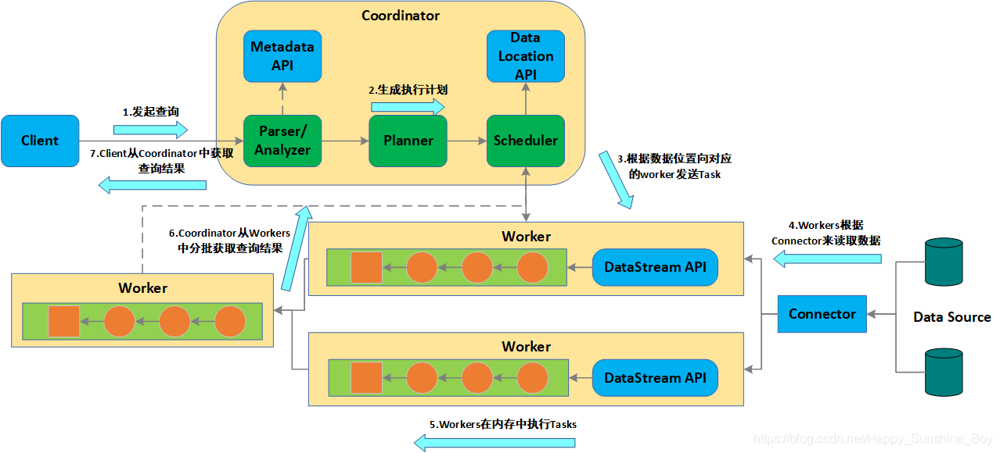
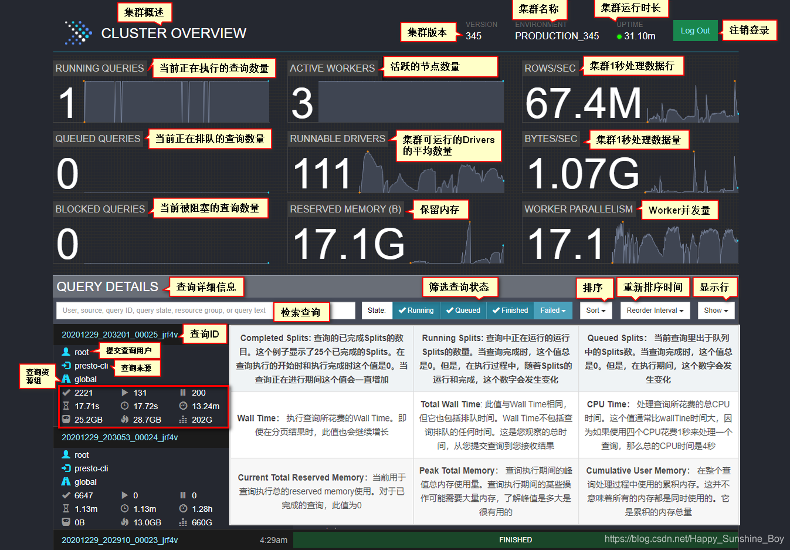
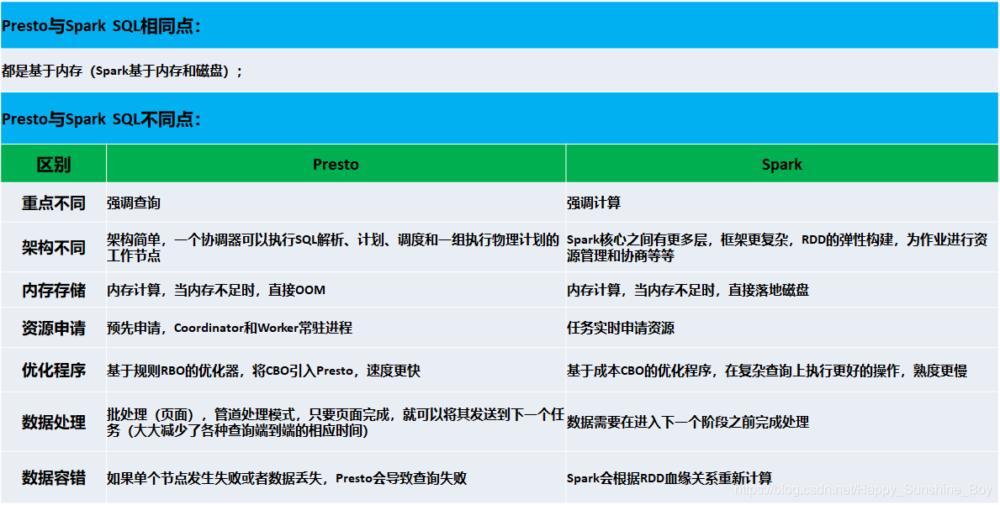

# Trino介绍


## 起源

Presto 是由 FaceBook 2013年开源的一个 **MPP 计算引擎**，**主要用来以解决 Facebook 海量 Hadoop 数据仓库的低延迟交互分析问题**，2018年Facebook 对该项目进行了更严格的控制，Facebook 版本的 Presto 更多的是以解决企业内部需求功能为主，也叫 PrestoDB，版本号以 0.xxx 来划分。

后来，Presto 其中的几个人出来创建了更通用的 Presto 分支，取名 Presto SQL，版本号以 xxx 来划分，例如 345 版本，这个开源版本也是更为被大家通用的版本。2019年因为与Facebook商标纠纷，Presto SQL 将名字改为 Trino，除了名字改变了其他都没变。不管是 Presto DB 还是 Presto SQL，它们”本是同根生“，因此它们的大部分的机制原理是一样的。

### 是什么

官网定义：

> Trino, a query engine that runs at ludicrous speed
> Fast distributed SQL query engine for big data analytics that helps you explore your data universe.
>
> **Trino，一个以高效的速度运行的查询引擎**。
>
> 用于大数据分析的快速**分布式 SQL 查询引擎**，可帮助您探索数据领域。


## 基本概念


## 整体架构


Trino主要是由 Client、Coordinator、Worker 以及 Connector 等几部分构成。

Client就是来接受客户端查询请求的；Coordinator来对接受到的查询进行词法、语法分析，然后进行任务和资源的调度；接下来就是实际执行任务的Worker来做具体的工作了，例如去数据源拉取数据，然后进行计算；那Connector就是Worker去数据源拉取数据的连接器（适配器/管道）。

通过Trino的架构我们就可以看出来为什么Trino可以支持多源数据的查询了，因为引擎本身是通过Connector与数据源进行交互的，Trino提供了一套自定义数据源的统一接口，也就是说，无论我们想要连接什么数据源，我们只需要按照规范开发对应的数据源接口即可。


SQL 执行流程：



Task 执行流程：

任务调度：

- 1.分配多少个任务？

- 2.每个任务分配到哪些机器节点上？拓扑调度算法 (Topology Aware Scheduling strategy)
  答：Presto把集群资源划分成两级结构(Machine，集群)；【两层结构】

  - 分配算法如下：

    ```txt
    2.1 当分配一个Split时候，会给定Split的一个地址，这个地址代表期望的分配地址；（尽量距离数据源最近的地址）
    2.2 从Machine层开始查找，首先查看Machine上已经分配的Split个数是否已满，若未满则分配该机器；
    2.3 若Machine资源池已满，则到集群级别找一台机器，这台机器的资源池使用量小于50%，则分配这台机器。否则分配失败；
    ```


接下来主要介绍下Client、Coordinator、Worker 以及 Connector ：

#### 1.[Clients](https://trino.io/docs/current/client.html)

###### 1.命令行界面

非交互式

```shell
trino --execute 'SELECT nationkey, name, regionkey FROM tpch.sf1.nation LIMIT 3'
```

交互式

```shell
$ trino
trino> select count(*) from tpch.tiny.nations;
```

###### 2.JDBC驱动程序

引入依赖：

```xml
<dependency>
    <groupId>io.trino</groupId>
    <artifactId>trino-jdbc</artifactId>
    <version>360</version>
</dependency>
```

JDBC URL ：

```yaml
jdbc:trino://example.net:8080/hive/sales
```

###### 3.Druid连接池

Druid链接池1.2.6版本已经支持Trino：https://github.com/alibaba/druid/releases

###### 4.工具客户端

- [HUE](https://gethue.com/): 开源 SQL 工作台，支持包括Trino、Apache Flink Sql、Apache Spark Sql等几十个Connectors
- [Yanagishima](https://yanagishima.github.io/yanagishima/):  是适用于 Presto、Hive、Elasticsearch 和 Spark 的开源 Web 应用程序。

#### **2. Coordinator**

Coordinator 服务器是用来解析语句，执行计划分析和管理 Trino的 Worker 节点。Trino安装必须有一个 Coordinator 和多个 Worker。如果用于开发环境和测试，则一个 Trino 实例可以同时担任这两个角色。
Coordinator 跟踪每个 Work 的活动情况并协调查询语句的执行。Coordinator 为每个查询建立模型，模型包含多个Stage，每个Stage再转为Task 分发到不同的 Worker 上执行。
Coordinator 与 Worker、Client 通信是通过 REST API。

**目前官方未提供Coordinator高可用的架构，为此存在单机故障问题。**

#### **3. Worker**

Worker 是负责执行任务和处理数据。Worker 从 Connector 获取数据。Worker 之间会交换中间数据。Coordinator 是负责从 Worker 获取结果并返回最终结果给 Client。
当 Worker 启动时，会广播自己去发现 Coordinator，并告知 Coordinator 它是可用，随 时可以接受 Task。
Worker 与 Coordinator、Worker 通信是通过 REST API。

#### 4. Connectors

Trino 可用于访问来自不同数据源的数据的连接器，目前已经支持：

- [Accumulo](https://trino.io/docs/current/connector/accumulo.html)
- [BigQuery](https://trino.io/docs/current/connector/bigquery.html)
- [Black Hole](https://trino.io/docs/current/connector/blackhole.html)
- [Cassandra](https://trino.io/docs/current/connector/cassandra.html)
- [ClickHouse](https://trino.io/docs/current/connector/clickhouse.html)
- [Druid](https://trino.io/docs/current/connector/druid.html)
- [Elasticsearch](https://trino.io/docs/current/connector/elasticsearch.html)
- [Google Sheets](https://trino.io/docs/current/connector/googlesheets.html)
- [Iceberg](https://trino.io/docs/current/connector/iceberg.html)
- [Hive](https://trino.io/docs/current/connector/hive.html)
- [JMX](https://trino.io/docs/current/connector/jmx.html)
- [Kafka](https://trino.io/docs/current/connector/kafka.html)
- [Kinesis](https://trino.io/docs/current/connector/kinesis.html)
- [Kudu](https://trino.io/docs/current/connector/kudu.html)
- [Local File](https://trino.io/docs/current/connector/localfile.html)
- [Memory](https://trino.io/docs/current/connector/memory.html)
- [MongoDB](https://trino.io/docs/current/connector/mongodb.html)
- [MySQL](https://trino.io/docs/current/connector/mysql.html)
- [Oracle](https://trino.io/docs/current/connector/oracle.html)
- [Phoenix](https://trino.io/docs/current/connector/phoenix.html)
- [Pinot](https://trino.io/docs/current/connector/pinot.html)
- [PostgreSQL](https://trino.io/docs/current/connector/postgresql.html)
- [Prometheus](https://trino.io/docs/current/connector/prometheus.html)
- [Redis](https://trino.io/docs/current/connector/redis.html)
- [Redshift](https://trino.io/docs/current/connector/redshift.html)
- [SingleStore (MemSQL)](https://trino.io/docs/current/connector/memsql.html)
- [SQL Server](https://trino.io/docs/current/connector/sqlserver.html)
- [System](https://trino.io/docs/current/connector/system.html)
- [Thrift](https://trino.io/docs/current/connector/thrift.html)
- [TPCDS](https://trino.io/docs/current/connector/tpcds.html)
- [TPCH](https://trino.io/docs/current/connector/tpch.html)


## Trino UI



Trino官方提供了[Web UI](https://trino.io/docs/current/admin/web-interface.html#user-interface-overview)，**可进行身份的验证**，主页有一个查询列表，以及唯一查询ID、查询文本、查询状态、完成百分比、用户名和此查询来源等信息。当前运行的查询位于页面顶部，然后是最近完成或失败的查询。

可能的查询状态如下：

- `QUEUED`–查询已被接受，正在等待执行。
- `PLANNING`– 查询正在计划中。
- `STARTING`– 正在开始查询执行。
- `RUNNING`– 查询至少有一个正在运行的任务。
- `BLOCKED`–查询被阻止并等待资源（缓冲区、内存、拆分等）。
- `FINISHING`–查询正在完成（例如自动提交查询）。
- `FINISHED`–查询已完成执行，所有输出均已消耗。
- `FAILED`– 查询执行失败。


## 特点及场景

### 特点

Presto 引擎相较于其他引擎的特点是：**多源、即席**。多源就是它可以支持跨不同数据源的联邦查询，即席即实时计算，将要做的查询任务实时拉取到本地进行现场计算，然后返回计算结果。除此之外，对于引擎本身，像官网所述的特点：

- **速度**：Trino 是一个**高度并行和分布式的查询引擎**，它从头开始构建以实现高效、低延迟的分析。
- **规模**：世界上最大的组织使用 Trino 来查询 EB 级数据湖和海量数据仓库。
- **简单**：Trino 是一个符合 ANSI SQL 的查询引擎，可与 R、Tableau、Power BI、Superset 等 BI 工具配合使用。
- **支持多种用例**：以交互速度进行的临时分析、海量多小时批量查询以及执行亚秒级查询的大容量应用程序。
- **就地分析**：您可以在 Hadoop、S3、Cassandra、MySQL 和许多其他应用程序中本地查询数据，而无需复杂、缓慢且容易出错的数据复制过程。
- **联邦查询**：**在单个查询中访问来自多个系统的数据**。例如，将存储在 S3 对象存储中的历史日志数据与存储在 MySQL 关系数据库中的客户数据连接起来。
- **随处运行**：Trino 针对内部部署和云环境（例如 Amazon、Azure、Google Cloud 等）进行了优化。
- **值得信赖**：Trino 被世界上一些最大的组织用于关键业务运营，包括公开市场的财务结果。
- **开源**：Trino 项目是非营利性[Trino 软件基金会](https://trino.io/foundation.html)下的社区驱动项目，**开源协议Apache-2.0 License**。

### 核心场景

- **交互式数据分析**：

  Trino 使用的主要驱动力是**交互式分析**。用户直接使用 SQL 或通过用户界面生成的查询输入查询，并等待尽快返回结果。一旦结果可用，Trino 就会立即将结果返回给用户。这为数据分析师和数据科学家提供了查询大量数据、测试假设、运行 A/B 测试以及构建可视化或仪表板的能力。

- **使用SQL对对象存储进行高性能的分析**：

  Trino 开发的最初用例是启用基于 SQL 的 HDFS/Hive 对象存储系统分析。Trino 的性能如此之高，以至于可以实现过去不可能或需要数小时才能进行的分析。从基于 Hive 的系统迁移和查询云对象存储系统仍然是 Trino 的一个主要用例。

- **使用查询联合进行集中数据访问和分析**：

  **使用相同的 SQL 查询同一系统中的许多不同数据源的能力**极大地简化了需要了解所有数据大图的分析。Trino 中的联合查询可以在同一个查询中访问您的对象存储、您的主要关系数据库和您的新流或 NoSQL 系统。Trino 彻底改变了这个中央数据消费层的可能性。

- **跨不同系统的批量ETL**：

  批量运行的大型提取、转换、加载 (ETL) 进程通常非常占用资源。通常由工程师运营，只要他们最终完成，他们就不会优先返回。**Trino 能够极大地加速 ETL 过程，允许它们都使用标准 SQL 语句，并在同一系统中处理大量数据源和目标**。


## 谁在使用


## 应用案例

整体在国内分享的案例不是很多，最典型的就是在滴滴中的大规模应用：

- [Presto 在滴滴的探索与实践](https://www.infoq.cn/article/VOhWXCQBkP8JfjwDFrV4)： 2018 年 10 月某产品接入后的性能提升，查询耗时 TP50 性能提升了 10+倍，由 400S 降低到 31S。滴滴 Presto 逐渐接入公司各大数据平台，并成为了公司首选 Ad-Hoc 查询引擎及 Hive SQL 加速引擎，具体应用包括：
  - Hive SQL 查询加速
  - 数据平台 Ad-Hoc 查询
  - 报表（BI 报表、自定义报表）
  - 活动营销
  - 数据质量检测
  - 资产管理
  - 固定数据产品
- [Presto 在有赞的实践之路](https://www.infoq.cn/article/mZS7Ij2RZNFPt1sQlbT8)：
  - 数据平台(DP)的临时查询: 有赞的大数据团队使用临时查询进行探索性的数据分析的统一入口，同时也提供了脱敏，审计等功能。
  - BI 报表引擎：为商家提供了各类分析型的报表。
  - 元数据数据质量校验等：元数据系统会使用 Presto 进行数据质量校验。
  - 数据产品：比如 CRM 数据分析，人群画像等会使用 Presto 进行计算。


## Trino VS Impala

Trino 和 Apache Impala都是采用 MPP 架构，且**只负责计算，不负责存储的引擎**的 OLAP 引擎，下面来进行对比下Apache Impala 和Trino。

#### 1. Apache Impala介绍

Apache Impala 是采用 MPP 架构的查询引擎，本身不存储任何数据，**直接使用内存进行计算**，兼顾[数据仓库](http://www.imcdo.com/tag/数据仓库)，具有实时，批处理，多并发等优点。

提供了类[SQL](http://www.imcdo.com/tag/sql)（类 Hsql）语法，在多用户场景下也能拥有较高的响应速度和吞吐量。它是由[Java](http://www.imcdo.com/tag/java)和 C++实现的，Java 提供的查询交互的接口和实现，C++实现了查询引擎部分。

Impala 支持共享[Hive](http://www.imcdo.com/tag/hive) Metastore，但没有再使用缓慢的 Hive+MapReduce 批处理，而是通过使用与商用并行关系数据库中类似的分布式查询引擎（由 Query Planner、Query Coordinator 和 Query Exec Engine 三部分组成），可以直接从 [HDFS](http://www.imcdo.com/tag/hdfs) 或 HBase 中用 SELECT、JOIN 和统计函数查询数据，从而大大降低了延迟。

Impala 经常搭配存储引擎[Kudu](http://www.imcdo.com/tag/kudu)一起提供服务，这么做最大的优势是查询比较快，并且支持数据的 Update 和 Delete。

#### 2.Trino VS Impala

|                     | Impala                                                       | Tirno                                                        |
| ------------------- | ------------------------------------------------------------ | ------------------------------------------------------------ |
| 开源时间            | Cloudera公司主导开发                                         | Facebook在2013/11开源                                        |
| 开源现状            | 2017年11月成为Apache顶级项目                                 | Facebook、Netflix、Airbnb、Pinterest 和 Lyft 等类型的数据驱动公司大规模的使用 |
| 开源基金会          | Apache                                                       | Trino 基金会                                                 |
| 开源协议            | Apache-2.0 License                                           | Apache-2.0 License                                           |
| Github Star         | 654                                                          | 3.8k                                                         |
| Github Contributors | 160                                                          | 495                                                          |
| SQL支持             | 类SQL                                                        | ANSI SQL                                                     |
| 内存依赖            | 高                                                           | 高                                                           |
| 跨数据源联合查询    | 不支持                                                       | 支持                                                         |
| 支持数据源          | Kudu、Hive、Hbase                                            | hive、hbase、iceberg、kafka、kudu、PostgreSQL等几十个数据源  |
| 文件格式            | 仅支持  text files, Parquet, Avro, SequenceFile, and RCFile  | 支持 ORC、Parquet、Avro、RCFile、SequenceFile、JSON、Text    |
| UDF支持             | 支持                                                         | 支持                                                         |
| 文档                | [规范、详细、PDF方式](https://impala.apache.org/docs/build/impala-4.0.pdf) | [规范、详细、友好](https://trino.io/docs/current/)           |
| 客户端              | shell command, Hue, JDBC, or ODBC.                           | shell command, Hue,Yanagishima, JDBC, Druid Pool             |

#### 3.Impala VS Trino总结

|        | 优点                                                         | 缺点                                                         |
| ------ | ------------------------------------------------------------ | ------------------------------------------------------------ |
| Impala | 1、跟Hadoop社区深度结合                                                                                                                               2、集成在Cloudera Manager和Ambari中，方便统一安装和管理<br/>3、跟KUDU结合很好 | 1、接入Hive，impala需要用另外定时任务广播元数据，新生成的数据，用impala不能立即查询。 |
| Trino  | 1、开源 Trino 社区可以提供更强大的支持，这也确保了大量用户正在使用 Trino                                                     2、支持丰富的数据源                                                                                                                                                     3、支持不同数据源的联合查询<br/>4、社区活跃度高，且经过了像Facebook、Netflix、Airbnb、Pinterest 和 Lyft 等类型的数据驱动公司的规模（PB 规模）上的测试<br/>5、支持Druid Pool方式，，对后续应用开发比较友好 | 1、需单独部署和维护                                          |


## Trino 和 Spark 简单对比




## 我们的需求

- **支持数据湖Iceberg的Ad-hoc的需求**：通过Trino高效的交互分析能力和支持Iceberg数据源，可以**支持数据湖Iceberg的Ad-hoc的需求**
- **支持跨数据源的联合查询**：通过Trino**跨数据源联合查询**的能力可以很方便拓展未来例如像**Iceberg表关联TiDB等的跨源的联合查询的需求**
- **统一OLAP查询引擎**：通过Trino支持丰富的数据源，可以进行**统一OLAP查询引擎**


## 总结

#### 优点

- 高效的交互分析能力
- 支持跨数据源的联合查询
- 支持丰富的数据源
-  经历过Facebook、Netflix、Airbnb、Pinterest 和 Lyft 等类型的数据驱动公司的规模（PB 规模）的环境下可以成功的得到大量使用，扩展性和稳定性毋容置疑

#### 缺点

- 基于MPP架构，因为 task 和 Executor 是绑定的，如果某个 Executor 执行过慢或故障，将会导致**整个集群的性能就会受限于这个故障节点的执行速度**(所谓木桶的短板效应)，所以 MPP 架构的最大缺陷就是——**短板效应**
- 最新Trino需要64 位版本的 Java 11，最低要求版本为 11.0.11
- Trino未集成到Cloudera Manager或者Ambari上，是单独的Trino Web UI管理
- **存在Coordinator单机故障问题**


## Ref

【Trino官网】https://trino.io/

【Presto在滴滴的探索与实践】https://www.infoq.cn/article/VOhWXCQBkP8JfjwDFrV4

【Presto 原理 & 调优 & 面试 & 实战全面升级版】https://xie.infoq.cn/article/ef2cde3e4d6a2ac1ad6baa2e0

【OLAP 计算引擎怎么选？】https://xie.infoq.cn/article/c30c0087d2a4236b56a3f33fc

【到底什么是数据仓库的MPP架构？】http://www.imcdo.com/blog/datawarehouse/5092.html

【Presto vs. Impala】https://cloud-atlas.readthedocs.io/zh_CN/latest/big_data/presto_vs_impala.html

【HUE官网】https://gethue.com/

【从 0 到 1 学习 Presto，这一篇就够了！】https://blog.csdn.net/weixin_44318830/article/details/114339496

【KeepAlive + VIP 配置高可用Presto-master主备集群(单活）】https://blog.csdn.net/liaynling/article/details/86589488

【Presto 协调器高可用性 (HA)】https://coding-stream-of-consciousness.com/2018/12/29/presto-coordinator-high-availability-ha/

【Trino 总结】https://blog.csdn.net/Happy_Sunshine_Boy/article/details/112967839


**本页编辑**      **[@gongshiwen](http://192.168.1.23/gongshiwen)**  