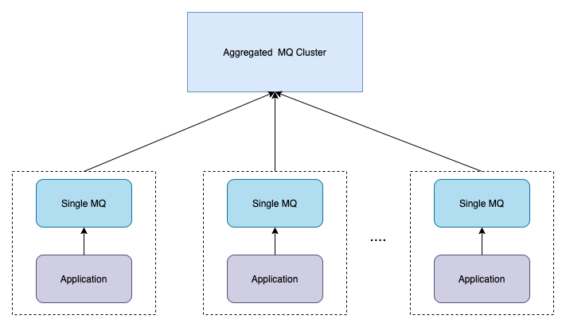

# 基于MQ的边缘计算和汇聚方案

## 什么是“边缘”或“边缘计算”？

维基百科称“**边缘计算是一种分布式计算范式，它使计算和数据存储更接近需要的位置，以改善响应时间并节省带宽。**”其他好处包括增加成本降低、灵活的架构和关注点分离。

## 多个MQ集群成为规范，而不是例外！

Apache Kafka/Pulsar的多集群和跨数据中心部署已成为常态，而不是例外。以下描述的MQ代指：Kafka 或者 Pulsar，因为Kafka和Pulsar为边缘计算提供了可能。

边缘的MQ部署可以是一个独立的项目。然而，在大多数情况下，**边缘的MQ是整个MQ架构的一部分**。

**在您的组织中创建多个MQ集群**存在许多原因：

- 独立项目
- 混合集成
- **边缘计算**
- **聚合**
- 移民（数据迁移）
- 灾难恢复
- 全球基础设施（区域甚至跨大陆通信）
- 跨公司通信

## 现实行业边缘的用例

**在各个行业都有在边缘部署MQ的用例**。无论“你的东西”是智能手机、车间机器、传感器、汽车、机器人、现金点机或其他任何东西。

让我们看看我在2019年在许多不同企业中看到的几个例子：

- **工业物联网（IIoT）：**实时边缘集成和处理是现代物联网架构取得成功的关键。工业4.0存在各种用例，包括预测维护、质量保证、流程优化和网络安全。[使用Kafka构建数字孪生](https://www.kai-waehner.de/blog/2019/11/28/apache-kafka-industrial-iot-iiot-build-an-open-scalable-reliable-digital-twin/)是最常见的场景之一，非常适合许多用例。
- **零售**：数字转型使许多新的、创新的用例成为可能，包括客户360体验、交叉销售以及与合作伙伴供应商的合作。这与任何类型的零售商都相关。无论您是考虑沃尔玛等零售店、星巴克等咖啡店，还是亚马逊围棋店等尖端商店。
- **物流**：大规模实时数据相关是任何物流场景的游戏规则改变者：跟踪和跟踪端到端进行包裹交付，交付无人机（或人类使用汽车）与当地自助收集亭之间的通信，物流中心加速处理，共享汽车/乘车共享的协调和规划，智能城市中的交通灯管理等。
- **公共部门**：每个城市的地方行政，包括公共交通在内的智慧城市项目，交通管理，不同汽车制造商的各种连接汽车平台的集成，网络安全（包括捕获和处理相机图像等物联网用例）
- **能源/公用事业/石油和天然气**：智能家居、智能建筑、智能仪表、远程机器监控（例如钻井、风车、采矿）、管道和炼油厂运营（例如预测故障或异常检测）
- **电信/媒体**：OSS实时监控/问题分析/指标报告/根本原因分析/网络设备和基础设施（路由器、交换机、其他网络设备）、BSS客户体验和OTT服务（数百万用户的移动应用程序集成）、5G边缘（例如街道传感器）
- **医疗保健**：医院跟踪、远程监控、机器传感器分析
- **交通/物流/铁路/航空**：轨道和跟踪，列车中的卡夫卡进行离线和本地处理/存储，旅行者信息（延迟或取消的航班/火车/公共汽车），实时忠诚平台（升级，休息室访问）

## 在边缘部署MQ的基础设施和硬件要求

最后，重要的是讨论如何在边缘部署MQ。需要说明的是：**MQ仍然需要一些计算能力**。

显然，这取决于许多因素：您正在使用的**硬件供应商和基础设施**、特定的**SLA和HA要求**等。好消息是，**MQ可以部署在许多基础设施中**，包括裸机、虚拟机、容器、Kubernetes等。另一个好消息是，用于计算资源的新硬件（即使是“边缘”）通常有4、8甚至16GB的RAM，因为这是当今供应商生产的最小的芯片（适用于这些环境，如小工厂、零售店等）。

**运行非常小的占地面积的Kafka的最低硬件要求是单核处理器和几个100MB的RAM。这已经允许在一个MQ节点上进行100+Mb/秒吞吐量的体面边缘处理（复制因子=1）。**然而，真实值取决于分区数量、消息大小、网络速度和其他特征。不要期望与数据中心或云中的相同性能和可扩展性！

## 我们的场景

我们的需求是将远程的医疗机构数据汇聚到我们的数据中心，并提供数据服务。在我们的场景中，一个数据中心会对应n个的前置机，前置机是靠近数据源部署的，我们前置机的应用主要的工作就是采集数据源数据，并将采集的数据汇聚到数据中心。为此前置机的场景是：

- 靠近数据源，且单点
- 前置机与采集点一一对应，**数量多**
- 与数据中心需网络交互
- 前置机核心工作
  - **数据采集**
  - **数据同步**到中心
  - **数据压缩**
  - **数据加密**

由上可见，我们正是符合**边缘计算和聚合**的场景，以下主要进行阐述如何通过MQ来构建我们的边缘计算和聚合。

前置机有单点的特性，在前置机上**单节点MQ部署有效，仍然提供MQ基础功能的许多好处**：

- **生产者和消费者之间的解偶**
- **背压的**处理
- **大容量实时处理**
- 磁盘上的**存储**
- **重新处理数据的能力**
- 压缩、加密等计算能力
- 边缘到远程：数据源->采集器->边缘的Pulsar->复制->Pulsar（数据中心/云）->分析/实时处理
  - Pulsar的跨地域复制: 两个Pulsar集群之间的单向或者双向复制
  - Kafka的MirrorMark2/ Confluent Replicator: 两个Kafka集群之间的单向或双向复制
- 单节点部署简单
  - Pulsar单点部署内置了Zookeeper，无需额外部署，且Zookeeper的启停一起内置到Pulsar启停命令中
  - Kafka单点内置了Zookeeper，无需额外部署Zookeeper，在未来将移除Zookeeper的依赖，

## 总结

通过单点MQ边缘计算和汇聚的能力，能给我们带来以下好处：

- 通过MQ的**高吞吐能力**，可以达到边缘节点数据缓存的能力

- 通过MQ的**地理复制能力**可以将边缘节点数据汇聚到中心

- 通过MQ的**限流能力**能够更好的控制整个入口的流量
- 通过MQ的**压缩能力**可以降低磁盘和流量带宽
- 通过MQ的**加密功能**可以保证数据的安全

整体上在我们的场景中，达到了**边缘计算是一种分布式计算范式，它使计算和数据存储更接近需要的位置，以改善响应时间并节省带宽**的定义。降低了整体架构的复杂度，前置机只管采集和写入到MQ，无需再考虑数据同步、压缩、加密、限流等等架构方案。

## Ref

【Apache Pulsar geo-replication】https://pulsar.apache.org/docs/en/next/administration-geo/

【Apache Kafka Geo-Replication (Cross-Cluster Data Mirroring)】https://kafka.apache.org/documentation/#georeplication

【Apache Kafka is the New Black at the Edge in Industrial IoT, Logistics and Retailing】https://www.kai-waehner.de/blog/2020/01/01/apache-kafka-edge-computing-industrial-iot-retailing-logistics/

【Use Cases and Architectures for Kafka at the Edge】https://www.kai-waehner.de/blog/2020/10/14/use-cases-architectures-apache-kafka-edge-computing-industrial-iot-retail-store-cell-tower-train-factory/

【Introducing Cluster Linking in Confluent Platform 6.0】https://www.confluent.io/blog/kafka-cluster-linking-with-confluent-platform/

【Geo-Replication in Apache Pulsar, Part 2: Patterns and Practices】https://www.splunk.com/en_us/blog/devops/geo-replication-in-apache-pulsar-part-2-patterns-and-practices.html

【博文推荐 | Apache Pulsar 三大跨地域复制解决方案】https://mp.weixin.qq.com/s?__biz=MzUyMjkzMjA1Ng==&mid=2247487443&idx=2&sn=b9dcb5013a17c8afeb7edaf628bd162b&scene=21#wechat_redirect

【专题｜防宕机，Pulsar 跨机房复制了解一下？】https://mp.weixin.qq.com/s/hrDUabaOWoj9AQiKozTZfA

