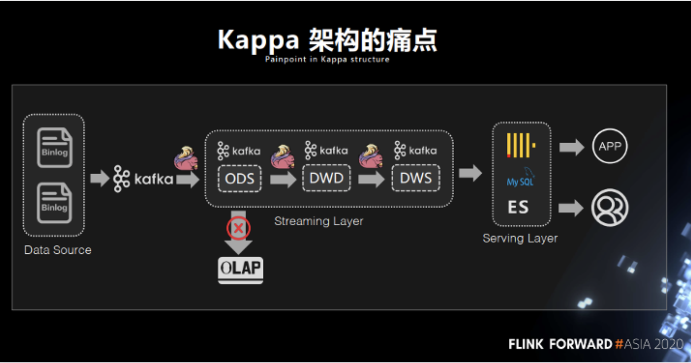
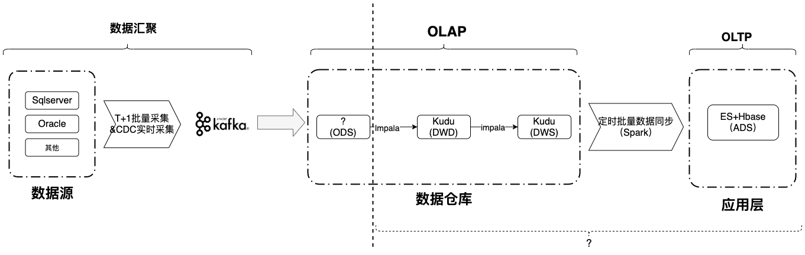
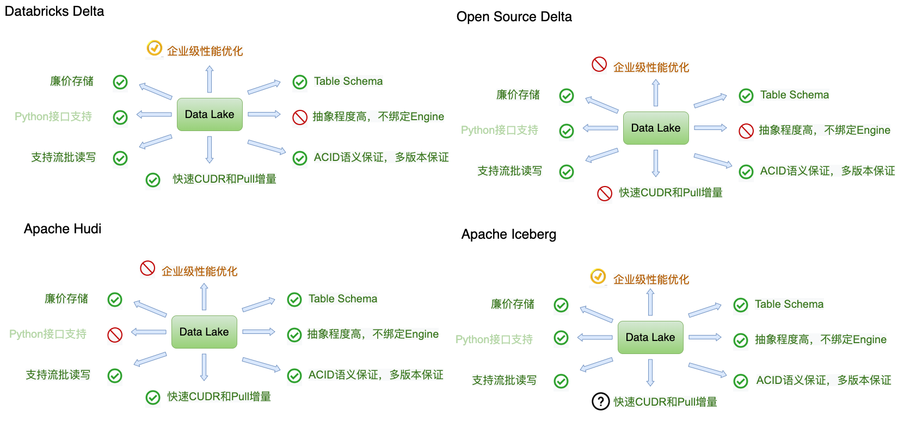
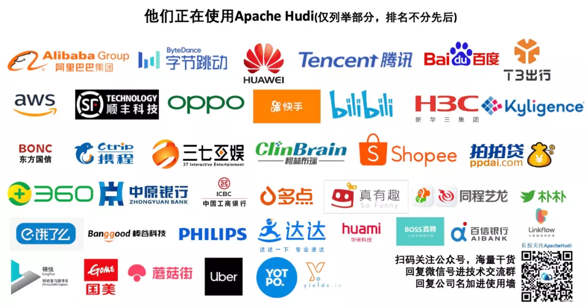
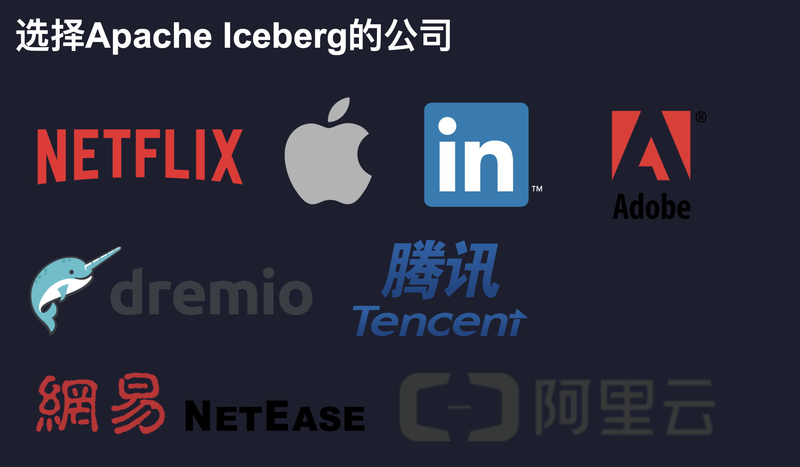
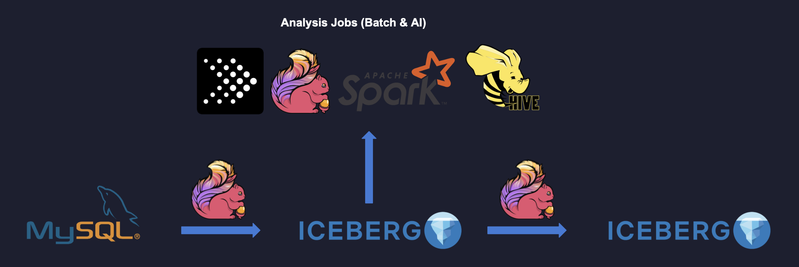
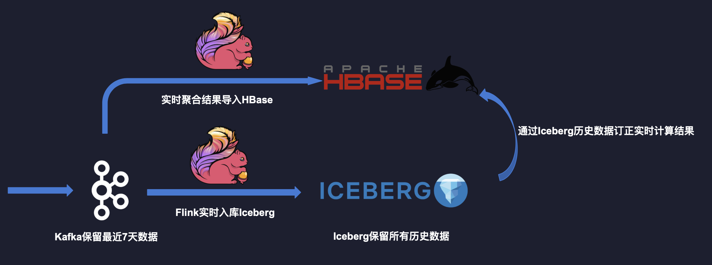
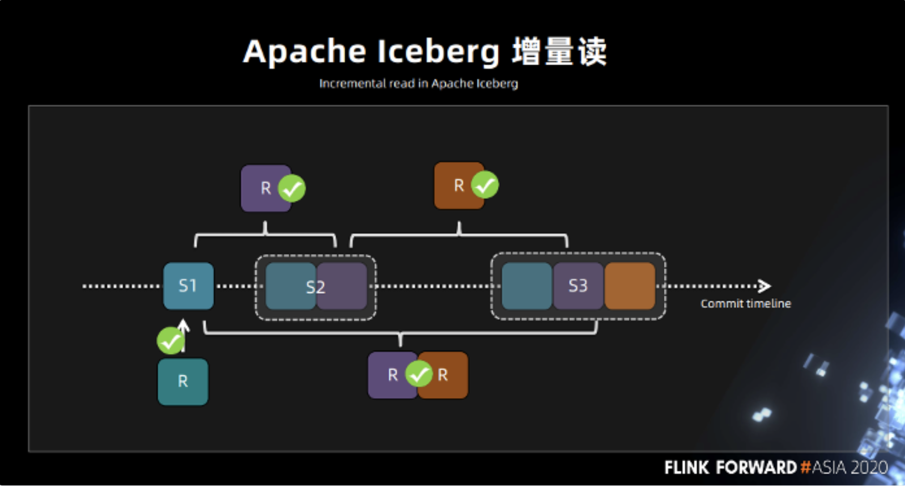
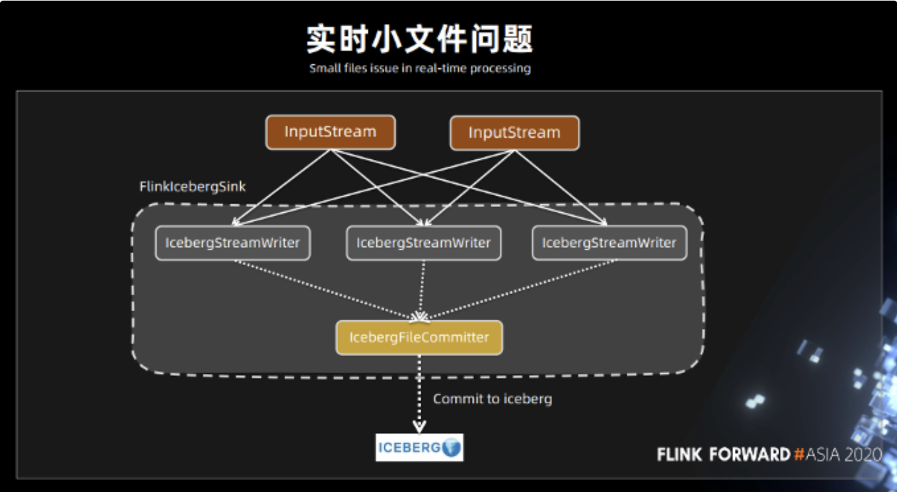

# 数据湖选型

## 一、我们的背景和痛点

当前每天汇聚来自37家机构在线系统，汇聚的大多是基于Oracle、Sqlserver等传统关系型数据库的数据源，每天汇聚的数据都在TB级以上。

当前是**基于传统T+1任务**构建的数据平台：


存在以下痛点：

- 海量的TB级 T+ 1 任务延迟导致下游数据产出时间不稳定
- 基于Hive的数仓的痛点
  - 不支持ACID
    - 不支持Row-Level Delete，数据修正成本高
    - 不支持Upsert场景
  - 时效性难以提升
    - 数据难以做到准实时可见
    - 无法增量读取，无法实现存储层面的流批统一
  - Table Evolution
    - 写入型Schema，对Schema变更支持不友好：当前是整表数据重采
    - Partition Spec变更支持不友好：当前是整表数据重采
- 为了提供实时对外服务，每天进行定时批量数据的同步，导致数据存储冗余，且难以保证数据的一致性
- 架构复杂，涉及多个系统协调，靠调度系统来构建任务依赖关系

## 二、改进T+1任务的公认架构

#### 2.1 Lambda 架构


Lambda架构的核心是按需使用**批量和流式的处理框架**，分别针对批式和流式数据提供相应的处理逻辑，Lambda架构解决了T+1任务数据实时性的问题。最终通过一个服务层进行对外服务的输出。

Lambda架构痛点：

- 同时维护实时平台和离线平台两套引擎，运维成本高
- 实时离线两个平台需要维护两套框架不同但业务逻辑相同代码，开发成本高
- 数据有两条不同链路，容易造成数据的不一致性
- 数据更新成本大，需要重跑链路

#### **2.2 Kappa 架构**



Kappa 架构的核心是**强依赖消息队列**，**用消息队列作为实时数仓**，通过用 Flink或Spark Streaming  将整个链路串联起来。Kappa 架构解决了 Lambda 架构中离线处理层和实时处理层之间由于引擎不一样，导致的运维成本和开发成本高昂的问题，但 Kappa 架构也有以下痛点：

- 对消息队列存储要求高，消息队列的回溯能力不及离线存储
- 消息队列本身对数据存储有时效性，且当前无法使用 OLAP 引擎直接分析消息队列中的数据
- 全链路依赖消息队列的实时计算可能因为数据的时序性导致结果不正确

## 三、构建基于我们场景的湖仓需求

虽然Lambda架构存在以上的痛点，但是**Lambda架构是批流一体化的必然要求**，原因来自于我们现实的业务场景。很多时候机构方出于对性能、数据库配置的考虑，可能有的数据库本身不能开change log。所以实际上并不是所有情况下都能从源端获取实时的流数据。且为了保证机构方在线业务的稳定性，机构方并不能全天侯开放数据源供我们进行数据采集，常常是在凌晨无在线业务压力开放数据采集权限。

之前我们介绍过，我们会**基于MQ的批流一体的数据汇聚方案**，为此数据会汇聚到MQ，今天我要讲的是数据汇聚到MQ之后，**ODS层的技术选型，以及如何构建ODS层？**



##### 3.1 湖仓建设需求

是否存在一种存储技术，既能够支持数据的更新，又能够实现数据的批流读写，并且还能够实现分钟级到秒级的数据接入？

构建批流一体湖仓迫切需求（如下图）


接下来主要介绍当前比较火的数据湖。以及基于数据湖Apache Iceberg构建批流一体的湖仓（ODS层)。

## 四、 数据湖介绍

#### 4.1 是什么

Wikipedia的定义：

> 数据湖是一类存储数据自然/原始格式的系统或存储，通常是对象块或者文件。数据湖通常是企业中全量数据的单一存储。全量数据包括原始系统所产生的原始数据拷贝以及为了各类任务而产生的转换数据，各类任务包括报表、可视化、高级分析和机器学习。数据湖中包括来自于关系型数据库中的结构化数据（行和列）、半结构化数据（如CSV、日志、XML、JSON）、非结构化数据（如email、文档、PDF等）和二进制数据（如图像、音频、视频）。数据沼泽是一种退化的、缺乏管理的数据湖，数据沼泽对于用户来说要么是不可访问的要么就是无法提供足够的价值。

AWS的定义：

> 数据湖是一个集中式存储库，允许您以任意规模存储所有结构化和非结构化数据。您可以按原样存储数据（无需先对数据进行结构化处理），并运行不同类型的分析 – 从控制面板和可视化到大数据处理、实时分析和机器学习，以指导做出更好的决策。

##### 4.1.1 基本特征

- 存储原始数据
  - 结构化数据
  - 半结构化数据
  - 非结构化数据
  - 二进制数据(图片等）
- 多种计算模型
  - 批处理
  - 流处理
  - 交互式分析
  - 机器学习
- 完善的数据管理
  - 多种数据源接入
  - 数据连接
  - Schema管理
  - 权限管理
- 灵活的底层存储
  - S3/OSS/HDFS
  - Parquet/Avro/Orc
  - 数据缓存加速
  - 轻量级索引

#### 4.2 数据湖 vs 数据仓库

|     特性      |                        数据仓库                        |                            数据湖                            |
| :-----------: | :----------------------------------------------------: | :----------------------------------------------------------: |
|   **数据**    | 来自事务系统、运营数据库和业务线应用程序的**关系数据** | 来自 IoT 设备、网站、移动应用程序、社交媒体和企业应用程序的**非关系和关系数据** |
|  **Schema**   |        设计在数据仓库实施之前（写入型 Schema）         |              分析时定义Schema（读取型 Schema）               |
|  **性价比**   |             更快查询结果会带来较高存储成本             |                 更快查询结果只需较低存储成本                 |
| **数据质量 ** |                 质量高，可作为事实依据                 |         包含大量原始数据，使用前需要清洗和标准化处理         |
|   **用户**    |                       业务分析师                       |     数据科学家、数据开发人员和业务分析师（使用监管数据）     |
|   **分析**    |                批处理报告、BI 和可视化                 |              机器学习、预测分析、数据发现和分析              |

#### 4.3 数据湖领域三巨头

当前数据湖领域三巨头：Delta Lake、Apache Hudi、Apache Iceberg。

- DELTA LAKE，在17年的时候 DataBricks 就做了 DELTA LAKE 的商业版。主要想解决的也是基于 Lambda 架构带来的存储问题，它的初衷是希望通过一种存储来把 Lambda 架构做成 kappa 架构。
- Hudi ( Uber 开源 ) 可以支持快速的更新以及增量的拉取操作。这是它最大的卖点之一。
- Iceberg 的初衷是想做标准的 Table Format 以及高效的 ETL。

##### 4.3.1如何定义这类新的技术

Delta Lake 将其定义为：Delta Lake is an open-source storage layer that brings ACID transactions to Apache Spark and big data workloads。而 Apache Iceberg 将其定义为：Apache Iceberg is an open table format for huge analytic datasets。

首先，这类技术它的定位是在计算引擎之下，又在存储之上。其次，它是一种数据存储格式，Delta Lake 称其为 “storage layer”，而 Iceberg 则称其为 “table format”。在整体来看，这类技术是介于计算引擎和数据存储格式中间的数据组织格式。通过特定的方式将数据和元数据组织起来，因此称之为数据组织格式更为合理，而 Iceberg 将其定义为表格式也直观地反映出了它的定位和功能，下文将此类技术统称为”表格式”。


##### 4.3.2 DataLake 现状

8个维度深度对比Delta、Hudi、Iceberg

###### 4.3.2.1 2020 DataLake 现状


###### 4.3.2.2 2021-7 DataLake 现状



###### 4.3.2.3 大维度对比Hudi 和 Iceberg

其中Databricks的Delta Lake分为开源版和商业版本，且深度绑定spark，而Apache社区的两个项目Apache Iceberg 和 Apache Hudi 因为全部开源，且社区蓬勃发展，目前是主流被各大小公司能接受的方案。

下表从多个维度对两者者进行了总结，需要注意的是此表所列的能力仅代表至 2021/7底。

|                                  | Apache Hudi                                                  | Apache Iceberg                               |
| -------------------------------- | ------------------------------------------------------------ | -------------------------------------------- |
| Apache 孵化时间                  | 2019/1-2020/5                                                | 2018/11-2020/05                              |
| Apache 现状                      | 顶级项目                                                     | 顶级项目                                     |
| Github star                      | 2.1k                                                         | 1.8k                                         |
| Github Contributors              | 188                                                          | 162                                          |
| ACID(事务)语义保证，多版本保证   | 支持                                                         | 支持                                         |
| 事务隔离级别                     | Write Serialzation                                           | Snapshot serialization                       |
| Time Travel                      | 支持                                                         | 支持                                         |
| **Row-level DELETE (batch)**     | 支持                                                         | 支持                                         |
| **Row-level DELETE (streaming)** | 支持                                                         | 支持                                         |
| Table Schema                     | 支持                                                         | 支持                                         |
| 不强绑定Engine                   | 支持（Hive、Spark、Flink、PrestoDB、Trino、Impala）          | 支持（Hive、Spark、Flink、Trino）            |
| 支持流批读写                     | 支持                                                         | 支持                                         |
| Python 接口支持                  | 不支持                                                       | 支持                                         |
| 廉价存储                         | 支持                                                         | 支持                                         |
| Schema Evolution                 | 向后兼容，用新的schema可以读取旧数据，如果字段没值，就用default值 | 支持添加、删除、更新或重命名，并且没有副作用 |
| FileFormats                      | Avro,Parquet,ORC                                             | Avro,Parquet, ORC                            |
| 增量摄取                         | Spark                                                        | Spark、Flink                                 |
| 隐藏分区                         | 不支持                                                       | 支持（Spark、Flink Datastream）              |
| 文件加密                         | 不支持                                                       | 支持                                         |

###### 4.3.2.4 Iceberg VS Hudi总结

以下各自优点既是对方的缺点。

|         | 优点                                                         | 缺点                                                         |
| ------- | ------------------------------------------------------------ | ------------------------------------------------------------ |
| Iceberg | 1、基础架构更加的坚实和严谨<br/>2、Schema支持增、删、改字段<br/>3、支持隐藏分区<br/>4、无需强主键 | 1、小文件问题需要单独维护，暂未实现内治理<br/>2、国内社区的活跃度相对没有那么高 |
| Hudi    | 1、功能更加丰富<br/>2、国内社区相对更活跃<br/>3、目前对upsert的支持更好<br/>4、内部已经实现小文件管理 | 1、Schema只支持向后兼容<br/>2、必须强主键，主键不支持更新    |

#### 4.5. Apache Hudi介绍

##### 4.5.1 背景

Hudi是为了解决Ubser在Hadoop数据湖上进行更新、删除的需求而产生的。

官网定义

> Hudi is a rich platform to build streaming data lakes with incremental data pipelines on a self-managing database layer, while being optimized for lake engines and regular batch processing.
>
> Hudi 是一个丰富的平台，用于在自我管理的数据库层上构建具有增量数据管道的流数据湖，同时针对湖引擎和常规批处理进行了优化。


##### 4.5.2 特性

- 使用快速、可插入索引进行更新、删除
- 事务、回滚、并发控制。
- 自动文件大小调整、数据聚类、压缩、清理。
- 用于可扩展存储访问的内置元数据跟踪。
- 增量查询、记录级变更流
- 来自 Spark、Presto、Trino、Hive 等的 SQL 读/写
- 流摄取、内置 CDC 源和工具。
- 向后兼容的模式演变和执行。

##### 4.5.3 选择Apache Hudi的公司



##### 4.5.4 核心应用场景

**场景一：近实时摄取**

参见：[近实时摄取](https://hudi.apache.org/docs/use_cases#near-real-time-ingestion) 

**场景二：数据删除**

参见：[数据删除]( https://hudi.apache.org/docs/use_cases#data-deletion)

**场景三：用于分析的统一存储**

参见：[用于分析的统一存储](https://hudi.apache.org/docs/use_cases#unified-storage-for-analytics) 

**场景四：增量处理管道**

参见：[增量处理管道](https://hudi.apache.org/docs/use_cases#incremental-processing-pipelines) 

##### 4.5.6 国内应用案例

- [字节跳动基于Apache Hudi构建EB级数据湖实践](https://mp.weixin.qq.com/s/oZz_2HzPCWgzxwZO0nuDUQ)

- [阿里云基于Apache Hudi构建Lakehouse实践探索](https://mp.weixin.qq.com/s/fGZdpEECynGWnPJJRgxspw)

- [快手基于Apache Hudi的实践](https://mp.weixin.qq.com/s/aE0OadGV1P8HB5_Ski1VGQ)：解决包括数据调度、数据同步和修复回刷三大类业务痛点，包括数据全量回刷效率低。

- [基于 Apache Hudi 构建实时数据湖在百信银行的实践](https://mp.weixin.qq.com/s/teFKWFYFbyD1yM2d1uyh-g)：

- [数仓实时化改造：Hudi on Flink 在顺丰的实践应用](https://mp.weixin.qq.com/s/H17GXC_ucC6oVLSrv6VBQQ)
- [贝壳找房利用Hudi构建准实时数仓的实践与挑战](https://mp.weixin.qq.com/s?__biz=MzIyMzQ0NjA0MQ==&mid=2247484149&idx=1&sn=3f222357c7ad844291d0fa29c1c0956a&chksm=e81f5783df68de95e19753910fa793399385217a39312885e48ab78e83d3e9f00689e9194928&token=1889807326&lang=zh_CN#rd)
- [T3 出行构建数据湖上低延迟数据 Pipeline 的实践](https://mp.weixin.qq.com/s/jfDDsdHV-qfouz-NlK_ZFQ)

##### 4.5.7 技术原理

- [Apache Hudi 设计与架构最强解读](https://mp.weixin.qq.com/s?__biz=MzIyMzQ0NjA0MQ==&mid=2247484778&idx=1&sn=1a52540f24c641ac17ec647fa241fbe9&chksm=e81f501cdf68d90a35e0277bc053274d8a2b0f36c639949c5e87ff7256b7b6e07388bbd39bf5&token=1889807326&lang=zh_CN#rd)

- [17张图带你彻底理解Hudi Upsert原理](https://mp.weixin.qq.com/s/BYHwv16A7LAKZMnOZ8y6mA)
- [Apache Hudi核心概念一网打尽](https://mp.weixin.qq.com/s/fSweg0XkFcOvsD3q8tKiNg)
- [Apache Hudi如何智能处理小文件问题](https://www.cnblogs.com/leesf456/p/14642991.html)

#### 4.6 Apache Iceberg介绍

##### 4.6.1 背景

**Netflix 为了解决Hive的痛点**

**官网定义**

> Apache Iceberg is an **open table format** for huge analytic datasets. Iceberg adds tables to Trino and Spark that use a high-performance format that works just like a SQL table.
> **Apache Iceberg 是一种用于大型分析数据集的开放表格式。**Iceberg 向 Trino 和 Spark 添加了使用高性能格式的表，就像 SQL 表一样。

**表和表格式解释**

> 表和表格式是两个概念。表是一个具象的概念，应用层面的概念，我们天天说的表是简单的行和列的组合。而表格式是数据库系统实现层面一个抽象的概念，**主要用于向下管理在存储系统上的文件，向上为计算层提供一些接口**，它定义了一个表中包含哪些字段，表下面文件的组织形式、表索引信息、统计信息以及上层查询引擎读取、写入表中文件的**接口**。

##### 4.6.2 特性

###### 4.6.2.1 用户体验

Iceberg避免了令人不快的惊喜。架构演进有效，不会无意中删除数据。用户无需了解分区即可获得快速查询。

- [架构演进](https://iceberg.apache.org/evolution#schema-evolution)支持添加、删除、更新或重命名，[没有副作用](https://iceberg.apache.org/evolution#correctness)
- [隐藏分区](https://iceberg.apache.org/partitioning)可防止用户错误，导致无声错误的结果或异常缓慢的查询
- [分区布局演进](https://iceberg.apache.org/evolution#partition-evolution)可以随着数据量或查询模式的变化而更新表的布局
- [时间旅行](https://iceberg.apache.org/spark#time-travel)允许使用完全相同的表快照的可重现查询，或允许用户轻松检查更改
- 版本回滚允许用户通过将表重置为良好状态来快速纠正问题

###### 4.6.2.2 可靠性和性能

Iceberg是为巨大的表建造的。Iceberg 用于生产中，其中**单个表可以包含数十 PB 的数据**，甚至可以在没有分布式 SQL 引擎的情况下读取这些巨大的表。

- [扫描计划很快](https://iceberg.apache.org/performance#scan-planning)不需要分布式 SQL 引擎来读取表或查找文件
- [高级过滤](https://iceberg.apache.org/performance#data-filtering)-使用表元数据，使用分区和列级统计信息修剪数据文件 Iceberg 旨在解决最终一致的云对象存储中的正确性问题。

- [适用于任何云商店](https://iceberg.apache.org/reliability)，通过避免列表和重命名，在HDFS中减少NN拥塞
- [可序列化隔离 ](https://iceberg.apache.org/reliability)– 表更改是原子的，读者永远不会看到部分或未提交的更改
- [多个并发写入器](https://iceberg.apache.org/reliability#concurrent-write-operations)使用乐观并发，并将重试以确保兼容的更新成功，即使写入冲突

##### 4.6.3能力总结


##### 4.6.4 **选择Apache Iceberg的公司**

#### 

##### 4.6.5 核心应用场景

**场景一: 构建近实时Data Pipeline**


**场景二: CDC数据实时摄入摄出**



**场景三: 近实时场景的流批统一 **


**场景四: 从Iceberg历史数据启动Flink任务**


**场景五: 通过Iceberg数据来订正实时聚合结果**



##### 4.6.6 国内应用案例

- [腾讯基于Flink + Iceberg 全场景实时数仓的建设实践](https://developer.aliyun.com/article/781534)：小程序和视频号这两款应用每天或者每个月产生的数据量都在 PB 级或者 EB 级以上
- [腾讯百亿级实时入湖实战](https://files.alicdn.com/tpsservice/cb1b9c805f6ef16820456efe7abb5a15.pdf?spm=a1zmmc.index.0.0.f1b7719db5iDKJ&file=cb1b9c805f6ef16820456efe7abb5a15.pdf)：
  - 手Q安全数据入湖：手 Q 的用户关联维表为 28 亿，每天的消息队列是百亿级的
  - 新闻平台索引分析：索引单表超千亿，单 batch 2000 万
  - 广告数据分析：日均千亿 PB 数据，单条 2K
- [汽车之家基于 Flink + Iceberg 的湖仓一体架构实践](https://xie.infoq.cn/article/6c3d36372fd1febc7e3ea7abc): 入仓延迟从 2 小时以上降低到 10 分钟以内

- [同程艺龙Flink+Iceberg生产环境实践](https://cloud.tencent.com/developer/article/1770789)：将所有Hive表迁移到Iceberg
- [从自研到 Delta 到 Iceberg，网易严选数据湖建设实践](https://www.infoq.cn/article/sjr7shxxvbczcl5arcif)：已经完成了近实时的数据访问场景
- [Flink + Iceberg 在去哪儿的实时数仓实践](https://xie.infoq.cn/article/21d5a5055483805048038e226)：基于Kafka的实时数仓->Iceberg近实时数仓，Iceberg替换Hive

##### 4.6.7 技术原理

**Iceberg 的文件组织格式介绍**

下图展示的是 Iceberg 的整个文件组织格式。从上往下看：

- 首先最上层是 snapshot 模块。Iceberg 里面的 snapshot 是一个用户可读取的基本的数据单位，也就是说用户每次读取一张表里面的所有数据，都是一个snapshot 下的数据。
- 其次，manifest（清单文件）。一个 snapshot 下面会有多个 manifest，如图 snapshot-0 有两个 manifest，而 snapshot-1 有三个 manifest，每个 manifest 下面会管理一个至多个 DataFiles 文件。
- 第三，DataFiles。**manifest 文件里面存放的就是数据的元信息**，我们可以打开 manifest 文件，可以看到里面其实是一行行的 datafiles 文件路径。

从图上看到，snapshot-1 包含了 snapshop-0 的数据，而 snapshot-1 这个时刻写入的数据只有 manifest2，这个能力其实就为我们后面去做增量读取提供了一个很好的支持。


**Iceberg 读写过程介绍**

■ **Apache Iceberg 读写**

首先，如果有一个 write 操作，在写 snapsho-1 的时候，snapshot-1 是虚线框，也就是说此时还没有发生 commit 操作。这时候对 snapshot-1 的读其实是不可读的，因为用户的读只能读到已经 commit 之后的  snapshot。发生 commit 之后才可以读。同理，会有 snapshot-2，snapshot-3。

Iceberg 提供的一个重要能力，就是读写分离能力。在对 snapshot-4 进行写的时候，其实是完全不影响对 snapshot-2 和 snapshot-3 的读。Iceberg 的这个能力对于构建实时数仓是非常重要的能力之一。


同理，读也是可以并发的，可以同时读 s1、s2、s3 的快照数据，这就提供了回溯读到 snapshot-2 或者 snapshot-3 数据的能力。Snapshot-4 写完成之后，会发生一次 commit 操作，这个时候 snapshot-4 变成了实心，此时就可以读了。另外，可以看到 current Snapshot 的指针移到 s4，也就是说默认情况下，用户对一张表的读操作，都是读 current Snapshot 指针所指向的 Snapshot，但不会影响前面的 snapshot 的读操作。

**■ Apache Iceberg 增量读**

接下来讲一下 Iceberg 的增量读。首先我们知道 Iceberg 的读操作只能基于已经提交完成的 snapshot-1，此时会有一个 snapshot-2，可以看到每个 snapshot 都包含前面 snapshot 的所有数据，如果每次都读全量的数据，整个链路上对计算引擎来说，读取的代价非常高。

如果只希望读到当前时刻新增的数据，这个时候其实就可以根据 Iceberg 的 snapshot 的回溯机制，仅读取 snapshot1 到 snapshot2 的增量数据，也就是紫色这块的数据可以读的。



同理 s3 也是可以只读黄色的这块区域的数据，同时也可以读 s3 到 s1 这块的增量数据，基于 Flink source 的 streaming reader 功能在内部我们已经实现这种增量读取的功能，并且已经在线上运行了。刚才讲到了一个非常重要的问题，既然 Iceberg 已经有了读写分离，并发读，增量读的功能，Iceberg 要跟 Flink 实现对接，那么就必须实现 Iceberg 的 sink。

**■ 实时小文件问题**

社区现在已经重构了 Flink 里面的 FlinkIcebergSink，提供了 global committee 的功能。

在有多个 IcebergStreamWriter 和一个 IcebergFileCommitter 的情况下，上游的数据写到 IcebergStreamWriter 的时候，每个 writer 里面做的事情都是去写 datafiles 文件。



当每个 writer 写完自己当前这一批 datafiles 小文件的时候，就会发送消息给 IcebergFileCommitter，告诉它可以提交了。而 IcebergFileCommitter 收到信息的时，就一次性将 datafiles 的文件提交，进行一次 commit 操作。

commit 操作本身只是对一些原始信息的修改，当数据都已经写到磁盘了，只是让其从不可见变成可见。在这个情况下，Iceberg 只需要用一个 commit 即可完成数据从不可见变成可见的过程。

**■ 实时小文件合并**

Flink 实时作业一般会长期在集群中运行，为了要保证数据的时效性，一般会把 Iceberg commit 操作的时间周期设成 30 秒或者是一分钟。当 Flink 作业跑一天时，如果是一分钟一次 commit，一天需要 1440 个 commit，如果 Flink 作业跑一个月commit 操作会更多。甚至 snapshot commit 的时间间隔越短，生成的 snapshot 的数量会越多。当流式作业运行后，就会生成大量的小文件。

这个问题如果不解决的话，Iceberg 在 Flink 处理引擎上的 sink 操作就不可用了。我们在内部实现了一个叫做 data compaction operator 的功能，这个 operator 是跟着 Flink sink 一起走的。当 Iceberg 的 FlinkIcebergSink 每完成一次 commit 操作的时候，它都会向下游 FileScanTaskGen 发送消息，告诉 FileScanTaskGen 已经完成了一次 commit。


FileScanTaskGen 里面会有相关的逻辑，能够根据用户的配置或者当前磁盘的特性来进行文件合并任务的生成操作。FileScanTaskGen 发送到 DataFileRewitre 的内容其实就是在 FileScanTaskGen 里面生成的需要合并的文件的列表。同理，因为合并文件是需要一定的耗时操作，所以需要将其进行异步的操作分发到不同的 task rewrite operator 中。

上面讲过的 Iceberg 是有 commit 操作，对于 rewrite 之后的文件需要有一个新的 snapshot 。这里对 Iceberg 来说，也是一个  commit 操作，所以采用一个单并发的像 commit 操作一样的事件。

整条链路下来，小文件的合并目前采用的是 commit 操作，如果 commit 操作后面阻塞了，会影响前面的写入操作，这块我们后面会持续优化。现在我们也在 Iceberg 社区开了一个 design doc 文档在推进，跟社区讨论进行合并的相关工作。

## 五、 我们的选择

针对以上深度对比，和结合我们自身的业务，目前我们选择Apache Iceberg进行构建我们的数据湖，具体原因如下：

- **Schema Evolution**：在我们的业务场景中，schema的变更权是由数据源决定的，整体变更的表比较多，Iceberg天然支持表字段的变更且无副作用，而Hudi所采取的为向后兼容的方式，会导致与数据源schema不一致
- **Partition Evolution**：Iceberg 可以在已有的表上更新分区信息，因为查询语句并不直接引用分区值。同时 Iceberg 提供了**隐式分区能力**，因此用户无须利用分区信息来刻意构造一些 query 使得查询能够加速。相反，Iceberg 可以根据用户的 query 来自动地进行 partition 修剪，从而过滤掉不需要的数据。另外，在 Iceberg 中 partition evolution 是一个元数据操作，因此并不需要进行文件的重写。
- **是否强主键**：**Iceberg不强主键**， 可以根据元数据进行快速过滤数据文件，从而达到数据过滤的功能，而**Hudi表必须包含主键**，是通过主键和索引进行数据的过滤
  - 在我们的业务场景中，由于数据源的复杂性，存在大量的表不包含主键，Iceberg在CDC场景中，可以使用**Equality Field特性根据Before数据进行先Delete后Insert操作**，而Hudi是完全忽略Before数据，根据After主键字段进行更新的，为此**Hudi必须为没有主键的表设计主键**
  - Hudi不支持update pk，若数据源的**表pk发生update，Hudi找不到对应的pk，从而进行append的操作会导致数据重复**
- 强大的社区资源Apache Iceberg始自Netflix
  - Netflix最早是All In Cloud的互联网巨头之一，也是最早在线上生产环境运行Flink/Spark+Iceberg这套数据湖方案的公司。
  - 支撑着Apple、LinkedIn、Adobe、腾讯、网易等多家互联网巨头PB级的生产数据。
  - 严苛的文档审核、代码审核及测试设计，有助于打造Format层的规范标准。
  - 最具影响力的Apache资深专家团队。拥有来自其他Apache项目的1个VP、7个PMC、4个Committer。

## 六、基于Flink+Iceberg的批流一体湖仓(ODS)


### 6.1 湖仓建设

##### 6.1.1 构建近实时湖仓

 基于CDC实时变更捕获能力，和Iceberg 既支持读写分离，又支持并发读、增量读、小文件合并，还可以支持秒级到分钟级的延迟的能力进行构建近实时数仓架构。

CDC Change Log包含：Before和After消息内容，我们会将Change Log转化为以下消息：

```
# Insert: 
+I("c1","c2","c3")

# Delete: 
-D("c1","c2","c3")

# Update: 
-U("c1","c2","c3")
+U("c1","c2","c3")
```

 Iceberg 既支持读写分离，又支持并发读、增量读、小文件合并，还可以支持秒级到分钟级的延迟，基于这些优势我们尝试采用 Iceberg 这些功能来构建基于 Flink 的批流一体化的近实时数仓架构

##### 6.1.2 构建 T+1批量采集的离线湖仓

基于Iceberg的分区覆盖、Row-level delete和Append的功能构建T+1的离线数仓。

**T+1采集模式：引用当前表分区采集方式**

增量识别：北京团队提供了两个方案：基于HBase的数据增量识别、基于布隆过滤器的数据增量识别，基于减轻中心入口带宽压力，我们选择在前置机**基于布隆过滤器的数据增量识别**方案进行处理。为了解决布容过滤器误判导致的数据不一致问题，**采取分区覆盖和增量识别结合策略**。

数据如何入湖：

- **有主键+增量识别**：在Partition内根据主键更新
- **无主键+增量识别**：直接Append数据到对应Partition
- **有/无主键+全分区**：Insert overwrite partition

### 6.2 Iceberg ODS数仓OLAP

Iceberg支持Hive、Spark、Flink、Trino等计算引擎，可以进行OLAP分析数据。

## 十、总结

####  优势

- 支持准实时数据入湖需求
- 实现了ODS层存储的统一
- 实现存储层的流批统一
- 解决了Hive Schema变更的副作用
- ODS层支持 OLAP 分析

#### 劣势

- Iceberg还很年轻
- Iceberg小文件处理还未做到内治理，需要额外处理
- Flink DDL支持还不够：还不能增删改字段，目前Flink社区在推进

## Ref

【Apache Iceberg官网】https://iceberg.apache.org

【Apache Hudi官网】https://hudi.apache.org

【腾讯基于Flink + Iceberg 全场景实时数仓的建设实践】https://developer.aliyun.com/article/781534

【汽车之家：基于 Flink + Iceberg 的湖仓一体架构实践】https://xie.infoq.cn/article/6c3d36372fd1febc7e3ea7abc

【深度对比Delta、Iceberg和Hudi三大开源数据湖方案】https://mp.weixin.qq.com/s?__biz=MzU1NDA4NjU2MA==&mid=2247500926&idx=2&sn=6dfdd0afa19d58bba73ee77e0b88584b&chksm=fbea7db1cc9df4a701d834f0e6b546f5dd282244093ea7cde125a7d7fd42a02fcaa636cb66ff&scene=27#wechat_redirect

【Flink 如何实时分析 Iceberg 数据湖的 CDC 数据】https://developer.aliyun.com/article/782120

【Flink + Iceberg 数据湖的应用场景】https://docs.google.com/presentation/d/15wu6aNHrzpsYUaOn9RHMlbWwXYgXHaLH0fJNOI-2ao8/edit#slide=id.g9bcd745d9e_0_507

【Flink 和 Iceberg 如何解决数据入湖面临的挑战】https://zhuanlan.zhihu.com/p/382990383

【dremio 的一篇详细对比hive table format和iceberg table format的文章】https://www.dremio.com/apache-iceberg-an-architectural-look-under-the-covers/#the-iceberg-table-format