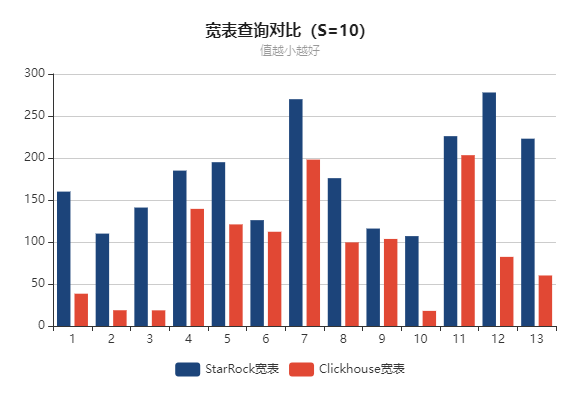

# StarRocks对比Clickhouse对比测试

## 1. 简介

>  Star schema benchmark（以下简称SSBM）是学术界和工业界广泛使用的一个星型模型测试集 ， 通过这个测试集合可以方便的对比各种OLAP产品的基础性能指标。
>
> 本次测试采用SSBM模型。


### 1.1 环境信息

**硬件，3计算节点，详情如下**：

- CPU： 虚拟机4核，型号：Intel(R) Xeon(R) Gold 5118 CPU @ 2.30GHz 
- 内存：9.6 G
- 硬盘： 普通机械硬盘， 容量：394G 

**软件**：

- 操作系统：CentOS Linux release 7.6.1810


**测试版本**：

- StarRocks：1.18.2
- Clickhouse：v21.9 

### 1.2  测试数据集

**生成工具**：各自官方推荐的工具生成。

**数据规模**：分别选取**10**和**50**规模因子的两组测试，分别对应的的主表数据量为**6千万**和**3亿**。


## 2. 测试步骤

### 2.1 StarRocks 测试

#### 2.1.1 构建工具

``` shell
wget http://dorisdb-public.oss-cn-zhangjiakou.aliyuncs.com/ssb-poc-0.9.zip 6
tar xvf ssb-poc.tar.gz
cd ssb-poc
make && make install
```

修改配置

``` shell
cd output
cat conf/doris.conf
# 修改配置文件中的host、端口等信息
mysql_host: test1
mysql_port: 9030
mysql_user: root
mysql_password:
starrocks_db: ssb
...
```

#### 2.1.2 测试表构建

``` shell
bin/create_db_table.sh ddl_100
```

#### 2.1.3 构建数据

```shell
cd output
# 10 为规模因子
bin/gen-ssb.sh 10 data_dir
```

#### 2.1.4导入数据

``` shell
#执行脚本建表
bin/stream_load.sh data_dir
# 生成宽表
bin/flat_insert.sh
```

#### 2.1.5 SQL测试

``` shell
# 管理查询
bin/benchmark.sh -p -d ssb
# 单表查询
bin/benchmark.sh -p -d ssb-flat
```

注：另一组50因子的，把步骤2.1.3的因子改为50即可。

### 2.2 Clickhouse 测试

#### 2.2.1 构建工具

```shell
git clone git@github.com:vadimtk/ssb-dbgen.git
cd ssb-dbgen
make
```

#### 2.2.2 测试表构建

参考附录的创建方式创建

#### 2.2.3  构建数据

``` shell
# 10 为规模因子
./dbgen -s 10 -T a
```

#### 2.2.4 导入数据

```shell
 clickhouse-client --query "INSERT INTO customer FORMAT CSV" < customer.tbl
 clickhouse-client --query "INSERT INTO part FORMAT CSV" < part.tbl
 clickhouse-client --query "INSERT INTO supplier FORMAT CSV" < supplier.tbl
 clickhouse-client --query "INSERT INTO lineorder FORMAT CSV" < lineorder.tbl
```

宽表导入

``` sql
INSERT INTO ssb.lineorder_flat 
SELECT
    l.LO_ORDERKEY AS LO_ORDERKEY,
    l.LO_LINENUMBER AS LO_LINENUMBER,
    l.LO_CUSTKEY AS LO_CUSTKEY,
    l.LO_PARTKEY AS LO_PARTKEY,
    l.LO_SUPPKEY AS LO_SUPPKEY,
    l.LO_ORDERDATE AS LO_ORDERDATE,
    l.LO_ORDERPRIORITY AS LO_ORDERPRIORITY,
    l.LO_SHIPPRIORITY AS LO_SHIPPRIORITY,
    l.LO_QUANTITY AS LO_QUANTITY,
    l.LO_EXTENDEDPRICE AS LO_EXTENDEDPRICE,
    l.LO_ORDTOTALPRICE AS LO_ORDTOTALPRICE,
    l.LO_DISCOUNT AS LO_DISCOUNT,
    l.LO_REVENUE AS LO_REVENUE,
    l.LO_SUPPLYCOST AS LO_SUPPLYCOST,
    l.LO_TAX AS LO_TAX,
    l.LO_COMMITDATE AS LO_COMMITDATE,
    l.LO_SHIPMODE AS LO_SHIPMODE,
    c.C_NAME AS C_NAME,
    c.C_ADDRESS AS C_ADDRESS,
    c.C_CITY AS C_CITY,
    c.C_NATION AS C_NATION,
    c.C_REGION AS C_REGION,
    c.C_PHONE AS C_PHONE,
    c.C_MKTSEGMENT AS C_MKTSEGMENT,
    s.S_NAME AS S_NAME,
    s.S_ADDRESS AS S_ADDRESS,
    s.S_CITY AS S_CITY,
    s.S_NATION AS S_NATION,
    s.S_REGION AS S_REGION,
    s.S_PHONE AS S_PHONE,
    p.P_NAME AS P_NAME,
    p.P_MFGR AS P_MFGR,
    p.P_CATEGORY AS P_CATEGORY,
    p.P_BRAND AS P_BRAND,
    p.P_COLOR AS P_COLOR,
    p.P_TYPE AS P_TYPE,
    p.P_SIZE AS P_SIZE,
    p.P_CONTAINER AS P_CONTAINER
FROM lineorder AS l
INNER JOIN customer AS c ON c.C_CUSTKEY = l.LO_CUSTKEY
INNER JOIN supplier AS s ON s.S_SUPPKEY = l.LO_SUPPKEY
INNER JOIN part AS p ON p.P_PARTKEY = l.LO_PARTKEY;
```

#### 2.2.5 SQL测试

```shell
cd clickhouse-ssb/flat
for i in `cat list`
do
    for c in {1..5}
    do
        clickhouse-client --password 123456 -d ssb -m -t -q "`cat ${i}.sql`" 1>/dev/null 2>> result/${i} 
    done
    echo ${i}_`cat  result/${i} | awk '{sum+=$1} END {print "avg =", 1000*sum/NR}'`
done 
```

#### 2.2.6 SQL关联测试

clickhouse的关联测试较为特殊，需要修改以下内容：

1. 构建工具，修改 dss.h，内容如下

   ```c
   #define  PR_DATE(tgt, yr, mn, dy)       \
      sprintf(tgt, "19%02d-%02d-%02d", yr, mn, dy)
      //修改为
      sprintf(tgt, "19%02d%02d%02d", yr, mn, dy)
   ```

   重新编译生成数据。

2. 建表语句，将Date类型改为UInt32。

3. 执行测试sql

``` shell
cd clickhouse-ssb/join
for i in `cat list`
do
    for c in {1..5}
    do
        clickhouse-client --password 123456 -d ssb -m -t -q "`cat ${i}.sql`" 1>/dev/null 2>> result/${i} 
    done
    echo ${i}_`cat  result/${i} | awk '{sum+=$1} END {print "avg =", 1000*sum/NR}'`
done 
```

## 3.测试结果

3.1规模因子为10（6千万数据）

| SQL编号 | StarRock关联表 | StarRock宽表 | Clickhouse宽表 | Clickhouse关联表 |
| ------- | -------------- | ------------ | -------------- | ---------------- |
| Q1.1    | 145            | 160          | 38.45          | 425.2            |
| Q1.2    | 132            | 110          | 18.75          | 399              |
| Q1.3    | 125            | 141          | 18.65          | 418.4            |
| Q2.1    | 242            | 185          | 139.45         | 18107            |
| Q2.2    | 209            | 195          | 120.95         | 13287            |
| Q2.3    | 186            | 126          | 112.2          | 13207            |
| Q3.1    | 357            | 270          | 198.1          | 13043            |
| Q3.2    | 220            | 176          | 99.55          | 10751            |
| Q3.3    | 158            | 116          | 103.65         | 7372             |
| Q3.4    | 154            | 107          | 18             | 1330             |
| Q4.1    | 452            | 226          | 203.35         | 15744            |
| Q4.2    | 365            | 278          | 82.3           | 3928             |
| Q4.3    | 269            | 223          | 60.15          | 3640             |



3.2 规模因子为500（3亿条数据）

| SQL编号 | StarRock关联表 （首次） | StarRock关联表 | StarRock宽表 （首次） | StarRock宽表 | Clickhouse宽表 （5次平均值） | Clickhouse宽表 (首次) | Clickhouse关联表 |
| ------- | ----------------------- | -------------- | --------------------- | ------------ | ---------------------------- | --------------------- | ---------------- |
| Q1.1    | 5375                    | 888            | 5771                  | 486          | 95.2                         | 212                   | /                |
| Q1.2    | 1543                    | 533            | 2312                  | 422          | 32.2                         | 379                   | /                |
| Q1.3    | 533                     | 500            | 981                   | 408          | 25.2                         | 107                   | /                |
| Q2.1    | 4072                    | 881            | 5869                  | 626          | 582                          | 7088                  | /                |
| Q2.2    | 823                     | 750            | 1559                  | 762          | 482                          | 495                   | /                |
| Q2.3    | 695                     | 684            | 462                   | 437          | 456                          | 446                   | /                |
| Q3.1    | 2513                    | 1564           | 2264                  | 912          | 826.6                        | 3090                  | /                |
| Q3.2    | 1013                    | 935            | 2557                  | 592          | 372                          | 2269                  | /                |
| Q3.3    | 869                     | 804            | 566                   | 370          | 374.6                        | 369                   | /                |
| Q3.4    | 755                     | 971            | 373                   | 366          | 33                           | 31                    | /                |
| Q4.1    | 2098                    | 1671           | 3774                  | 870          | 905.8                        | 4296                  | /                |
| Q4.2    | 1298                    | 1273           | 3371                  | 1033         | 299                          | 488                   | /                |
| Q4.3    | 1138                    | 1203           | 2830                  | 706          | 197.4                        | 329                   | /                |


3.3 Clickhouse不同主机测试

| SQL编号 | 4核6G | 2核6G  |
| ------- | ----- | ------ |
| Q1.1    | 93    | 174.4  |
| Q1.2    | 34.6  | 46.8   |
| Q1.3    | 21.8  | 34.2   |
| Q2.1    | 578.2 | 1287.6 |
| Q2.2    | 482.2 | 1086.8 |
| Q2.3    | 447.4 | 1004.6 |
| Q3.1    | 817   | 1729.6 |
| Q3.2    | 358.8 | 753    |
| Q3.3    | 360.8 | 757.4  |
| Q3.4    | 34    | 34.4   |
| Q4.1    | 877   | 1989.2 |
| Q4.2    | 286.2 | 633.8  |
| Q4.3    | 186.8 | 357.6  |

**测试汇总数据**：

缩写说明： **SS**：StarRocks  **CC**：Clickhouse

| 对比项                   | 速度对比 | 备注                               |
| ------------------------ | -------- | ---------------------------------- |
| SS与CC宽表查询对比       | 0:13     | CC优于SS                           |
| SS与CC关联表查询对比     | 13:0     | SS优于CC                           |
| SS宽表与SS关联表查询对比 | 2:11     | SS的宽表查询优于关联，但差距不大   |
| CC宽表与CC关联表查询对比 | 13:0     | CC的宽表查询远远优于关联查询性能。 |


## 4.测试结论

1. 宽表查询测试项，StarRocks与Clickhouse整体性能都较为良好，但对比而言Clickhouse优于StarRocks。

2. 关联表测试项中，StarRocks性能良好，但Clickhouse下降严重，甚至在S=50中集群运行过于缓慢，以致放弃该项测试。

3. 在测试过程中，两款产品在数据导入后首次均出现查询慢问题。第二次后的查询则现象消失，重启集群服务也一样。推测可能与首次索引或者缓存建立有关。

4. 测试环境中Clickhouse有两组不同CPU核数环境，相同数据集下。多数场景查询速率与CPU核数直接相关。

   

## 附录

#### 1. ClickHouse 数据表创建

```
CREATE TABLE customer
(
        C_CUSTKEY       UInt32,
        C_NAME          String,
        C_ADDRESS       String,
        C_CITY          LowCardinality(String),
        C_NATION        LowCardinality(String),
        C_REGION        LowCardinality(String),
        C_PHONE         String,
        C_MKTSEGMENT    LowCardinality(String)
)
ENGINE = MergeTree ORDER BY (C_CUSTKEY);

CREATE TABLE lineorder
(
    LO_ORDERKEY             UInt32,
    LO_LINENUMBER           UInt8,
    LO_CUSTKEY              UInt32,
    LO_PARTKEY              UInt32,
    LO_SUPPKEY              UInt32,
    LO_ORDERDATE            Date,
    LO_ORDERPRIORITY        LowCardinality(String),
    LO_SHIPPRIORITY         UInt8,
    LO_QUANTITY             UInt8,
    LO_EXTENDEDPRICE        UInt32,
    LO_ORDTOTALPRICE        UInt32,
    LO_DISCOUNT             UInt8,
    LO_REVENUE              UInt32,
    LO_SUPPLYCOST           UInt32,
    LO_TAX                  UInt8,
    LO_COMMITDATE           Date,
    LO_SHIPMODE             LowCardinality(String)
)
ENGINE = MergeTree PARTITION BY toYear(LO_ORDERDATE) ORDER BY (LO_ORDERDATE, LO_ORDERKEY);

CREATE TABLE part
(
        P_PARTKEY       UInt32,
        P_NAME          String,
        P_MFGR          LowCardinality(String),
        P_CATEGORY      LowCardinality(String),
        P_BRAND         LowCardinality(String),
        P_COLOR         LowCardinality(String),
        P_TYPE          LowCardinality(String),
        P_SIZE          UInt8,
        P_CONTAINER     LowCardinality(String)
)
ENGINE = MergeTree ORDER BY P_PARTKEY;

CREATE TABLE supplier
(
        S_SUPPKEY       UInt32,
        S_NAME          String,
        S_ADDRESS       String,
        S_CITY          LowCardinality(String),
        S_NATION        LowCardinality(String),
        S_REGION        LowCardinality(String),
        S_PHONE         String
)
ENGINE = MergeTree ORDER BY S_SUPPKEY;

```

#### 2. Clickhouse宽表的创建

``` sql
CREATE TABLE ssb.lineorder_local
(
    `LO_ORDERKEY` UInt32,
    `LO_LINENUMBER` UInt8,
    `LO_CUSTKEY` UInt32,
    `LO_PARTKEY` UInt32,
    `LO_SUPPKEY` UInt32,
    `LO_ORDERDATE` Date,
    `LO_ORDERPRIORITY` LowCardinality(String),
    `LO_SHIPPRIORITY` UInt8,
    `LO_QUANTITY` UInt8,
    `LO_EXTENDEDPRICE` UInt32,
    `LO_ORDTOTALPRICE` UInt32,
    `LO_DISCOUNT` UInt8,
    `LO_REVENUE` UInt32,
    `LO_SUPPLYCOST` UInt32,
    `LO_TAX` UInt8,
    `LO_COMMITDATE` Date,
    `LO_SHIPMODE` LowCardinality(String),
    `C_NAME` String,
    `C_ADDRESS` String,
    `C_CITY` LowCardinality(String),
    `C_NATION` LowCardinality(String),
    `C_REGION` LowCardinality(String),
    `C_PHONE` String,
    `C_MKTSEGMENT` LowCardinality(String),
    `S_NAME` String,
    `S_ADDRESS` String,
    `S_CITY` LowCardinality(String),
    `S_NATION` LowCardinality(String),
    `S_REGION` LowCardinality(String),
    `S_PHONE` String,
    `P_NAME` String,
    `P_MFGR` LowCardinality(String),
    `P_CATEGORY` LowCardinality(String),
    `P_BRAND` LowCardinality(String),
    `P_COLOR` LowCardinality(String),
    `P_TYPE` LowCardinality(String),
    `P_SIZE` UInt8,
    `P_CONTAINER` LowCardinality(String)
)
ENGINE = MergeTree
PARTITION BY toYear(LO_ORDERDATE)
ORDER BY (LO_ORDERDATE, LO_ORDERKEY);


CREATE TABLE ssb.lineorder_flat AS ssb.lineorder_local
ENGINE = Distributed(cluster_test, ssb, lineorder_local, rand());
```


## REF

[StarRocks Documentation | StarRocks Documentation](https://docs.starrocks.com/zh-cn/main/benchmarking/SSB_Benchmarking)

[Star Schema Benchmark | ClickHouse文档](https://clickhouse.com/docs/zh/getting-started/example-datasets/star-schema/)