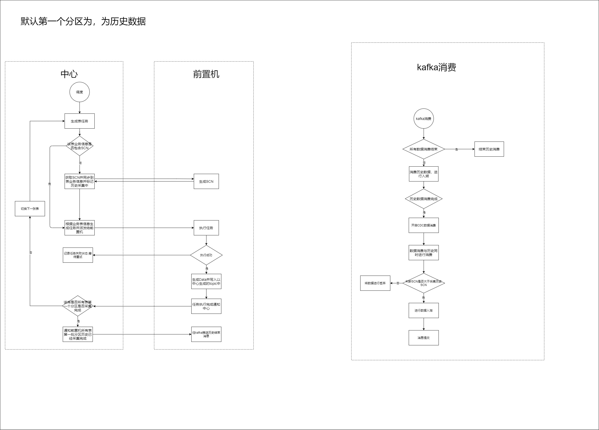

## 一、所有历史的结束再消费CDC数据

### 1、Oracle批流设计

​		oracle设计主要以表数量和topic直接的关系进行设计,主要分为1对1的关系和1对n的关系

#### 1.1 Oracle表和Topic的关系 （1:1）

##### 1.1.1 设计流程

生产消息流程
- CDC的消息根据第一次开启的的SCN进行消息入队
- 检查业务中心表是否包含SCN，没有则前置机获取
- 根据SCN生成脚本，发送给前置机执行任务，并将数据存入kafka历史topic
- 如果该任务是最后一个任务则再kafka发送一条结束标记位

消费消息流程
- 首先将历史的队列消费完毕
- 再消费CDC的数据如果SCN小于之前记录的SCN则进行抛弃

##### 1.1.2 优劣势

优势

- 历史消费完成后直接消费CDC无需考虑顺序问题

劣势

- 表多的话会造成大量的Topic给kafka带来较大的压力

##### 1.1.3 流程图

#### 1.2 Oracle表和Topic的关系 （N:1）

##### 1.2.1 设计流程

生产消息流程
- CDC的消息根据第一次开启的的SCN进行消息入队
- 检查业务中心表是否包含SCN，没有则前置机获取
- 根据SCN生成脚本，发送给前置机执行任务，并将数据存入kafka历史topic
- 如果该任务是最后一个任务则再kafka发送一条结束标记位

消费消息流程
- 历史队列和CDC队列是两个线程再同时消费
- 历史的直接入湖直到消费到结束标记位
- 历史消费完毕后更新表状态
- CDC消费先判断是否该表开始采集历史没有的话数据可直接抛弃
- 判断SCN是否大于开始采集历史的SCN小于的话直接抛弃
- 判断历史队列是否消费完成没有的话则将数据进入临时队列等待历史消费后进行消费
- 如果以上条件都满足则最后判断该表是否有临时节点没有的话直接进行数据入湖，有的话则优先消费临时结点

##### 1.2.2 优劣势

优势

- 只需要管理一个topic

劣势

- 因为历史入库要优先CDC入库所以要考虑到边界导致设计复杂度提高较多

##### 1.2.3 流程图

### 2、Sqlserver 批流设计 

​		Sqlserver 设计主要以表数量和topic直接的关系进行设计,主要Sqlserver表和Topic 1比1关系 且历史和CDC在同一个topic中，分为1对1的关系和1对n的关系

#### 2.1 批流设计-Sqlserver表和Topic 1比1关系 且历史和CDC在同一个topic中

##### 2.1.1 设计流程

生产消息流程
- CDC的消费根据第一次历史的LSN进行查询
- 生成脚本，发送给前置机执行任务，并将数据存入kafka历史topic
- 如果该任务是最后一个任务则再kafka发送一条结束标记位

消费消息流程

- 判断是否是历史数据是的话直接入湖
- CDC数据则处理后入湖

##### 2.1.2  优劣势

优势

- 历史消费完成后直接消费CDC无需考虑顺序问题

劣势

- 表多的话会造成大量的Topic给kafka带来较大的压力

##### 2.1.3  流程图

#### 2.2 批流设计-Sqlserver表和Topic 1比1关系

##### 2.2.1 设计流程

生产消息流程

- CDC的消费根据第一次历史的LSN进行查询
- 生成脚本，发送给前置机执行任务，并将数据存入kafka历史topic
- 如果该任务是最后一个任务则再kafka发送一条结束标记位

消费消息流程

- 首先将历史的队列消费完毕
- 再消费CDC队列

##### 2.2.2 优劣势

优势

- 历史消费完成后直接消费CDC无需考虑顺序问题

劣势

- 表多的话会造成大量的Topic给kafka带来较大的压力

##### 2.2.3 流程图

#### 2.3 批流设计-Sqlserver表和Topic 1比1关系

##### 2.3.1 设计流程

生产消息流程
- CDC的消费根据第一次历史的LSN进行查询
- 生成脚本，发送给前置机执行任务，并将数据存入kafka历史topic
- 如果该任务是最后一个任务则再kafka发送一条结束标记位

消费消息流程

- CDC和历史两个消费同时进行
- 历史消费完毕后将该表和采集时的LSN添加到CDC连接器进行收集CDC
- CDC直接消费因为只有历史消费完成后CDC队列才会有该表的CDC

##### 2.3.2 优劣势

优势

- 只需要管理一个topic

劣势

- 可能历史采集时间过久导致的CDC数据丢失

##### 2.3.3 流程图

### 二、部分历史的结束再消费CDC数据

所有历史的结束再消费CDC数据的方案都存在TOPIC过多或者实现起来复杂的情况吗，如果不做到那么极致是否有很好的方案？

#### 2.1设计流程

如果我们将每张表除了第一个分区其他的数据默认为不再修改这样是不是就能快速的将历史数据消费结束，接下来我们看下具体的设计流程

生产消息流程

- 遍历该库所有的表，并且生成每张表的第一个分区，同时开启CDC的采集
- 依次通知前置机生成任务，并将数据同步到kafka 历史队列当中
- 当所有表的第一个分区结束后，往kafka发送历史结束标识

消费消息流程

- 首先先判断第一批历史数据是否入库完成，完成则开启CDC消费
- 再判断是否所有历史数据消费完成，未完成则继续消费历史数据并入库
- 如果所有历史消费完成则终止历史消费

#### 2.2 流程图

