# Ambari-HDP集群部署

## 介绍

Ambari 跟 Hadoop 等开源软件一样，也是 Apache Software Foundation 中的一个项目，并且是顶级项目。就 Ambari 的作用来说，就是创建、管理、监视 Hadoop 的集群，但是这里的 Hadoop 是广义，指的是 Hadoop 整个生态圈（例如 Hive，Hbase，Sqoop，Zookeeper 等），而并不仅是特指 Hadoop。用一句话来说，Ambari 就是为了让 Hadoop 以及相关的大数据软件更容易使用的一个工具。

说到这里，大家就应该明白什么人最需要 Ambari 了。那些苦苦花费好几天去安装、调试 Hadoop 的初学者是最能体会到 Ambari 的方便之处的。而且，Ambari 现在所支持的平台组件也越来越多，例如流行的 Spark，Storm 等计算框架，以及资源调度平台 YARN 等，我们都能轻松地通过 Ambari 来进行部署。

Ambari 自身也是一个分布式架构的软件，主要由两部分组成：Ambari Server 和 Ambari Agent。简单来说，用户通过 Ambari Server 通知 Ambari Agent 安装对应的软件；Agent 会定时地发送各个机器每个软件模块的状态给 Ambari Server，最终这些状态信息会呈现在 Ambari 的 GUI，方便用户了解到集群的各种状态，并进行相应的维护。详细的操作和介绍会在后续章节介绍。

大多数情况下，我们在linux环境中安装软件都是使用在线安装的方式，比如centOS的 yum，ubuntu的apt-get，但是，有些时候，我们需要安装软件，但并没有网络，或网速并不快，比如公司的集群，很可能是没有外网的，有些库是国外的库，下载速度非常慢，这个时候，如果有个本地库，这个问题就能比较好的解决了 。当然，并不是说所有的软件都做成本地库，这里只是把安装Ambari和HDP的库本地化。

## 1.准备

### 1.1软件要求

- CentOS7.6

- JDK-1.8.0_191
- Mysql（5.5、5.6、5.7）/MariaDB (10、10.1、10.2)
- Mysql驱动：mysql-connector-java-5.1.44.jar

在每个主机上：

- `yum`
- `scp, curl, unzip, tar`，`wget`，`gcc` ， `ssh, pdsh`
- OpenSSL（v1.01，版号16或更高版本）
- Python 2.7.12（使用python-devel）

**Ambari Metrics Monitor使用python库（psutil），该库需要gcc和python-devel包。**

### 1.2 端口使用情况

Hadoop 附带了大量侦听各种端口的服务。从这些 Hadoop 3（默认）配置文件中提取了默认端口号：

- hdfs-site.xml
- yarn-site.xml
- mapred-site.xml

```shell
PORT	   	CONFIGNAME		
-------------------hdfs-site.xml---------------------------------------------
50010      dfs.datanode.address
50075      dfs.datanode.http.address
50475      dfs.datanode.https.address
8010       dfs.datanode.ipc.address
8480       dfs.journalnode.http-address
8481       dfs.journalnode.https-address
50070      dfs.namenode.http-address.bdptest.nn1
50070      dfs.namenode.http-address.bdptest.nn2
50470      dfs.namenode.https-address.bdptest.nn1
50470      dfs.namenode.https-address.bdptest.nn2
8020       dfs.namenode.rpc-address.bdptest.nn1
8020       dfs.namenode.rpc-address.bdptest.nn2
---------------------yarn-site.xml---------------------------------------
45454      yarn.nodemanager.address
8050       yarn.resourcemanager.address
8141       yarn.resourcemanager.admin.address
8025       yarn.resourcemanager.resource-tracker.address
8025       yarn.resourcemanager.resource-tracker.address.rm1 
8025       yarn.resourcemanager.resource-tracker.address.rm2
8030       yarn.resourcemanager.scheduler.address 
8088       yarn.resourcemanager.webapp.address 
8088       yarn.resourcemanager.webapp.address.rm1 
8088       yarn.resourcemanager.webapp.address.rm2 
8090       yarn.resourcemanager.webapp.https.address
8090       yarn.resourcemanager.webapp.https.address.rm1
8090       yarn.resourcemanager.webapp.https.address.rm2
2181       yarn.resourcemanager.zk-address
10200      yarn.timeline-service.address
8198       yarn.timeline-service.reader.webapp.address
8199       yarn.timeline-service.reader.webapp.https.address
8188       yarn.timeline-service.webapp.address
8190       yarn.timeline-service.webapp.https.address
54         hadoop.registry.dns.bind-port
---------------------mapred-site.xml---------------------------------------
10020			 mapreduce.jobhistory.address
19888			 mapreduce.jobhistory.webapp.address
--------------------ambari-------------------------------------------------
8080       ambari web
3000       Ambari Metrics Port
61888      timeline.metrics.host.inmemory.aggregation.port
--------------------zookeeper-------------------------------------------------
2181       zookeeper
--------------------spark2-------------------------------------------------
8999       livy.server.port
18081      spark.history.ui.port
--------------------hive-------------------------------------------------
10000			 HiveServer2 Port
10001			 hive.server2.thrift.http.port
10002			 hive.server2.thrift.http.port
10016      hive.server2.thrift.port
15551      hive.llap.daemon.yarn.shuffle.port
15004      hive.llap.management.rpc.port
10501      hive.server2.thrift.http.port
10500      HiveServer2 Port
10502      hive.server2.webui.port
10002      hive.server2.webui.port
```

### 1.3准备环境

#### 1.3.1集群机器挂载xfs数据盘

生产环境部署，建议使用xfs类型文件系统直接以**JBOD**方式作为数据盘。

以root用户登陆到服务器上，以 `/dev/sdb` 数据盘为例，具体操作步骤如下：

(1)  查看数据盘

```shell
fdisk -l
```

(2)  创建分区

```shell
parted -s -a optimal /dev/sdb mklabel gpt -- mkpart primary xfs 1 -1
```

(3)  格式化文件系统

```shell
mkfs.xfs /dev/sdb1
```

(4)  编辑 `/etc/fstab` 文件，添加以下信息

```shell
/dev/sdb1 /data/1 xfs defaults 0 0
```

(5)  挂载数据盘

```shell
mkdir -p /data/1 & mount -a
```

(6)  查看磁盘挂在情况，包含以下信息，说明情况

```shell
[root@master ~]# mount -t xfs
/dev/sdb1 on /data/1 type xfs (rw,relatime,attr2,inode64,noquota)

[root@master ~]# lsblk
NAME            MAJ:MIN RM  SIZE RO TYPE MOUNTPOINT
sda               8:0    0   20G  0 disk
├─sda1            8:1    0    2M  0 part
├─sda2            8:2    0  512M  0 part /boot
└─sda3            8:3    0 19.5G  0 part
  ├─centos-root 253:0    0 11.5G  0 lvm  /
  └─centos-swap 253:1    0    8G  0 lvm  [SWAP]
sdb               8:16   0  100G  0 disk
└─sdb1            8:17   0  100G  0 part /data/1
sdc               8:32   0  100G  0 disk
└─sdc1            8:33   0  100G  0 part /data/2
sr0              11:0    1  4.3G  0 rom
```

#### 1.3.2Linux依赖安装

##### （1）安装redhat-lsb

```shell
yum localinstall -y redhat-lsb
```

##### （2）安装libtirpc

```
yum localinstall --nogpgcheck libtirpc-0.2.4-0.15.el7.x86_64.rpm 
yum localinstall --nogpgcheck libtirpc-devel-0.2.4-0.6.el7.x86_64.rpm
```

#### 1.3.3最大打开文件要求

在Ambari Server和Agent所有节点上设置并查看

```shell
[root@master ~]# vim /etc/security/limits.conf 
# End of file 
* soft nofile 65536 
* hard nofile 65536 
* soft nproc 65535 
* hard nproc 65535
 
# 关闭当前会话，重新开启会话，通过以下命令查看 
[root@master ~]# ulimit -Sn 
[root@master ~]# ulimit -Hn  
```

#### 1.3.4设置无密码SSH

要让Ambari Server在所有集群主机上自动安装Ambari代理，必须在Ambari服务器主机和集群中的所有其他主机之间设置无密码SSH连接。Ambari Server主机使用SSH公钥身份验证远程访问和安装安巴里代理。

**步骤**

（1）ambari server所在主机要和其它主机通信并安装ambari agent，所以需配置server到其它服务器的免密登录

```shell
ssh-keygen -t rsa  #（四个回车）

#执行完这个命令后，会生成两个文件id_rsa（私钥）、id_rsa.pub（公钥）

cd ~/.ssh
```

（2）将server所在服务器的公钥拷贝到其它agent服务器

```shell
ssh-copy-id <remote.target.host>
```

（3）分别ssh登录其它服务器

配置完ssh免密登录后，第一次需要输入密码，之后就可免密登录了

```shell
ssh root@<remote.target.host>
```

如果显示以下警告消息时，第一次连接: `Are you sure you want to continue connecting (yes/no)?` Enter **`Yes`**.

> 注意：可以使用非root SSH 帐户，如果该帐户可以执行 sudo ，且无需输入密码。

#### 1.3.5在集群和浏览器主机上启用NTP

集群中所有节点的时钟和运行访问Ambari Web界面的浏览器的机器必须能够相互同步。

##### （1）安装NTP服务

要安装NTP服务并确保它启动，在**每个主机上**运行以下命令：

```shell
yum install -y ntp
systemctl enable ntpd
systemctl start ntpd
```

##### （2）配置NTP Server

修改配置文件`/etc/ntp.conf`，其中<ntp.server.ip>需要替换

```shell
# 将以下内容注释或者删除
#server 0.centos.pool.ntp.org iburst
#server 1.centos.pool.ntp.org iburst
#server 2.centos.pool.ntp.org iburst
#server 3.centos.pool.ntp.org iburst

# 配置本地的时间同步服务器，并允许该服务器修改本机时间
server <ntp.server.ip>
restrict <ntp.server.ip> nomodify notrap noquery
```

重启服务

```shell
systemctl restart ntpd
```

##### （3）配置NTP Client

停止服务

```shell
systemctl stop ntpd
```

修改配置文件`/etc/ntp.conf`，其中<ntp.server.ip>需要替换

```shell
#配置本地的时间同步服务器，并允许该服务器修改本机时间
server <ntp.server.ip>
restrict <ntp.server.ip> nomodify notrap noquery
```

启动服务

```shell
systemctl start ntpd
```

检测是否同步

```shell
# ntpstat

# 显示如下则表示正常同步
synchronised to NTP server (192.168.5.169) at stratum 7
   time correct to within 33 ms
   polling server every 128 s
```


#### 1.3.6检查DNS和NSCD

系统中的所有主机都必须配置为正向和反向DNS。

Hadoop严重依赖DNS，因此在正常运行期间执行许多DNS查找。为了减少DNS基础设施的负载，**强烈建议在运行Linux的集群节点上使用名称服务缓存守护进程（NSCD）**。该守护进程将缓存主机、用户和组查找，提供更好的分辨率性能，并减少DNS基础设施的负载。

##### （1）编辑主机文件

1. 配置集群每台服务器的hosts：

   ```shell
   vi /etc/hosts
   ```

2. 为集群中的每个主机添加一行。应由IP地址和FQDN((Fully Qualified Domain Name)全限定域名)组成。例如：

   ```shell
   192.168.1.140 <full.qualified.domain.name>
   ```

> 注意：不要将主机文件中删除以下两行。删除或编辑以下行可能会导致各种需要网络功能的程序失败。
>
> ```shell
> 127.0.0.1 localhost.localdomain localhost
> *1 localhost6.localdomain6 localhost6
> ```

##### （2）设置主机名

1. 通过运行以下命令确认主机名已设置：

   ```shell
   hostname -f
   ```

   这应该会返回您刚刚设置的<full.qualified.domain.name>。

2. 使用“主机名”命令在集群中的每个主机上设置主机名。例如：

   ```shell
   hostname <full.qualified.domain.name>
   ```

##### （3）编辑网络配置文件

1. 使用文本编辑器，在每个主机上打开网络配置文件，并为每个主机设置所需的网络配置（需替换<full.qualified.domain.name>）。例如：

   ```shell
   vi /etc/sysconfig/network
   ```

2. 修改 HOSTNAME 属性以设置完全限定的域名。

   ```shell
   NETWORKING=yes
   ```

   ```shell
   HOSTNAME=<full.qualified.domain.name>
   ```

##### （4）配置iptables

为了让ambari在设置期间与其部署和管理的主机通信，某些端口必须是开放和可用的。最简单的方法是暂时禁用iptables，如下所示：

```shell
service firewalld stop
systemctl disable firewalld
```

设置完成后，您可以重新启动iptables。如果您环境中的安全协议阻止禁用iptables，如果所有必需的端口都已打开且可用，您可以继续启用iptables。

安巴里检查iptables在安巴里服务器设置过程中是否运行。如果iptables正在运行，则显示警告，提醒您检查所需的端口是否打开且可用。群集安装向导中的主机确认步骤还为每个运行iptables的主机发出警告。

##### （5）禁用SELinux和PackageKit并检查掩码值

1. 必须禁用 SELinux，以便 Ambari 设置才能正常运行。在集群中的每个主机上，输入：

   ```shell
   [root@master ~]# vim /etc/selinux/config
   
   #修改如下选项
   
   SELINUX=disabled
   ```

2. 在运行CentOS并安装了PackageKit的安装主机上，使用文本编辑器打开`/etc/yum/pluginconf.d/refresh-packagekit.conf`。进行以下更改：

   查看是否安装：

   ```shell
   [root@master ~]# systemctl status packagekit
   
   ```

   更改：

   ```shell
   [root@master ~]# vim /etc/yum/pluginconf.d/refresh-packagekit.conf
   
   #修改如下选项
   enabled=0
   ```

3. UMASK（用户掩码或用户文件创建MASK）设置在Linux机器上创建新文件或文件夹时授予的默认权限或基本权限。大多数Linux发行版将022设置为默认掩码值。掩码值为022授予新文件或文件夹的读取、写入、执行权限为755。027的掩码值授予新文件或文件夹750的读写和执行权限。

   ambari、HDP和HDF支持0.22（0022在功能上等效）、027（0027在功能上等效）的掩码值。这些值必须设置在所有主机上。

   **UMASK示例**：

   为您当前登录会话设置umask：

   ```shell
   umask 0022
   ```

   检查当前的umask：

   ```shell
   umask
   ```

   永久更改所有交互用户的umask：

   ```shell
   echo umask 0022 >> /etc/profile
   ```

#### 1.3.7各主机安装JDK并配置环境变量

（1）上传`jdk-8u291-linux-x64.tar.gz`到服务器，并解压：

```shell
tar -zxvf jdk-8u291-linux-x64.tar.gz -C /usr/local
```

（2）配置环境变量

```shell
export JAVA_HOME=/usr/local/jdk1.8.0_281

export PATH=.:$JAVA_HOME/bin:$PATH

export CLASSPATH=.:$JAVA_HOME/lib/dt.jar:$JAVA_HOME/lib/tools.jar
```

（3）使之生效

```shell
source /etc/profile
```

#### 1.3.8MariaDB数据库安装

要求版本：10.2.40-MariaDB

> 可以使用现有的MariaDB或者参照官网进行安装

## 2.安装本地库（在ambari server主机上）

#### 2.1 准备建立本地存储库

如果企业集群有有限的出站Internet访问权限，则应该考虑使用本地存储库，这使您能够从更多的治理和更好的安装性能中获益。就算有网络也也建议使用本地库，要不然会很慢很久；更重要的是现在有付费墙的原因，不能免费下载了。

在设置本地存储库之前，必须满足某些要求:

- 选择运行受支持操作系统的现有服务器(群集中的服务器或群集可以访问的服务器);

- 启用了从群集中的所有主机到镜像服务器的网络访问;

- 确保镜像服务器安装了包管理器(如yum);

- **可选：**如果存储库具有临时互联网访问权限，则安装yum工具包：

  ```shell
  yum install yum-utils createrepo
  ```

满足这些要求后，您可以采取措施准备建立本地存储库。

**步骤**

1. 创建一个HTTP服务器：

   ```shell
   yum -y install httpd
   /sbin/chkconfig httpd on
   /sbin/service httpd start
   ```

2. 在镜像服务器上，为您的Web服务器创建一个目录。

   ```shell
   mkdir -p /var/www/html/ambari-hdp
   ```

#### 2.2 建立一个没有互联网接入的本地存储库

要完成本地存储库的设置，请完成以下操作：

2. 上传安装包到Web服务器目录：例如`/opt/soft`

3. 解压安装包：

```shell
cd /opt/soft

# 解压
tar -zxvf ambari-2.7.5.0-centos7.tar.gz -C /var/www/html/ambari-hdp

tar -zxvf HDP-3.1.5.0-centos7-rpm.tar.gz -C /var/www/html/ambari-hdp

tar -zxvf HDP-GPL-3.1.5.0-centos7-gpl.tar.gz -C /var/www/html/ambari-hdp

tar -zxvf HDP-UTILS-1.1.0.22-centos7.tar.gz -C /var/www/html/ambari-hdp
```

3. 确认解压目录正常

解压结束后，在浏览器中确认是否可以访问，访问地址如下：

```shell
# Ambari Base URL
http://<IP>/ambari-hdp/ambari/centos7/2.7.5.0-72/

# HDP Base URL
http://<IP>/ambari-hdp/HDP/centos7/

# HDP-UTILS Base URL
http://<IP>/ambari-hdp/HDP-UTILS/
```

#### 2.3 配置本地yum源

1. 如果环境中配置了多个存储库，请**在集群中的所有节点上**部署以下插件。

安装插件：

```
yum install yum-plugin-priorities
```

编辑`/etc/yum/pluginconf.d/priorities.conf`:

```shell
[main]

enabled=1

gpgcheck=0
```

2. 拷贝repo文件

```shell
cd /var/www/html/ambari-hdp/

cp ambari/centos7/2.7.5.0-72/ambari.repo /etc/yum.repos.d/

cp HDP/centos7/3.1.5.0-152/ssl_hdp.repo /etc/yum.repos.d/hdp.repo

cp HDP-GPL/centos7/3.1.5.0-152/hdp.gpl.repo /etc/yum.repos.d/
```

3. 修改Ambari、HDP、HDP-GPL资源文件

其中<hostname>需进行对应修改。

- ambari.repo

```shell
[root@master ~]# vim /etc/yum.repos.d/ambari.repo

#VERSION_NUMBER=2.7.5.0-72

[ambari-2.7.5.0]

#json.url = http://public-repo-1.hortonworks.com/HDP/hdp_urlinfo.json

name=ambari Version - ambari-2.7.5.0

baseurl=http://<hostname>/ambari-hdp/ambari/centos7/2.7.5.0-72/

gpgcheck=1

gpgkey=http://<hostname>/ambari-hdp/ambari/centos7/2.7.5.0-72/RPM-GPG-KEY/RPM-GPG-KEY-Jenkins

enabled=1

priority=1
```

- hdp.repo

```shell
[root@master ~]# vim /etc/yum.repos.d/hdp.repo

 
#VERSION_NUMBER=3.1.5.0-152

[HDP-3.1.5.0]

name=HDP Version - HDP-3.1.5.0

baseurl=http://<hostname>/ambari-hdp/HDP/centos7/3.1.5.0-152/

gpgcheck=1

gpgkey=http://<hostname>/ambari-hdp/HDP/centos7/3.1.5.0-152/RPM-GPG-KEY/RPM-GPG-KEY-Jenkins

enabled=1

priority=1

[HDP-UTILS-1.1.0.22]

name=HDP-UTILS Version - HDP-UTILS-1.1.0.22

baseurl=http://<hostname>/ambari-hdp/HDP-UTILS/centos7/1.1.0.22/

gpgcheck=1

gpgkey=http://<hostname>/ambari-hdp/HDP-UTILS/centos7/1.1.0.22/RPM-GPG-KEY/RPM-GPG-KEY-Jenkins

enabled=1

priority=1
```

- hdp.gpl.repo

```shell
[root@master ~]# vim /etc/yum.repos.d/hdp.gpl.repo


#VERSION_NUMBER=3.1.5.0-152

[HDP-GPL-3.1.5.0]

name=HDP-GPL Version - HDP-GPL-3.1.5.0

baseurl=http://<hostname>/ambari-hdp/HDP-GPL/centos7/3.1.5.0-152/

gpgcheck=1

gpgkey=http://<hostname>/ambari-hdp/HDP-GPL/centos7/3.1.5.0-152/RPM-GPG-KEY/RPM-GPG-KEY-Jenkins

enabled=1

priority=1
```

制作完成后，移动到`/etc/yum.repos.d/`；依次执行以下命令，更新本地资源池：

```sh
  # yum clean all
  # yum makecache
```

等待更新完毕后，查看资源池：

```sh
  # yum repolist
```

如果看到以下资源，表示配置成功：

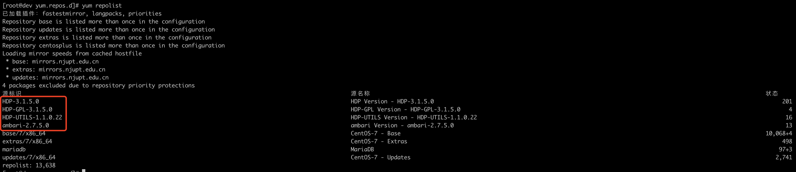

## 3.安装Ambari(在ambari server主机上)

##### 3.1 安装ambari

```
yum -y install ambari-server
```

##### 3.2 新建ambari数据库

```sql
create database ambari default character set='utf8';

CREATE USER 'ambari'@'localhost' IDENTIFIED BY 'ambari123';

CREATE USER 'ambari'@'dev.public.mgmt01' IDENTIFIED BY 'ambari123';

CREATE USER 'ambari'@'%' IDENTIFIED BY 'ambari123';

GRANT ALL PRIVILEGES ON ambari.* TO 'ambari'@'localhost' IDENTIFIED BY 'ambari123' with grant option;  

GRANT ALL PRIVILEGES ON ambari.* TO 'ambari'@'dev.public.mgmt01' IDENTIFIED BY 'ambari123' with grant option;  

GRANT ALL PRIVILEGES ON ambari.* TO 'ambari'@'%' IDENTIFIED BY 'ambari123' with grant option;

FLUSH PRIVILEGES;

#如果添加错误，删除的话用如下命令

drop user 'ambari'@'localhost';

#可用如下命令查看hive用户的权限信息

SELECT * FROM mysql.`user` WHERE `User`='ambari'
```

##### 3.3 导入元数据

```shell
[root@master ~]# mysql -u root -p
Enter password:
MariaDB [(none)]> use ambari;
Database changed
MariaDB [ambari]> source /var/lib/ambari-server/resources/Ambari-DDL-MySQL-CREATE.sql;
```

##### 3.4 安装

```shell
[root@dev log]# ambari-server setup
Using python  /usr/bin/python
Setup ambari-server
Checking SELinux...
SELinux status is 'disabled'
Customize user account for ambari-server daemon [y/n] (n)? y #输入y
Enter user account for ambari-server daemon (root):ambari
Adjusting ambari-server permissions and ownership...
Checking firewall status...
Checking JDK...
[1] Oracle JDK 1.8 + Java Cryptography Extension (JCE) Policy Files 8
[2] Custom JDK
==============================================================================
Enter choice (1): 2  #输入2，自定义jdk
WARNING: JDK must be installed on all hosts and JAVA_HOME must be valid on all hosts.
WARNING: JCE Policy files are required for configuring Kerberos security. If you plan to use Kerberos,please make sure JCE Unlimited Strength Jurisdiction Policy Files are valid on all hosts.
Path to JAVA_HOME: /usr/local/jdk1.8.0_191    #输入java path
Validating JDK on Ambari Server...done.
Check JDK version for Ambari Server...
JDK version found: 8
Minimum JDK version is 8 for Ambari. Skipping to setup different JDK for Ambari Server.
Checking GPL software agreement...
GPL License for LZO: https://www.gnu.org/licenses/old-licenses/gpl-2.0.en.html
Enable Ambari Server to download and install GPL Licensed LZO packages [y/n] (n)? y   #输入y
Completing setup...
Configuring database...
Enter advanced database configuration [y/n] (n)? y
Configuring database...
==============================================================================
Choose one of the following options:
[1] - PostgreSQL (Embedded)
[2] - Oracle
[3] - MySQL / MariaDB
[4] - PostgreSQL
[5] - Microsoft SQL Server (Tech Preview)
[6] - SQL Anywhere
[7] - BDB
==============================================================================
Enter choice (1): 3 #输入3
Hostname (localhost): dev.public.mgmt01  # 输入数据库hostname或者ip
Port (3306): 3306 # 输入数据库端口
Database name (ambari): ambari  # 输入数据库名
Username (ambari): ambari # 输入数据库用户名
Enter Database Password (bigdata): # 输入数据库密码
Re-enter password:  # 输入数据库密码
Configuring ambari database...
Enter full path to custom jdbc driver: /data1/LW-POC/BDP/mysql-connector-java-5.1.44.jar # 输入数据库驱动路径
You already have file mysql-connector-java-5.1.44.jar in /usr/share/java/. Should it be replaced? [y/n] (y)? y
Copying /data1/LW-POC/BDP/mysql-connector-java-5.1.44.jar to /usr/share/java
Configuring remote database connection properties...
WARNING: Before starting Ambari Server, you must run the following DDL directly from the database shell to create the schema: /var/lib/ambari-server/resources/Ambari-DDL-MySQL-CREATE.sql
Proceed with configuring remote database connection properties [y/n] (y)? y # 输入y
Extracting system views...
.....
Ambari repo file contains latest json url http://public-repo-1.hortonworks.com/HDP/hdp_urlinfo.json, updating stacks repoinfos with it...
Adjusting ambari-server permissions and ownership...
Ambari Server 'setup' completed successfully.
```

##### 3.5 启动ambari

```shell
#启动

ambari-server start

#查看状态

ambari-server status

#停止

ambari-server stop
```

日志路径：

```
 /var/log/ambari-server/ambari-server.log
```

启动成功后，访问：http://<ip>:8080（我已经将集群服务器加入到Windows的hosts，所以可使用主机名访问），默认用户名/密码是 ： admin/admin

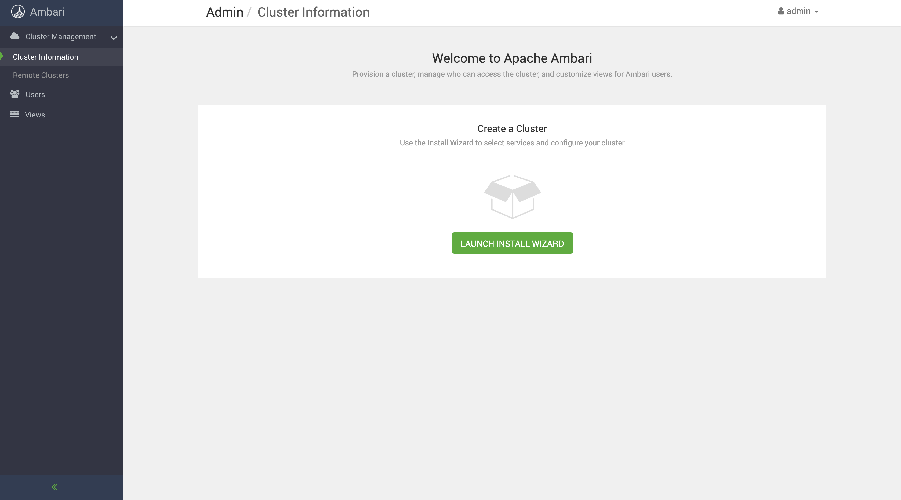

## 4.安装、配置和部署集群

#### 4.1 为集群起名字

登录成功后，点击 “LAUNCH INSTALL WIZARD”，开始创建一个集群，并为集群取一个名字，例如：bdp-test


#### 4.2 选择版本和安装库

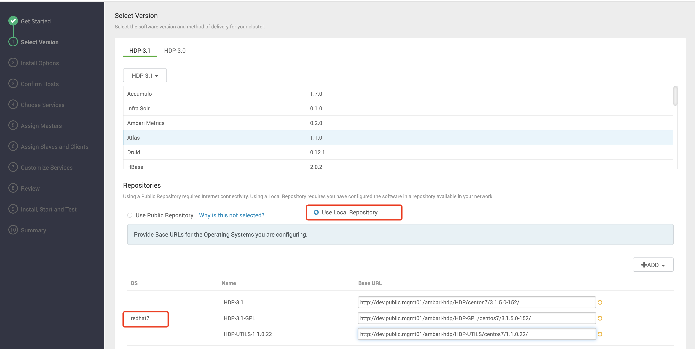

将之前配置的`/etc/yum.repos.d/hdp.repo`、`/etc/yum.repos.d/hdp.gpl.repo`中的base url依次填入：

```shell
# HDP-3.1
http://dev.public.mgmt01/ambari-hdp/HDP/centos7/3.1.5.0-152/
# HDP-3.1-GPL
http://dev.public.mgmt01/ambari-hdp/HDP-GPL/centos7/3.1.5.0-152/
# HDP-UTILS-1.1.0.22
http://dev.public.mgmt01/ambari-hdp/HDP-UTILS/centos7/1.1.0.22/
```

#### 4.3 安装选项

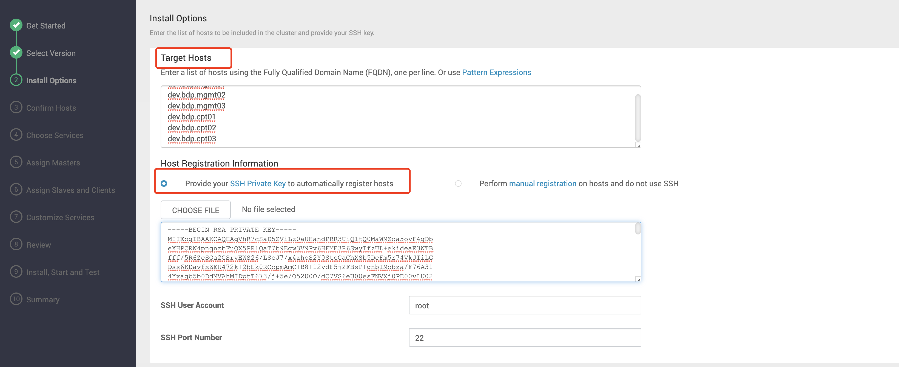

（1）这一步的“Target Hosts”为每台主机的域名，在之前配置/etc/hosts的步骤里提到过。

（2）SSH Private Key 里选择的文件是ambari主机那台机器的 id_rsa 这个文件

#### 4.4 确认主机

确认成功后，点击下一步。

#### 4.5 选择服务

根据需要，选择服务。如果某些服务依赖其它服务，而没有选择依赖的服务的话，点击“Next”时，会做相应的提示。


当前需要的组件为：

```
HDFS、YARN + MapReduce2、Hive、ZooKeeper、Ambari Metrics、Spark2、Tez、
```

#### 4.6 分配主服务

“Assign Masters” ambari 会自动分配各种服务到不同的机器上,也可手动进行调整。

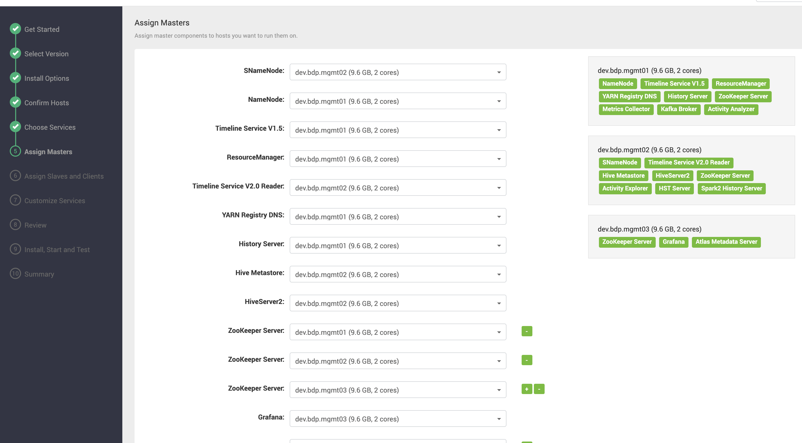

#### 4.7 分配从服务和客户端

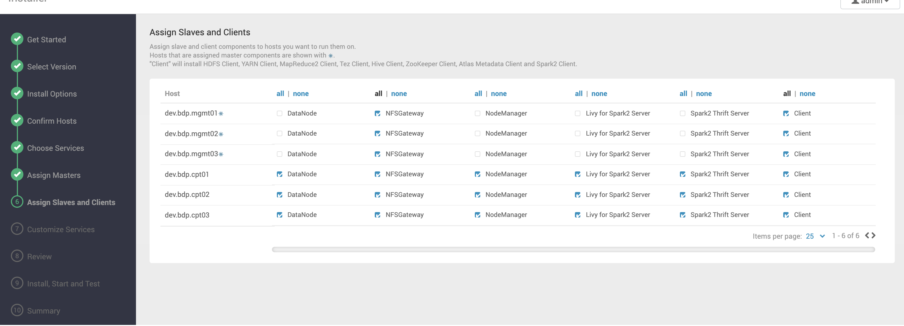

#### 4.8 认证


设置各组件的认证密码，请记住密码。

#### 4.9 配置hive数据库


（1）创建数据库

```sql
create database hive default character set='utf8';

use hive;

CREATE USER 'hive'@'localhost' IDENTIFIED BY 'admin123';

GRANT ALL PRIVILEGES ON hive.* TO 'hive'@'localhost' IDENTIFIED BY 'admin123' with grant option;  

CREATE USER 'hive'@'%' IDENTIFIED BY 'admin123';

GRANT ALL PRIVILEGES ON hive.* TO 'hive'@'%' IDENTIFIED BY 'admin123' with grant option;  

FLUSH PRIVILEGES;
```

（2）在ambari server主机上执行

```shell
ambari-server setup --jdbc-db=mysql --jdbc-driver=/usr/share/java/mysql-connector-java-5.1.44.jar
```

（3）Database URL加上utf8字符限制

```shell
jdbc:mysql://<hostname>/hive?createDatabaseIfNotExist=true&useUnicode=true&characterEncoding=UTF-8
jdbc:mysql://dev.public.mgmt01/hive?createDatabaseIfNotExist=true&useUnicode=true&characterEncoding=UTF-8
```

（4）输入对应的数据库用户密码，点击"TEST CONNECTION"，显示"Connection OK"则配置成功。

#### 4.10 目录配置


配置完成后，下一步

#### 4.11 账户确认


确认完，点击下一步

#### 4.12 Review


#### 4.13 安装

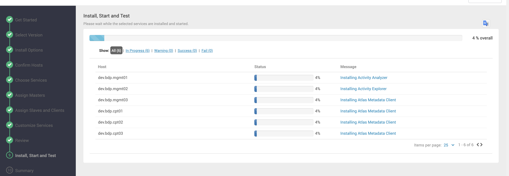

#### 4.14 组件安装

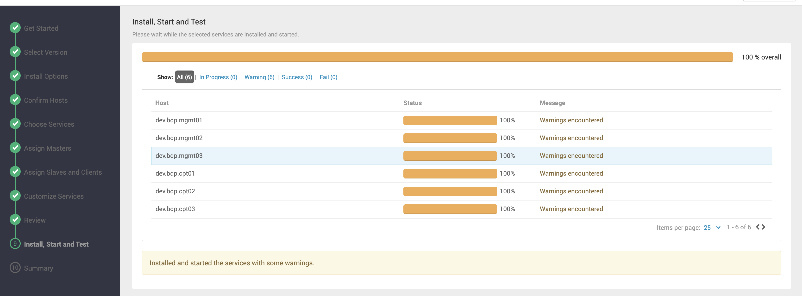

其中可能会存在一些错误，可以查看FAQ对应的错误解决方案，存在一些警告可以直接下一步，在后面启动过程中查看具体的问题进行解决。

#### 4.15 总揽


#### 4.16 启动所有组件


将问题解决，所有组件启动后，如上所示

## 5.配置NameNode HA

#### 5.1 启用 NameNode HA

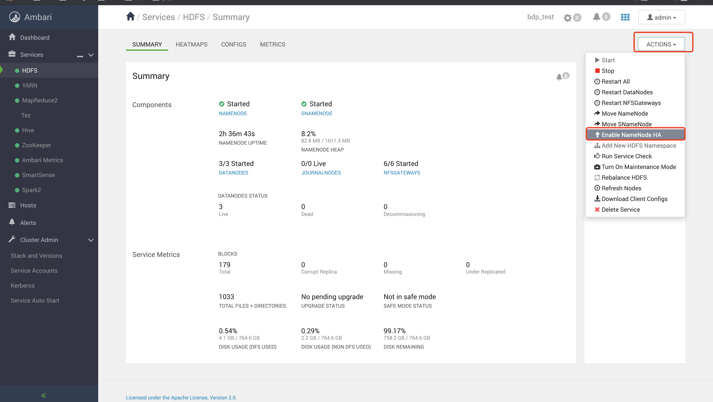

#### 5.2 配置Nameservice ID

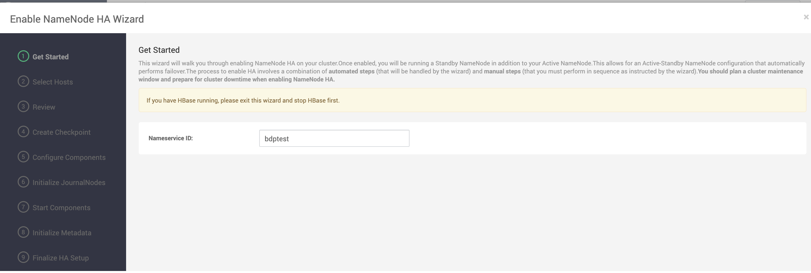

#### 5.3 选择NameNode和JournalNode的主机


#### 5.4 Review


此时Secondary NameNode会被删除

#### 5.5 创建checkpoint

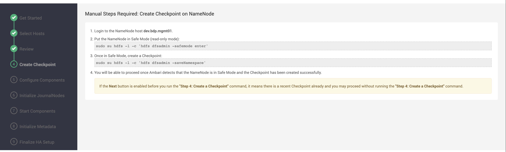

根据页面提示，登陆到对应的机器上面，执行第2和第3的命令：

```shell
# 进入安全模式
sudo su hdfs -l -c 'hdfs dfsadmin -safemode enter'
# 创建一个检查点
sudo su hdfs -l -c 'hdfs dfsadmin -saveNamespace'
```

#### 5.6 配置组件

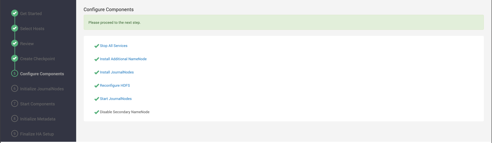

#### 5.7 初始化JournalNodes

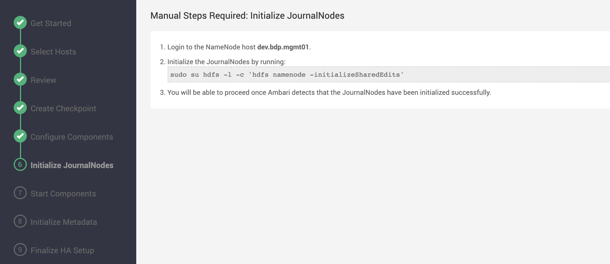

登入第1步提示的机器执行第2步命令：

```shell
sudo su hdfs -l -c 'hdfs namenode -initializeSharedEdits'
```

第一次可能会失败：


重试命令就成功了：

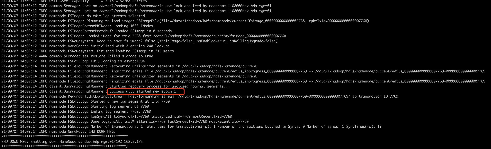

#### 5.8 开启组件


#### 5.9 初始化 NameNode HA 元数据

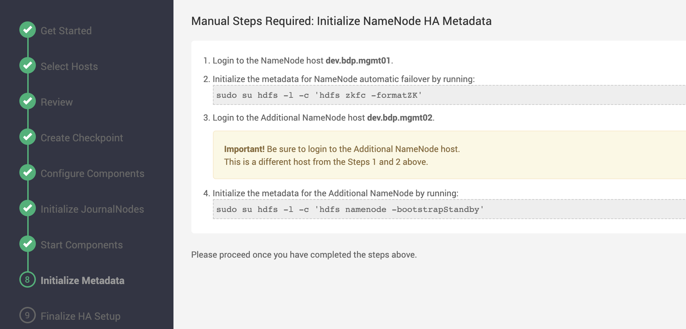

根据第1步登录到对应的机器，执行命令：

```shell
sudo su hdfs -l -c 'hdfs zkfc -formatZK'
```

根据第3步登录到新增的NameNode节点，执行命令：

```shell
sudo su hdfs -l -c 'hdfs namenode -bootstrapStandby'
```

#### 5.10 完成HA设置

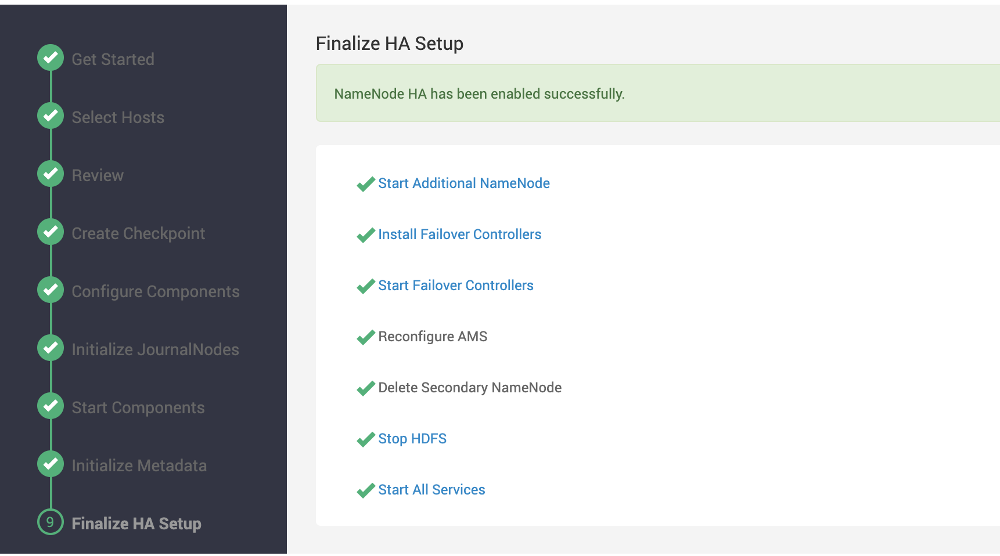

#### 5.11 查看HDFS页面


新增了**STANDBY NAMENODE**、**ZKFAILOVERCONTROLLER**、**JOURNALNODES**。原来的**SNAMENODE**被删除了

就此已经配置成功。

## 6. 配置Yarn ResourceManager HA

#### 6.1 启用RESOURCEMANAGER HA

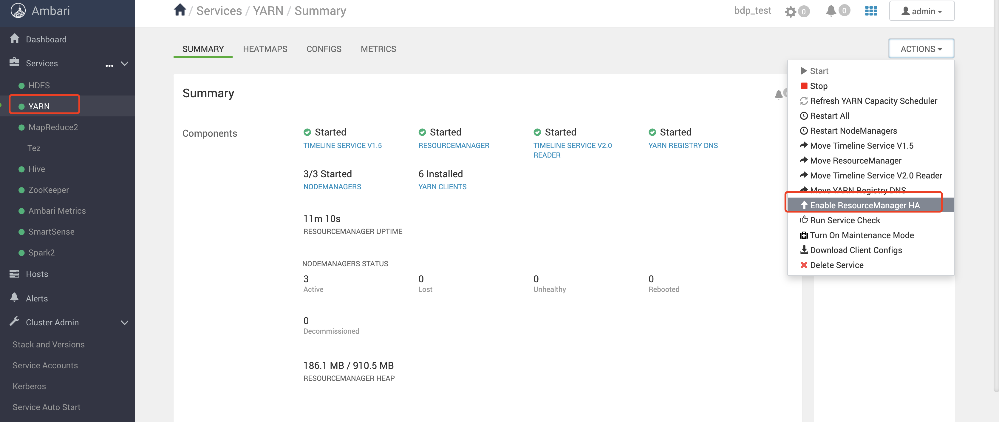

#### 6.2 开始


直接点击下一步

#### 6.3 选择主机


#### 6.4 Review


#### 6.5 配置组件


#### 6.6 查看YARN页面


页面上多了一个组件**STANDBY RESOURCEMANAGER**。就此已经配置成功。

## 7.YARN队列配置

> **注意**
>
> 新增的Yarn队列保存和更新完成后，后续提交应用到Yarn时，需要指定对应的队列，否则都提交到default队列，如果default队列资源不足时，会导致排队等待的现象。

#### 7.1 进入YARN队列配置页面


点击页面右上角的【YARN Queue Manager】，即进入到配置的页面

#### 7.2 新增队列


选中**root**队列，默认都分配给default队列，点击【Add Queue】，就可以在该root队列中划分新的队列，如果选中的是别的队列，则在对应选中的该队列进行资源划分。

从以上页面，可以看到root占有100%的资源，我们在其中新增batch和streaming两种队列。

其中，需要根据需求配置，一是整体资源的划分百分比，二是对应队列资源的配置。

#### 7.3 保存队列

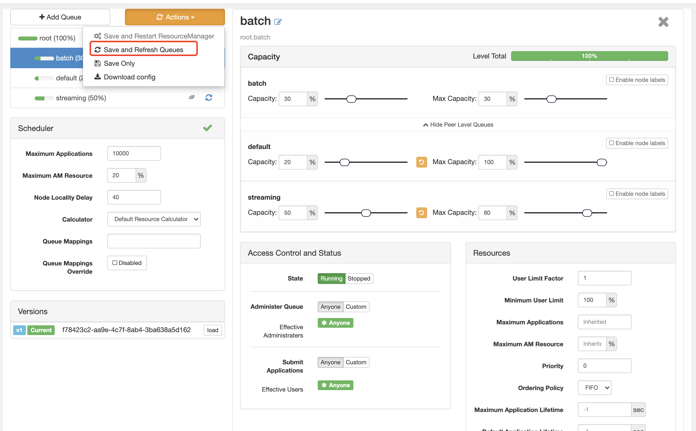


点击【Actions】下拉列表中的【Save and Refresh Queues】进行保存和更新队列。保存完成后会新增一个版本V2。

## 8.配置边缘节点（待补充）

待补充

## 9.安全和权限控制（待补充）

待补充

## 10.Ambari Server高可用（待补充）

待补充

## FAQ

1. Ambari启动报错如下：

   ```shell
   2021-08-30 22:19:10,049 ERROR [main] AmbariServer:1120 - Failed to run the Ambari Server
   org.apache.ambari.server.AmbariException: Current database store version is not compatible with current server version, serverVersion=2.7.5.0, schemaVersion=null
   	at org.apache.ambari.server.checks.DatabaseConsistencyCheckHelper.checkDBVersionCompatible(DatabaseConsistencyCheckHelper.java:256)
   	at org.apache.ambari.server.controller.AmbariServer.main(AmbariServer.java:1105)
   ```

   原因：

   数据库的版本和当前的Ambari的版本不兼容，出现这个问题时对应的MariaDB版本为5.5.x

   解决：

   安装新版本的MariaDB，例如：10.2

2. Ambari安装配置HDP的Confirm Hosts步骤时，一直失败，报错如下：

```shell

STDOUT: 

 One of the configured repositories failed (未知),
 and yum doesn't have enough cached data to continue. At this point the only
 safe thing yum can do is fail. There are a few ways to work "fix" this:
```

原因：
问题文件为：/etc/yum.repos.d/CentOS-Base.repo

解决：

在失败的主机上执行以下命令，就此解决

```shell
mv CentOS-Base.repo CentOS-Base.repo.bak
```

参考：[解决方法：CentOS7用yum安装软件显示错误：cannot find a valid baseurl for repo: base/7/x86_64](https://www.huaweicloud.com/articles/13423233.html) 

3.组件安装过程中，报错要求redhat-lsb


```
RuntimeError: Failed to execute command '/usr/bin/yum -y install hadoop_3_1_5_0_152', exited with code '1', message: 'Error: Package: hadoop_3_1_5_0_152-3.1.1.3.1.5.0-152.x86_64 (HDP-3.1-repo-1)

           Requires: redhat-lsb
```

解决：

安装rebhat-lsb

```shell
yum -y install redhat-lsb
```

安装完成查看

```shell
# rpm -qa | grep redhat-lsb
redhat-lsb-4.1-27.el7.centos.1.x86_64
redhat-lsb-submod-security-4.1-27.el7.centos.1.x86_64
redhat-lsb-printing-4.1-27.el7.centos.1.x86_64
redhat-lsb-desktop-4.1-27.el7.centos.1.x86_64
redhat-lsb-core-4.1-27.el7.centos.1.x86_64
redhat-lsb-submod-multimedia-4.1-27.el7.centos.1.x86_64
redhat-lsb-languages-4.1-27.el7.centos.1.x86_64
redhat-lsb-cxx-4.1-27.el7.centos.1.x86_64
```

4.ambari-metrics启动失败：cannot import name _common

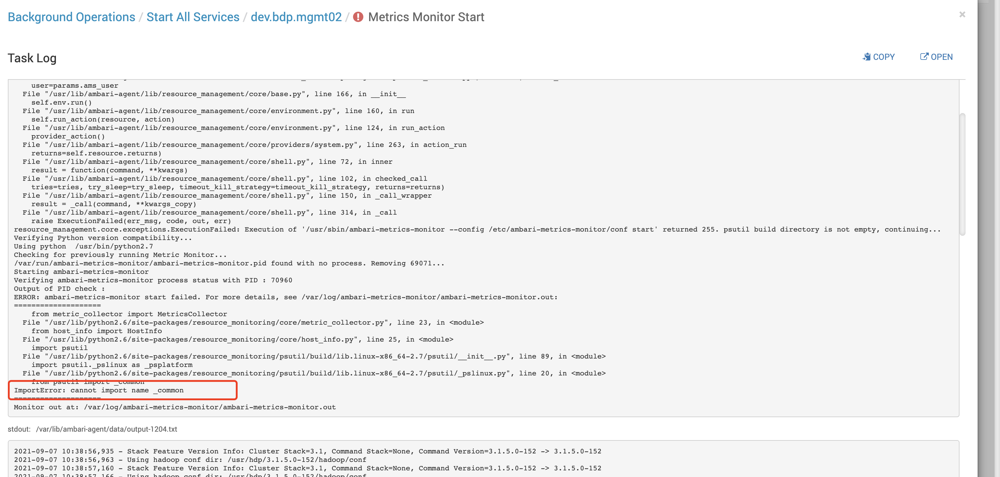

解决：

登录对应机器安装python 2.6依赖。

```shell
cd /usr/lib/python2.6/site-packages/resource_monitoring/psutil 
python setup.py build 
python setup.py install
```

参考：[ambari-metrics启动失败：cannot import name _common](https://support.huaweicloud.com/dpmg-hdp-kunpengbds/kunpengambarihdp_04_0029.html)

5.YARN Registry DNS Start failed

```
ERROR dns.PrivilegedRegistryDNSStarter (PrivilegedRegistryDNSStarter.java:init(61)) - Error initializing Registry DNS
java.net.BindException: Problem binding to [node.b2be.com:53] java.net.BindException: Address already in use; For more details see:  http://wiki.apache.org/hadoop/BindException
```

原因：

从报错问题可以看到，原因为53端口已经在使用，我们查看下被什么进程占用了：

```shell
# netstat -tnlpa | grep 53
tcp        0      0 192.168.122.1:53        0.0.0.0:*               LISTEN      12378/dnsmasq
```

解决：

有两种解决方式，一种是将原来的端口占用进程kill，另外一种是更改端口，我们选择更改端口：

检查 YARN 配置中以下属性的值
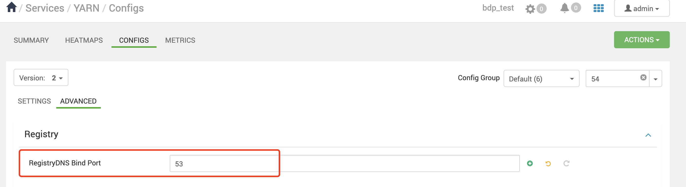

将其改为别的未占用端口，例如54.

参考：[YARN Registry DNS Start failed (Hortonworks 3)](https://community.cloudera.com/t5/Support-Questions/YARN-Registry-DNS-Start-failed-Hortonworks-3/td-p/218794)

6. 配置NameNode HA初始化JournalNodes，报错

```shell
21/09/07 13:59:10 ERROR namenode.NameNode: Could not initialize shared edits dir
org.apache.hadoop.hdfs.qjournal.client.QuorumException: Unable to check if JNs are ready for formatting. 3 exceptions thrown:
192.168.5.174:8485: Call From dev.bdp.mgmt01/192.168.5.173 to dev.bdp.mgmt02:8485 failed on connection exception: java.net.ConnectException: Connection refused; For more details see:  http://wiki.apache.org/hadoop/ConnectionRefused
192.168.5.175:8485: Call From dev.bdp.mgmt01/192.168.5.173 to dev.bdp.mgmt03:8485 failed on connection exception: java.net.ConnectException: Connection refused; For more details see:  http://wiki.apache.org/hadoop/ConnectionRefused
192.168.5.173:8485: Call From dev.bdp.mgmt01/192.168.5.173 to dev.bdp.mgmt01:8485 failed on connection exception: java.net.ConnectException: Connection refused; For more details see:  http://wiki.apache.org/hadoop/ConnectionRefused
	at org.apache.hadoop.hdfs.qjournal.client.QuorumException.create(QuorumException.java:81)
	at org.apache.hadoop.hdfs.qjournal.client.QuorumCall.rethrowException(QuorumCall.java:287)
	at org.apache.hadoop.hdfs.qjournal.client.QuorumJournalManager.hasSomeData(QuorumJournalManager.java:253)
	at org.apache.hadoop.hdfs.server.common.Storage.confirmFormat(Storage.java:1142)
	at org.apache.hadoop.hdfs.server.namenode.FSImage.confirmFormat(FSImage.java:196)
	at org.apache.hadoop.hdfs.server.namenode.NameNode.initializeSharedEdits(NameNode.java:1253)
	at org.apache.hadoop.hdfs.server.namenode.NameNode.createNameNode(NameNode.java:1619)
	at org.apache.hadoop.hdfs.server.namenode.NameNode.main(NameNode.java:1710)
21/09/07 13:59:10 INFO util.ExitUtil: Exiting with status 1: ExitException
21/09/07 13:59:10 INFO namenode.NameNode: SHUTDOWN_MSG:
/************************************************************
SHUTDOWN_MSG: Shutting down NameNode at dev.bdp.mgmt01/192.168.5.173
************************************************************/
```

解决：

可能是在重试时间内，未成功，直接重新执行命令就成功了。

7. Chrome浏览器上查看Applications的列表中的时间和服务器系统时间不一致

   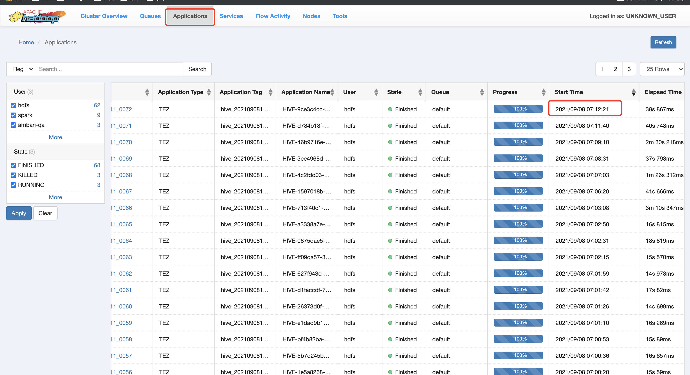

原因：

浏览器上的时间与实际的时间差了16个小时，从浏览器拿出对应的时间戳转成时间后，其实是与实际时间一致的，为此不一致的原因为浏览器的时区与服务器系统的时区不一致导致的。

解决：

更改浏览器的时区，比如谷歌可以下载【更改Google Chrome™的时区】插件进行更改。

8. datanode启动失败

   ```shell
   2021-09-09 10:04:09,629 WARN  common.Storage (DataStorage.java:loadDataStorage(418)) - Failed to add storage directory [DISK]file:/data/1/hadoop/hdfs/data
   java.io.IOException: Incompatible clusterIDs in /data/1/hadoop/hdfs/data: namenode clusterID = CID-200e8ce0-d8f2-43b8-a1b9-5efa6bc68de0; datanode clusterID = CID-3d0b5407-9772-4be0-a31e-74a6bfd1372b
           at org.apache.hadoop.hdfs.server.datanode.DataStorage.doTransition(DataStorage.java:736)
           at org.apache.hadoop.hdfs.server.datanode.DataStorage.loadStorageDirectory(DataStorage.java:294)
           at org.apache.hadoop.hdfs.server.datanode.DataStorage.loadDataStorage(DataStorage.java:407)
           at org.apache.hadoop.hdfs.server.datanode.DataStorage.addStorageLocations(DataStorage.java:387)
           at org.apache.hadoop.hdfs.server.datanode.DataStorage.recoverTransitionRead(DataStorage.java:551)
           at org.apache.hadoop.hdfs.server.datanode.DataNode.initStorage(DataNode.java:1718)
           at org.apache.hadoop.hdfs.server.datanode.DataNode.initBlockPool(DataNode.java:1678)
           at org.apache.hadoop.hdfs.server.datanode.BPOfferService.verifyAndSetNamespaceInfo(BPOfferService.java:390)
           at org.apache.hadoop.hdfs.server.datanode.BPServiceActor.connectToNNAndHandshake(BPServiceActor.java:280)
           at org.apache.hadoop.hdfs.server.datanode.BPServiceActor.run(BPServiceActor.java:817)
           at java.lang.Thread.run(Thread.java:748)
   ```

   原因：

   由于一些配置错误原因将namenod重新格式化，导致namenode和datanode的VERSION文件中的clusterID不一致，从而会导致失败

   解决：

   将每台datanode上的data目录下的所有文件删除，其中每台机器上有多个数据盘，需要都删除。例如

   ```shell
   # 进入到以下两个数据目录下，将以下文件都删除
   cd /data/1/hadoop/hdfs/data/
   cd /data/2/hadoop/hdfs/data/
   ```

9. YARN异常YarnException:Failed while publishing entity的解决方案

   mapreduce提交任务计算时，job已经结束，但是容器仍不能关闭持续等待五分钟，日志一直输出以下内容：

  ```
  2021-09-09 12:15:46,620 INFO [Thread-78] org.apache.hadoop.yarn.event.AsyncDispatcher: Waiting for AsyncDispatcher to drain. Thread state is :WAITING
  2021-09-09 12:15:46,720 INFO [Thread-78] org.apache.hadoop.yarn.event.AsyncDispatcher: Waiting for AsyncDispatcher to drain. Thread state is :WAITING
  2021-09-09 12:15:46,820 INFO [Thread-78] org.apache.hadoop.yarn.event.AsyncDispatcher: Waiting for AsyncDispatcher to drain. Thread state is :WAITING
  2021-09-09 12:15:46,920 INFO [Thread-78] org.apache.hadoop.yarn.event.AsyncDispatcher: Waiting for AsyncDispatcher to drain. Thread state is :WAITING
  2021-09-09 12:15:47,021 INFO [Thread-78] org.apache.hadoop.yarn.event.AsyncDispatcher: Waiting for AsyncDispatcher to drain. Thread state is :WAITING
  2021-09-09 12:15:47,121 INFO [Thread-78] org.apache.hadoop.yarn.event.AsyncDispatcher: Waiting for AsyncDispatcher to drain. Thread state is :WAITING
  2021-09-09 12:15:47,221 INFO [Thread-78] org.apache.hadoop.yarn.event.AsyncDispatcher: Waiting for AsyncDispatcher to drain. Thread state is :WAITING
  2021-09-09 12:15:47,321 INFO [Thread-78] org.apache.hadoop.yarn.event.AsyncDispatcher: Waiting for AsyncDispatcher to drain. Thread state is :WAITING
  2021-09-09 12:15:47,421 INFO [Thread-78] org.apache.hadoop.yarn.event.AsyncDispatcher: Waiting for AsyncDispatcher to drain. Thread state is :WAITING
  2021-09-09 12:15:47,522 INFO [Thread-78] org.apache.hadoop.yarn.event.AsyncDispatcher: Waiting for AsyncDispatcher to drain. Thread state is :WAITING
  2021-09-09 12:15:47,622 INFO [Thread-78] org.apache.hadoop.yarn.event.AsyncDispatcher: Waiting for AsyncDispatcher to drain. Thread state is :WAITING
  ```

  解决方案：

  参考：[YARN异常YarnException:Failed while publishing entity的解决方案](https://blog.csdn.net/qq_41958123/article/details/87921251)

## Ref

- 【Apache Ambari Installation】https://docs.cloudera.com/HDPDocuments/Ambari-2.7.5.0/bk_ambari-installation/content/ch_Getting_Ready.html
- 【HDP Documentation】https://docs.cloudera.com/HDPDocuments/HDP3/HDP-3.1.5/index.html

- 【ambari2.7.3 + HDP3.1.0离线搭建HA高可用集群】https://juejin.cn/post/6854573215134515208

- 【ambari2.7.5百度网盘下载地址】https://download.csdn.net/download/NDF923/18838311

- 【最新版Ambari2.75安装及HDP3.1.5集群搭建】https://blog.csdn.net/NDF923/article/details/116445785

- 【Ambari2.7.4+HDP3.1.4安装 Centos7离线安装】https://www.cnblogs.com/shook/p/12409759.html

- 【Ambari-HDP版本要求】https://supportmatrix.cloudera.com/#Hortonworks

- 【XFS (简体中文)】https://wiki.archlinux.org/title/XFS_(%E7%AE%80%E4%BD%93%E4%B8%AD%E6%96%87)

- 【Planning for the HDP Cluster】https://docs.cloudera.com/HDPDocuments/HDP3/HDP-3.1.5/cluster-planning/content/partitioning.html
- 【Ambari 2.7.3 离线安装手册】https://blog.appydm.com/2021/07/06/bigdata/Ambari-2-7-3-离线安装手册/

