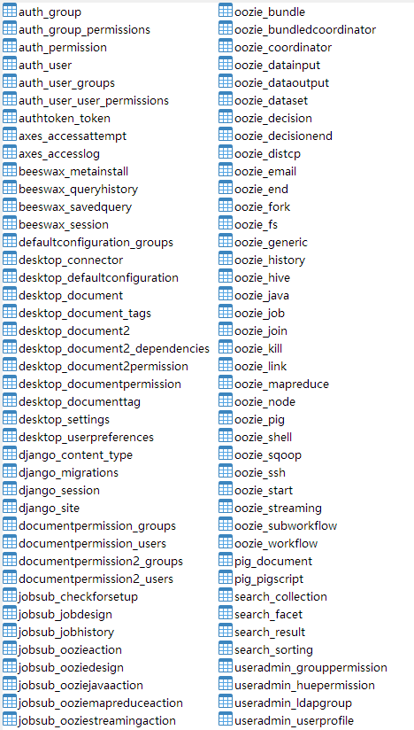

# Hue 安装

## 运行环境依赖

> [Dependencies :: Hue SQL Assistant Documentation (gethue.com)](https://docs.gethue.com/administrator/installation/dependencies/)

- Python 2.7 或 3.6+

  - CenttOS 7.5 自带 Python 2.7，这里不做安装描述

- 数据库：  [MySQL InnoDB, PostgreSQL or Oracle](https://docs.cloudera.com/documentation/enterprise/latest/topics/hue_dbs_0.html).

- 系统包：

  ***编译安装需要***

  ```shell
  sudo yum install ant asciidoc cyrus-sasl-devel cyrus-sasl-gssapi cyrus-sasl-plain gcc gcc-c++ krb5-devel libffi-devel libxml2-devel libxslt-devel make mysql mysql-devel openldap-devel python-devel sqlite-devel gmp-devel
  ```

- NPM 工具：

  ```shell
  wget https://npm.taobao.org/mirrors/node/v14.5.0/node-v14.5.0-linux-x64.tar.gz
  tar -xzf node-v14.5.0-linux-x64.tar.gz
  cd node-v14.5.0-linux-x64/
  #ln -s /opt/node-v14.5.0-linux-x64/bin/* /usr/local/bin/
  #ln -s /opt/node-v14.5.0-linux-x64/bin/npm /usr/bin/npm
  ```

  

- JDK 环境：如果需要 JDBC 支持

- 浏览器：Edge/Safari/Chrome/Firefox

- 操作系统用户，非 root

  ```shell
  useradd hue
  passwd hue
  ```


## 准备

- 编译安装：下载 HUE 源码包 https://cdn.gethue.com/downloads/hue-4.10.0.tgz
- 离线安装：下载已编译版本 链接：[hue.4.10.0-centos7.5-py2.7-node14.5.0.tar.gz](https://pan.baidu.com/s/1QYSaFG_0ZQHXvtJJG2t5-w) 
  提取码：4z5p


## 安装

> 参考：[Install :: Hue SQL Assistant Documentation (gethue.com)](https://docs.gethue.com/administrator/installation/install/)
>
> ​	安装方式，按照官方文档为联网编译安装。生产环境无法满足连接互联网，配置内网的 NPM 依赖库比较麻烦。故选择以编译打包好的包，直接解压方式安装。


### 方式一：编译安装

> 需要联网，NPM 编译时需要下载前端依赖包。

#### 解压安装包

```shell
mkdir -p /opt/bdp
tar -xvzf - hue-4.10.0.tgz -C /opt/bdp
cd /opt/bdp/hue-4.10.0
```

#### 编译

 `$PREFIX` 指定编译到特定的目录：

```shell
# 编译过程需要 npm 构建，会比较慢，可以设置国内的 npm 源，加速构建
npm config set registry https://registry.npm.taobao.org/
PREFIX=/usr/share make install
# 把目录权限赋给 hue 用户
chown -R hue:hue /usr/share/hue/
cd /usr/share/hue
```


### 方式二：解压安装

> 注：解压安装必须安装在 /usr/share/hue

```shell
tar -xvzf hue.4.10.0-centos7.5-py2.7-node14.5.0.tar.gz -C /usr/share/
```


### 配置服务

> 参考：[Server :: Hue SQL Assistant Documentation (gethue.com)](https://docs.gethue.com/administrator/configuration/server/)

```shell
# 先备份
cd /usr/share/hue/desktop/conf/
cp hue.ini hue.ini.bak
```

修改`/usr/share/hue/desktop/conf/hue.ini`中数据库的配置

```ini
  [[database]]
    host=192.168.6.152
    port=4000
    engine=mysql
    user=hue
    password=admin123
    name=hue
```

开放 Web UI 上配置 Connectors

```ini
[desktop]
enable_connectors=true

[notebook]
enable_notebook_2=true
```


### 创建后端数据库

> 默认 Hue 运行在 SqlLite，这里选用 mysql 5.7 作为后端数据库。

```sql
-- 创建数据库 hue
create database hue default character set='utf8';
-- 创建用户 hue
CREATE USER 'hue'@'localhost' IDENTIFIED BY 'admin123';
CREATE USER 'hue'@'192.168.6.152' IDENTIFIED BY 'admin123';
CREATE USER 'hue'@'%' IDENTIFIED BY 'admin123';
-- 赋权
GRANT ALL PRIVILEGES ON hue.* TO 'hue'@'localhost' IDENTIFIED BY 'admin123' with grant option;  
GRANT ALL PRIVILEGES ON hue.* TO 'hue'@'192.168.6.152' IDENTIFIED BY 'admin123' with grant option;  
GRANT ALL PRIVILEGES ON hue.* TO 'hue'@'%' IDENTIFIED BY 'admin123' with grant option;
FLUSH PRIVILEGES;

SELECT * FROM mysql.`user` WHERE `User`='hue';
```

#### 初始化数据

> 执行安装手册下 `config/hue.sql` 文件，初始化数据。




## 运行

```shell
nohup /usr/share/hue/build/env/bin/supervisor >> /usr/share/hue/logs/server.log 2>&1 &
```

浏览器打开 http://hueserver:8888/


​	


# REF

- Hue 官方网站：[https://gethue.com/](https://links.jianshu.com/go?to=https%3A%2F%2Fgethue.com%2F)
- [Install :: Hue SQL Assistant Documentation (gethue.com)](https://docs.gethue.com/administrator/installation/install/)
- [关于hue安装后出现KeyError: "Couldn't get user id for user hue"的解决方法](https://www.cnblogs.com/nanguyan/p/8040482.html)
- [CDH 报错：UnicodeEncodeError: 'ascii' codec can't encode characters in position 0-11: ordinal not in range - pcwen.top - 博客园 (cnblogs.com)](https://www.cnblogs.com/chevin/p/10221313.html)
- [Connectors :: Hue SQL Assistant Documentation (gethue.com)](https://docs.gethue.com/administrator/configuration/connectors/)
- [User :: Hue SQL Assistant Documentation (gethue.com)](https://docs.gethue.com/user/)
- [解决/usr/bin/ld: cannot find -lmariadb报错 - 小伍子 - 博客园 (cnblogs.com)](https://www.cnblogs.com/wurijie/p/13110308.html)
- [Editor :: Hue Presto JDBC Connector](http://cloudera.github.io/hue/latest/administrator/configuration/editor/#presto)


### 按需安装数据源插件

> [Connectors :: Hue SQL Assistant Documentation (gethue.com)](https://docs.gethue.com/administrator/configuration/connectors/)

```shell
# 安装必要的插件
/usr/share/hue/build/env/bin/pip install pyhive
/usr/share/hue/build/env/bin/pip install mysqlclient
/usr/share/hue/build/env/bin/pip installpymssql
/usr/share/hue/build/env/bin/pip install cx_Oracle
/usr/share/hue/build/env/bin/pip install psycopg2
/usr/share/hue/build/env/bin/pip install psycopg2-binary
/usr/share/hue/build/env/bin/pip install phoenixdb
/usr/share/hue/build/env/bin/pip install pydruid
/usr/share/hue/build/env/bin/pip install ksql
/usr/share/hue/build/env/bin/pip install thrift_sasl
/usr/share/hue/build/env/bin/pip install sqlalchemy-redshift
/usr/share/hue/build/env/bin/pip install sqlalchemy-solr
/usr/share/hue/build/env/bin/pip install kylinpy
/usr/share/hue/build/env/bin/pip install sqlalchemy-clickhouse
/usr/share/hue/build/env/bin/pip install pytz==2021.1
/usr/share/hue/build/env/bin/pip install elasticsearch-dbapi
```

配置需要的 jar home

```
# MySQL
export MYSQL_HOME=/Users/hue/Dev/mysql
export CLASSPATH=$MYSQL_HOME/mysql-connector-java-5.1.38-bin.jar:$CLASSPATH
```


**本页编辑**      **[@gongshiwen](http://192.168.1.23/gongshiwen)**  