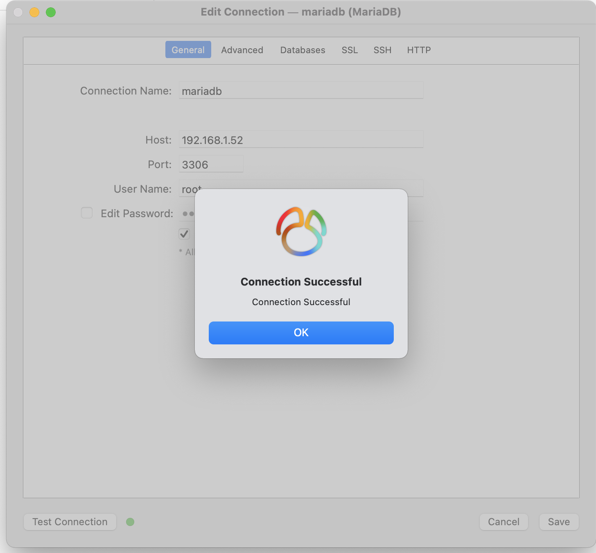

# MariaDB安装

## 介绍

MariaDB 是一个采用Maria 存储引擎的MySQL分支版本，是由原来MySQL 的作者Michael Widenius创办的公司所开发的**免费开源**的数据库服务器。 这个项目的很多代码都改编于MySQL 6.0，例如“pool of threads”功能提供解决多数据连接问题。

## 安装方式

1.通过yum源进行安装

2.从官网下载包安装

## yum源安装

#### 准备

- `yum`
- 有外网或者本地yum包含mariadb-server

自从 CentOS 7 开始，自带的数据库就变成 MariaDB 了，yum 安装之后的默认版本是 5.5，但是这个数据版本已经比较老了，为此我们将 MariaDB Yum 库升级到 MariaDB 官方推荐的 stable 稳定版10.2。

#### 添加 MariaDB Yum 库

`vim  /etc/yum.repos.d/MariaDB.repo` 添加以下内容：

```shell
# MariaDB 10.2 CentOS repository list - created 2021-08-30 05:51 UTC
# http://downloads.mariadb.org/mariadb/repositories/
[mariadb]
name = MariaDB
baseurl = http://yum.mariadb.org/10.2/centos7-amd64
gpgkey=https://yum.mariadb.org/RPM-GPG-KEY-MariaDB
gpgcheck=1
```

#### 安装

命令

```shell
# 安装
sudo yum install MariaDB-server MariaDB-client

# 清理安装包
yum  clean  all
```

###### （1）安装：

```shell
[root@PUBLIC_IP yum.repos.d]# yum install MariaDB-server MariaDB-client
已加载插件：fastestmirror, langpacks
Loading mirror speeds from cached hostfile
 * base: mirrors.aliyun.com
 * extras: mirrors.aliyun.com
 * updates: mirrors.huaweicloud.com
正在解决依赖关系
--> 正在检查事务
---> 软件包 MariaDB-client.x86_64.0.10.2.40-1.el7.centos 将被 安装
--> 正在处理依赖关系 MariaDB-common，它被软件包 MariaDB-client-10.2.40-1.el7.centos.x86_64 需要
---> 软件包 MariaDB-server.x86_64.0.10.2.40-1.el7.centos 将被 安装
--> 正在处理依赖关系 galera，它被软件包 MariaDB-server-10.2.40-1.el7.centos.x86_64 需要
--> 正在检查事务
---> 软件包 MariaDB-common.x86_64.0.10.2.40-1.el7.centos 将被 安装
--> 正在处理依赖关系 MariaDB-compat，它被软件包 MariaDB-common-10.2.40-1.el7.centos.x86_64 需要
---> 软件包 galera.x86_64.0.25.3.34-1.el7.centos 将被 安装
--> 正在处理依赖关系 libboost_program_options-mt.so.1.53.0()(64bit)，它被软件包 galera-25.3.34-1.el7.centos.x86_64 需要
--> 正在检查事务
---> 软件包 MariaDB-compat.x86_64.0.10.2.40-1.el7.centos 将被 安装
---> 软件包 boost-program-options.x86_64.0.1.53.0-28.el7 将被 安装
--> 解决依赖关系完成

依赖关系解决

==============================================================================================================================================================================================================================================
 Package                                                          架构                                              版本                                                             源                                                  大小
==============================================================================================================================================================================================================================================
正在安装:
 MariaDB-client                                                   x86_64                                            10.2.40-1.el7.centos                                             mariadb                                             11 M
 MariaDB-server                                                   x86_64                                            10.2.40-1.el7.centos                                             mariadb                                             24 M
为依赖而安装:
 MariaDB-common                                                   x86_64                                            10.2.40-1.el7.centos                                             mariadb                                             81 k
 MariaDB-compat                                                   x86_64                                            10.2.40-1.el7.centos                                             mariadb                                            2.2 M
 boost-program-options                                            x86_64                                            1.53.0-28.el7                                                    base                                               156 k
 galera                                                           x86_64                                            25.3.34-1.el7.centos                                             mariadb                                            8.1 M

事务概要
==============================================================================================================================================================================================================================================
安装  2 软件包 (+4 依赖软件包)

总下载量：45 M
安装大小：221 M
Is this ok [y/d/N]: y
Downloading packages:
警告：/var/cache/yum/x86_64/7/mariadb/packages/MariaDB-common-10.2.40-1.el7.centos.x86_64.rpm: 头V4 DSA/SHA1 Signature, 密钥 ID 1bb943db: NOKEY                                                             ]  73 kB/s |  89 kB  00:10:32 ETA
MariaDB-common-10.2.40-1.el7.centos.x86_64.rpm 的公钥尚未安装
(1/6): MariaDB-common-10.2.40-1.el7.centos.x86_64.rpm                                                                                                                                                                  |  81 kB  00:00:01
(2/6): MariaDB-compat-10.2.40-1.el7.centos.x86_64.rpm                                                                                                                                                                  | 2.2 MB  00:00:03
(3/6): boost-program-options-1.53.0-28.el7.x86_64.rpm                                                                                                                                                                  | 156 kB  00:00:00
(4/6): MariaDB-client-10.2.40-1.el7.centos.x86_64.rpm                                                                                                                                                                  |  11 MB  00:00:07
(5/6): galera-25.3.34-1.el7.centos.x86_64.rpm                                                                                                                                                                          | 8.1 MB  00:00:01
(6/6): MariaDB-server-10.2.40-1.el7.centos.x86_64.rpm                                                                                                                                                                  |  24 MB  00:00:06
----------------------------------------------------------------------------------------------------------------------------------------------------------------------------------------------------------------------------------------------
总计                                                                                                                                                                                                          3.9 MB/s |  45 MB  00:00:11
从 https://yum.mariadb.org/RPM-GPG-KEY-MariaDB 检索密钥
导入 GPG key 0x1BB943DB:
 用户ID     : "MariaDB Package Signing Key <package-signing-key@mariadb.org>"
 指纹       : 1993 69e5 404b d5fc 7d2f e43b cbcb 082a 1bb9 43db
 来自       : https://yum.mariadb.org/RPM-GPG-KEY-MariaDB
是否继续？[y/N]：y
Running transaction check
Running transaction test
Transaction test succeeded
Running transaction
  正在安装    : MariaDB-common-10.2.40-1.el7.centos.x86_64                                                                                                                                                                                1/6
  正在安装    : MariaDB-compat-10.2.40-1.el7.centos.x86_64                                                                                                                                                                                2/6
  正在安装    : MariaDB-client-10.2.40-1.el7.centos.x86_64                                                                                                                                                                                3/6
  正在安装    : boost-program-options-1.53.0-28.el7.x86_64                                                                                                                                                                                4/6
  正在安装    : galera-25.3.34-1.el7.centos.x86_64                                                                                                                                                                                        5/6
  正在安装    : MariaDB-server-10.2.40-1.el7.centos.x86_64                                                                                                                                                                                6/6


PLEASE REMEMBER TO SET A PASSWORD FOR THE MariaDB root USER !
To do so, start the server, then issue the following command:

'/usr/bin/mysql_secure_installation'

which will also give you the option of removing the test
databases and anonymous user created by default.  This is
strongly recommended for production servers.

See the MariaDB Knowledgebase at http://mariadb.com/kb or the
MySQL manual for more instructions.

Please report any problems at http://mariadb.org/jira

The latest information about MariaDB is available at http://mariadb.org/.
You can find additional information about the MySQL part at:
http://dev.mysql.com
Consider joining MariaDB's strong and vibrant community:
https://mariadb.org/get-involved/

  验证中      : MariaDB-client-10.2.40-1.el7.centos.x86_64                                                                                                                                                                                1/6
  验证中      : boost-program-options-1.53.0-28.el7.x86_64                                                                                                                                                                                2/6
  验证中      : MariaDB-server-10.2.40-1.el7.centos.x86_64                                                                                                                                                                                3/6
  验证中      : galera-25.3.34-1.el7.centos.x86_64                                                                                                                                                                                        4/6
  验证中      : MariaDB-compat-10.2.40-1.el7.centos.x86_64                                                                                                                                                                                5/6
  验证中      : MariaDB-common-10.2.40-1.el7.centos.x86_64                                                                                                                                                                                6/6

已安装:
  MariaDB-client.x86_64 0:10.2.40-1.el7.centos                                                                          MariaDB-server.x86_64 0:10.2.40-1.el7.centos

作为依赖被安装:
  MariaDB-common.x86_64 0:10.2.40-1.el7.centos                 MariaDB-compat.x86_64 0:10.2.40-1.el7.centos                 boost-program-options.x86_64 0:1.53.0-28.el7                 galera.x86_64 0:25.3.34-1.el7.centos

完毕！
```

###### （2）清理安装包

```
[root@PUBLIC_IP lcs]# yum  clean   all
已加载插件：fastestmirror, langpacks
正在清理软件源： base docker-ce-stable extras updates
Cleaning up everything
Maybe you want: rm -rf /var/cache/yum, to also free up space taken by orphaned data from disabled or removed repos
Cleaning up list of fastest mirrors
```

#### 数据库启动

命令:

```shell
# 启动命令 
systemctl  start  mariadb
# 重启命令  
systemctl  restart  mariadb
# 关闭命令
systemctl  stop  mariadb
# 查看状态命令  
systemctl  status  mariadb
```

启动并查看状态：

```shell
[root@PUBLIC_IP lcs]# systemctl  start  mariadb
[root@PUBLIC_IP yum.repos.d]# systemctl  status  mariadb
● mariadb.service - MariaDB 10.2.40 database server
   Loaded: loaded (/usr/lib/systemd/system/mariadb.service; disabled; vendor preset: disabled)
  Drop-In: /etc/systemd/system/mariadb.service.d
           └─migrated-from-my.cnf-settings.conf
   Active: active (running) since 一 2021-08-30 21:54:24 CST; 1s ago # active说明已经启动了
     Docs: man:mysqld(8)
           https://mariadb.com/kb/en/library/systemd/
  Process: 26278 ExecStartPost=/bin/sh -c systemctl unset-environment _WSREP_START_POSITION (code=exited, status=0/SUCCESS)
  Process: 26235 ExecStartPre=/bin/sh -c [ ! -e /usr/bin/galera_recovery ] && VAR= ||   VAR=`cd /usr/bin/..; /usr/bin/galera_recovery`; [ $? -eq 0 ]   && systemctl set-environment _WSREP_START_POSITION=$VAR || exit 1 (code=exited, status=0/SUCCESS)
  Process: 26232 ExecStartPre=/bin/sh -c systemctl unset-environment _WSREP_START_POSITION (code=exited, status=0/SUCCESS)
 Main PID: 26246 (mysqld)
   Status: "Taking your SQL requests now..."
    Tasks: 30
   Memory: 75.0M
   CGroup: /system.slice/mariadb.service
           └─26246 /usr/sbin/mysqld --basedir=/usr

8月 30 21:54:24 PUBLIC_IP mysqld[26246]: 2021-08-30 21:54:24 140030276413632 [Note] InnoDB: 5.7.35 started; log sequence number 1615498
8月 30 21:54:24 PUBLIC_IP mysqld[26246]: 2021-08-30 21:54:24 140029405943552 [Note] InnoDB: Loading buffer pool(s) from /var/lib/mysql/ib_buffer_pool
8月 30 21:54:24 PUBLIC_IP mysqld[26246]: 2021-08-30 21:54:24 140029405943552 [Note] InnoDB: Buffer pool(s) load completed at 210830 21:54:24
8月 30 21:54:24 PUBLIC_IP mysqld[26246]: 2021-08-30 21:54:24 140030276413632 [Note] Plugin 'FEEDBACK' is disabled.
8月 30 21:54:24 PUBLIC_IP mysqld[26246]: 2021-08-30 21:54:24 140030276413632 [Note] Server socket created on IP: '::'.
8月 30 21:54:24 PUBLIC_IP mysqld[26246]: 2021-08-30 21:54:24 140030276413632 [Note] Reading of all Master_info entries succeeded
8月 30 21:54:24 PUBLIC_IP mysqld[26246]: 2021-08-30 21:54:24 140030276413632 [Note] Added new Master_info '' to hash table
8月 30 21:54:24 PUBLIC_IP mysqld[26246]: 2021-08-30 21:54:24 140030276413632 [Note] /usr/sbin/mysqld: ready for connections.
8月 30 21:54:24 PUBLIC_IP mysqld[26246]: Version: '10.2.40-MariaDB'  socket: '/var/lib/mysql/mysql.sock'  port: 3306  MariaDB Server
8月 30 21:54:24 PUBLIC_IP systemd[1]: Started MariaDB 10.2.40 database server.
```

#### 数据库初始化

###### 命令

```
mysql_secure_installation
```

###### 初始化

```shell
[root@PUBLIC_IP yum.repos.d]# mysql_secure_installation

NOTE: RUNNING ALL PARTS OF THIS SCRIPT IS RECOMMENDED FOR ALL MariaDB
      SERVERS IN PRODUCTION USE!  PLEASE READ EACH STEP CAREFULLY!

In order to log into MariaDB to secure it, we'll need the current
password for the root user.  If you've just installed MariaDB, and
you haven't set the root password yet, the password will be blank,
so you should just press enter here.

Enter current password for root (enter for none):
OK, successfully used password, moving on...

Setting the root password ensures that nobody can log into the MariaDB
root user without the proper authorisation.

Set root password? [Y/n] y
New password:
Re-enter new password:
Password updated successfully!
Reloading privilege tables..
 ... Success!


By default, a MariaDB installation has an anonymous user, allowing anyone
to log into MariaDB without having to have a user account created for
them.  This is intended only for testing, and to make the installation
go a bit smoother.  You should remove them before moving into a
production environment.

Remove anonymous users? [Y/n] y
 ... Success!

Normally, root should only be allowed to connect from 'localhost'.  This
ensures that someone cannot guess at the root password from the network.

Disallow root login remotely? [Y/n] n
 ... skipping.

By default, MariaDB comes with a database named 'test' that anyone can
access.  This is also intended only for testing, and should be removed
before moving into a production environment.

Remove test database and access to it? [Y/n] n
 ... skipping.

Reloading the privilege tables will ensure that all changes made so far
will take effect immediately.

Reload privilege tables now? [Y/n] y
 ... Success!

Cleaning up...

All done!  If you've completed all of the above steps, your MariaDB
installation should now be secure.

Thanks for using MariaDB!
```

#### 开启远程访问数据库权限

连接到mysql数据库执行以下语句：

```sql
update user set host='%' where host='localhost';  
```

具体如下：

```shell
[root@PUBLIC_IP lcs]# mysql -u root -p
Enter password:
Welcome to the MariaDB monitor.  Commands end with ; or \g.
Your MariaDB connection id is 7
Server version: 5.5.68-MariaDB MariaDB Server

Copyright (c) 2000, 2018, Oracle, MariaDB Corporation Ab and others.

Type 'help;' or '\h' for help. Type '\c' to clear the current input statement.

MariaDB [test]> show databases;
+--------------------+
| Database           |
+--------------------+
| information_schema |
| mysql              |
| performance_schema |
| test               |
+--------------------+
4 rows in set (0.00 sec)

MariaDB [test]> use mysql;
Reading table information for completion of table and column names
You can turn off this feature to get a quicker startup with -A

Database changed

MariaDB [mysql]> select host,user,password from user;
+------------+------+-------------------------------------------+
| host       | user | password                                  |
+------------+------+-------------------------------------------+
| localhost  | root | *E800315DF924876A1EB11B8DD8FBF928B65E65C7 |
| public\_ip | root | *E800315DF924876A1EB11B8DD8FBF928B65E65C7 |
| 127.0.0.1  | root | *E800315DF924876A1EB11B8DD8FBF928B65E65C7 |
| ::1        | root | *E800315DF924876A1EB11B8DD8FBF928B65E65C7 |
+------------+------+-------------------------------------------+
4 rows in set (0.00 sec)

MariaDB [mysql]> update user set host='%' where host='localhost';  # 将host=“localhost” 改为 “%”
Query OK, 1 row affected (0.00 sec)
Rows matched: 1  Changed: 1  Warnings: 0

MariaDB [mysql]> select host,user,password from user;
+------------+------+-------------------------------------------+
| host       | user | password                                  |
+------------+------+-------------------------------------------+
| %          | root | *E800315DF924876A1EB11B8DD8FBF928B65E65C7 |
| public\_ip | root | *E800315DF924876A1EB11B8DD8FBF928B65E65C7 |
| 127.0.0.1  | root | *E800315DF924876A1EB11B8DD8FBF928B65E65C7 |
| ::1        | root | *E800315DF924876A1EB11B8DD8FBF928B65E65C7 |
+------------+------+-------------------------------------------+
4 rows in set (0.00 sec)

MariaDB [mysql]> flush privileges;
Query OK, 0 rows affected (0.00 sec)

MariaDB [mysql]>
```

通过navicat远程登录测试连接成功：



## HA

待补充

## 调优

待补充

## Ref

【mariadb官网】https://mariadb.org

【mariadb yum配置】https://downloads.mariadb.org/mariadb/repositories/#distro=CentOS&distro_release=centos7-amd64--centos7&mirror=xtom_dus&version=10.2

