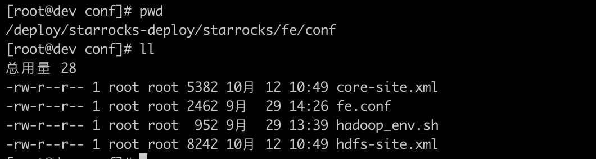
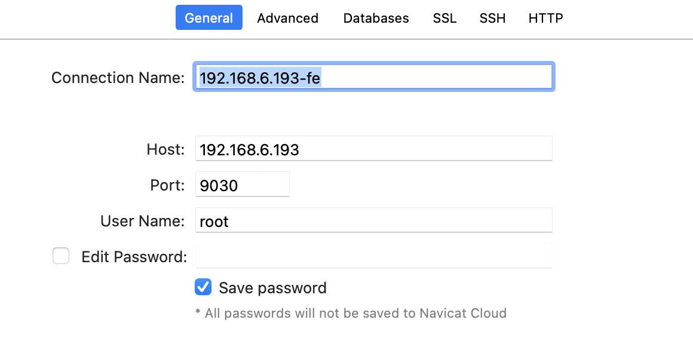
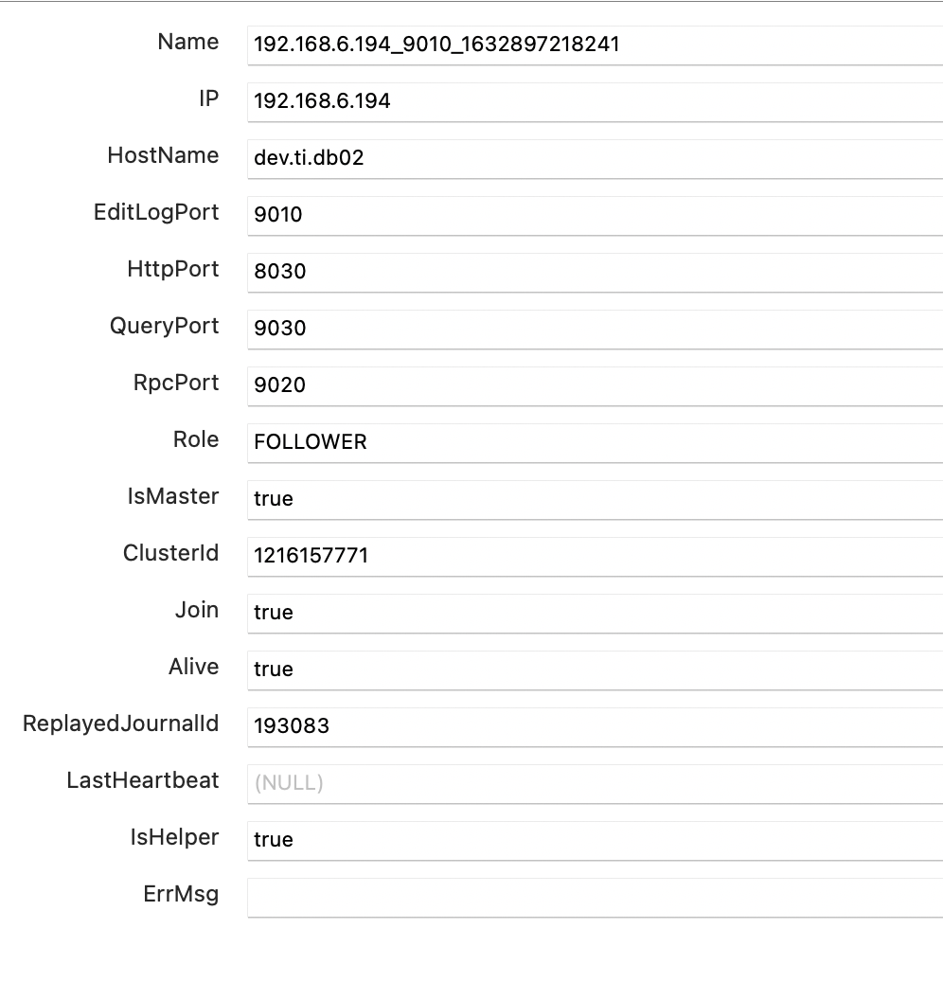
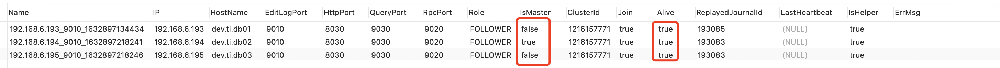
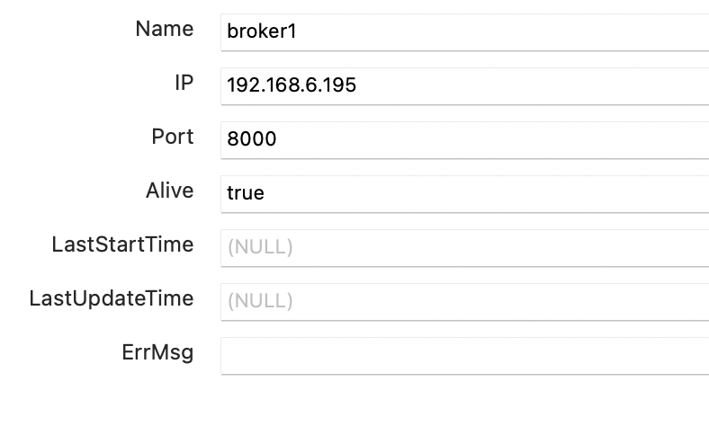

# StarRocks集群部署

## 一、端口列表

| 实例名称  | 端口名称               | 默认端口 | 通讯方向                       | 说明                                                 |
| :-------- | :--------------------- | :------- | :----------------------------- | :--------------------------------------------------- |
| BE        | be_port                | 9060     | FE  --> BE                     | BE 上 thrift server 的端口， 用于接收来自 FE 的请求  |
| BE        | webserver_port         | 8040     | BE <--> BE                     | BE 上的 http server 的端口                           |
| BE        | heartbeat_service_port | 9050     | FE  --> BE                     | BE 上心跳服务端口（thrift）， 用于接收来自 FE 的心跳 |
| BE        | brpc_port              | 8060     | FE <--> BE BE <--> BE          | BE 上的 brpc 端口， 用于 BE 之间通讯                 |
| FE        | **http_port**          | **8030** | FE <--> 用户                   | FE 上的 http server 端口                             |
| FE        | rpc_port               | 9020     | BE  --> FE FE <--> FE          | FE 上的 thrift server 端口                           |
| FE        | **query_port**         | **9030** | FE <--> 用户                   | FE 上的 mysql server 端口                            |
| FE        | edit_log_port          | 9010     | FE <--> FE                     | FE 上的 bdbje 之间通信端口                           |
| Broker    | broker_ipc_port        | 8000     | FE  --> Broker  BE  --> Broker | Broker 上的 thrift server， 用于接收请求             |
| promethus | promethus_port         | 9091     |                                | promethus服务端口                                    |
| grafana   | grafana_port           | 8001     |                                | grafana服务端口                                      |

其中 http_port(8030)、query_port(9030) 是常用端口，前者用于网页访问 FE，后者用于 MySQL 客户端访问。

## 二、环境准备

#### 服务器需要以下环境支持

- Linux (Centos 7+)
- Java 1.8+

CPU需要支持AVX2指令集， `cat /proc/cpuinfo |grep avx2`有结果输出表明CPU支持，如果没有支持，建议更换机器，StarRocks使用向量化技术需要一定的指令集支持才能发挥效果。

#### 集群机器挂载ext4数据盘

以root用户登陆到服务器上，以 `/dev/sdb` 数据盘为例，具体操作步骤如下：

(1)  查看数据盘

```shell
fdisk -l
```

(2)  创建分区

```shell
parted -s -a optimal /dev/sdb mklabel gpt -- mkpart primary ext4 1 -1
```

(3)  格式化文件系统

```shell
mkfs.ext4 /dev/sdb1
```

(4)  编辑 `/etc/fstab` 文件，添加以下信息

```shell
/dev/sdb1 /data1 ext4 defaults,nodelalloc,noatime 0 2
```

(5)  挂载数据盘

```shell
mkdir -p /data1 & mount -a
```

(6)  查看磁盘挂在情况，包含以下信息，说明情况

```shell
# mount -t ext4
/dev/sdb1 on /data1 type ext4 (rw,noatime,nodelalloc,data=ordered)

# lsblk
NAME            MAJ:MIN RM  SIZE RO TYPE MOUNTPOINT
sda               8:0    0   20G  0 disk
├─sda1            8:1    0    2M  0 part
├─sda2            8:2    0  512M  0 part /boot
└─sda3            8:3    0 19.5G  0 part
  ├─centos-root 253:0    0 17.5G  0 lvm  /
  └─centos-swap 253:1    0    2G  0 lvm  [SWAP]
sdb               8:16   0  400G  0 disk
└─sdb1            8:17   0  400G  0 part /data1
sr0              11:0    1  4.3G  0 rom
```

#### 配置host

查看当前hostname：

```shell
# hostname -f
```

配置hostname:

```shell
# hostname <hostname>
```

配置`/etc/hosts`，添加一行当前主机ip和hostname映射关系

```shell
# vim /etc/hosts

192.168.x.x <hostname>
```

#### 关闭防火墙

```shell
# systemctl status firewalld.service

# systemctl stop firewalld.service

# systemctl disable firewalld.service
```

#### 安装NTP

选取其中一台服务器作为ntp server，其他服务器作为ntp client。

## 三、部署

### 准备安装包

将安装包`StarRocks-1.18.2.tar`上传到服务器，并解压到`/deploy/starrocks-deploy/`

```shell
# mkdir /deploy/starrocks-deploy/
# tar -zxf StarRocks-1.18.2.tar.gz -C /deploy/starrocks-deploy/
```

创建软连接

```shell
# cd /deploy/starrocks-deploy/
# ln -s StarRocks-1.18.2 starrocks
```

### 部署FE

以下按照FE高可用集群方式部署，部署FE高可用集群需奇数(2n+1)节点，最少3台。

#### FE单实例部署

配置`fe/conf/fe.conf`:

```shell
# 可以根据FE内存大小调整 -Xmx4096m，为了避免GC建议16G以上，StarRocks的元数据都在内存中保存。
JAVA_OPTS = "-Xmx4096m -XX:+UseMembar -XX:SurvivorRatio=8 -XX:MaxTenuringThreshold=7 -XX:+PrintGCDateStamps -XX:+PrintGCDetails -XX:+UseConcMarkSweepGC -XX:+UseParNewGC -XX:+CMSClassUnloadingEnabled -XX:-CMSParallelRemarkEnabled -XX:CMSInitiatingOccupancyFraction=80 -XX:SoftRefLRUPolicyMSPerMB=0 -Xloggc:$STARROCKS_HOME/log/fe.gc.log"

# 元数据路径
meta_dir = /data1/starrocks/meta
# 优先的网络段
priority_networks=192.168.6.0/24
```

复制线上Hadoop的配置文件hdfs-site.xml、core-site.xml到`fe/conf/`目录下



创建元数据路径：

```shell
# mkdir -p /data1/starrocks/meta
```

启动FE:

```shell
# bin/start_fe.sh --daemon
```

查看日志log/fe.log确认成功启动FE:

```
2020-03-16 20:32:14,686 INFO 1 [FeServer.start():46] thrift server started.

2020-03-16 20:32:14,696 INFO 1 [NMysqlServer.start():71] Open mysql server success on 9030

2020-03-16 20:32:14,696 INFO 1 [QeService.start():60] QE service start.

2020-03-16 20:32:14,825 INFO 76 [HttpServer$HttpServerThread.run():210] HttpServer started with port 8030

...
```

Mysql客户端登陆：

```shell
mysql -h 192.168.6.193 -P9030 -u root
```

或者

Navicat登陆：

查看FE状态：

```sql
SHOW PROC '/frontends';
```



Role为FOLLOWER说明这是一个能参与选主的FE；IsMaster为true，说明该FE当前为主节点。

#### 部署FE从节点

分发二进制和配置文件, 配置文件和FE主节点情形相同.

使用MySQL客户端连接已有的FE,  添加新实例的信息，信息包括角色、ip、port：

```sql
mysql> ALTER SYSTEM ADD FOLLOWER "host:port";
```

或者

```sql
mysql> ALTER SYSTEM ADD OBSERVER "host:port";
```

如出现错误，需要删除FE，应用下列命令：

```sql
alter system drop follower "fe_host:edit_log_port";
alter system drop observer "fe_host:edit_log_port";
```

启动：

第一次启动需要用以下命令启动

```shell
# 第一次启动需要用以下命令启动
# ./bin/start_fe.sh --helper <FE主节点IP>:9010 --daemon
```

当FE再次启动时，无须指定--helper参数， 因为FE已经将其他FE的配置信息存储于本地目录, 因此可直接启动：

```shell
# ./bin/start_fe.sh --daemon
```

查看集群状态, 确认部署成功：



### 部署BE

配置`be/conf/be.conf`，添加如下两个配置:

```shell
# 优先的网络段
priority_networks=192.168.1.0/24
# 数据存储路径
storage_root_path = /data1/starrocks/storage
```

复制线上Hadoop的配置文件hdfs-site.xml、core-site.xml到`be/conf/`目录下


创建数据存储路径

```shell
# mkdir -p /data1/starrocks/storage
```

通过mysql客户端/Navicat等添加BE节点：

```sql
mysql> ALTER SYSTEM ADD BACKEND "192.168.x.x:9050";
```

如出现错误，需要删除BE节点，应用下列命令：

```sql
alter system decommission backend "be_host:be_heartbeat_service_port";
alter system dropp backend "be_host:be_heartbeat_service_port";
```

启动BE:

```shell
# bin/start_be.sh --daemon
```

通过mysql客户端/Navicat等查看BE状态, 确认BE就绪:

```sql
mysql> SHOW PROC '/backends'\G
```

结果如下图：


如果isAlive为true，则说明BE正常接入集群。如果BE没有正常接入集群，请查看log目录下的be.WARNING日志文件确定原因。

### 部署Broker

复制线上的hdfs-site.xml到`apache_hdfs_broker/conf/`目录下

启动： 

```shell
# ./apache_hdfs_broker/bin/start_broker.sh --daemon
```

添加broker节点到集群中：

```sql
MySQL> ALTER SYSTEM ADD BROKER broker1 "172.16.139.24:8000";
```

查看broker状态：



Alive为true代表状态正常。

## 四、离线安装Mysql客户端

#### 准备安装包

需要在一台**有外网**且相同操作系统服务器上下载MariaDB-client的相关rpm包。

##### 添加 MariaDB Yum 库

`vim /etc/yum.repos.d/MariaDB.repo` 添加以下内容：

```shell
# MariaDB 10.2 CentOS repository list - created 2021-08-30 05:51 UTC
# http://downloads.mariadb.org/mariadb/repositories/
[mariadb]
name = MariaDB
baseurl = http://yum.mariadb.org/10.2/centos7-amd64
gpgkey=https://yum.mariadb.org/RPM-GPG-KEY-MariaDB
gpgcheck=1
```

##### 下载安装包

```shell
# yum install -y --downloadonly --downloaddir=. MariaDB-client

MariaDB-client-10.2.40-1.el7.centos.x86_64.rpm
MariaDB-common-10.2.40-1.el7.centos.x86_64.rpm
MariaDB-compat-10.2.40-1.el7.centos.x86_64.rpm
```

#### 安装

将rpm包复制到对应的服务器，并执行以下命令安装

```shell
# yum localinstall -y MariaDB*
```

## 五、安装proxysql

1、下载rpm包[proxysql-2.3.2-1-centos7.x86_64.rpm](https://github.com/sysown/proxysql/releases/download/v2.3.2/proxysql-2.3.2-1-centos7.x86_64.rpm)到`/deploy/proxysql`

2、解压到到当前目录

```shell
# rpm2cpio proxysql-2.3.2-1-centos7.x86_64.rpm | cpio -ivdm
```

3、修改配置文件

```shell
# vim ./etc/proxysql.cnf 
```

修改为用户有权限访问的目录（绝对路径）

```vim
datadir="/deploy/proxysql/data"
errorlog="/deploy/proxysql/proxysql.log"
```

4、创建数据目录

```shell
# mkdir /deploy/proxysql/data
```

5、启动

```shell
# ./usr/bin/proxysql -c ./etc/proxysql.cnf --no-monitor

2021-10-11 11:35:30 [INFO] Using config file ./etc/proxysql.cnf
2021-10-11 11:35:30 [INFO] Current RLIMIT_NOFILE: 1024
2021-10-11 11:35:30 main.cpp:1294:main(): [ERROR] Current RLIMIT_NOFILE is very low: 1024 .  Tune RLIMIT_NOFILE correctly before running ProxySQL
2021-10-11 11:35:30 main.cpp:1301:main(): [WARNING] Automatically setting RLIMIT_NOFILE to 4096
2021-10-11 11:35:30 [INFO] Using OpenSSL version: OpenSSL 1.1.1j  16 Feb 2021
2021-10-11 11:35:30 [INFO] No SSL keys/certificates found in datadir (/deploy/proxysql/data). Generating new keys/certificates.
```

6、登录

```shell
# mysql -u admin -padmin -h 127.0.0.1 -P6032

Welcome to the MariaDB monitor.  Commands end with ; or \g.
Your MySQL connection id is 1
Server version: 5.5.30 (ProxySQL Admin Module)

Copyright (c) 2000, 2018, Oracle, MariaDB Corporation Ab and others.

Type 'help;' or '\h' for help. Type '\c' to clear the current input statement.

MySQL [(none)]>
```

7、配置全局日志

```sql
SET mysql-eventslog_filename='proxysql_queries.log';
SET mysql-eventslog_default_log=1;
SET mysql-eventslog_format=2;
LOAD MYSQL VARIABLES TO RUNTIME;
SAVE MYSQL VARIABLES TO DISK;
```

8、插入FE节点信息

```sql
insert into mysql_servers(hostgroup_id, hostname, port) values(1, '192.168.6.193', 9030);
insert into mysql_servers(hostgroup_id, hostname, port) values(1, '192.168.6.194', 9030);
insert into mysql_servers(hostgroup_id, hostname, port) values(1, '192.168.6.195', 9030);
```

使配置生效

```sql
load mysql servers to runtime;
save mysql servers to disk;
```

9、 配置用户名和密码

```sql
insert into mysql_users(username, password, active, default_hostgroup, backend, frontend) values('starrocks', '123456', 1, 1, 1, 1);

insert into mysql_users(username, password, active, default_hostgroup, backend, frontend) values('starrocks2', '123456', 1, 1, 1, 1);
```

使配置生效

```sql
load mysql users to runtime; 
save mysql users to disk;
```

10、写入代理规则

```sql
insert into mysql_query_rules(rule_id, active, match_digest, destination_hostgroup, mirror_hostgroup, apply) values(1, 1, '.', 1, 2, 1);
```

使配置生效

```sql
load mysql query rules to runtime; 
save mysql query rules to disk;
```

11、在starrocks集群创建对应的用户信息

```sql
CREATE USER 'starrocks'@'%' IDENTIFIED BY '123456';
GRANT ALL ON *.* TO 'starrocks'@'%';
FLUSH PRIVILEGES;
```

12、验证查询

```shell
# mysql -ustarrocks -p123456 -P6033 -h127.0.0.1 -e "show databases;"

+--------------------+
| Database           |
+--------------------+
| _statistics_       |
| example_db         |
| information_schema |
| ssb                |
| tpcc               |
| tpch               |
+--------------------+
```

## 六、监控告警-Prometheus+Grafana

### 部署

#### Prometheus

1、下载[Prometheus](https://github.com/prometheus/prometheus/releases/download/v2.30.3/prometheus-2.30.3.linux-amd64.tar.gz)，并解压

```shell
wget https://github.com/prometheus/prometheus/releases/download/v2.30.3/prometheus-2.30.3.linux-amd64.tar.gz
tar -xf prometheus-2.30.3.linux-amd64.tar.gz
```

2、添加StarRocks监控相关的配置，`vi prometheus.yml`

```shell
# my global config
global:
  scrape_interval: 15s # Set the scrape interval to every 15 seconds. Default is every 1 minute.
  evaluation_interval: 15s # Evaluate rules every 15 seconds. The default is every 1 minute.
  # scrape_timeout is set to the global default (10s).

# Alertmanager configuration
alerting:
  alertmanagers:
    - static_configs:
        - targets:
          # - alertmanager:9093

# Load rules once and periodically evaluate them according to the global 'evaluation_interval'.
rule_files:
  # - "first_rules.yml"
  # - "second_rules.yml"

# A scrape configuration containing exactly one endpoint to scrape:
# Here it's Prometheus itself.
scrape_configs:
  # The job name is added as a label `job=<job_name>` to any timeseries scraped from this config.
  - job_name: "StarRocks_Default_Cluster"  # 每一个集群称之为一个job，可以自定义名字作为StarRocks集群名

    # metrics_path defaults to '/metrics'  
    # scheme defaults to 'http'.

    static_configs:
      - targets: ["dev.ti.db01:8030","dev.ti.db02:8030","dev.ti.db03:8030"]
        labels:
          group: fe   # 这里配置了 fe 的 group，该 group 中包含了 3 个 Frontends
      - targets: ['dev.ti.flash01:8040', 'dev.ti.flash02:8040', 'dev.ti.flash03:8040']
        labels:
          group: be # 这里配置了 be 的 group，该 group 中包含了 3 个 Backends
```

3、启动prometheus

```shell
nohup ./prometheus \
    --config.file="./prometheus.yml" \
    --web.listen-address=":9091" \
    --log.level="info" &
```

4、访问prometheus

通过浏览器访问：http://promethus_host:9091，点击`Status -> Targets`，如下图：


#### Grafana

1、下载[Grafana](https://dl.grafana.com/oss/release/grafana-8.0.6.linux-amd64.tar.gz)，并解压

```shell
wget https://dl.grafana.com/oss/release/grafana-8.0.6.linux-amd64.tar.gz
tar -zxf grafana-8.0.6.linux-amd64.tar.gz
```

2、检查以下配置并修改，`vi ./conf/defaults.ini `

```shell
...
[paths]
data = ./data
logs = ./data/log
plugins = ./data/plugins
[server]
http_port = 8001
domain = localhost
...
```

3、启动Grafana

```shell
nohup ./bin/grafana-server \
    --config="./conf/defaults.ini" &
```

### Dashboard

登录grafana，即上一步配置的地址[http://grafana_host:8001](http://grafana_host:8001/)，默认用户名/密码为admin/admin。

#### 1、数据源配置

配置路径：`Configuration-->Data sources-->Add data source-->Prometheus`

Data Source配置简介


- Name: 数据源的名称，自定义，比如 starrocks_monitor
- URL: Prometheus 的 web 地址，如 [http://prometheus_host:9091](http://prometheus_host:9091/)
- Access: 选择 Server 方式，即通过 Grafana 进程所在服务器，访问 Prometheus。 其余选项默认即可。

点击最下方 Save & Test，如果显示 Data source is working，即表示数据源可用。

#### 2、添加Dashboard

1、[Dashboard模版下载](http://starrocks-thirdparty.oss-cn-zhangjiakou.aliyuncs.com/StarRocks-Overview.json?Expires=4784940342&OSSAccessKeyId=LTAI4GFYjbX9e7QmFnAAvkt8&Signature=JJ5u%2BNBNX2g1pfzvql6xxqubAxI%3D)

2、添加Dashboard

确认数据源可用后，点击左边导航栏的 + 号，开始添加 Dashboard。这里我们使用上文下载的 StarRocks 的 Dashboard 模板。点击 `左边的导航栏 + 号 -> Import -> Upload Json File`，将下载的 json 文件导入。 导入后，可以命名 Dashboard，默认是 StarRocks Overview。同时，需要选择数据源，这里选择之前创建的 starrocks_monitor。 点击 Import，即完成导入。之后，可以看到 StarRocks 的 Dashboard 展示。


## FAQ

**1、proxysql访问starrocks报用户禁止访问错误，如下所示：**

```sql
[root@dev ~]# mysql -ustarrocks -p123456 -P6033 -h127.0.0.1 -e "show databases;"
ERROR 1064 (HY000) at line 1: Access denied for user 'default_cluster:starrocks' (using password: YES)
```

原因：

由于starrocks集群无对应的starrocks用户，所以导致了如上错误

解决：

在starrocks集群创建对应的用户信息

```sql
CREATE USER 'starrocks'@'%' IDENTIFIED BY '123456';
GRANT ALL ON *.* TO 'starrocks'@'%';
FLUSH PRIVILEGES;
```

**2、proxysql访问starrocks报超时，如下所示：**

```shell
[root@dev ~]# mysql -ustarrocks -p123456 -P6033 -h127.0.0.1 -e "show databases;"
ERROR 9001 (HY000) at line 1: Max connect timeout reached while reaching hostgroup 0 after 10000ms 
```

原因：

 **default_hostgroup** 和 **hostgroup_id**不一致导致的，可参见：https://github.com/sysown/proxysql/issues/1588

可运行以下语句进行查看验证

```sql
SELECT username, default_hostgroup FROM mysql_users;
SELECT hostgroup_id, hostname FROM mysql_servers;
```

解决：

 **default_hostgroup** and **hostgroup_id**不一致，则进行修正。

**3、hive外部表，查询报错如下：**

```shell
get partition detail failed: org.apache.doris.common.DdlException: get hive partition meta data failed: java.net.UnknownHostException: bdptest
```

原因：

hive外部表依赖于hadoop环境，由于本地starrocks未将hadoop相关配置放到本地配置导致了以上问题。

解决：

将hadoop环境的hdfs-site.xml、core-site.xml放到`fe/conf/`、`be/conf/`下，重新启动fe和be集群。参考：https://docs.starrocks.com/zh-cn/main/using_starrocks/External_table#配置

## Ref

- [StarRocks手动部署](https://docs.starrocks.com/zh-cn/main/quick_start/Deploy#手动部署)
- [StarRocks负载均衡](https://docs.starrocks.com/zh-cn/main/administration/Load_balance#proxysql)

- [mysql client(客户端) 5.7 rpm 离线安装]( https://cdmana.com/2021/05/20210519164806493U.html) 

- [proxysql介绍与配置](https://blog.csdn.net/yeqixian123456/article/details/108012968)
- [内网环境centos7 yum离线安装软件包](https://blog.csdn.net/cl2010abc/article/details/88602188)
- [DorisDB自动化运维-集群管理实现](https://forum.starrocks.com/t/topic/378)