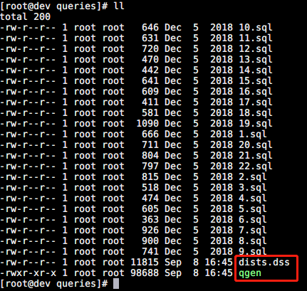
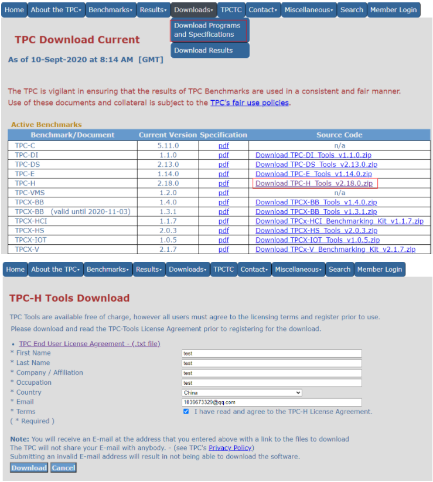

# TiDB 基准测试

## tiup bench 基准测试

### TPC-C 测试

#### 准备数据

```shell
tiup bench tpcc -H 192.168.6.200 -P 4000 -p d8af32876ee82cbff3c64d14db11b87b3f -D titpcc  --warehouses 4 --parts 4 prepare
```

#### 压测

```shell
tiup bench tpcc -H 192.168.6.200 -P 4000 -p d8af32876ee82cbff3c64d14db11b87b3f -D titpcc  --warehouses 4 run
tiup bench tpcc -H 192.168.6.200 -P 4000 -p d8af32876ee82cbff3c64d14db11b87b3f -D titpcc  --warehouses 4 --threads 16 --time 300s run
```

###  TPC-H 测试

#### 准备数据

```shell
tiup bench tpch -H 192.168.6.200 -P 4000 -p d8af32876ee82cbff3c64d14db11b87b3f -D titpch --sf=1 prepare
```
#### 压测

```shell
tiup bench tpch -H 192.168.6.200 -P 4000 -p d8af32876ee82cbff3c64d14db11b87b3f -D titpch --sf=1 --check=true run
```


## 三方标准工具基准测试


### TPC-C 测试

#### 准备

- [benchmarksql5.0-for-mysql](https://mirrors.huaweicloud.com/kunpeng/archive/kunpeng_solution/database/patch/benchmarksql5.0-for-mysql.zip)
  - unzip benchmarksql5.0-for-mysql.zip
  -  cd benchmarksql5.0-for-mysql/run && chmod 777  *.sh
- 确认已安装 JDK
- 安装 R 环境 （压测报告生成图表需要）

#### 创建压测配置文件

```shell
cd benchmarksql5.0-for-mysql/run
cp props.conf mysql.properties
vi mysql.properties
```

```properties
db=mysql
driver=com.mysql.cj.jdbc.Driver
conn=jdbc:mysql://192.168.6.200:4000/tpcc?useSSL=false&useServerPrepStmts=true&useConfigs=maxPerformance&rewriteBatchedStatements=true
user=root
password=d8af32876ee82cbff3c64d14db11b87b3f
profile=/etc/my.cnf
data=/data/mysql/data
backup=/data/mysql/backup

warehouses=20
loadWorkers=5

terminals=16
//To run specified transactions per terminal- runMins must equal zero
runTxnsPerTerminal=2048
//To run for specified minutes- runTxnsPerTerminal must equal zero
runMins=0
//Number of total transactions per minute
limitTxnsPerMin=100000

//Set to true to run in 4.x compatible mode. Set to false to use the
//entire configured database evenly.
terminalWarehouseFixed=true

//The following five values must add up to 100
//The default percentages of 45, 43, 4, 4 & 4 match the TPC-C spec
newOrderWeight=45
paymentWeight=43
orderStatusWeight=4
deliveryWeight=4
stockLevelWeight=4
```

#### 准备数据

```shell
./runDatabaseBuild.sh mysql.properties
```

#### 启动压测

```shell
./runBenchmark.sh mysql.properties
```

#### 生成报告

```shell
./generateReport.sh my_result_2021-09-09_134211/
```


#### 清除数据

```shell
./runDatabaseDestroy.sh mysql.properties
```


### TPC-H 测试（不推荐）

#### 编译工具

```shell
 unzip b5c62ff1-3be2-4950-9deb-2ce9dfb366f8-tpc-h-tool.zip
 cd TPC-H_Tools_v3.0.0/dbgen/
 cp makefile.suite makefile
 vi makefile
```

1、找到 makefile 文件，然后修改103~112行

```shell
CC      = gcc
# Current values for DATABASE are: INFORMIX, DB2, TDAT (Teradata)
#                                  SQLSERVER, SYBASE, ORACLE, VECTORWISE
# Current values for MACHINE are:  ATT, DOS, HP, IBM, ICL, MVS,
#                                  SGI, SUN, U2200, VMS, LINUX, WIN32
# Current values for WORKLOAD are:  TPCH
DATABASE = MYSQL
MACHINE  = LINUX
WORKLOAD = TPCH
#
```

2、打开tpcd.h，在文件最上方添加如下宏定义

```c
#ifdef MYSQL
#define GEN_QUERY_PLAN ""
#define START_TRAN "START TRANSACTION"
#define END_TRAN "COMMIT"
#define SET_OUTPUT ""
#define SET_ROWCOUNT "limit %d;\n"
#define SET_DBASE "use %s;\n"
#endif
```

3、编译

```shell
make
gcc -g -DDBNAME=\"dss\" -DLINUX -DMYSQL -DTPCH -DRNG_TEST -D_FILE_OFFSET_BITS=64    -c -o build.o build.c
gcc -g -DDBNAME=\"dss\" -DLINUX -DMYSQL -DTPCH -DRNG_TEST -D_FILE_OFFSET_BITS=64    -c -o driver.o driver.c
gcc -g -DDBNAME=\"dss\" -DLINUX -DMYSQL -DTPCH -DRNG_TEST -D_FILE_OFFSET_BITS=64    -c -o bm_utils.o bm_utils.c
gcc -g -DDBNAME=\"dss\" -DLINUX -DMYSQL -DTPCH -DRNG_TEST -D_FILE_OFFSET_BITS=64    -c -o rnd.o rnd.c
gcc -g -DDBNAME=\"dss\" -DLINUX -DMYSQL -DTPCH -DRNG_TEST -D_FILE_OFFSET_BITS=64    -c -o print.o print.c
gcc -g -DDBNAME=\"dss\" -DLINUX -DMYSQL -DTPCH -DRNG_TEST -D_FILE_OFFSET_BITS=64    -c -o load_stub.o load_stub.c
gcc -g -DDBNAME=\"dss\" -DLINUX -DMYSQL -DTPCH -DRNG_TEST -D_FILE_OFFSET_BITS=64    -c -o bcd2.o bcd2.c
gcc -g -DDBNAME=\"dss\" -DLINUX -DMYSQL -DTPCH -DRNG_TEST -D_FILE_OFFSET_BITS=64    -c -o speed_seed.o speed_seed.c
gcc -g -DDBNAME=\"dss\" -DLINUX -DMYSQL -DTPCH -DRNG_TEST -D_FILE_OFFSET_BITS=64    -c -o text.o text.c
gcc -g -DDBNAME=\"dss\" -DLINUX -DMYSQL -DTPCH -DRNG_TEST -D_FILE_OFFSET_BITS=64    -c -o permute.o permute.c
gcc -g -DDBNAME=\"dss\" -DLINUX -DMYSQL -DTPCH -DRNG_TEST -D_FILE_OFFSET_BITS=64    -c -o rng64.o rng64.c
gcc -g -DDBNAME=\"dss\" -DLINUX -DMYSQL -DTPCH -DRNG_TEST -D_FILE_OFFSET_BITS=64  -O -o dbgen build.o driver.o bm_utils.o rnd.o print.o load_stub.o bcd2.o speed_seed.o text.o permute.o rng64.o -lm
gcc -g -DDBNAME=\"dss\" -DLINUX -DMYSQL -DTPCH -DRNG_TEST -D_FILE_OFFSET_BITS=64    -c -o qgen.o qgen.c
gcc -g -DDBNAME=\"dss\" -DLINUX -DMYSQL -DTPCH -DRNG_TEST -D_FILE_OFFSET_BITS=64    -c -o varsub.o varsub.c
gcc -g -DDBNAME=\"dss\" -DLINUX -DMYSQL -DTPCH -DRNG_TEST -D_FILE_OFFSET_BITS=64  -O -o qgen build.o bm_utils.o qgen.o rnd.o varsub.o text.o bcd2.o permute.o speed_seed.o rng64.o -lm
```

4、生成.tbl数据文件

> 接下来要用dbgen生成数据，一共会生成8个表（.tbl）。生成1G数据。其中1表示生成1G数据。如果你想生成10G，将1改为10。
>
> 8个表分别为：supplier.tbl、region.tbl、part.tbl、partsupp.tbl、orders.tbl、nation.tbl、lineitem.tbl、customer.tbl。

生成数据文件：

```shell
./dbgen -s 1
```

5、修改 dss.ddl

dss.ddl的开头需要加上一些给MySQL建立数据库连接用的指令。在最前面加上以下代码：

```sql
DROP DATABASE tpch;
CREATE DATABASE tpch;
USE tpch;
```

6、修改 dss.ri

下面的内容全部复制、替换掉初始版本就能用。

```sql
-- Sccsid:     @(#)dss.ri   2.1.8.1
-- tpch Benchmark Version 8.0

USE tpch;

-- ALTER TABLE tpch.region DROP PRIMARY KEY;
-- ALTER TABLE tpch.nation DROP PRIMARY KEY;
-- ALTER TABLE tpch.part DROP PRIMARY KEY;
-- ALTER TABLE tpch.supplier DROP PRIMARY KEY;
-- ALTER TABLE tpch.partsupp DROP PRIMARY KEY;
-- ALTER TABLE tpch.orders DROP PRIMARY KEY;
-- ALTER TABLE tpch.lineitem DROP PRIMARY KEY;
-- ALTER TABLE tpch.customer DROP PRIMARY KEY;


-- For table region
ALTER TABLE tpch.region
ADD PRIMARY KEY (R_REGIONKEY);

-- For table nation
ALTER TABLE tpch.nation
ADD PRIMARY KEY (N_NATIONKEY);

ALTER TABLE tpch.nation
ADD FOREIGN KEY NATION_FK1 (N_REGIONKEY) references
tpch.region(R_REGIONKEY);

COMMIT;

-- For table part
ALTER TABLE tpch.part
ADD PRIMARY KEY (P_PARTKEY);

COMMIT;

-- For table supplier
ALTER TABLE tpch.supplier
ADD PRIMARY KEY (S_SUPPKEY);
ALTER TABLE tpch.supplier
ADD FOREIGN KEY SUPPLIER_FK1 (S_NATIONKEY) references
tpch.nation(N_NATIONKEY);

COMMIT;

-- For table partsupp
ALTER TABLE tpch.partsupp
ADD PRIMARY KEY (PS_PARTKEY,PS_SUPPKEY);

COMMIT;

-- For table customer
ALTER TABLE tpch.customer
ADD PRIMARY KEY (C_CUSTKEY);

ALTER TABLE tpch.customer
ADD FOREIGN KEY CUSTOMER_FK1 (C_NATIONKEY) references
tpch.nation(N_NATIONKEY);

COMMIT;

-- For table lineitem
ALTER TABLE tpch.lineitem
ADD PRIMARY KEY (L_ORDERKEY,L_LINENUMBER);

COMMIT;

-- For table orders
ALTER TABLE tpch.orders
ADD PRIMARY KEY (O_ORDERKEY);

COMMIT;

-- For table partsupp
ALTER TABLE tpch.partsupp
ADD FOREIGN KEY PARTSUPP_FK1 (PS_SUPPKEY) references
tpch.supplier(S_SUPPKEY);
COMMIT;

ALTER TABLE tpch.partsupp
ADD FOREIGN KEY PARTSUPP_FK2 (PS_PARTKEY) references
tpch.part(P_PARTKEY);

COMMIT;

-- For table orders
ALTER TABLE tpch.orders
ADD FOREIGN KEY ORDERS_FK1 (O_CUSTKEY) references
tpch.customer(C_CUSTKEY);

COMMIT;

-- For table lineitem
ALTER TABLE tpch.lineitem
ADD FOREIGN KEY LINEITEM_FK1 (L_ORDERKEY) references
tpch.orders(O_ORDERKEY);

COMMIT;

ALTER TABLE tpch.lineitem
ADD FOREIGN KEY LINEITEM_FK2 (L_PARTKEY,L_SUPPKEY) references
tpch.partsupp(PS_PARTKEY,PS_SUPPKEY);

COMMIT;
```


7、导入 dss.ddl、dss.ri

8、导入数据

在dbgen目录下创建一个load.sh脚本文件：

```
vi load.sh
```


将以下代码输入并保存，注意是否需要修改数据库名称tpch。

```
#!/bin/bash

write_to_file()
{
file="loaddata.sql"

if [ ! -f "$file" ] ; then
touch "$file"
fi

echo 'USE tpch;' >> $file
echo 'SET FOREIGN_KEY_CHECKS=0;' >> $file

DIR=`pwd`
for tbl in `ls *.tbl`; do
table=$(echo "${tbl%.*}")
echo "LOAD DATA LOCAL INFILE '$DIR/$tbl' INTO TABLE $table" >> $file
echo "FIELDS TERMINATED BY '|' LINES TERMINATED BY '|\n';" >> $file
done
echo 'SET FOREIGN_KEY_CHECKS=1;' >> $file
}

write_to_file
 
```

开始执行：

```
sh load.sh 
```

同目录下就会生成一个loaddata.sql，里面是从8个tbl里导入数据的sql指令。

导入数据：

```
mysql -uroot -p123456 < loaddata.sql 
```

9、生成查询sql语句。

在dbgen目录下生成查询sql语句：

```shell
cp qgen dists.dss queries/ 
```


将qgen执行文件和dists.dss文件拷贝到queries模板目录中。



创建saveSql文件夹（在dbgen目录下执行）。

```shell
mkdir ../saveSql
```

进入queries目录。

```shell
cd queries
```


执行需要生成的sql命令。

```shell
./qgen -d 1 > ../../saveSql/1.sql
./qgen -d 2 > ../../saveSql/2.sql
./qgen -d 3 > ../../saveSql/3.sql
./qgen -d 4 > ../../saveSql/4.sql
./qgen -d 5 > ../../saveSql/5.sql
./qgen -d 6 > ../../saveSql/6.sql
./qgen -d 7 > ../../saveSql/7.sql
./qgen -d 8 > ../../saveSql/8.sql
./qgen -d 9 > ../../saveSql/9.sql
./qgen -d 10 > ../../saveSql/10.sql
./qgen -d 11 > ../../saveSql/11.sql
./qgen -d 12 > ../../saveSql/12.sql
./qgen -d 13 > ../../saveSql/13.sql
./qgen -d 14 > ../../saveSql/14.sql
./qgen -d 15 > ../../saveSql/15.sql
./qgen -d 16 > ../../saveSql/16.sql
./qgen -d 17 > ../../saveSql/17.sql
./qgen -d 18 > ../../saveSql/18.sql
./qgen -d 19 > ../../saveSql/19.sql
./qgen -d 20 > ../../saveSql/20.sql
./qgen -d 21 > ../../saveSql/21.sql
./qgen -d 22 > ../../saveSql/22.sql
```


生成的sql文件还是有问题，需要做下处理：

到savaSql目录下打开生成的sql文件，按照下表进行修改。


| sql文件名称                                                  | 对应操作                                                     |
| ------------------------------------------------------------ | ------------------------------------------------------------ |
| 1.sql                                                        | 删除 day后面的 (3)                                           |
| 1.sql、4.sql、5.sql、6.sql、7.sql、8.sql、9.sql、11.sql、12.sql、13.sql、14.sql、15.sql、16.sql、17.sql、19.sql、20.sql、22.sql、 | 删除最后一行的 limit -1;可以在savaSql目录下快速删除，输入命令：sed -i "s/limit\ -1;//g" *.sql |
| 2.sql、3.sql、10.sql、18.sql、21.sql                         | 删除倒数第二行的分号                                         |

例如：

1.sql 删除 (3) 和 limit -1;


## 测试结果解读

### TCP-C

**TPC-C 标准测试模拟了 5 种事务处理，通过这些事务处理来模拟真实的用户操作，事务分别为**:

- 新订单（New-Order）
- 支付操作(Payment)
- 订单状态查询(Order-Status)
- 发货(Delivery)
- 库存状态查询(Stock-Level)

#### benchmarksql 会生成测试报告，主要有以下指标

- Latency 表示完全执行一个指令所需的时钟周期，潜伏期越少越好。
- tmpC 表示每分钟执行的事务数(NewOrders)
- tmpTOTAL 表示每分钟执行的总事务数
- runMins BenchmarkSQL 测试模式，分为 runTxnsPerTerminal 和 runMins ：
  - runTxnsPerTerminal ：每个终端执行数模式
  - runMins：执行时长模式

#### tiup 中会打印以下指标

> 按照事务类型输出。

```shell
[Summary] NEW_ORDER - Takes(s): 299.3, Count: 17382, TPM: 3484.7, Sum(ms): 1944255.5, Avg(ms): 0.3, 50th(ms): 0.5, 90th(ms): 0.5, 95th(ms): 0.5, 99th(ms): 0.5, 99.9th(ms): 0.5, Max  (ms): 0.5
```

- NEW_ORDER，事务类型
- Takes(s)，压测时长
- Count，总执行次数
- TPM，每分钟执行的事务数
- Sum(ms)，cpu 耗时


### TPC-H

主要是测试 22 个查询集的查询时间，没有其它复杂指标。


# 附录

## Benchmarksql 参数

| 参数           | 说明                                       |                                                              |
| -------------- | ------------------------------------------ | ------------------------------------------------------------ |
| conn           | 192.168.222.120                            | 数据库服务器地址，以实际情况为准。                           |
| 3306           | MySQL数据库端口，以实际情况为准。          |                                                              |
| tpcc           | 数据库名称，以实际情况为准，本例中为tpcc。 |                                                              |
| user和password | root和123456                               | 修改为创建数据库tpcc的账号和密码。                           |
| warehouses     | 1000                                       | 初始化加载数据时，需要创建多少仓库的数据。例如200，标识创建200个仓库数据，每一个数据仓库的数据量大概是76823.04KB，可有少量的上下浮动，因为测试过程中将会插入或删除现有记录。 |
| loadworker     | 100                                        | 加载数据时，每次提交进程数。                                 |

​     

| 参数                   | 说明                                                         |
| ---------------------- | ------------------------------------------------------------ |
| terminals              | 终端数量，指同时有多少终端并发执行，表示并发程度。遍历值140，170，200。 |
| runTxnsPerTerminal     | 每分钟每个终端执行的事务数。                                 |
| runMins                | 执行多少分钟，例如15分钟。与terminals配合使用。              |
| limitTnxsPermin        | 每分钟执行的事务总数。                                       |
| terminalWarehouseFixed | 用于指定终端和仓库的绑定模式，设置为true时可以运行4.x兼容模式，意思为每个终端都有一个固定的仓库。设置为false时可以均匀的使用数据库整体配置。 |

##   下载 TPC-H 工具

> 官网下载地址：http://www.tpc.org/tpch/




# REF

- [使用 TiUP bench 组件压测 TiDB | PingCAP Docs](https://docs.pingcap.com/zh/tidb/stable/tiup-bench)
- [介绍_鲲鹏BoostKit数据库使能套件_测试指导书_BenchMarkSQL 测试指导_华为云 (huaweicloud.com)](https://support.huaweicloud.com/tstg-kunpengdbs/kunpengbenchmarksql_06_0001.html)
- [TPC-H介绍_鲲鹏BoostKit数据库使能套件_测试指导书_TPC-H 测试指导（for MySQL）_华为云 (huaweicloud.com)](https://support.huaweicloud.com/tstg-kunpengdbs/kunpengtpch_02_0001.html)
- [使用 TiUP bench 组件压测 TiDB | PingCAP Docs](https://docs.pingcap.com/zh/tidb/stable/tiup-bench)
- https://developer.aliyun.com/article/790151


**本页编辑**      **[@gongshiwen](http://192.168.1.23/gongshiwen)**  